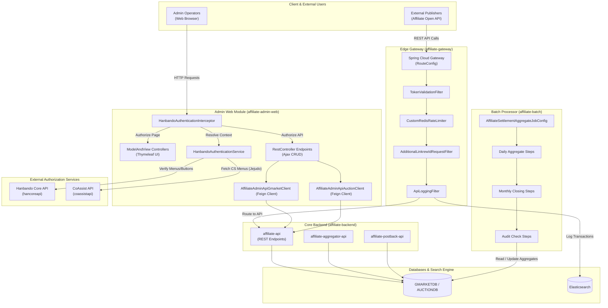

# Affiliate Admin Platform Technical Wiki

## 1. Introduction and Architectural Overview

### System Overview
제휴마케팅 플랫폼 (Affiliate Admin Platform)은 Gmarket 및 Auction의 제휴 채널 및 파트너(Publisher) 데이터를 통합 관리하고, 거래 유입에서부터 정산 및 지급에 이르는 전체 Affiliate 비즈니스 라이프사이클을 처리하는 Spring Boot 기반의 엔터프라이즈 관리 플랫폼입니다.
이 시스템은 다중 마이크로서비스 모듈로 구성되어 있으며, 대외 파트너사 연동을 위한 Gateway, 실시간 유입 이벤트 처리기, 일/월 배치 처리기 및 최종 백오피스 관리를 위한 Admin Web 모듈로 세분화되어 있습니다.

### Component Architecture & Data Flow
플랫폼의 전체적인 레이어 구조 및 컴포넌트 간 데이터 연동 흐름은 다음과 같습니다.



---

## 2. Authentication & Authorization Lifecycle (Hanbando & Jejudo)

### Overview
본 백오피스 웹 애플리케이션은 임직원 및 고객센터 운영자를 대상으로 한 세밀한 메뉴 접근 권한과 기능적 제어를 처리하기 위해 Gmarket 통합 사내 인증 시스템인 **한반도 (Hanbando)** 및 고객센터 전용 **제주도 (Jejudo)** 시스템과 연동되어 인증 및 권한 확인 라이프사이클을 수행합니다.

### Internal Mechanisms
인증 절차는 Spring MVC Interceptor 흐름 내에서 선언적 애노테이션 방식으로 제어됩니다.

1. **선언적 어드민 인증 애노테이션 (`@HanbandoAuthentication`)**
   - 특정 컨트롤러 메서드가 권한 검증 대상임을 지정하기 위해 [@HanbandoAuthentication](file:///Users/jaecjeong/work/martech/affiliate/affiliate-admin/affiliate-admin-web/src/main/java/com/gmarket/admin/affiliate/web/config/annotation/HanbandoAuthentication.java) 애노테이션을 활용합니다. 검증 시점의 접근 범위는 `AuthenticationType` (Menu, Button, Csv)으로 정의되어 상세하게 제어됩니다.

2. **로그인 상태 복호화 및 컨텍스트 바인딩**
   - [HanbandoAuthenticationInterceptor](file:///Users/jaecjeong/work/martech/affiliate/affiliate-admin/affiliate-admin-web/src/main/java/com/gmarket/admin/affiliate/web/config/interceptor/HanbandoAuthenticationInterceptor.java)는 HTTP 요청 수신 시 `preHandle` 단계에서 쿠키에 저장된 `hauth` 값을 추출합니다.
   - [LoginWebContext](file:///Users/jaecjeong/work/martech/affiliate/affiliate-admin/affiliate-admin-web/src/main/java/com/gmarket/admin/affiliate/web/model/entity/LoginWebContext.java) 생성자 내부에서 `CipherSupport.decrypt(hauth, KeyType.Login, InstanceType.Gmarket)`를 호출하여 쿠키 값을 복호화한 후 사용자 ID, 이름, 사번 정보를 담은 DTO로 매핑합니다.
   - 바인딩된 사용자 자격 증명은 ThreadLocal 객체를 래핑하는 [ThreadLocalSupport](file:///Users/jaecjeong/work/martech/affiliate/affiliate-admin/affiliate-admin-web/src/main/java/com/gmarket/admin/affiliate/web/support/ThreadLocalSupport.java) 및 [WebContextSupport](file:///Users/jaecjeong/work/martech/affiliate/affiliate-admin/affiliate-admin-web/src/main/java/com/gmarket/admin/affiliate/web/support/WebContextSupport.java)를 통해 현재 실행 스레드에 보존됩니다.

3. **원격 권한 조회 및 검증**
   - [HanbandoAuthenticationService.checkLogin()](file:///Users/jaecjeong/work/martech/affiliate/affiliate-admin/affiliate-admin-web/src/main/java/com/gmarket/admin/affiliate/web/service/hanbando/HanbandoAuthenticationService.java#L55-L69)에서 쿠키 정보의 유효성을 검증하며, 최종 로그인 IP와 현재 인바운드 IP의 일치 여부를 `coreService.isLatestLoginIp` API를 통해 체크합니다.
   - `checkAuthentication()` 메서드는 요청된 URI와 권한 유형에 따라 메뉴 접근 권한(`checkMenuAuth`) 및 개별 기능 권한(`checkButtonAuth`)을 한반도 코어 API를 호출하여 조회합니다.
   - 인가 검증이 성공적으로 종료되면, `postHandle` 단계에서 사용자 편의 제공 및 다음 인증을 위해 `LoginCookieSupport.updateLoginCookie`를 통해 세션 쿠키의 만료일을 자동으로 연장합니다.

4. **스레드 로컬 클린업 관리**
   - 요청 처리가 끝나면 WebContext의 누수를 차단하기 위해 `postHandle`의 종단점에서 `service.clearWebContext()`를 명시적으로 실행하여 ThreadLocal 맵 내의 인증 데이터를 즉시 해제합니다.

### Design Rationale
전통적인 Spring Security의 필터 체인 패턴 대신 **Custom Interceptor + WebContextSupport** 패턴을 설계한 이유는 Gmarket 사내 레거시 인증 인프라인 한반도/제주도 서버의 암복호화 스키마와의 강결합성을 독립시키기 위함입니다.
아울러, Thymeleaf 템플릿 로딩과 REST API 비동기 Ajax 호출을 정밀하게 구분하여 예외 유형에 따른 리다이렉트(`LoginPgeRedirectException`) 및 JSON 형태의 에러 반환을 일관적으로 통합 제정하는 아키텍처적 유연성을 보장합니다.

---

## 3. API Gateway and Edge Processing Pipeline

### Overview
`affiliate-gateway` 모듈은 대외 퍼블리셔사들의 마케팅 실적 적립 API 요청을 처리하기 위해 **Spring Cloud Gateway (Reactive Stack)** 기반으로 구축된 유입 경로 제어 레이어입니다. API 라우팅 뿐만 아니라 클라이언트 검증, 유량 제어(Rate Limiting), 개인정보 필터링(Masking)을 엣지 영역에서 일괄 처리합니다.

### Internal Mechanisms
게이트웨이로 진입한 패킷은 [RouteConfig](file:///Users/jaecjeong/work/martech/affiliate/affiliate-gateway/affiliate-gateway-api/src/main/java/com/gmarket/affiliate/gateway/api/config/RouteConfig.java)에 사전 선언된 라우팅 조건에 따라 필터 체인 파이프라인을 관통합니다.

1. **인증 토큰 유효성 검증 (`TokenValidationFilter`)**
   - [TokenValidationFilter](file:///Users/jaecjeong/work/martech/affiliate/affiliate-gateway/affiliate-gateway-api/src/main/java/com/gmarket/affiliate/gateway/api/filter/TokenValidationFilter.java)는 HTTP Header의 `Authorization` 필드에서 Bearer Access Token을 추출합니다.
   - `authorizationService.validateToken()` 비동기 WebClient 호출을 통해 해당 키의 유효 여부를 검증하고, 검증에 성공할 경우 내부 Downstream 마이크로서비스에서 전파받아야 할 메타데이터(`memberKey`, `linkrewId`, `openApiUri`)를 Project Reactor의 `contextWrite`를 활용하여 비동기 스트림 Context 상에 기록합니다.

2. **클라이언트 파라미터 변조 방지 (`AdditionalLinkrewIdRequestFilter`)**
   - 대외 API 호출 시 호출자가 임의로 파라미터 내 `linkrewId` 값을 변조하여 타 채널의 데이터를 스누핑하는 리스크를 방지하고자 합니다.
   - [AdditionalLinkrewIdRequestFilter](file:///Users/jaecjeong/work/martech/affiliate/affiliate-gateway/affiliate-gateway-api/src/main/java/com/gmarket/affiliate/gateway/api/filter/AdditionalLinkrewIdRequestFilter.java)는 이전 필터에서 주입된 검증 정보(`linkrewId`)를 Context에서 인출하고, `UriComponentsBuilder`를 이용하여 백엔드로 향하는 아웃바운드 HTTP 요청 쿼리스트링 파라미터(`linkrewId`)를 동적으로 덮어써 강제 주입(Mutation)합니다.

3. **Redis 기반 분산 유량 제어 (`CustomRedisRateLimiter`)**
   - 각 라우터 경로별로 호출 빈도를 제어하여 분산 DDoS 공격 및 특정 채널의 과도한 API 호출로 인한 백엔드 장애를 방지합니다.
   - [CustomRedisRateLimiter](file:///Users/jaecjeong/work/martech/affiliate/affiliate-gateway/affiliate-gateway-api/src/main/config/CustomRedisRateLimiter.java)는 Redis 내 토큰 버킷 알고리즘(Token Bucket Algorithm)을 동적으로 조율하고, `UserKeyResolver`를 통해 클라이언트별 유량 할당량을 독립 적용합니다.

4. **개인정보 응답 마스킹 (`ResponseSupport`)**
   - 백엔드 마이크로서비스(`affiliate-api`)로부터 받아온 응답 스트림의 Body에서 민감성 개인정보 식별 데이터를 자동으로 마스킹하는 전처리를 수행합니다.
   - `modifyResponseBody` 필터 단계를 연결하여 스트림 형태로 로딩된 Payload 내의 이름, 계좌정보, 연락처 등의 패턴을 비식별 처리한 후 표준 래퍼 포맷으로 다운스트림에 전달합니다.

### Design Rationale
대외 채널들과의 연동은 API 규격 변경이 잦고 비인증 상태의 대용량 트래픽에 직접 노출되는 지점입니다. 게이트웨이 레이어에서 인증과 유량 감쇄(Throttling) 및 개인정보 마스킹을 일괄 차단(Decoupling)함으로써 내부 비즈니스 엔티티 서버들은 자원 검증에 대한 연산 연계 부담을 덜고 핵심 트랜잭션 수행에 온전히 집중할 수 있는 무상태성(Stateless) 아키텍처를 실현합니다.

---

## 4. Batch Processing and Settlement Lifecycle

### Overview
`affiliate-batch`는 유입된 광고 계약 데이터를 토대로 일별 마케팅 실적을 산정하고 월 마감 정산액을 계산하며 결함을 분석하는 스케줄링 배치 파이프라인 모듈입니다.
[AffiliateSettlementAggregateJobConfig](file:///Users/jaecjeong/work/martech/affiliate/affiliate-batch/affiliate-settlement-batch/src/main/java/com/gmarket/affiliate/batch/config/job/AffiliateSettlementAggregateJobConfig.java)의 `affiliateSettlementAggregateJob` 정의를 기반으로 Spring Batch의 정교한 청크 지향 처리 및 검증 태스크를 실행합니다.

### Internal Mechanisms
마감 배치 작업은 데이터 집계 단계와 엄격한 정밀 재무 검증(Check Step) 단계가 선형(Flow) 체인 형태로 결합되어 수행됩니다.

```
[주문일 일집계] ──> [환불일 일집계] ──> [배송완료 처리] ──> [정산상세 삽입]
                                                                     │
┌────────────────────────────────────────────────────────────────────┘
│
└─> [월단위 정산 확정] ──> [월단위 지급결의] ──> [일일/상세 오차검증] ──> [SAP 전송준비 완료]
```

1. **일집계 수집 단계 (Daily Aggregate Stage)**
   - `affiliateSettlementDailyStep`: 전일 발생한 주문(Order Placed) 건을 추출하여 제휴 수수료 적립 대상을 `AFFILIATE_SETTLE_DAILY` 테이블에 적재합니다.
   - `affiliateSettlementDailyRefundStep`: 주문 후 반품/취소 처리가 접수된 건에 대해 실적을 소급 차감하기 위해 환불 일정을 기준으로 일 단위 차감 정산을 수행합니다.
   - `affiliateSettlementDailyTransportStep`: 최종 구매가 성립되는 조건인 "배송 완료" 이벤트와 물리 매핑하여 실적 데이터 내의 배송 상태 필드를 갱신 처리합니다.
   - `affiliateSettleDetailDailyStep`: 파트너사에게 노출되는 포인트 및 현금 캐시 적립예정금액을 산출하여 상세 내역 테이블(`AFFILIATE_SETTLE_DETAIL`)에 가공 데이터를 기록합니다.

2. **월 마감 확정 단계 (Monthly Closing Stage)**
   - `affiliateShareInsertSettleMonthlyStep`: 매월 지정일에 누적 일집계 데이터를 기준으로 파트너별 정산 기대 연월 데이터인 월 정산 원장(`AFFILIATE_SETTLE`)을 생성합니다.
   - `affiliateShareUpdateSettleSeqMonthlyStep`: 수집 완료된 일 단위 레코드들에 최종 월 정산 시퀀스 식별키(`settle_seq`)를 매핑하여 상태를 집계 완료(`Y`)로 일괄 업데이트합니다.
   - `affiliateShareInsertSettleProcMonthlyStep`: 지급 예정일에 도달한 파트너들에게 현금 지급 결의를 내리기 위한 최종 지급 데이터 대상 테이블(`AFFILIATE_SETTLE_PROC`)을 형성합니다.

3. **데이터 무결성 검증 단계 (Audit Check Stage)**
   - `affiliateSettleDailyPaymentMinusStep`: 정산 데이터의 왜곡 방지를 위해 특정 예외 케이스(과거 집계 완료 상태에서 전일 뒤늦게 발생한 결제 취소 분 등)를 식별하여 상계 이월 처리 정책을 조율합니다.
   - `affiliateSettleDailyNDetailCompareStep` & `affiliateSettleDailyNDetailCompareByIssueMembStep`: 일집계 원장(`AFFILIATE_SETTLE_DAILY`)의 전체 총합액과 정산 상세 내역(`AFFILIATE_SETTLE_DETAIL`) 테이블의 회원별 자원 합계 데이터를 크로스 체킹하여 단 1원의 오차라도 감지되는 경우 배치를 비정상 종료(Failure Trap)하도록 구성하여 오지급 위험을 차단합니다.
   - `affiliateSettleNProcCompareStep`: 최종 정산 집계 테이블과 지급 결의 테이블 간 월 지급 목표 금액이 정밀 합치하는지 더블 엔트리 대조 방식으로 최종 보증합니다.

### Design Rationale
대용량 이커머스 거래 내역을 준실시간으로 온라인 트랜잭션 도메인에서 처리할 경우 데이터 잠금(Locking) 및 정합성 불일치가 발생할 리스크가 극히 높습니다.
따라서, 마케팅 유입 데이터는 분리된 준실시간 컨슈머(`affiliate-order-consumer`)를 통해 적재 전용 상태로 남겨두고, 재무 지급에 관련된 대용량 가공 처리는 비즈니스 휴지기에 무결성 감사 단계를 내재한 Spring Batch Job을 수행하여 실적의 일관성과 정산 정확도를 철저하게 보장하도록 아키텍처를 유기적으로 격리 설계했습니다.

---

## 5. SAP and Corporate Finance Integration

### Overview
정산이 종료된 실적 자료를 실제 기업 회계 장부에 반영하고 대금 송금 지시를 내리기 위해 파트너 정산 대금 청구 데이터는 사내 SAP ERP 모듈과 실시간 및 일괄 배치 방식으로 데이터 동기화를 이행합니다. 이 파이프라인의 입구는 [GmarketLinkrewSettleSapRestController](file:///Users/jaecjeong/work/martech/affiliate/affiliate-admin/affiliate-admin-web/src/main/java/com/gmarket/admin/affiliate/web/controller/settlement/GmarketLinkrewSettleSapRestController.java) 컨트롤러에서 통제합니다.

### Internal Mechanisms
SAP ERP 계정계 연동은 월 단위 타임라인을 기반으로 3단계의 프로세스 파티션으로 분리되어 수행됩니다.

```
          [Accrual Phase]                      [ProcRequest Phase]                   [Transfer Phase]
 ┌──────────────────────────────┐       ┌──────────────────────────────┐      ┌─────────────────────────────┐
 │       매월 말 (약 26일)        │  ──>  │     익월 중순 (약 14일)        │ ──>  │     익월 말일 (지급 완료)      │
 │  당월 발생 정산 대금 비용 추정   │       │  파트너 실 지급 대금 확정 송금 요청  │      │  지급 은행의 실제 송금 결과 수신 │
 └──────────────────────────────┘       └──────────────────────────────┘      └─────────────────────────────┘
```

1. **미지급 비용 계상 (Accrual Phase)**
   - 매월 말(보통 26일경), 백오피스 담당자는 `getLinkrewSapAccrual()` API를 호출하여 해당 월에 누적 집계된 예상 파트너사 지급 비용(Accrual Data) 목록을 확인합니다.
   - 데이터 검증 후 `sapAccrualConfirm()`을 트리거하면, 당월 발생 총액이 사내 SAP ERP 시스템의 미지급금 임시 계정으로 분개 처리되어 법인 장부에 당월 비용으로 우선 인식됩니다.

2. **지급 요청 결의 (ProcRequest Phase)**
   - 익월 14일 경 파트너사 정보와 세금 정산 검토가 마무리되면, `getLinkrewSapProcRequest()`를 실행하여 실제 송금 요청 명세서를 컴파일합니다.
   - 관리자가 백오피스 상에서 비용 송금을 최종 결제 승인하면, `sapProcRequestConfirm()`이 트리거되며 ERP 시스템 내에 실지급 채무 계정이 확정 분개 처리되어 지급 준비 상태로 전환됩니다.

3. **지급 완료 및 Reconciliation (Transfer Phase)**
   - 익월 15일(또는 휴일의 경우 익영업일), 지급 은행을 거쳐 파트너 통장으로 이체가 완료되면 은행 및 금융 부서로부터 이체 완료 원장이 송신됩니다.
   - `getLinkrewSapTransfer()`를 통해 원장 매치 여부를 대조하고, `sapTransferConfirm()`을 실행하여 SAP 원장 내 미지급 채무를 완전 소멸시키고 예금 계정에서 대금이 인출된 회계 기록을 최종 매칭 이행(Reconciliation)합니다.

### Design Rationale
대금 정산 비즈니스는 세무 회계 감사 대상이기 때문에 발생 기준(Accrual Basis)과 현금 기준(Cash Basis)의 회계처리가 각각 적법하게 이행되어야 합니다.
플랫폼 내부적으로 3단계의 트랜잭션 프로세스로 분할 연결함으로써, 일시적 이체 에러나 세금계산서 정정 발행과 같은 예외 상황이 도래하더라도 이미 장부에 적재된 누적 비용(Accrual)의 롤백 없이 지급 전 결의 데이터(ProcRequest) 조정 단계에서 유연하게 차단할 수 있는 결함 감쇄력을 확보하였습니다.

---

## 6. Network Isolation ("망분리") and Client-side Security

### Overview
Gmarket 사내 내부 관리 시스템은 금융 감독 기준에 따라 민감성 개인정보 및 주요 재무 데이터 처리를 다루는 기법에 대해 **망분리 (Network Isolation)** 규정을 준수합니다. 정산 담당자의 작업 환경이 기 인가된 고안전망(망분리 대역)에 위치하는 경우에만 데이터 접근 및 수정 기능을 선별적으로 해제하여 불법적 외부 데이터 탈취를 차단합니다.

### Internal Mechanisms
망분리 확인 및 UI 통제 메커니즘은 백엔드 IP 연산과 프론트엔드 Thymeleaf 렌더링 엔진의 긴밀한 상호 연동으로 처리됩니다.

1. **대역폭 검증 메서드 (`isSeparatedNetwork`)**
   - 백엔드는 접근이 인가된 고안전망 대역 리스트(`separatedNetworkIps`)를 환경 설정 파일로부터 로드합니다.
   - IP 검증 로직인 [HanbandoAuthenticationService.isSeparatedNetwork()](file:///Users/jaecjeong/work/martech/affiliate/affiliate-admin/affiliate-admin-web/src/main/java/com/gmarket/admin/affiliate/web/service/hanbando/HanbandoAuthenticationService.java#L150-L191)는 요청 클라이언트의 IPv4 주소를 세그먼트별로 분할 분석합니다.
   - 단순 일치뿐만 아니라 서브넷 범위 지정 패턴(예: `10.10.15.1-50`)에 대해서도 최솟값/최댓값을 정밀 파싱하여 인가망 범위에 소속되는지를 검증합니다.

2. **프론트엔드 버튼 동적 비활성화 (Markup & Thymeleaf Binding)**
   - 컨트롤러가 페이지 이동 요청을 승인할 때, 공통 인가 플래그인 `isSeparatedNetwork` 논리값을 계산하여 `ModelAndView` 모델 스페이스에 바인딩합니다.
   - 공통 레이아웃 템플릿인 [default_layout.html](file:///Users/jaecjeong/work/martech/affiliate/affiliate-admin/affiliate-admin-web/src/main/resources/templates/layout/default_layout.html) 파일 내부에는 특정 기능(예: 계좌 정보 보기, 엑셀/CSV 데이터 다운로드)을 활성화하는 버튼 엘리먼트들이 존재합니다. 이 버튼들은 타겟 호출 주소가 선언된 `data-path` 어트리뷰트를 갖습니다.
   - 뷰 엔진은 전달받은 망분리 변수를 기초로 하여 망분리 대역이 아닌 IP에서 접근했을 경우 민감 액션 버튼들에 `disabled` 클래스 및 어트리뷰트를 동적으로 주입하여 클라이언트 상에서의 진입을 완전 물리 통제합니다.

3. **API 백엔드 2차 철벽 검증 (Backend Enforcement)**
   - 공격자가 HTML DOM 조작을 통해 비활성화된 버튼을 강제로 우회 클릭하거나 REST API 엔드포인트로 다이렉트 패킷을 전송하는 시나리오를 방어합니다.
   - [HanbandoAuthenticationInterceptor.preHandle](file:///Users/jaecjeong/work/martech/affiliate/affiliate-admin/affiliate-admin-web/src/main/java/com/gmarket/admin/affiliate/web/config/interceptor/HanbandoAuthenticationInterceptor.java#L51-L90)에 선언된 `checkButtonAuth()`는 실제 REST 서비스가 처리되기 바로 직전 IP 검증 코드를 다시 관통시킵니다.
   - 검증 불일치 시 `SeparatedNetworkCheckException`을 유발시켜 HTTP 비즈니스 로직 진입을 완전 거부하고 즉시 차단 처리를 반환합니다.

### Design Rationale
클라이언트 통제만 신뢰하는 보안 체계는 스크립트 변조에 매우 취약하며, 매번 API 비즈니스 메소드 내부에서 개발자가 누락 없이 IP 체크 코드를 수동 기입하도록 강제하는 방식 또한 인적 실수가 발생할 여지가 큽니다.
Thymeleaf 공통 레이아웃에서의 동적 인가 비활성화 처리로 1차 UX 방어막을 구축하고, 컨트롤러 전단 공통 인터셉터 레벨에서 2차 검증을 강제(Defense in Depth)함으로써 개발자가 개별 로직 설계 시 보안 요소에 신경 쓰지 않아도 보안 정책이 보편적으로 적용되는 강력한 프레임워크적 설계를 구축하였습니다.