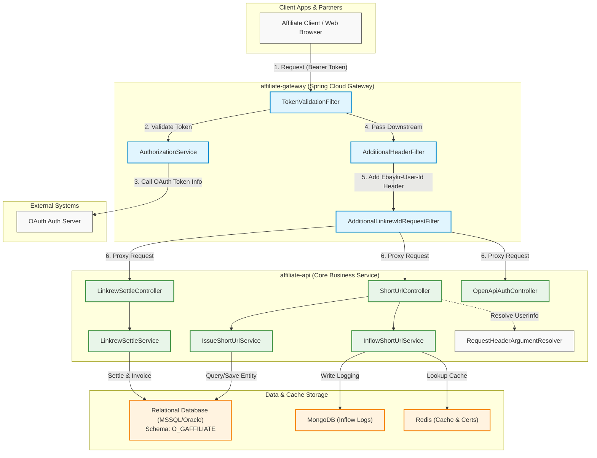
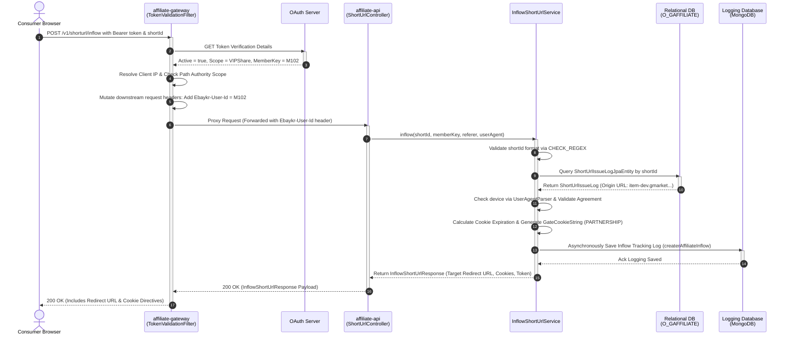

# Core Affiliate API & Business Services

## 1. Overview & System Architecture

Gmarket Affiliate System은 외부 파트너(Affiliate Partners), 인플루언서(Curators) 및 마케팅 대행사들이 자사 상품 링크를 공유하여 유입 및 구매를 유도하고, 이에 따른 기여도를 추적하여 수익을 정산해 주는 고성능 마케팅 플랫폼입니다. 전체 시스템 아키텍처는 고가용성, 대용량 트래픽 처리, 그리고 보안을 극대화하기 위해 API Gateway 레이어와 Core Business API 레이어로 물리적·논리적으로 격리되어 설계되었습니다.

### 1.1. System Component Relationship Diagram

---

## 2. Authentication & Authorization Flow

Gmarket Affiliate System의 핵심 관문인 `affiliate-gateway` 모듈은 외부 요청의 인증 및 인가를 전담하여 백엔드 비즈니스 서비스를 외부 공격 및 불법 접근으로부터 보호합니다. 본 아키텍처는 Spring Cloud Gateway의 비동기 리액티브 필터 체인을 기반으로 구축되었습니다.

### 2.1. Authentication Process Detail
1. **Request Interception**: 외부 클라이언트가 `/v1/` 하위 API를 호출하면 Gateway의 [TokenValidationFilter.java](file:///Users/jaecjeong/work/martech/affiliate/affiliate-gateway/affiliate-gateway-api/src/main/java/com/gmarket/affiliate/gateway/api/filter/TokenValidationFilter.java)가 요청을 인터셉트하여 `Authorization` 헤더에서 `Bearer` 액세스 토큰을 추출합니다.
2. **OAuth Token Verification**: 필터는 [AuthorizationService.java](file:///Users/jaecjeong/work/martech/affiliate/affiliate-gateway/affiliate-gateway-api/src/main/java/com/gmarket/affiliate/gateway/api/service/AuthorizationService.java#L101-L127)의 `validateToken` 메소드를 호출합니다. 이 메소드는 Gateway 설정 파일인 [application-gmarket.yaml](file:///Users/jaecjeong/work/martech/affiliate/affiliate-backend/affiliate-api/src/main/resources/application-gmarket.yaml)에 구성된 `verificationClientId` 및 `verificationClientSecret` 기반의 Basic Authentication 헤더를 동적으로 생성하여 내부 OAuth API 서버(`OAuthApiClient`)로 토큰 정보 조회를 요청합니다.
3. **Scope and Authorization Checks**: 반환된 토큰의 활성화 상태(`active == true`)를 검증한 후, 클라이언트가 접근하려고 하는 HTTP Method와 Request Path가 부여받은 권한 범위(`Scope`) 내에 있는지 `openApiUriSupport.validateOpenApiUri(...)`를 통해 확인합니다.
4. **Context Propagation & Downstream Headers**: 인가가 완료되면 [TokenValidationFilter.java](file:///Users/jaecjeong/work/martech/affiliate/affiliate-gateway/affiliate-gateway-api/src/main/java/com/gmarket/affiliate/gateway/api/filter/TokenValidationFilter.java#L96-L113)의 `setContextData(...)`에서 토큰에 바인딩된 파트너의 고유 식별값인 `memberKey`와 `linkrewId`를 Reactive Web Exchange의 Context에 기입합니다.
   - [AdditionalHeaderFilter.java](file:///Users/jaecjeong/work/martech/affiliate/affiliate-gateway/affiliate-gateway-api/src/main/java/com/gmarket/affiliate/gateway/api/filter/AdditionalHeaderFilter.java#L18-L32)는 컨텍스트에서 `memberKey`를 조회하여 하위 마이크로서비스로 프록시되는 HTTP Request 헤더에 `Ebaykr-User-Id` 키값으로 추가합니다.
   - [AdditionalLinkrewIdRequestFilter.java](file:///Users/jaecjeong/work/martech/affiliate/affiliate-gateway/affiliate-gateway-api/src/main/java/com/gmarket/affiliate/gateway/api/filter/AdditionalLinkrewIdRequestFilter.java#L19-L51)는 특정 라우트 조건이 만족되는 경우, Context에서 추출한 `linkrewId`를 Query Parameter 목록에 직접 주입하여 클라이언트가 임의의 다른 파트너 ID를 위조해 전송하는 **IDOR(Insecure Direct Object Reference) 어뷰징을 인프라 레벨에서 원천 차단**합니다.
5. **Downstream Argument Resolution**: Core API의 [WebConfig.java](file:///Users/jaecjeong/work/martech/affiliate/affiliate-backend/affiliate-api/src/main/java/com/gmarket/affiliate/api/config/WebConfig.java#L19-L31)에 등록된 [RequestHeaderArgumentResolver.java](file:///Users/jaecjeong/work/martech/affiliate/affiliate-backend/affiliate-api/src/main/java/com/gmarket/affiliate/api/config/RequestHeaderArgumentResolver.java#L15-L52)는 `@UserInfoHeader` 어노테이션이 선언된 컨트롤러 메소드 파라미터에서 `Ebaykr-User-Id` 헤더를 투명하게 디코딩하여 `UserInfo` 객체로 역직렬화합니다.

---

## 3. Core Business Services

### 3.1. Short URL Issuance Service (`IssueShortUrlService`)
- **WHAT**: 마케터나 일반 유저가 타겟 상품, 기획전 또는 검색 결과 페이지를 홍보하기 위해 단축된 형태의 공유용 URL을 요청했을 때, 고유 식별 정보가 삽입된 최적화된 URL을 발급 및 기록하는 비즈니스 컴포넌트입니다.
- **HOW**:
  1. 외부 호출 컨트롤러인 [ShortUrlController.java](file:///Users/jaecjeong/work/martech/affiliate/affiliate-backend/affiliate-api/src/main/java/com/gmarket/affiliate/api/controller/ShortUrlController.java#L89-L110)로부터 요청을 위임받아 [IssueShortUrlService.java](file:///Users/jaecjeong/work/martech/affiliate/affiliate-backend/affiliate-api/src/main/java/com/gmarket/affiliate/api/service/IssueShortUrlService.java#L63-L203)의 `issue(...)` 메소드가 실행됩니다.
  2. `ShareType.Cash` 또는 `ShareType.Linkrew` 등의 적립형 공유일 경우, 전달받은 `memberKey` 유무를 우선적으로 검증하여 비로그인 접근을 에러로 반환합니다.
  3. `ShortIdSupport.makeShortId(...)`를 통해 사용자 고유 키, 타겟 URL 도메인 값, DB 시퀀스 번호(`shortUrlRepository.nextVal()`) 및 인플로우 유입 방식 정보를 인코딩 및 압축하여 유니크한 `shortId` 값을 연산해 냅니다.
  4. 발급 당시 유효한 마케팅 제휴 정책인 [AffiliatePolicyResponse](file:///Users/jaecjeong/work/martech/affiliate/affiliate-backend/affiliate-api/src/main/java/com/gmarket/affiliate/api/model/response/AffiliatePolicyResponse.java)를 조회하고, 사용자가 해당 공유 행위에 필요한 약관 정보(`AgreementType`)에 정상 동의했는지 [AgreementRepository.java](file:///Users/jaecjeong/work/martech/affiliate/affiliate-backend/affiliate-api/src/main/java/com/gmarket/affiliate/api/repository/AgreementRepository.java)로 확인합니다.
  5. 특정 금지 상품군에 속한 카테고리 코드(`LimitCategoryCodeRepository`)의 상품 공유인지를 검증하여 캐시 적립 대상에서 제외시킵니다.
  6. 최종적으로 PC 환경용 Target URL과 Mobile 기기 대응용 Target URL을 분리 연산한 뒤, 발급 기기 정보 및 브라우저를 파싱하여 [IssueShortUrlRepository.java](file:///Users/jaecjeong/work/martech/affiliate/affiliate-backend/affiliate-api/src/main/java/com/gmarket/affiliate/api/repository/IssueShortUrlRepository.java#L34-L79)를 거쳐 Oracle/MSSQL 등 관계형 데이터베이스의 `ShortUrlIssueLogJpaEntity`에 영속적으로 적재합니다.
- **WHY**:
  - 발급 시점에 사용자의 단말 정보(User-Agent)와 필수 약관 동의 내역, 타겟 카테고리를 실시간 필터링함으로써 정산 정합성을 보장합니다.
  - Sub ID 및 Linkrew ID의 어뷰징(타인의 매체 식별자를 부정 도용하는 행위) 검증을 거침으로써 마케팅 부정행위(Fraud)를 방지하는 설계적 장치입니다.

### 3.2. Short URL Inflow & Redirection Service (`InflowShortUrlService`)
- **WHAT**: 마케터가 생성한 단축 URL을 소비자가 클릭하여 시스템에 진입했을 때, 해당 단축 URL의 무결성과 만료 상태를 체크한 뒤 트래킹용 식별 쿠키 및 토큰을 발급하여 최종 쇼핑몰 페이지로 리다이렉트하는 유입 처리 엔진입니다.
- **HOW**:
  1. 소비자가 단축 URL을 통해 접속하면 [InflowShortUrlService.java](file:///Users/jaecjeong/work/martech/affiliate/affiliate-backend/affiliate-api/src/main/java/com/gmarket/affiliate/api/service/InflowShortUrlService.java#L61-L274)의 `inflow(...)` 가 기동됩니다.
  2. 인자로 인입된 `shortId`가 지정 규격 포맷(`CHECK_REGEX = "[a-z|A-Z|0-9]*"`)에 일치하는지 정규표현식으로 빠르게 검증하여 악성 SQL Injection 유입 등을 초기에 차단합니다.
  3. [IssueShortUrlRepository.java](file:///Users/jaecjeong/work/martech/affiliate/affiliate-backend/affiliate-api/src/main/java/com/gmarket/affiliate/api/repository/IssueShortUrlRepository.java#L81-L86)를 통해 데이터베이스에 보관 중인 `ShortUrlIssueLogJpaEntity` 원본 로그를 호출합니다.
  4. 정책 정보(`AffiliatePolicyResponse`)와 유효 기한 설정을 분석하여, 발급 시점 기준으로 현재 유입 시점이 쿠키 보존 기한 및 정산 기한 내에 있는지 `getExpireDate(...)`로 연산합니다.
  5. 추적 쿠키 데이터 생성기인 [GateCookieSupport.java](file:///Users/jaecjeong/work/martech/affiliate/affiliate-backend/affiliate-api/src/main/support/GateCookieSupport.java)를 호출하여 최종 모바일 앱 또는 PC 브라우저에 구워질 `PARTNERSHIP` 트래킹용 암호화 쿠키 문자열을 동적 생성합니다.
  6. 이로써 획득된 최종 경로 정보와 쿠키 생성 내역을 기반으로 MongoDB 로그 데이터베이스(`InflowShortUrlMongoRepository`)에 실시간 유입 트래픽 이력 로그를 대량으로 배치 기입하며, 호출자에게는 302 리다이렉트를 처리할 원본 타겟 URL 정보가 포함된 `InflowShortUrlResponse`를 응답합니다.
- **WHY**:
  - 유입(Inflow) 비즈니스는 실시간 마케팅 트래픽이 집중되므로 트래픽 지연을 최소화해야 합니다. 따라서 상대적으로 쓰기 성능 및 분산 처리가 뛰어난 MongoDB 스토리지(`InflowShortUrlMongoRepository`)를 정산 이력 기록 저장소로 분리 채택하여 확장성 및 성능 부하 분리를 도모하고 있습니다.

### 3.3. Affiliate Settlement & Remittance Service (`LinkrewSettleService` & `LinkrewSettleTransferService`)
- **WHAT**: 제휴 채널을 통한 유입 기여로 발생한 주문 건들의 정산 데이터를 일별/월별로 집계하고 검증하여 외부 은행 또는 사내 정산 코어 인프라를 통해 수수료를 최종 송금하는 비즈니스 영역입니다.
- **HOW**:
  1. 백엔드에서 정산 데이터 수집 프로세스([LinkrewSettleService.java](file:///Users/jaecjeong/work/martech/affiliate/affiliate-backend/affiliate-api/src/main/java/com/gmarket/affiliate/api/service/LinkrewSettleService.java))가 특정 파트너 `linkrewId`에 걸려 있는 결제 및 환불 집계 데이터를 조회합니다.
  2. 수수료율 매핑 정보 및 정책 모델 데이터베이스(`LinkrewSellerFeeRepository`)를 취합하여 파트너에게 환원할 최종 정산 예정 금액을 확정합니다.
  3. 확정 내역을 기반으로 거래명세서 역발행(`Reverse Invoice`) 프로세스를 제공하여 파트너의 확인 서명을 대기합니다.
  4. 송금 이체 단계가 다다르면 [LinkrewSettleTransferService.java](file:///Users/jaecjeong/work/martech/affiliate/affiliate-backend/affiliate-api/src/main/java/com/gmarket/affiliate/api/service/LinkrewSettleTransferService.java)가 실시간 송금 완료 콜백 API 엔드포인트 `/v1/linkrew-settle/remittance-complete` 로 유입되는 은행 측 수신 성공/실패 정보를 인터셉트합니다.
  5. 성공 상태코드(`S`) 수신 시 해당 파트너의 이체 이력을 성공으로 플래그 처리하고, 계좌 에러 등의 실패 상태코드(`F`) 수신 시 수동 처리 큐에 데이터를 적재한 뒤 정산 담당자 노티피케이션을 제공합니다.
- **WHY**:
  - 금융 결제 정보의 특성상 정합성이 최우선이므로 이력 추적과 멱등성 보장이 중요합니다. 송금 실패 원인(계좌 불일치 등)을 상세 기록하도록 이중 검증 테이블 구조를 지니고 있으며 수동 배치 조정과 자동화 조정 로직([LinkrewSettleAdjustAutoService.java](file:///Users/jaecjeong/work/martech/affiliate/affiliate-backend/affiliate-api/src/main/java/com/gmarket/affiliate/api/service/LinkrewSettleAdjustAutoService.java), [LinkrewSettleAdjustManualService.java](file:///Users/jaecjeong/work/martech/affiliate/affiliate-backend/affiliate-api/src/main/java/com/gmarket/affiliate/api/service/LinkrewSettleAdjustManualService.java))을 모듈 단위로 완전히 파티셔닝하여 시스템 안정성을 구축했습니다.

---

## 4. REST API Endpoints

| HTTP Method | API Path | Authorization Requirement | Request Summary | Response Summary |
| :--- | :--- | :--- | :--- | :--- |
| `POST` | `/v1/open-api-auth/auth-info/save` | Client Credentials | `SaveAuthInfoRequest` (Linkrew ID 및 파트너 정보) | `LinkrewApiAuthInfoResponse` (발급된 Client ID 및 Secret) |
| `GET` | `/v1/open-api-auth/auth-info` | Client Credentials | Query: `linkrewId` (Long) | `LinkrewApiAuthInfoResponse` (ClientID 및 상태 정보 조회) |
| `GET` | `/v1/open-api-auth/auth-info-by-client-id` | Client Credentials | Query: `clientId` (String) | `LinkrewApiAuthInfoResponse` (클라이언트 ID 기반 상세 조회) |
| `POST` | `/v1/shorturl/issue` | Bearer Access Token | `IssueShortUrlRequest` (타겟 링크, 카테고리 코드, ShareType) | `String` (단축된 도메인 링크, 예: `https://dev.gmkt.kr/XXXXX`) |
| `POST` | `/v1/shorturl/inflow` | Bearer Access Token | `InflowShortUrlRequest` (shortId, Referer, User-Agent, IP) | `InflowShortUrlResponse` (쿠키 스트링, 최종 Target Url, 만료기한) |
| `GET` | `/v1/linkrew-settle` | Bearer Access Token | Query: `linkrewId` (Long) | `List&lt;LinkrewSettleProcWithInvoiceResponse&gt;` (정산 거래 리포트 목록) |
| `POST` | `/v1/linkrew-settle/remittance-complete` | Basic Credential (사내 인프라망 전용) | `RemittanceSettlementRequest` (송금 번호, 성공 여부 코드) | `RemittanceSettlementResponse` (송금 반영 결과 상태 코드) |

---

## 5. Sequence Diagram: Short URL Inflow Processing

소비자가 마케터의 단축 링크를 클릭하여 유입되었을 때, `Gateway` 및 `Core API` 컴포넌트 간에 벌어지는 트래픽 라이프사이클 처리 시퀀스는 다음과 같습니다.

