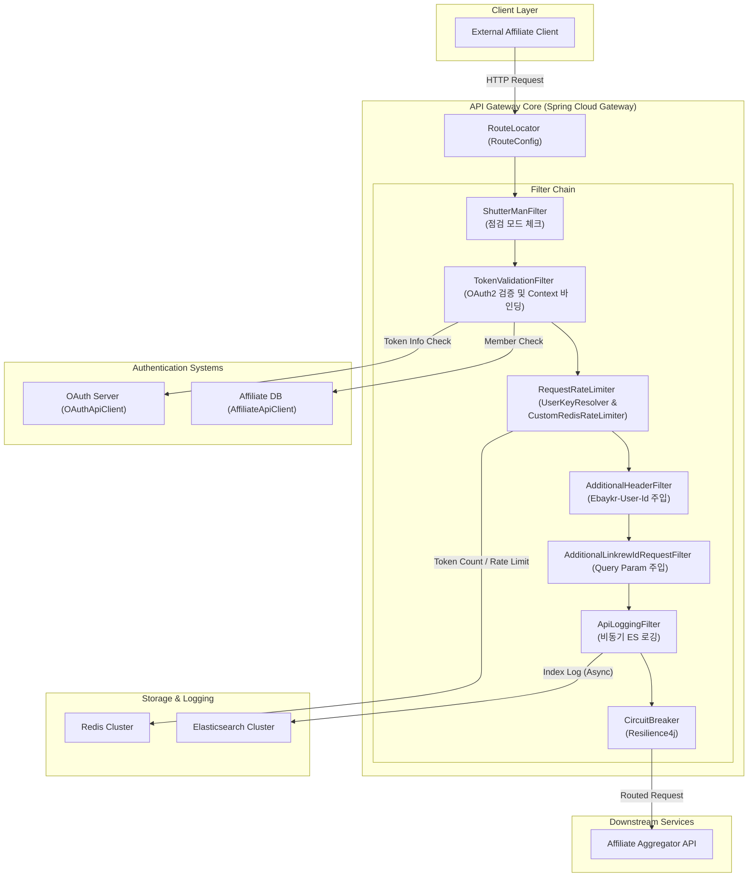
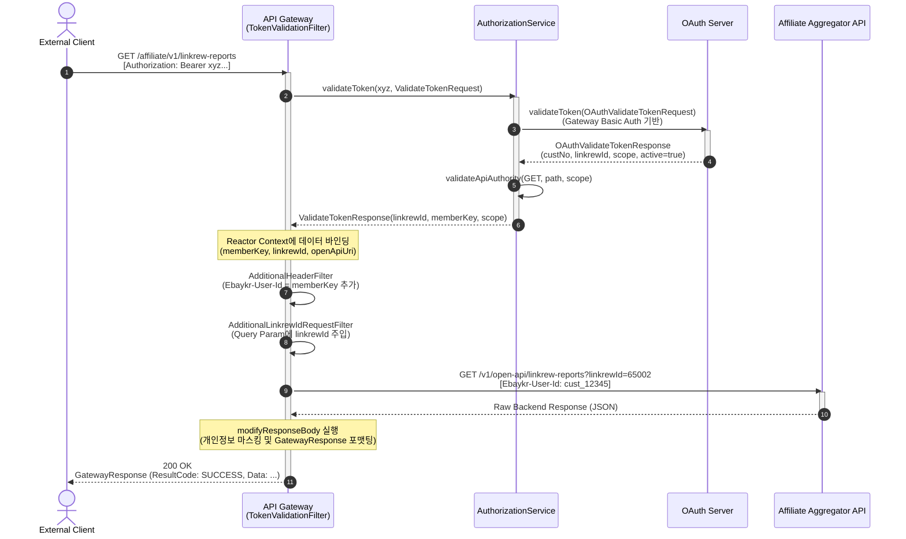

# API Gateway & Traffic Routing

## Introduction & Overview

Gmarket Affiliate 서비스의 API Gateway는 외부 파트너사(어필리에이트) 및 채널 서비스로부터 들어오는 모든 트래픽을 안전하고 효율적으로 제어하여 내부 마이크로서비스로 라우팅하는 단일 진입점 역할을 합니다. **Spring Cloud Gateway**와 **Project Reactor(Spring WebFlux)** 기반의 완전 비동기 논블로킹(Non-blocking) 아키텍처로 구현되어 있으며, 분산 환경에서의 높은 처리량(Throughput)과 안정성을 유지하도록 설계되었습니다.

본 위키 페이지는 API Gateway의 라우팅 구조, 인증/인가 아키텍처, 분산 환경에서의 Redis 기반 유량 제어 기법, 그리고 장애 전파 방지를 위한 Resiliency 설계 등 핵심 컴포넌트들의 동작 메커니즘을 상세히 다룹니다.

---

## Architecture Design

API Gateway는 클라이언트로부터 들어오는 요청을 검증하고 가공한 후, Downstream 서비스인 `affiliate-aggregator-api` 등으로 안전하게 위임합니다. 전체적인 컴포넌트 구조는 다음과 같이 구성되어 있습니다.



---

## Authentication & Authorization Flow

### Authentication & Authorization Paragraphs
Gateway로 진입하는 모든 API 요청은 HTTP Header의 `Authorization: Bearer &lt;Access_Token&gt;`을 통해 인증 과정을 거칩니다. [TokenValidationFilter](file:///Users/jaecjeong/work/martech/affiliate/affiliate-gateway/affiliate-gateway-api/src/main/java/com/gmarket/affiliate/gateway/api/filter/TokenValidationFilter.java)가 해당 요청을 가로채고, [AuthorizationService](file:///Users/jaecjeong/work/martech/affiliate/affiliate-gateway/affiliate-gateway-api/src/main/java/com/gmarket/affiliate/gateway/api/service/AuthorizationService.java)를 통해 토큰의 유효성을 최종 검증합니다.

`AuthorizationService` 내부에서는 크게 세 단계의 검증 및 컨텍스트 바인딩 작업이 발생합니다:
1. **OAuth2 Token Validation**: [OAuthApiClient](file:///Users/jaecjeong/work/martech/affiliate/affiliate-gateway/affiliate-gateway-api/src/main/java/com/gmarket/affiliate/gateway/api/client/OAuthApiClient.java)를 호출해 OAuth 인증 서버에 토큰 유효성 검증을 요청(`getTokenInfo`)합니다. 이때, Gateway의 Client ID/Secret을 Basic Authentication 형태로 인코딩하여 전송합니다. 검증 성공 시 토큰에 부여된 `scope`, 회원 식별 정보(`custNo`), 어필리에이트 식별 ID(`linkrewId`)를 획득합니다.
2. **API Specification & Scope Mapping**: 사용자가 요청한 HTTP Method 및 API URI Path가 토큰 내에 정의된 OAuth Scope(예: `USER`, `CHANNEL_USER`, `ADMIN`) 권한으로 실행 가능한지 [OpenApiUriSupport](file:///Users/jaecjeong/work/martech/affiliate/affiliate-gateway/affiliate-gateway-api/src/main/java/com/gmarket/affiliate/gateway/api/support/OpenApiUriSupport.java) 모듈을 통해 검사합니다.
3. **Reactor Context Binding**: 검증이 완료되면, Downstream 필터 및 마이크로서비스에서 공통으로 재사용할 수 있도록 `memberKey`(`custNo`), `linkrewId`, 그리고 API 메타데이터 정보(`openApiUri`)를 Reactor Context에 바인딩(`contextWrite`)합니다. 이 컨텍스트 정보를 활용해 [AdditionalHeaderFilter](file:///Users/jaecjeong/work/martech/affiliate/affiliate-gateway/affiliate-gateway-api/src/main/java/com/gmarket/affiliate/gateway/api/filter/AdditionalHeaderFilter.java)에서 `Ebaykr-User-Id` 헤더를 생성하여 백엔드로 안전하게 전달합니다.

### Gateway API Endpoints
Gateway가 직접 노출하거나 중개하는 핵심 엔드포인트 구조는 다음과 같습니다:

| HTTP Method | Path | Auth Type | Request & Response Summary |
| :--- | :--- | :--- | :--- |
| `POST` | `/auth/token` | Basic Auth (Client ID/Secret) | OAuth Access Token 발급 요청. 파트너 계정 및 계약 활성화 상태 체크 후 토큰 반환. |
| `GET` | `/affiliate/v1/linkrew-reports` | Bearer Token (`CHANNEL_USER`, `ADMIN`) | 기간별 어필리에이트 리포트 조회. Query Param에 `linkrewId` 자동 인젝션 처리됨. |
| `GET` | `/affiliate/v1/linkrew-settle` | Bearer Token (`CHANNEL_USER`, `ADMIN`) | 어필리에이트 정산 목록 조회. |
| `GET` | `/affiliate/v2/linkrew-reports/details/paging` | Bearer Token (`CHANNEL_USER`, `ADMIN`) | 페이징 처리된 리포트 상세 데이터 조회 (V2 - 카운트 쿼리 제외 최적화 버전). |

### Sequence Diagram: API Routing & Authentication Flow
다음 시퀀스 다이어그램은 클라이언트가 API Gateway를 통해 Downstream 백엔드 서비스를 호출하는 전체 수명 주기를 나타냅니다.



---

## Dynamic Traffic Routing & API Specification Mapping

API Gateway의 유연한 라우팅 핵심은 [RouteConfig](file:///Users/jaecjeong/work/martech/affiliate/affiliate-gateway/affiliate-gateway-api/src/main/java/com/gmarket/affiliate/gateway/api/config/RouteConfig.java)를 통한 동적 라우팅 테이블 정의에 있습니다. `RouteConfig`는 YAML 설정 파일인 [application-gmarket.yaml](file:///Users/jaecjeong/work/martech/affiliate/affiliate-gateway/affiliate-gateway-api/src/main/resources/application-gmarket.yaml)에 사전 정의된 `com.gmarket.affiliate.gateway.data.routes` 목록을 주입받아 실시간으로 라우트 구조를 매핑합니다.

### 개발 및 운영 환경의 동적 필터 분기 (WHAT / HOW / WHY)
* **WHAT**: Gateway는 구동 환경(실행 환경)에 따라 보안 및 점검 필터를 유동적으로 켜고 끕니다.
* **HOW**: `RouteConfig.getRouteBuildable()` 메소드는 [EnvSupport](file:///Users/jaecjeong/work/martech/affiliate/affiliate-gateway/affiliate-gateway-api/src/main/java/com/gmarket/affiliate/gateway/api/support/EnvSupport.java) 모듈을 이용해 `envSupport.isDev()` 여부를 판단합니다. 개발 환경일 경우 전체 시스템 점검 기능을 수행하는 `ShutterManFilter`를 필터 체인에서 제외하고 라우팅을 빌드하며, 운영 환경에서는 해당 필터를 가장 최상위에 위치시킵니다.
* **WHY**: 점검 정보를 조회하는 `ShutterMan` API 서버가 운영 전용 환경에만 구축되어 있기 때문입니다. 만약 개발 환경에서 이 필터를 활성화하면 점검 정보 API 호출 자체가 네트워크 정책상 실패하여 개발 게이트웨이 전체 요청이 불가능해집니다. 따라서 로컬 및 개발 환경의 유연성을 위해 필터 파이프라인에서 환경에 따라 동적으로 제거하도록 설계되었습니다.

---

## Distributed Rate Limiting & Hotspot Prevention

대규모 트래픽 환경에서 특정 파트너사의 오남용 API 호출로 인해 전체 시스템 성능이 저하되는 현상을 차단하기 위해, Gateway는 Redis 기반의 분산 처리 유량 제어 시스템을 구축하고 있습니다.

### UserKeyResolver의 로컬/글로벌 이중 캐싱 구조
유량 제어를 고유 식별하기 위해 [UserKeyResolver](file:///Users/jaecjeong/work/martech/affiliate/affiliate-gateway/affiliate-gateway-api/src/main/java/com/gmarket/affiliate/gateway/api/config/UserKeyResolver.java)를 활용합니다.
```java
String prefixKey = redisProperties.getRequestRateLimiterKeyPrefix() + "." + linkrewId + "-" + apiSeqNo;
```
위와 같이 파트너사 ID(`linkrewId`)와 호출한 API 번호(`apiSeqNo`)의 조합으로 고유 키를 정의합니다.

### Redis Cluster 핫스팟 제거를 위한 분산 버킷 라운드로빈 기법 (WHAT / HOW / WHY)
* **WHAT**: 특정 대형 파트너사(예: 대형 채널 연동 업체)에서 대량의 API 요청을 보낼 때, Redis 클러스터의 특정 슬롯(Hash Slot) 및 단일 노드에 CPU 부하가 폭발적으로 몰리는 **Hotspot Node** 현상을 해결합니다.
* **HOW**: `UserKeyResolver` 내부적으로 로컬 Caffeine Cache(`countersMap`)를 두어 파트너사+API 조합별 `AtomicInteger` 인스턴스를 관리합니다. 키가 조회될 때마다 `getRoundRobinBucketIndex()` 함수를 통해 인덱스를 획득하고, 다음과 같이 분산 해싱 태그를 생성합니다:
  ```java
  prefixKey = "gmkt:aff:gw.65002-100004"
  // Bucket Size가 8일 때 0~7 사이의 값 분산
  int bucketIndex = Math.abs(counter.getAndIncrement() % bucketSize); 
  return prefixKey + "-" + bucketIndex; // 최종 키: gmkt:aff:gw.65002-100004-3
  ```
  이러한 라운드로빈 방식으로 키 명칭 뒤에 인덱스를 분할하여 Redis Cluster 내의 여러 노드로 슬롯 분산을 유도합니다.
* **WHY**: 대형 연동사 1곳이 초당 수천 건의 요청을 발생시키는 경우, 단일 키를 사용하게 되면 Redis Cluster 구조라 하더라도 해당 키를 관리하는 특정 Redis Master 노드로 모든 읽기/쓰기 커맨드가 집중되어 병목이 발생합니다. Caffeine 로컬 메모리 카운터와 모듈러 연산으로 Redis 분산 저장 공간(Bucket)을 인위적으로 나누어 줌으로써 Redis 부하를 클러스터 전체 노드로 균등 분산시킵니다. 카운터는 점차 값이 증가하여 오버플로우되거나 무한정 커지는 것을 방지하기 위해 `counter.compareAndSet(bucketSize, 0)` 로직을 적용하여 메모리 및 값의 바운더리를 보호합니다.

---

## Filtering Pipeline & Response Processing

Gateway를 통과하는 요청과 응답은 순차적으로 배치된 특수 목적 필터들에 의해 가공됩니다.

```
Request ──> [ShutterManFilter] ──> [TokenValidationFilter] ──> [RequestRateLimiter]
                                                                        │
Response <── [ModifyResponseBody] <── [CircuitBreaker] <── [ApiLoggingFilter] <──┘
```

1. **AdditionalLinkrewIdRequestFilter** ([AdditionalLinkrewIdRequestFilter.java](file:///Users/jaecjeong/work/martech/affiliate/affiliate-gateway/affiliate-gateway-api/src/main/java/com/gmarket/affiliate/gateway/api/filter/AdditionalLinkrewIdRequestFilter.java)):
   * **기능**: OpenAPI 규격 상 어필리에이트 파트너는 대개 자신에게 한정된 리포트 데이터만 조회해야 합니다. 이를 강제하기 위해 Gateway 수준에서 Context의 검증된 `linkrewId` 값을 가로채어 HTTP GET 요청의 Query Parameter에 `?linkrewId=65002` 형태로 자동 인젝션 처리합니다.
   * **YAML 바인딩**: `application-gmarket.yaml` 내의 각 API 정의(`com.gmarket.affiliate.gateway.openapi.openApiUriList`) 중 `request-filter-type-list` 항목에 `AdditionalLinkrewIdRequestFilter`가 명시된 경로에만 타겟팅되어 선택적으로 작동합니다.
2. **ApiLoggingFilter** ([ApiLoggingFilter.java](file:///Users/jaecjeong/work/martech/affiliate/affiliate-gateway/affiliate-gateway-api/src/main/java/com/gmarket/affiliate/gateway/api/filter/ApiLoggingFilter.java)):
   * **기능**: 호출 이력을 Elasticsearch에 인덱싱합니다.
   * **비동기 최적화**: 논블로킹 특성을 훼손하지 않기 위해 `apiLogService.insert()`의 호출 스케줄러를 `boundedElastic` 스레드 풀로 바운딩하고 즉시 구독(`subscribe()`) 처리하여 백그라운드 스레드에서 처리가 완료되도록 보장합니다. 메인 라우팅 Reactive Stream은 지연 없이 바로 이어서 통과됩니다.
3. **Response Formatting & PII Masking**:
   * Downstream 백엔드가 전달한 날것의 응답(Raw JSON String)은 Gateway의 `modifyResponseBody` 페이즈를 탑니다.
   * [ResponseSupport](file:///Users/jaecjeong/work/martech/affiliate/affiliate-gateway/affiliate-gateway-api/src/main/java/com/gmarket/affiliate/gateway/api/support/ResponseSupport.java) 모듈을 통해 비즈니스 공통 포맷인 `GatewayResponse` 형식으로 감싸지며, YAML의 `response-remove-personal-info.keywords`에 명시된 개인식별정보(PII) 키워드들(`linkrewId`, `memberKey`, `loginId` 등)이 응답 페이로드에서 즉시 제거 혹은 마스킹 처리되어 클라이언트로 반환됩니다.

---

## Resiliency & Error Handling

Gateway는 연동되어 있는 백엔드 마이크로서비스 또는 타사 API의 장애로 인해 게이트웨이 자체가 마비되는 Cascading Failure(장애 전파)를 완벽하게 차단하도록 설계되었습니다.

### Resilience4j Circuit Breaker 연동
[application-gmarket.yaml](file:///Users/jaecjeong/work/martech/affiliate/affiliate-gateway/affiliate-gateway-api/src/main/resources/application-gmarket.yaml#L143-L167) 설정을 바탕으로 `ApiGatewayCircuitBreaker` 인스턴스를 가동합니다.
* **동작 파라미터**: 슬라이딩 윈도우 크기는 `100`건(Count-based)이며, 요청 실패율이 `50%`를 초과할 경우 서킷이 즉시 오픈(`OPEN` 상태)됩니다. 서킷이 열린 상태에서는 백엔드 API를 호출하지 않고 빠른 실패(Fail-fast) 처리를 함으로써 Downstream 시스템의 복구 시간을 확보해 줍니다.
* **타임아웃 설정**: 백엔드 API로 전달된 요청의 타임아웃 임계치는 `180초`(`timeout-duration: 180s`)로 상한선을 두어, 일부 장기 배치성 조회 API의 특성을 감안하면서도 시스템 자원이 고갈되는 현상을 방지합니다.

### Global Exception Handling
게이트웨이 파이프라인(필터링, Rate Limiting, 라우팅 과정 등)에서 던져진 예외들은 최상위에 설정된 [GlobalErrorWebExceptionHandler](file:///Users/jaecjeong/work/martech/affiliate/affiliate-gateway/affiliate-gateway-api/src/main/java/com/gmarket/affiliate/gateway/api/config/GlobalErrorWebExceptionHandler.java)에 의해 일괄 제어됩니다.

* `AbstractErrorWebExceptionHandler`를 확장하여 구현되었으며, 게이트웨이 레이어의 에러 응답은 내부 통신 규격 상 **항상 HTTP status 200 (OK)** 로 감싸서 내려갑니다.
* 실제 비즈니스 에러 식별은 JSON 페이로드 구조 내의 에러 속성들을 통해 구분됩니다:
  ```json
  {
    "success": false,
    "resultCode": "NON_VALIDATED_REQUEST",
    "resultMessage": "요청 파라미터 혹은 인증 정보가 올바르지 않습니다.",
    "data": null
  }
  ```
* [GlobalErrorWebExceptionHandler.renderErrorResponse](file:///Users/jaecjeong/work/martech/affiliate/affiliate-gateway/affiliate-gateway-api/src/main/java/com/gmarket/affiliate/gateway/api/config/GlobalErrorWebExceptionHandler.java#L53-L73) 메서드에서 인입된 에러 객체를 분류하여 `ApiDomainException`, `AffiliateDomainException`, 혹은 Spring WebFlux 프레임워크의 파라미터 바인딩 오류인 `WebExchangeBindException` 등을 정제된 공통 오류 포맷으로 가공 처리한 후 응답 스트림으로 전송합니다.