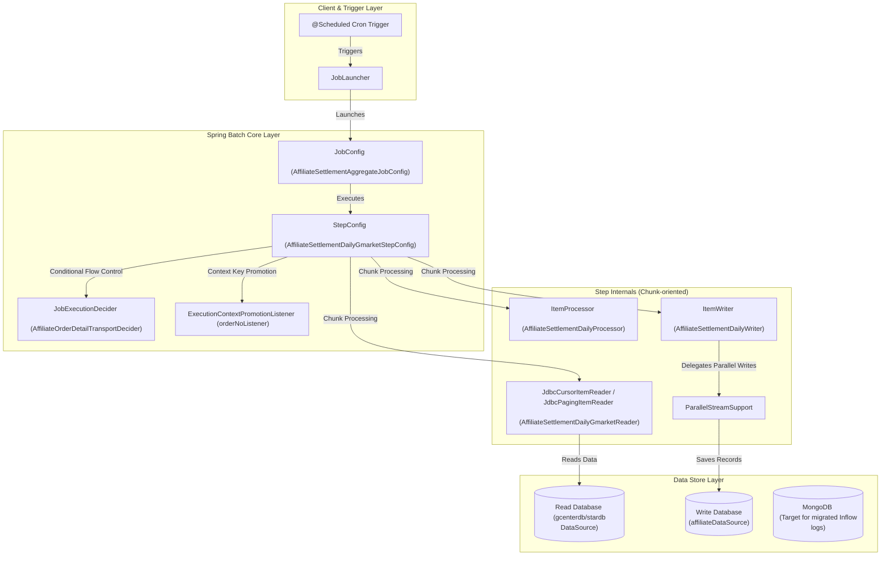
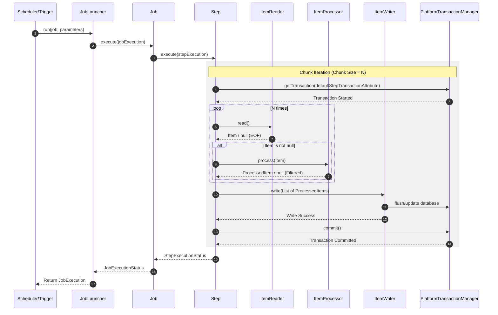

# Technical Wiki: Batch Settlement & Data Retention

## Overview

본 문서는 Gmarket Affiliate 서비스 내에서 핵심적인 백엔드 배치(Batch) 인프라를 담당하고 있는 **Batch Settlement(정산 집계 및 지급)** 시스템과 **Data Retention(데이터 보존 및 수명 주기 관리)** 시스템의 소프트웨어 아키텍처 및 상세 설계를 다룹니다.

본 시스템은 대용량 트랜잭션 데이터를 안정적으로 처리하고, 시스템 성능 저하를 방지하기 위해 RDBMS 테이블의 크기를 최적화하도록 설계되었습니다. Spring Batch 프레임워크를 기반으로 하며 다중 데이터 소스(Multi-DataSource) 연동, 청크(Chunk) 기반 트랜잭션 관리, 데시메이터(Decider)를 이용한 동적 루프 제어, 그리고 데이터 보존용 MongoDB 전환 전략 등의 기술적 특징을 가지고 있습니다.

---

## Component Architecture

시스템의 핵심 구성 요소와 이들의 계층 구조 및 데이터 흐름은 다음과 같습니다.

---

## Batch Settlement Subsystem

### 1. Overview & Business Objectives
**Batch Settlement Subsystem**은 제휴 채널을 통해 유입된 주문 정보 및 환불 정보를 일 단위로 집계하고, 월별 정산 데이터를 생성한 후 최종 지급 테이블까지 데이터를 이관 및 검증하는 역할을 수행합니다.
- **주요 파일**: [AffiliateSettlementAggregateJobConfig.java](file:///Users/jaecjeong/work/martech/affiliate/affiliate-batch/affiliate-settlement-batch/src/main/java/com/gmarket/affiliate/batch/config/job/AffiliateSettlementAggregateJobConfig.java)
- **대상 모듈**: `affiliate-settlement-batch`

### 2. Internal Mechanics & Execution Steps
`AffiliateSettlementAggregateJobConfig` 클래스는 `affiliateSettlementAggregateJob()` 메서드를 통해 단일 Job 흐름에 여러 순차적 Step과 분기 흐름을 구성하고 있습니다.

1. **Daily Aggregation (일집계)**
   - **`affiliateSettlementDailyStep`**: 주문일 기준으로 대상을 조회하여 일집계 테이블(`AFFILIATE_SETTLE_DAILY`)에 데이터를 생성 및 적재합니다. ([AffiliateSettlementDailyGmarketStepConfig.java](file:///Users/jaecjeong/work/martech/affiliate/affiliate-batch/affiliate-settlement-batch/src/main/java/com/gmarket/affiliate/batch/config/step/gmarket/AffiliateSettlementDailyGmarketStepConfig.java))
   - **`affiliateSettlementDailyRefundStep`**: 환불일 기준으로 취소/환불 내역을 반영합니다.
   - **`affiliateSettlementDailyTransportStep` & `affiliateSettlementDailyTransportRetryStep`**: 배송 완료일 업데이트 및 누락 건에 대한 보정 처리를 실행합니다.
   - **`affiliateSettleDetailDailyStep`**: 고객 적립 금액의 실시간 노출(MyG 화면 등)을 위해 정산상세 테이블(`AFFILIATE_SETTLE_DETAIL`)에 적재를 수행합니다.

2. **Monthly Aggregation (월집계)**
   - **`affiliateShareInsertSettleMonthlyStep`**: 정산 예정일(`settleExpectedDate`)이 도래한 건들을 취합하여 월집계 원장 데이터를 생성합니다.
   - **`affiliateShareUpdateSettleSeqMonthlyStep` & `affiliateShareUpdateDetailSettleSeqMonthlyStep`**: 일집계 원장과 상세 테이블에 월정산 시퀀스(`settle_seq`)를 매핑하고 집계 완료 여부(`Y`)를 업데이트합니다.

3. **Monthly Payout (월지급)**
   - **`affiliateShareInsertSettleProcMonthlyStep`**: 지급 요청일(`procRequestDate`)에 도래한 최종 지급 데이터를 생성 및 검증 테이블로 적재합니다.
   - **`affiliateShareUpdateSettleDetailMonthlyStep`**: 월지급 완료 후 정산상세 테이블을 갱신합니다.

4. **Data Integrity Verification (검증 단계)**
   - 정산 테이블 간의 정합성을 검증하기 위해 다음과 같은 단계를 순차 실행합니다.
     - **`affiliateSettleDailyNDetailCompareStep`**: `DAILY`와 `DETAIL` 테이블의 정산 예정 총금액을 비교 검증합니다.
     - **`affiliateSettleDailyNDetailCompareByIssueMembStep`**: 개별 회원 레벨에서 `DAILY`와 `DETAIL` 금액 불일치 건이 존재하는지 세부 검증합니다.
     - **`affiliateSettleNProcCompareStep`**: 정산 원장(`AFFILIATE_SETTLE`)과 지급 원장(`AFFILIATE_SETTLE_PROC`)의 최종 합산 금액 일치 여부를 검증합니다.

### 3. Key Design Decisions & Rationale
- **Stored Procedure 기반 고속 추출**:
  - `ItemReader`인 [AffiliateSettlementDailyGmarketReader.java](file:///Users/jaecjeong/work/martech/affiliate/affiliate-batch/affiliate-settlement-batch/src/main/java/com/gmarket/affiliate/batch/reader/gmarket/AffiliateSettlementDailyGmarketReader.java)는 RDBMS의 부하를 줄이고 조회 쿼리를 튜닝하기 위해 직접 SQL을 선언하는 대신 DB 내부에 기정의된 Stored Procedure (`EXEC DBO.UPGMKT_Affiliate_Batch_AffiliateOrder_SelectByInputDtAndPolicyTypeCode`)를 구동하도록 설계되었습니다.
- **병렬 스트림을 통한 고속 Persist**:
  - [AffiliateSettlementDailyWriter.java](file:///Users/jaecjeong/work/martech/affiliate/affiliate-batch/affiliate-settlement-batch/src/main/java/com/gmarket/affiliate/batch/writer/AffiliateSettlementDailyWriter.java) 내의 `write()` 메서드는 `parallelStreamSupport.apply()`를 호출하여 Spring Batch의 단일 Writer 스레드 병목을 극복하고 JVM 내 병렬 스레드를 활용해 데이터베이스 쓰기 성능을 극대화합니다.
- **예외 필터링 전략**:
  - [AffiliateSettlementDailyProcessor.java](file:///Users/jaecjeong/work/martech/affiliate/affiliate-batch/affiliate-settlement-batch/src/main/java/com/gmarket/affiliate/batch/processor/AffiliateSettlementDailyProcessor.java)에서는 비즈니스 유효성 검증 실패로 인해 발생하는 `SettlementException`을 catch할 경우, 배치 프로세스를 중단(Throw)하지 않고 `null`을 반환하도록 설계되었습니다. Spring Batch 아키텍처상 `ItemProcessor`가 `null`을 반환하면 해당 Item은 Chunk의 쓰기 대상에서 제외(Filter-out) 처리되므로, 정상 항목들만 격리하여 원활한 정산을 지속할 수 있습니다.

---

## Data Retention & Clean-up Subsystem

### 1. Overview & Business Objectives
**Data Retention Subsystem**은 유입 추적 로그 등 주기적으로 생성되는 대용량 마케팅 데이터를 RDBMS로부터 삭제 처리하여 데이터베이스 저장 공간의 고갈을 막고 성능을 지속적으로 확보하는 역할을 합니다.
- **주요 파일**: [AffiliateRetentionJobConfig.java](file:///Users/jaecjeong/work/martech/affiliate/affiliate-batch/affiliate-retention-batch/src/main/java/com/gmarket/affiliate/batch/config/job/AffiliateRetentionJobConfig.java)
- **대상 모듈**: `affiliate-retention-batch`

### 2. Internal Mechanics & Execution Steps
`AffiliateRetentionJobConfig`는 `affiliateRetentionDataJob()` 빈을 빌드하고 총 3가지 세부 단계를 실행합니다.

1. **`affiliateRetentionInflowLogDataStep`**:
   - 쇼트 URL을 통해 유입된 과거 흔적 로그를 정리하는 단계입니다.
   - [AffiliateRetentionInflowLogStepConfig.java](file:///Users/jaecjeong/work/martech/affiliate/affiliate-batch/affiliate-retention-batch/src/main/java/com/gmarket/affiliate/batch/config/step/AffiliateRetentionInflowLogStepConfig.java)
2. **`affiliateRetentionPCSInflowAllStep`**:
   - 파트너 채널 시스템(PCS)을 통한 외부 유입 트래픽 로그를 정리하는 단계입니다.
3. **`affiliateRetentionChannelInflowAllStep`**:
   - 일반 광고 채널 유입 데이터를 정리하는 단계입니다.

각 Step의 데이터 삭제 로직은 대규모 데이터 대상의 락(Lock) 경합과 트랜잭션 롤백 로그 공간 부족을 완화하기 위해 **Paging Read → Batch Delete** 방식으로 구동됩니다.
- **Reader**: [AffiliateRetentionInflowLogDataItemReader.java](file:///Users/jaecjeong/work/martech/affiliate/affiliate-batch/affiliate-retention-batch/src/main/java/com/gmarket/affiliate/batch/reader/AffiliateRetentionInflowLogDataItemReader.java)
  - `INS_DATE` 필드가 설정된 보존 기한 임계치(`startDate`)보다 오래된 엔티티 데이터를 `JdbcPagingItemReader`를 활용하여 페이지 단위(`Chunk` 크기 크기만큼)로 나누어 순차 조회합니다.
- **Writer**: [AffiliateRetentionInflowLogDataItemWriter.java](file:///Users/jaecjeong/work/martech/affiliate/affiliate-batch/affiliate-retention-batch/src/main/java/com/gmarket/affiliate/batch/writer/AffiliateRetentionInflowLogDataItemWriter.java)
  - 조회한 `AffiliateInflowLogJpaEntity` 엔티티 리스트를 파라미터로 받아 데이터베이스에서 해당 PK 목록에 해당하는 데이터의 직접 삭제(`DELETE FROM AFFILIATE_INFLOW_LOG WHERE AFFILIATE_INFLOW_SEQNO = :id`)를 수행합니다.

### 3. Key Design Decisions & Rationale
- **RDBMS에서 MongoDB로의 이전 설계**:
  - `AffiliateRetentionJobConfig.java:31`의 주석 내에 명시된 설계적 주요 배경에 따르면, 트래픽 유입 로그 테이블(`AFFILIATE_INFLOW_LOG` 등)이 관계형 데이터베이스에서 **MongoDB로 마이그레이션**되었습니다.
  - 이에 따라 대량의 트래픽 쓰기 및 보존 기한 만료 후 삭제 동작을 RDBMS 대신 MongoDB의 내장 기능인 **TTL Index**를 활용하여 데이터베이스 엔진 차원에서 자체 관리하도록 구조가 단순화되었습니다.
  - 이로 인해 Spring Batch 애플리케이션의 주기적인 `DELETE` 실행으로 인한 DB 부하가 불필요하게 됨에 따라 배치 내 스케줄러 설정(`@Scheduled`)은 현재 비활성화(주석 처리)된 상태입니다.

---

## Sequence of Job Execution & Chunk Boundaries

Spring Batch 아키텍처 상에서 개별 Chunk 단위의 데이터 처리 및 물리적 트랜잭션 커밋 과정의 상호작용 흐름은 아래와 같습니다.

---

## Job Scheduling & Tuning Configuration

아래 테이블은 주요 정산 집계 및 데이터 보존 작업의 동작 설정 및 조율 매개변수 명세입니다. 세부 튜닝 정보는 [AffiliateBatchDataProperties.java](file:///Users/jaecjeong/work/martech/affiliate/affiliate-batch/lib-core/src/main/java/com/gmarket/affiliate/batch/data/properties/AffiliateBatchDataProperties.java) 원본 파일 내의 내부 속성을 참고하십시오.

| Job Name | Cron / Trigger Schedule | Chunk Size | Idempotency Strategy | Retry & Skip Policy |
| :--- | :--- | :--- | :--- | :--- |
| `affiliateSettlementAggregateJob` | `${com.gmarket.affiliate.batch.data.affiliateSettlementData.affiliateSettlementAggregateData.schedule}` | `properties.affiliateSettlementData` 내 `chunk` 크기 | 1. 실행 파라미터에 `System.currentTimeMillis()` 타임스탬프를 매핑하여 실행 고유성 부여. 2. Upsert 및 Merge 문 형태로 DB 중복 삽입 방지. | 1. `ItemProcessor` 단계에서 `SettlementException` 처리 시 비정상 항목은 `null`을 반환하여 쓰기 대상 필터링 처리. 2. 비정상 데이터 검증(Compare) 단계 오류 시 실패 처리 및 슬랙 통보. |
| `affiliateRetentionDataJob` | `${com.gmarket.affiliate.batch.data.affiliateRetentionBatchData.schedule}` (현재 비활성화) | `properties.affiliateRetentionBatchData` 내 `chunk` 크기 | 1. 실행 시점에 동적 계산된 `startDate` 파라미터를 입력값으로 하여 멱등적 이중 실행 차단. 2. PK 기준 `DELETE` 연산 처리. | 1. 시간 변환 및 유효하지 않은 실행 범위에 대해 `RuntimeException`을 통해 즉시 배치 비정상 종료. |

---

## Failure Recovery & Re-run Behavior

배치 작업 실행 중 예외 또는 데이터 정합성 검증 실패가 발생하는 경우, 다음과 같은 절차에 따라 예외 복구 및 재처리가 진행됩니다.

### 1. Verification Failure Mitigation (검증 실패 시 동적 루프 복구)
`AffiliateOrderDetailTransportStep` 등 일집계 보정 확인 단계 중 누락 건이 발견되는 경우, [AffiliateOrderDetailTransportStepListener.java](file:///Users/jaecjeong/work/martech/affiliate/affiliate-batch/affiliate-settlement-batch/src/main/java/com/gmarket/affiliate/batch/listener/check/AffiliateOrderDetailTransportStepListener.java)의 `ExecutionContextPromotionListener`가 누락된 주문 리스트(`transport.orderNoListForDecider`)를 Step Context에서 Job Execution Context로 승격(Promote)시킵니다. 

이후 [AffiliateOrderDetailTransportDecider.java](file:///Users/jaecjeong/work/martech/affiliate/affiliate-batch/affiliate-settlement-batch/src/main/java/com/gmarket/affiliate/batch/decider/AffiliateOrderDetailTransportDecider.java)가 해당 리스트의 원소를 하나씩 소비하며 `FlowExecutionStatus("CONTINUE")` 상태를 반환하여 보정 Step인 `affiliateSettlementDailyTransportByOrderNoStep`을 재귀적으로 실행하도록 흐름을 유도합니다. 복구가 끝나 리스트가 비어 있으면 `COMPLETED`를 반환해 안전하게 루프를 중단합니다.

### 2. Job Status Monitoring & Alerting
배치의 모든 Step 동작과 실패 여부는 `StepExecutionListener`를 상속한 Listener 클래스군에 의해 모니터링됩니다. Step이 실패로 종료되거나 처리 결과 오류 예외 리스트(`stepExecution.getFailureExceptions()`)가 비어 있지 않은 경우, 내부 모니터링 모듈인 `SendMessageSupportService`가 즉시 오류 상세 내용(실패 Step명, 에러 메시지, 트레이스 로그)을 취합하여 시스템 담당자 채널(Teams/Slack)로 비상 실패 알림 메시지를 송신합니다.

### 3. Re-run & Restart Protocol
정산 배치의 재실행은 수동 파라미터 보정을 지원합니다. 예기치 못한 하드웨어 장애나 RDBMS 오프라인 현상으로 배치가 전면 정단되는 경우, Job Parameter의 `startDate`, `endDate`, `settleExpectedDate` 필드에 오류 시점의 대상 기간을 입력하여 강제 배치 재구동이 가능하도록 구성되어 있습니다. RDBMS 트랜잭션은 Spring Batch의 커밋 스키마를 따르므로 중단 시점의 청크 다음 지점부터 멱등성이 보장된 정산 재실행이 가능합니다.