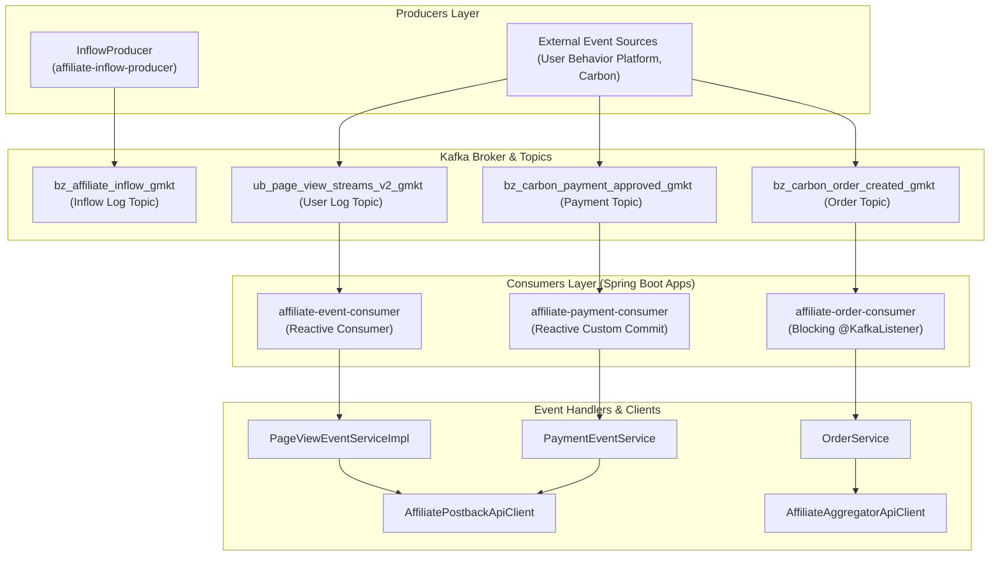
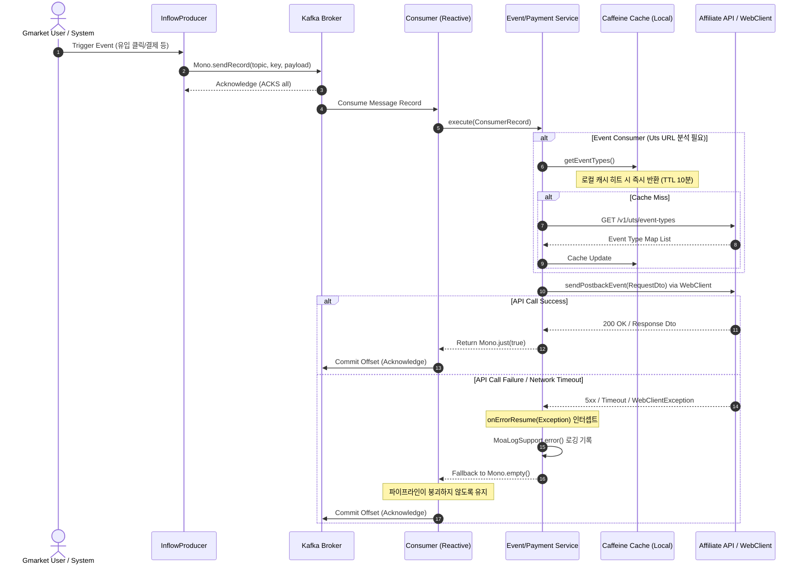

# Kafka Event Consumers & Producers

## Overview & System Architecture

본 문서는 Gmarket 마케팅/제휴(Martech/Affiliate) 서비스의 비동기 메시징 처리를 위해 구축된 **Kafka Event Producers 및 Consumers** 설계와 구현 방식을 설명합니다. 이 시스템은 마케팅 제휴 채널을 통한 유입 데이터(Inflow), 사용자 행동 로그(Click, View, Impression), 그리고 주문/결제/환불/배송/정산 등의 트랜잭션 데이터를 유기적으로 처리합니다.

대량의 트래픽을 처리하고 지연 시간을 최소화하기 위해 시스템 아키텍처는 크게 두 가지 영역으로 나뉩니다:
1. **Reactive Pipeline (Spring Cloud Reactor + Reactive Kafka)**: 클릭, 페이지 뷰, 노출 등 초당 수만 건 이상의 높은 처리량(Throughput)이 요구되는 이벤트 스트림 처리에 활용됩니다.
2. **Blocking/Standard Pipeline (Spring Kafka `@KafkaListener`)**: 주문 접수, 정산금 지급 완료 등 트랜잭션의 정확성과 스레드 풀 기반 동시성 제어가 중요한 비즈니스 로직 처리에 활용됩니다.



---

## Producer-Consumer Matrix & Topic Specification

전체 마이크로서비스 및 외부 시스템 간의 이벤트 메시지 흐름을 파악하기 위한 매트릭스 정보입니다.

### 1. Producer-Consumer Matrix

| Topic | Producer Project | Consumer Projects | Message Schema 요약 | 발행 트리거 |
| :--- | :--- | :--- | :--- | :--- |
| `bz_affiliate_inflow_{tenant}` | [affiliate-inflow-producer](file:///Users/jaecjeong/work/martech/affiliate/affiliate-event/affiliate-inflow-producer) | External Log Systems / Data Platform | `AffiliateInflowDto` (inflowNo, clickId, siteCode, trackingCode, subId) | 외부 어필리에이트 제휴 매체로부터 유입 요청이 발생하여 REST API가 호출될 때 |
| `bz_channel_inflow_{tenant}` | [affiliate-inflow-producer](file:///Users/jaecjeong/work/martech/affiliate/affiliate-event/affiliate-inflow-producer) | External Log Systems | `ChannelInflowDto` (channelCode, channelKey, campaignId, deviceType) | 광고 채널 유입 발생 시 |
| `bz_pcs_inflow_{tenant}` | [affiliate-inflow-producer](file:///Users/jaecjeong/work/martech/affiliate/affiliate-event/affiliate-inflow-producer) | External Log Systems | `PcsInflowDto` (pcsName, itemId, discountPrice, inflowTime) | 가격비교 서비스(Price Comparison Service)를 통한 유입 발생 시 |
| `ub_page_view_streams_v2_gmkt` | User Behavior Platform (외부) | [affiliate-event-consumer](file:///Users/jaecjeong/work/martech/affiliate/affiliate-event/affiliate-event-consumer) (`view` 프로필) | `PageEventConsumeDto` (host, path, protocol, areaCode, eventType, memberNo) | 사용자가 지마켓 사이트 또는 앱 내 특정 화면에 진입하여 페이지 뷰가 기록될 때 |
| `ub_page_event_streams_v2_gmkt` | User Behavior Platform (외부) | [affiliate-event-consumer](file:///Users/jaecjeong/work/martech/affiliate/affiliate-event/affiliate-event-consumer) (`click` 프로필) | `PageEventConsumeDto` (host, path, protocol, areaCode, eventType, clickElementId) | 사용자가 지마켓 페이지 내 제휴 상품 영역이나 링크를 클릭할 때 |
| `ub_page_impression_streams_v2_gmkt` | User Behavior Platform (외부) | [affiliate-event-consumer](file:///Users/jaecjeong/work/martech/affiliate/affiliate-event/affiliate-event-consumer) (`impression` 프로필) | `PageEventConsumeDto` (host, path, protocol, areaCode, eventType, impressionData) | 제휴 관련 배너 또는 상품 리스트가 화면 상에 노출되었을 때 |
| `bz_carbon_payment_approved_gmkt` | Carbon Payment System (외부) | [affiliate-payment-consumer](file:///Users/jaecjeong/work/martech/affiliate/affiliate-event/affiliate-payment-consumer) | `PaymentRequsetDto` (paymentSeq, orderNo, approvedAmount, payMethod, token) | 주문에 대한 결제 승인이 완료되었을 때 |
| `bz_refund_completed_gmkt` | Carbon Order System (외부) | [affiliate-refund-consumer](file:///Users/jaecjeong/work/martech/affiliate/affiliate-event/affiliate-refund-consumer) | `RefundRequsetDto` (refundSeq, orderNo, refundAmount, refundDate, token) | 주문 취소 또는 반품 처리에 따른 환불 완료 이벤트가 발생할 때 |
| `bz_shipping_delivery_complete_gmkt` | Logistics/Delivery System (외부) | [affiliate-transport-consumer](file:///Users/jaecjeong/work/martech/affiliate/affiliate-event/affiliate-transport-consumer) | `TransportCompletedRequestDto` (deliverySeq, transportStatus, deliveryDate) | 구매 상품의 배송이 최종 완료 처리되었을 때 |
| `bz_carbon_order_created_gmkt` | Carbon Order System (외부) | [affiliate-order-consumer](file:///Users/jaecjeong/work/martech/affiliate/affiliate-event/affiliate-order-consumer) | `OrderPlacedEvent` (txKey, orderNo, buyerId, orderAmount) | 새로운 주문서가 작성이 완료되고 주문이 접수되었을 때 |
| `bz_refund_remittance` | Settlement System (외부) | [affiliate-remittance-consumer](file:///Users/jaecjeong/work/martech/affiliate/affiliate-event/affiliate-remittance-consumer) | `RemittanceEvent` (partnerLcode, partnerScode, partnerPayoutSeq, payoutStatus) | 제휴 파트너사에 대한 대금 정산 송금 완료 처리가 완료되었을 때 |

### 2. Topic Configuration & Message Schema

각 토픽의 Payload Schema, Consumer Group 및 Partition Key 매핑 상세 테이블입니다.

| Topic | Payload Schema | Consumer Group | Partition Key |
| :--- | :--- | :--- | :--- |
| `bz_affiliate_inflow_{tenant}` | `com.gmarket.affiliate.producer.event.dto.request.AffiliateInflowRequest` | N/A (Producer Only) | Round-Robin (키 미지정) |
| `bz_channel_inflow_{tenant}` | `com.gmarket.affiliate.producer.event.dto.request.ChannelInflowRequest` | N/A (Producer Only) | Round-Robin (키 미지정) |
| `bz_pcs_inflow_{tenant}` | `com.gmarket.affiliate.producer.event.dto.request.PcsInflowRequest` | N/A (Producer Only) | Round-Robin (키 미지정) |
| `ub_page_view_streams_v2_gmkt` | `com.gmarket.affiliate.consumer.event.service.dto.PageEventConsumeDto` | `ub_affiliate_group` | `memberNo` or `deviceCookieId` |
| `ub_page_event_streams_v2_gmkt` | `com.gmarket.affiliate.consumer.event.service.dto.PageEventConsumeDto` | `ub_affiliate_group` | `memberNo` or `deviceCookieId` |
| `ub_page_impression_streams_v2_gmkt` | `com.gmarket.affiliate.consumer.event.service.dto.PageEventConsumeDto` | `ub_affiliate_group` | `memberNo` or `deviceCookieId` |
| `bz_carbon_payment_approved_gmkt` | `com.gmarket.affiliate.consumer.payment.client.postback.dto.PaymentRequsetDto` | `bz_carbon_payment_approved_gmkt_affiliate_group` | `orderNo` |
| `bz_refund_completed_gmkt` | `com.gmarket.affiliate.consumer.refund.client.postback.dto.RefundRequsetDto` | `ub_affiliate_group` | `orderNo` |
| `bz_shipping_delivery_complete_gmkt` | `com.gmarket.affiliate.consumer.transport.client.aggregator.dto.TransportCompletedRequestDto` | `bz_shipping_transport_affiliate_group` | `deliverySeq` |
| `bz_carbon_order_created_gmkt` | `com.gmarket.affiliate.consumer.order.integration.OrderPlacedEvent` | `bz_carbon_order_created_gmkt_affiliate_group` | `txKey` |
| `bz_refund_remittance` | `com.gmarket.affiliate.consumer.remittance.integration.RemittanceEvent` | `bz_refund_remittance_affiliate_group` | `partnerPayoutSeq` |

---

## Component Design & Detailed Execution Flow

### 1. Producers Design: InflowProducer 계열

[InflowProducer](file:///Users/jaecjeong/work/martech/affiliate/affiliate-event/affiliate-inflow-producer/src/main/java/com/gmarket/affiliate/producer/event/producer/InflowProducer.java)는 Spring WebFlux 환경에서 비동기로 이벤트를 발행하기 위해 구현된 추상 클래스입니다.

- **작동 원리**:
  - `ReactiveKafkaProducerTemplate&lt;String, String&gt;`를 활용하여 메시지를 논블로킹(Non-blocking) 방식으로 Broker에 전송합니다.
  - `@PostConstruct` 초기화 시점에 `saturn.application.tenant-token` 설정값(`gmkt` 또는 `iac`)을 가져와 `%s` 플레이스홀더를 매핑함으로써 멀티 테넌트용 토픽 이름(예: `bz_affiliate_inflow_gmkt`)을 동적으로 생성합니다.
  - 전송 작업 완료 후 Reactor의 `publishOn(Schedulers.parallel())`을 사용하여 스레드를 Parallel 스케줄러로 전환하고 스레드 풀의 지연 현상을 차단합니다.
- **상세 아키텍처 의사결정**:
  - 높은 전송 속도를 확보하기 위해 `compression.type`을 `zstd`로 지정하였으며, 중복 전송 방지를 위해 `enable-idempotence: true`와 `acks: all`을 강제하여 데이터 무결성을 최대화합니다.

### 2. High-Throughput Consumers: EventListener 계열

[EventListener](file:///Users/jaecjeong/work/martech/affiliate/affiliate-event/affiliate-event-consumer/src/main/java/com/gmarket/affiliate/consumer/event/listener/EventListener.java)는 마케팅 유입 로그 수집기 등으로 수백만 건의 이벤트를 유실 없이 고속 처리해야 합니다.

- **작동 원리**:
  - Reactive Kafka의 `receiveAutoAck()` 스트림을 구독합니다. 이는 레코드가 들어오는 즉시 프레임워크가 백그라운드에서 Offset을 Acknowledge하여 고성능을 제공합니다.
  - 메시지를 유입 유형에 따라 `PageViewEventServiceImpl`, `PageClickEventServiceImpl`, `PageImpressionEventServiceImpl` 등으로 분기 라우팅합니다.
  - [PageViewEventServiceImpl](file:///Users/jaecjeong/work/martech/affiliate/affiliate-event/affiliate-event-consumer/src/main/java/com/gmarket/affiliate/consumer/event/service/impl/PageViewEventServiceImpl.java)에서는 [UtsService](file:///Users/jaecjeong/work/martech/affiliate/affiliate-event/affiliate-event-consumer/src/main/java/com/gmarket/affiliate/consumer/event/service/UtsService.java)를 조회하여 URL 패턴 매칭을 통해 현재 유입 경로의 이벤트 타입(`PostbackEventType`)을 동적으로 분석합니다.
- **캐싱 및 최적화**:
  - 매 이벤트마다 유입 메타 모델 조회를 방지하기 위해 Caffeine Cache(`UtsEventTypes`, 만료 시간 10분, 최대 사이즈 1000)를 메모리 상에 운용합니다.
  - 변환된 유입 정보를 외부 마케팅 Postback 파트너사로 연동하기 위해 WebClient 기반의 `AffiliatePostbackApiClient`를 호출합니다.

### 3. State-Sensitive Consumers: Payment / Refund / Transport Consumers

결제([PaymentEventListener](file:///Users/jaecjeong/work/martech/affiliate/affiliate-event/affiliate-payment-consumer/src/main/java/com/gmarket/affiliate/consumer/payment/listener/PaymentEventListener.java)), 환불([RefundEventListener](file:///Users/jaecjeong/work/martech/affiliate/affiliate-event/affiliate-refund-consumer/src/main/java/com/gmarket/affiliate/consumer/refund/listener/RefundEventListener.java)), 배송([TransportEventListener](file:///Users/jaecjeong/work/martech/affiliate/affiliate-event/affiliate-transport-consumer/src/main/java/com/gmarket/affiliate/consumer/transport/listener/TransportEventListener.java)) 등의 도메인은 정확한 Offset 관리가 생명입니다.

- **동작 방식**:
  - `spring.kafka.consumer.enable-auto-commit`이 `false`로 설정된 경우 `listenWithCustomCommit()` 메서드가 실행됩니다.
  - `receive()` 스트림을 통해 들어오는 `ReceiverRecord&lt;String, String&gt;`에 대해 서비스 로직을 성공적으로 수행한 후에만 수동으로 `record.receiverOffset().acknowledge()`를 호출하여 Offset을 커밋합니다.
  - 네트워크 파티션이나 컨슈머 일시 정체 등으로 Offset 커밋에 실패하여 `RetriableCommitFailedException`이 유발되면, 내부 재시도 메서드인 `commitOffsetWithRetryInternal`를 통해 **2초 대기 후 최대 3회** 재시도를 반복 수행합니다.

```java
private void commitOffsetWithRetryInternal(ReceiverRecord<String, String> record, int maxRetries, int attempt) {
    try {
        record.receiverOffset().acknowledge(); // 수동 오프셋 커밋
    } catch (RetriableCommitFailedException e) {
        if (attempt < maxRetries) {
            MoaLogSupport.error("Offset commit failed, retrying... Attempt " + (attempt + 1), e);
            Mono.delay(Duration.ofSeconds(2)) // 2초 지연 후 재시도
                    .doOnTerminate(() -> commitOffsetWithRetryInternal(record, maxRetries, attempt + 1))
                    .subscribe();
        } else {
            MoaLogSupport.error("Offset commit failed after " + maxRetries + " attempts", e);
        }
    }
}
```

### 4. Traditional Concurrency Consumers: Order / Remittance Consumers

주문([OrderPlacedListener](file:///Users/jaecjeong/work/martech/affiliate/affiliate-event/affiliate-order-consumer/src/main/java/com/gmarket/affiliate/consumer/order/listener/OrderPlacedListener.java))과 정산 송금([RemittanceListener](file:///Users/jaecjeong/work/martech/affiliate/affiliate-event/affiliate-remittance-consumer/src/main/java/com/gmarket/affiliate/consumer/remittance/listener/RemittanceListener.java)) 시스템은 Reactive 패러다임 대신 전통적인 블로킹 구조를 취합니다.

- **설계 구조**:
  - 데이터베이스 SP(Stored Procedure) 호출이나 복잡한 MSSQL 트랜잭션이 수반되므로 스레드 풀 구조가 효율적입니다.
  - `@KafkaListener`에 `concurrency = "${kafka.consumer.concurrency.order.placed}"` (지마켓 설정 기준 `50`)를 지정하여, 동시 소비 스레드 수를 50개까지 활성화함으로써 순식간에 몰리는 결제완료/주문 이벤트를 병렬로 안정적으로 처리하도록 튜닝되어 있습니다.

---

## Message Flow & Exception Handling Flow

이벤트 메시지가 유입되어 외부 전송 및 데이터베이스 적재가 되기까지의 성공 시나리오와 예외 복구 시나리오입니다.



---

## Idempotency, Duplicate Handling, and DLQ Policy

### 1. Idempotency & Duplicate Handling (중복 방지 정책)
제휴 수수료 정산과 결제 처리는 금액적인 손실로 이어질 수 있으므로 메시지 소비의 멱등성 보장이 필수적입니다. 이 시스템은 어플리케이션 계열 데이터베이스 단에서 중복 처리를 판별합니다.

[OrderService](file:///Users/jaecjeong/work/martech/affiliate/affiliate-event/affiliate-order-consumer/src/main/java/com/gmarket/affiliate/consumer/order/service/OrderService.java)의 `inflowOrder` 비즈니스 처리 방식을 보면 알 수 있습니다:

```java
public InflowOrderResponse inflowOrder(String txKey) {
  AffiliateOrderTokenJpaEntity tokenEntity = repository.findByTxKey(txKey).orElse(null);
  // 토큰 조회 안되거나 토큰 없는 주문이거나 이미 실행된 토큰이면 중단
  if (tokenEntity == null ||
      !StringUtils.hasText(tokenEntity.getToken()) ||
      tokenEntity.isExecution()
  ) {
    return null;
  }
  ...
}
```

- **동작 방식**: 
  - 주문 접수 이벤트가 도달하면 Kafka의 `txKey`를 고유 식별값으로 취급하여 데이터베이스의 `AffiliateOrderTokenJpaEntity` 테이블을 조회합니다.
  - 해당 거래건이 존재하지 않거나, 보안 토큰 값이 비어있거나, 이미 처리 완료 상태(`isExecution == true`)인 경우 즉시 로직 처리를 차단하고 `null`을 반환하여 멱등성을 보장합니다.

### 2. Error Recovery & Dead-Letter Queue (DLQ) Policy
Martech Affiliate 도메인의 데이터 처리 특성에 맞춰 차별화된 에러 핸들링 및 복구 정책을 운영합니다.

- **High-Volume Click/Impression Stream**: 
  - 클릭과 뷰 노출 관련 대량 스트림은 개별 건의 일시적인 네트워크 지연이나 실패로 인해 파이프라인 전체가 블로킹(Head-of-Line Blocking)되면 대형 장애로 번집니다. 
  - 따라서 파이프라인 최하단에 `onErrorResume(Exception.class, throwable -> { MoaLogSupport.error(...); return Mono.empty(); })`를 선언하여 예외를 집어삼키고 모니터링 로그 서버인 `Moa`로 적재합니다. 별도의 브로커 레벨 DLQ로 메시지를 우회 적재하지 않고, 로그 유실 추적기를 가동해 사후 분석하는 정책을 채택하고 있습니다.
- **Transactional Streams (Payment, Refund, Transport)**: 
  - 정산대금이 걸린 스트림은 무조건 소비 완료를 보장해야 합니다. 
  - 이를 위해 `enable-auto-commit: false` 설정 하에 비즈니스 데이터 처리가 완벽히 성공해야만 수동으로 커밋을 진행합니다. 
  - Kafka Offset 커밋에 실패하는 인프라성 장애에 대비하여 최대 3회, 2초 간격으로 `RetriableCommitFailedException` 처리를 위한 재시도 매커니즘을 구동하고 있습니다.

### 3. Dead-Letter / Retry / 순서 보장 정책 테이블

| 구분 | 대상 토픽 및 Consumer | 에러 감지 및 재시도 정책 | 순서 보장 (Ordering) 정책 | DLQ / 대체 처리 방안 |
| :--- | :--- | :--- | :--- | :--- |
| **User Web Log** | `ub_page_view_streams_*` <br> `ub_page_event_streams_*` | `onErrorResume`을 활용해 로그 적재 후 스킵. 개별 실패건 재시도 없음. | 비즈니스에 영향이 적으므로 순서 보장하지 않음. partition key 분산 사용. | 별도 DLQ 없음. 중앙 모니터링 플랫폼 `Moa`에 적재된 에러 분석 후 제휴 매체사 로그와 사후 대조(Reconciliation). |
| **Transaction Event** | `bz_carbon_payment_approved_gmkt` <br> `bz_refund_completed_gmkt` | 비즈니스 로직 에러는 로그 유실 처리. 인프라 Offset 커밋 에러는 2초 간격 3회 재시도. | Kafka 토픽 레벨에서 `orderNo`를 Partition Key로 설정하여 특정 주문건의 생성-결제-배송 이벤트가 동일한 Partition으로 인입되도록 유도함. | 장애 시 `MoaLogSupport.error()`를 통해 알림 발송. 배치 인프라가 주기적으로 복구용 동기화 API를 실행하여 실시간 카프카 유실 데이터를 원장에 강제 보정함. |
| **Legacy ERP sync** | `bz_refund_remittance` | `@KafkaListener` 및 `@Transactional` 프레임워크가 예외 발생 시 세션을 롤백하고, 재시도 인터셉터 작동. | `partnerPayoutSeq`를 해시 키로 설정하여 정산 전송 순서를 파티션별로 고정함. | 에러 발생 시 지정 횟수 이상 실패하면 로깅 후 알람이 생성되며 정산 플랫폼 배치 시스템에서 수동 재처리 대기. |