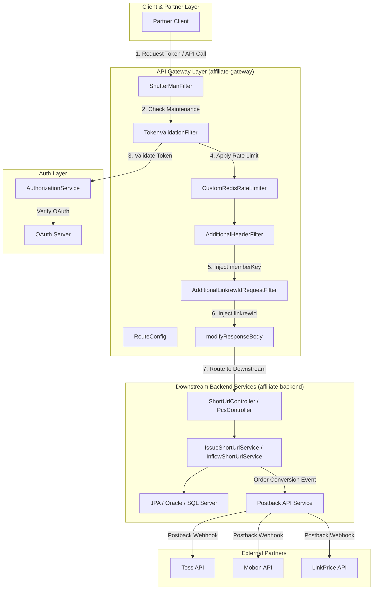
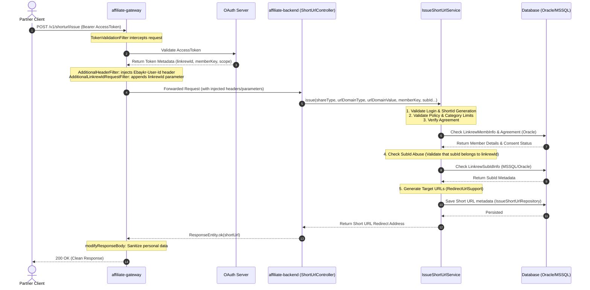

# Integration & API Protocols

본 문서는 GMarket Affiliate (Linkrew) 플랫폼의 **Integration & API Protocols**에 관한 기술 위키 페이지입니다. 신규 온보딩하는 시니어 엔지니어를 위해 API Gateway의 패킷 흐름, 인증 및 인가 프로토콜, 다운스트림 서비스 라우팅 설계, 그리고 외부 매체사로의 Postback 연동 및 회복성(Resiliency) 아키텍처를 소스 코드 수준의 참조와 함께 상세히 설명합니다.

---

## 1. Overview
GMarket Affiliate 플랫폼은 외부 제휴 파트너(Linkrew Members)와 내부 커머스 생태계를 유기적으로 연결하는 고성능 마이크로서비스 아키텍처(MSA)로 설계되어 있습니다. 시스템은 다음과 같은 주요 모듈로 구성됩니다.

- **affiliate-gateway**: Spring Cloud Gateway 기반의 리액티브 넷티(Netty) 서버로 구동되며, 외부 파트너의 모든 API 요청에 대해 최전선에서 인증(Authentication), 인가(Authorization), 유량 제어(Rate Limiting), 시스템 점검 차단(Shuttering), 응답 데이터 마스킹(Data Cleansing)을 수행합니다.
- **affiliate-backend (affiliate-api)**: 실질적인 비즈니스 로직을 처리하는 핵심 다운스트림 서비스입니다. 단축 URL 발급([ShortUrlController](file:///Users/jaecjeong/work/martech/affiliate/affiliate-backend/affiliate-api/src/main/java/com/gmarket/affiliate/api/controller/ShortUrlController.java)), 제휴 유입 로깅, 파트너 회원 정보 수집 및 조정을 관리합니다.
- **affiliate-backend (affiliate-postback-api)**: 구매 및 유입 이벤트를 외부 매체사(Toss, Mobon, LinkPrice 등)로 비동기 전송하는 전환 수집 서비스입니다.
- **Database Layer**: Oracle Database([ojdbc](file:///Users/jaecjeong/work/martech/affiliate/affiliate-backend/build.gradle#L26))와 SQL Server([mssql-jdbc](file:///Users/jaecjeong/work/martech/affiliate/affiliate-backend/build.gradle#L27-L28))를 혼용하여 영속성 데이터를 분리 관리합니다.

---

## 2. Authentication & Authorization Flow
GMarket Affiliate API는 파트너 데이터 격리 및 어뷰징 방지를 위해 2단계 인증/인가 프로토콜을 수행합니다.

### 2.1. Credentials Issuance & Token Generation
1. **API Key 발급**: 파트너사는 어드민을 통해 `clientId`와 `clientSecret`을 발급받습니다. 내부적으로 이는 [OpenApiAuthController](file:///Users/jaecjeong/work/martech/affiliate/affiliate-backend/affiliate-api/src/main/java/com/gmarket/affiliate/api/controller/OpenApiAuthController.java)의 `/v1/open-api-auth/auth-info/save` API를 통해 데이터베이스에 저장 및 관리됩니다.
2. **Access Token 발급**: 외부 클라이언트는 발급받은 자격 증명을 Base64 인코딩하여 `Authorization: Basic {base64(client_id:client_secret)}` 헤더로 API Gateway의 [AuthorizationController](file:///Users/jaecjeong/work/martech/affiliate/affiliate-gateway/affiliate-gateway-api/src/main/java/com/gmarket/affiliate/gateway/api/controller/AuthorizationController.java) `/auth/token` 엔드포인트를 호출합니다.
3. [AuthorizationService.java](file:///Users/jaecjeong/work/martech/affiliate/affiliate-gateway/affiliate-gateway-api/src/main/java/com/gmarket/affiliate/gateway/api/service/AuthorizationService.java)는 다음 절차에 따라 토큰을 발급합니다:
   - `OAuthSupport.getClientId(authorization)`를 통해 헤더에서 `clientId`를 추출합니다.
   - 내부 API 통신을 통해 `getLinkrewApiAuthInfoByClientId(clientId)`를 호출하여 자격 증명이 활성화(`ApiAuthStatus.Active`) 상태인지 검증합니다.
   - `getMemberInfoByLinkrewId`로 해당 파트너 계정이 정상 승인(`LinkrewStatusType.Complete`) 상태인지 확인합니다.
   - 모든 조건 충족 시, GMarket 공통 OAuth API 서버에 토큰 발급을 위임하여 JWT 또는 불투명 Access Token을 발급받아 반환합니다.

### 2.2. Request Validation & Gateway Sandboxing
매 API 호출 시 [TokenValidationFilter](file:///Users/jaecjeong/work/martech/affiliate/affiliate-gateway/affiliate-gateway-api/src/main/java/com/gmarket/affiliate/gateway/api/filter/TokenValidationFilter.java)가 요청을 인터셉트하여 검증을 수행합니다.

- **Token Inspection**: `Authorization` 헤더의 Bearer 토큰 유효성을 OAuth API 서버(`oAuthApiClient.validateToken`)를 통해 검증하고, 파트너 식별자(`linkrewId`), 고객 번호(`memberKey`/`custNo`), 권한 범위(`scope`) 정보를 획득합니다.
- **URI & Scope Matching**: 호출된 HTTP Method와 URI가 토큰의 `scope` 권한과 매칭되는지 [OpenApiUriSupport](file:///Users/jaecjeong/work/martech/affiliate/affiliate-gateway/affiliate-gateway-api/src/main/java/com/gmarket/affiliate/gateway/api/support/OpenApiUriSupport.java)를 활용해 검사합니다.
- **Context Writing**: 검증을 마친 데이터는 리액티브 컨텍스트에 기록되어 후속 필터 체인으로 전달됩니다.
- **Header Mutation**: [AdditionalHeaderFilter](file:///Users/jaecjeong/work/martech/affiliate/affiliate-gateway/affiliate-gateway-api/src/main/java/com/gmarket/affiliate/gateway/api/filter/AdditionalHeaderFilter.java)는 복호화된 사용자 식별 키(`memberKey`)를 downstream 전용 헤더인 `Ebaykr-User-Id`에 주입합니다.
- **Parameter Injecting (Gateway Sandboxing)**: [AdditionalLinkrewIdRequestFilter](file:///Users/jaecjeong/work/martech/affiliate/affiliate-gateway/affiliate-gateway-api/src/main/java/com/gmarket/affiliate/gateway/api/filter/AdditionalLinkrewIdRequestFilter.java)는 쿼리 매개변수에 호출 주체의 `linkrewId`를 강제 삽입(또는 치환)합니다. 
  > [!IMPORTANT]
  > 외부 파트너 클라이언트가 요청 파라미터 내 `linkrewId`를 타인의 ID로 변조하여 호출하는 권한 우회(Idor/Parameter Tampering) 어뷰징을 Gateway 레이어에서 원천 차단하기 위한 필수 보안 설계입니다.

---

## 3. Core API Gateway Architecture
API Gateway인 `affiliate-gateway`는 고가용성 보장 및 무중단 제어를 위해 다음과 같은 필터 파이프라인 구조를 가집니다.

### 3.1. Route Specification & Rate Limiting
[RouteConfig.java](file:///Users/jaecjeong/work/martech/affiliate/affiliate-gateway/affiliate-gateway-api/src/main/java/com/gmarket/affiliate/gateway/api/config/RouteConfig.java)는 Spring Cloud Gateway의 라우팅 정보 정의 시, 운영 환경(`!isDev`)과 개발 환경(`isDev`)을 동적으로 판별합니다.
- **CustomRedisRateLimiter**: Redis 기반의 토큰 버킷 알고리즘을 사용하며, 라우터별로 `replenishRate`(초당 토큰 생성량), `burstCapacity`(최대 대역폭)를 유연하게 정의합니다. 식별 키는 `UserKeyResolver`를 구현하여 호출자의 Access Token 및 Client ID 단위로 처리율을 격리합니다.
- **CircuitBreaker**: `ApiGatewayCircuitBreaker` 설정을 바인딩하여 백엔드 응답 지연 발생 시 빠른 실패(Fail-fast)를 유도함으로써 게이트웨이의 스레드 풀 고갈을 방지합니다.

### 3.2. ShutterMan (System Maintenance Coordination)
실시간 점검 제어 필터인 [ShutterManFilter](file:///Users/jaecjeong/work/martech/affiliate/affiliate-gateway/affiliate-gateway-api/src/main/java/com/gmarket/affiliate/gateway/api/filter/ShutterManFilter.java)는 서비스 점검 시간 동안 백엔드 호출을 차단합니다.
- 실행 중 [ShutterManSupport](file:///Users/jaecjeong/work/martech/affiliate/affiliate-gateway/affiliate-gateway-api/src/main/java/com/gmarket/affiliate/gateway/api/support/ShutterManSupport.java)가 환경 식별자 및 사이트 코드(`Gmarket`/`Auction`)를 판단합니다.
- `shutterManApiClient.getPmTime` API를 비동기 호출하여 현재가 점검 윈도우에 속하는지(`isPmTime`) 확인하고, 점검 중일 경우 백엔드 호출을 전면 생략한 채 `UNDER_MAINTENANCE` 오류 코드 응답을 직접 생성하여 클라이언트에 200 OK(JSON 포맷 오류 메시지)로 즉시 반환합니다.

### 3.3. MDC Logging & Data Privacy Masking
- **MoAWebFilter**: GMarket 내부 프레임워크 표준인 [MoAWebFilter](file:///Users/jaecjeong/work/martech/affiliate/affiliate-gateway/affiliate-gateway-api/src/main/java/com/gmarket/affiliate/gateway/api/config/MoAWebFilter.java)는 들어오는 모든 리액티브 요청의 바디 스트림을 캐싱하여 페이로드 로깅에 매핑하고, 분산 트래픽 추적을 위한 짚킨(Zipkin) 표준 MDC 정보(`moa.requestid`, `moa.distributed_tracing.x_b3_trace_id` 등)를 주입합니다.
- **Personal Information Cleansing**: 개인정보 유출 방지를 위해 응답 변환 단계(`modifyResponseBody`)에서 [ResponseSupport](file:///Users/jaecjeong/work/martech/affiliate/affiliate-gateway/affiliate-gateway-api/src/main/java/com/gmarket/affiliate/gateway/api/support/ResponseSupport.java)의 `removePersonalInfo` 함수를 거칩니다. 이 함수는 백엔드 반환 메시지에 포함되어 있을 수 있는 이메일, 전화번호, 계좌 정보 등의 민감 데이터를 정규식 패턴 기반으로 탐지 및 마스킹 처리하여 반환합니다.

---

## 4. Key API Endpoints & Protocols

아래 표는 API Gateway를 거쳐 최종 라우팅되는 핵심 연동 엔드포인트 세부 명세서입니다.

| Method | Path | Authentication | Request Summary | Response Summary | Downstream Handler / Service |
|:---|:---|:---|:---|:---|:---|
| `POST` | `/auth/token` | Basic (Client Credentials) | Basic `clientId` & `clientSecret` 인증 기반 Access Token 신규 발급 요청 | Access Token 발급 정보 (`OAuthCreateTokenResponse`) | `AuthorizationController` / `AuthorizationService` |
| `POST` | `/v1/shorturl/issue` | Bearer (OAuth Token) | 적립 유형, 타겟 URL 주소, 카테고리 정보 전달을 통한 제휴용 단축 URL 생성 | 생성된 단축 URL 문자열 | `ShortUrlController` / `IssueShortUrlService` |
| `POST` | `/v1/shorturl/inflow` | Bearer (OAuth Token) | 생성된 단축 URL의 실제 접속 유입 추적 및 원본 리디렉션 분석 | 원본 타겟 URL 정보 (`InflowShortUrlResponse`) | `ShortUrlController` / `InflowShortUrlService` |
| `POST` | `/v1/pcs/inflow` | Bearer (OAuth Token) | 가격비교 사이트(Price Comparison Site)의 제휴 연동 채널 유입 처리 | PCS 유입 기록 결과 (`InflowPcsResponse`) | `PcsController` / `PcsService` |
| `POST` | `/v1/channel/inflow` | Bearer (OAuth Token) | 외부 매체사(나스미디어 등) 전용 딥링크 유입 이벤트 적재 | 딥링크 처리 결과 (`InflowChannelResponse`) | `ChannelController` / `ChannelService` |
| `POST` | `/v1/open-api-auth/auth-info/save` | Downstream Header | 특정 파트너 고객 대상의 오픈 API 연동 키 쌍(Client ID / Secret) 최초 생성 | 연동 키 발급 상세 정보 (`LinkrewApiAuthInfoResponse`) | `OpenApiAuthController` / `OpenApiAuthService` |

---

## 5. Integration Sequence Flow

다음 시퀀스 다이어그램은 외부 파트너 클라이언트가 API Gateway를 통해 제휴용 단축 URL 발급 API(`POST /v1/shorturl/issue`)를 호출했을 때의 전체 트랜잭션 수명 주기 및 백엔드 파이프라인의 흐름을 나타냅니다.

### 5.1. Downstream Service Processing
[IssueShortUrlService.java](file:///Users/jaecjeong/work/martech/affiliate/affiliate-backend/affiliate-api/src/main/java/com/gmarket/affiliate/api/service/IssueShortUrlService.java)는 API Gateway로부터 위임받은 인자를 토대로 비즈니스 유효성 검증을 거친 후 단축 URL의 키(`shortId`)를 영속화합니다.

1. **Member Login Verification**: 공유 형태가 적립형(`ShareType.Cash` 또는 `ShareType.Linkrew`)인 경우, `memberKey` 값이 존재하는지 필수 여부를 판단합니다.
2. **Short ID Generation**: 파트너 회원 고유 식별 정보, 원래 도메인 값, 데이터베이스 시퀀스 발급 값을 병합하여 고유 단축 식별자를 고르게 분산하여 해시 생성(`makeShortId`)합니다.
3. **Category Throttling check**: [LimitCategoryCodeRepository](file:///Users/jaecjeong/work/martech/affiliate/affiliate-backend/affiliate-api/src/main/java/com/gmarket/affiliate/api/repository/LimitCategoryCodeRepository.java)를 조회하여 제한 설정된 소/중/대분류의 상품 카테고리인 경우 적립 대상에서 영구 제외합니다.
4. **Member Consent Check**: 약관 동의 리포지토리([AgreementRepository](file:///Users/jaecjeong/work/martech/affiliate/affiliate-backend/affiliate-api/src/main/java/com/gmarket/affiliate/api/repository/AgreementRepository.java))를 확인하여 해당 정산 정책 형태의 필수 약관 동의(`isAgreement`) 여부를 가려냅니다.
5. **SubId Abusing Check**: 전달된 서브 채널 ID(`subId`)가 실재하는지 [LinkrewSubIdInfoRepository](file:///Users/jaecjeong/work/martech/affiliate/affiliate-backend/affiliate-api/src/main/java/com/gmarket/affiliate/api/repository/LinkrewSubIdInfoRepository.java)로 확인하고, 구한 매체 회원 소속 관계가 요청 파트너의 실제 `linkrewId` 정보와 엄밀히 부합하는지 판별하여 매체 도용 어뷰징을 원천 차단합니다.
6. **URL Redirect Mapping & Log DB Logging**: PC용 타겟 주소와 모바일 최적화 타겟 주소를 다르게 생성한 뒤 단축 URL 발급 이력을 `IssueShortUrlRepository`에 최종 적재한 후 리디렉션 매핑용 도메인 주소를 문자열로 생성해 반환합니다.

---

## 6. External Postback Integration & Resilience
구매 발생 등 내부에서 특정 전환 이벤트가 포착되면, `affiliate-postback-api` 마이크로서비스는 연계된 외부 제휴 연동 파트너의 서버에 트랜잭션 실시간 전환 소식(Postback)을 밀어주는 프록시 역할을 책임집니다.

### 6.1. Abstract ApiClient & WebClient Engine
모든 외부 파트너 전송은 [ApiClient.java](file:///Users/jaecjeong/work/martech/affiliate/affiliate-backend/affiliate-postback-api/src/main/java/com/gmarket/affiliate/postback/api/client/ApiClient.java)를 부모 클래스로 하여 구현됩니다.
- 본 엔진은 무차별 동기 호출로 인한 성능 정체를 해결하고자 비블로킹(Non-blocking) 리액티브 통신 엔진인 `WebClient`를 기본으로 설계되었습니다.
- [CustomWebClientFactory](file:///Users/jaecjeong/work/martech/affiliate/affiliate-backend/affiliate-postback-api/src/main/java/com/gmarket/affiliate/postback/api/config/CustomWebClientFactory.java)에 위임하여 연동 매체사 정보 마다 다르게 설정해야 할 응답 타임아웃, 커스텀 시그니처 및 헤더를 격리 주입하여 안전하게 인스턴스를 확보합니다.

### 6.2. Failure Isolation via Resilience4j Circuit Breaker
외부 광고 매체사의 API 서버는 네트워크 순단이나 내부 정전으로 인해 수시로 장애 상태에 돌입할 수 있으므로 장애 전파 차단 설계가 필수로 요구됩니다.
- [TossApiClient.java](file:///Users/jaecjeong/work/martech/affiliate/affiliate-backend/affiliate-postback-api/src/main/java/com/gmarket/affiliate/postback/api/client/toss/TossApiClient.java)와 같은 개별 통신 모듈 클래스 레벨 상단에 `@CircuitBreaker(name = "TossApiClient")` 애노테이션을 적용하고 있습니다.
- 특정 시간 동안 호출 실패 비율(Failure Rate) 또는 느린 호출 비율(Slow Call Rate)이 설정한 임계값(Threshold)을 초과하게 되면 회로 차단기가 즉시 **Open State** 상태로 전환됩니다.
- 회로가 차단되면 장애 상황을 유발하고 있는 외부 연동 API 호출을 즉각 취소(Fast Failover)하고 폴백 동작을 수행하여 넷티 커넥션 풀의 고갈을 원천적으로 막고 전체 시스템의 연쇄 도미노 장애 확산(Cascading Failure)을 방지합니다.