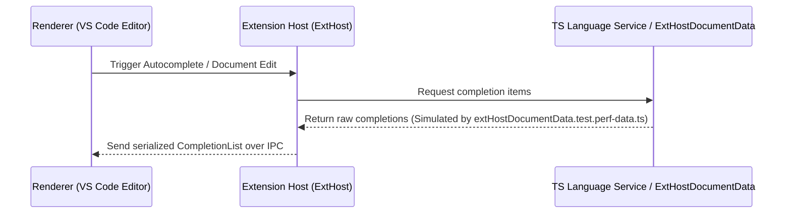

# Module: `src/vs/workbench/api/test/browser/extHostDocumentData.test.perf-data.ts`

This module provides mock performance data for testing document operations, completion providers, and editor-related API performance within the Extension Host (`extHost`) environment of Visual Studio Code.

---

## Overview and Purpose

The primary purpose of `extHostDocumentData.test.perf-data.ts` is to serve as a static repository of realistic, large-scale, and CPU-intensive completion item data. Instead of generating or fetching completion items dynamically during unit and performance tests, this module exports pre-recorded completion payloads.

This data is used to:
1. **Benchmark Performance**: Test the serialization, deserialization, and processing overhead of large completion lists passing between the Extension Host and the renderer process.
2. **Stress-Test Autocomplete Pipelines**: Validate that the completion list UI and filtering mechanisms handle thousands of items with complex metadata (such as paths, modifiers, and documentation sources) without causing UI lag.
3. **Simulate Real-World Scenarios**: Provide test suites with authentic completion lists captured from large workspaces (in this case, referencing symbols and files from VS Code's own codebase under `/Users/jrieken/Code/vscode/...`).

---

## Key Exports

### `_$_$_expensive`
- **Type**: `string` (JSON serialized format)
- **Description**: A large stringified JSON payload representing a mock completion response (`completionInfo`) from a TypeScript language service.
- **Structure**:
  - `seq`: Sequence number of the response.
  - `type`: Message type (typically `"response"`).
  - `command`: The request command command associated with the data (e.g., `"completionInfo"`).
  - `request_seq`: Sequence number matching the original request.
  - `success`: A boolean indicating if the operation succeeded (`true`).
  - `body`:
    - `isGlobalCompletion`: Boolean indicating if completions are at a global scope.
    - `isMemberCompletion`: Boolean indicating if completions are members of a class/object.
    - `isNewIdentifierLocation`: Boolean indicating if the cursor is at a location for a new identifier.
    - `entries`: An array of completion entry objects, each containing:
      - `name`: The symbol name (e.g., `__dirname`, `AbstractKeybindingService`).
      - `kind`: Symbol type classification (e.g., `"var"`, `"class"`, `"method"`, `"module"`).
      - `kindModifiers`: Modifiers such as `"private,static,declare"`, `"abstract,export"`.
      - `sortText`: Tie-breaking sorting information.
      - `hasAction`: Optional flag indicating if code actions are attached.
      - `source`: The absolute file path where the symbol is declared (e.g., pointing to the VS Code source directories or dependencies).

---

## Architectural Patterns and Design Decisions

### 1. Pre-Serialized String Payload
The data is stored as a raw JSON-encoded string rather than a parsed JavaScript object. This design allows tests to measure the parsing overhead (from JSON string to object) and mimic the exact boundary condition where messages arrive via IPC (Inter-Process Communication) as text.

### 2. Large Corpus for Benchmarking
The completion entry list contains a very wide range of standard Node.js variables, TypeScript utilities, and editor core classes. This makes it a realistic representation of a complex workspace autocomplete trigger, enabling accurate regression testing for completion list filtering and scoring algorithms.

### 3. Isolation of Test Data
Keeping heavy performance data outside of the test logic files (`.test.ts`) prevents bloat in the main test suites and keeps test logic clean, readable, and focused on assertions.

---

## Integration in the VS Code Architecture

In VS Code's multi-process architecture, extensions run in a separate **Extension Host** process to ensure editor UI responsiveness. Autocomplete requests flow as follows:

This module simulates the output of the language services or document model structures when validating the efficiency of the Extension Host's document sync (`ExtHostDocumentData`) and completion dispatch subsystems.