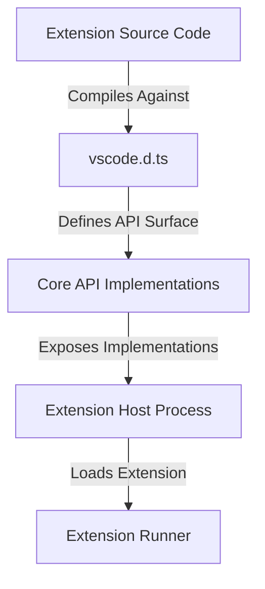

# VS Code Extension API Type Declarations (`vscode.d.ts`)

The [vscode.d.ts](file:///Users/jaecjeong/lab/vscode/src/vscode-dts/vscode.d.ts) module serves as the official TypeScript type definition file for the Visual Studio Code Extension API. It defines the public contract between the VS Code core application and external extensions. 

---

## Overview and Purpose

The primary purpose of [vscode.d.ts](file:///Users/jaecjeong/lab/vscode/src/vscode-dts/vscode.d.ts) is to provide extension developers with compile-time type safety, autocompletion (IntelliSense), and inline documentation inside their IDEs. It contains the complete set of namespaces, classes, interfaces, events, and functions exposed by the VS Code Extension Host.

Because extensions run in a separate process (the Extension Host), they do not access the internal components of the editor directly. Instead, they interact exclusively with the namespace and types declared in this module.

---

## Key Interfaces and Responsibilities

The module exposes several core domain abstractions representing the editor environment, document state, and UI controls:

### 1. [TextDocument](file:///Users/jaecjeong/lab/vscode/src/vscode-dts/vscode.d.ts)
Represents an in-memory text document (e.g., a source file).
* **Responsibilities:** Provides access to document metadata (URI, language ID, version, dirty state) and provides methods to query document contents.
* **Key Members:**
  * `uri`: Unique identifier (usually `file` scheme, but can represent virtual or untitled documents).
  * `lineCount`: Total number of lines in the document.
  * `lineAt(line: number)`: Returns the line metadata for a specific line number.
  * `getText(range?: Range)`: Retrieves document text within an optionally specified range.
  * `offsetAt(position: Position)` and `positionAt(offset: number)`: Conversions between linear character offsets and coordinate-based line/character positions.

### 2. [TextLine](file:///Users/jaecjeong/lab/vscode/src/vscode-dts/vscode.d.ts)
Represents a single line of text from a [TextDocument](file:///Users/jaecjeong/lab/vscode/src/vscode-dts/vscode.d.ts).
* **Responsibilities:** Exposes text contents, line range (with or without line breaks), whitespace attributes, and empty checks.
* **Characteristics:** Objects are **immutable snapshot representations**. They do not update dynamically when the document changes.

### 3. [Command](file:///Users/jaecjeong/lab/vscode/src/vscode-dts/vscode.d.ts)
Represents a UI-bound execution unit.
* **Responsibilities:** Associates a user-facing label (title) with an underlying command identifier and optional arguments.
* **Usage:** Commonly used in context menus, status bar items, and keybinding registrations.

---

## Important Patterns and Design Decisions

### Immutability of Document State
State representations like [TextLine](file:///Users/jaecjeong/lab/vscode/src/vscode-dts/vscode.d.ts) are strictly immutable. Because the document can be mutated concurrently, references retrieved in the past are not kept live. This design simplifies state management in extension code and prevents out-of-sync race conditions.

### Abstracted Asynchronous APIs (`Thenable<T>`)
Many methods (e.g., `TextDocument.save()`) return a `Thenable<T>`. This abstraction is a lightweight representation of a Promise-like object, ensuring compatibility with various promise library standards and keeping the API independent of standard JS runtime variations.

### URI-Driven Extensibility
Virtually all resources are modeled as standard URIs. This allows VS Code to treat local filesystem resources, remote workspace files, memory-backed files (via `TextDocumentContentProvider`), and custom virtual schemas uniformly.

---

## Integration into the Project Lifecycle

1. **Compilation & Type Safety:** Extensions compile against [vscode.d.ts](file:///Users/jaecjeong/lab/vscode/src/vscode-dts/vscode.d.ts) to verify API usage.
2. **Implementation Binding:** The actual runtime implementation of the declarations in [vscode.d.ts](file:///Users/jaecjeong/lab/vscode/src/vscode-dts/vscode.d.ts) is injected inside the Extension Host process by VS Code's workbench layer (specifically under `src/vs/workbench/api`).
3. **API Evolution:** Proposed changes to the API are developed in separate proposal declaration files (`vscode.proposed.<proposalName>.d.ts`) before being finalized and merged into the main [vscode.d.ts](file:///Users/jaecjeong/lab/vscode/src/vscode-dts/vscode.d.ts) file.