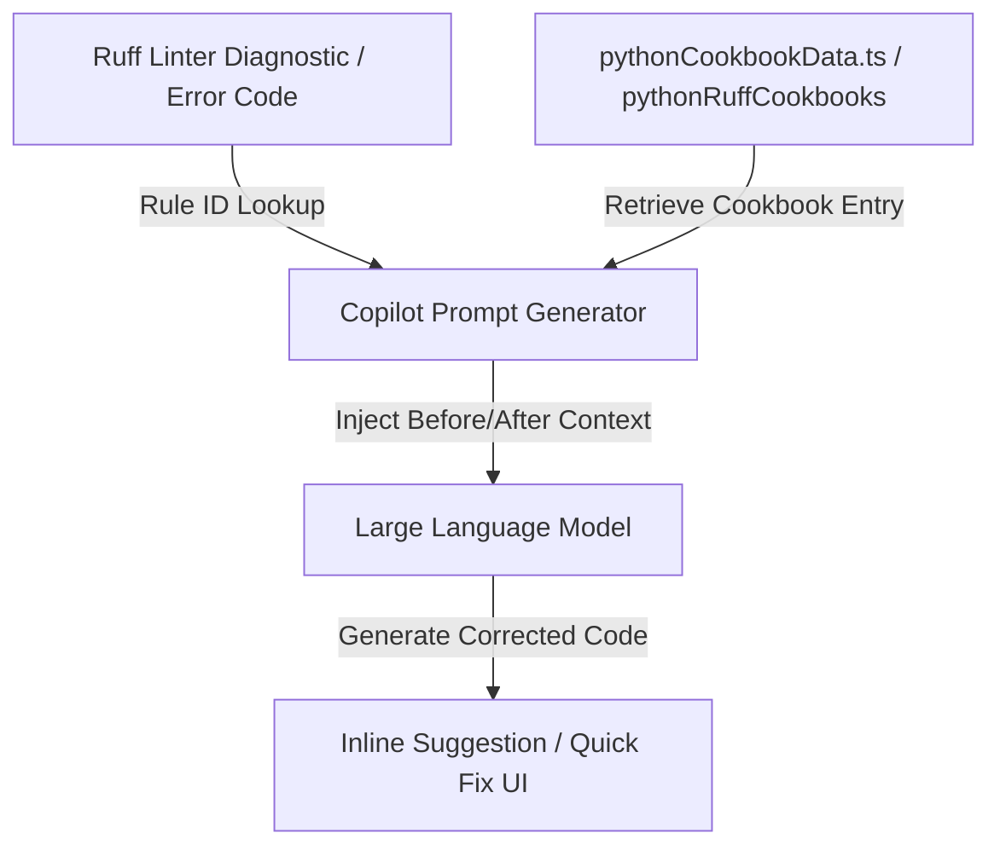

# Python Ruff Cookbook Data Module

The `pythonCookbookData.ts` module provides a mapping of Python Ruff linter rule IDs to code transformation instructions. This data serves as standard reference examples ("cookbooks") used to guide Copilot's inline code generation and refactoring capabilities for Python files.

## Purpose

The main objective of this module is to supply the Copilot extension with structured, rule-specific knowledge for Python codebase improvements. By referencing this map, the extension can enrich LLM prompts with exact contextual explanations and concrete `Before` / `After` code snippets corresponding to specific Ruff diagnostics.

---

## Module Structure and Key Exports

### Types

#### `PromptMap`
A utility type definition representing a key-value dictionary where both keys and values are strings.
```typescript
type PromptMap = Record<string, string>;
```

### Constants

#### `pythonRuffCookbooks`
An exported constant of type `PromptMap` containing a dictionary of Ruff rule diagnostics mapped to formatting explanations.
- **Keys**: Standard Ruff linter rule codes (e.g., `AIR001`, `FAST001`, `YTT101`, `ANN001`).
- **Values**: Plain-text descriptions detailing the code smell or deprecated practice, followed by structured `[Before]` and `[After]` Markdown code blocks illustrating how to resolve the issue.

---

## Key Design Patterns & Decisions

### 1. Automated Generation
As indicated by the header comment, this file is automatically generated by an upstream tool or script and should not be modified manually:
```typescript
// this file is automatically generated. Do not edit it.
```
This ensures that the cookbook definitions remain in sync with official Ruff rules or an upstream source-of-truth database without human-introduced formatting discrepancies.

### 2. Standardized Value Format
Every entry follows a strict string pattern:
1. **Explanation**: A concise sentence defining the recommendation.
2. **Before block**: Marked by `[Before]` and wrapped in a python code block showing the problematic code pattern.
3. **After block**: Marked by `[After]` and wrapped in a python code block showing the corrected or modernized code pattern.

This uniform structure allows parsing mechanisms within the prompt generation system to easily slice, format, or present these examples to the model.

---

## Project Integration



Within the VS Code Copilot extension architecture:
- **Prompt Construction**: Located under `extensions/copilot/src/extension/prompts/node/inline/`, this module is loaded when inline prompts are being constructed for Python diagnostics.
- **Linter Integration**: When a linter diagnostic is triggered in the user's workspace (specifically Ruff rules), the corresponding rule code is matched against keys in `pythonRuffCookbooks`.
- **Few-Shot Prompting**: If a match is found, the value containing the description and code snippets is injected as a few-shot example or context block into the LLM prompt. This guides the model to produce higher-quality, rule-compliant fixes.