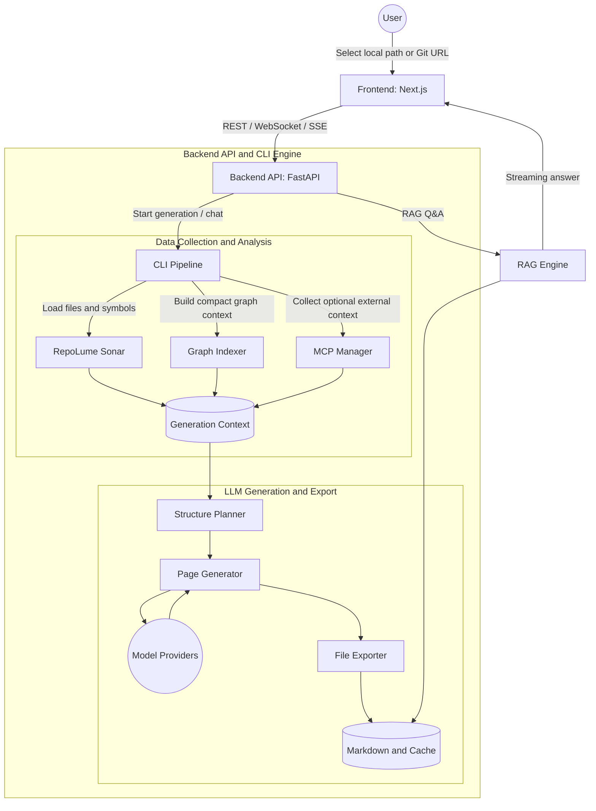

# System Architecture

RepoLume is split into a web interface, a backend API, and a CLI-first generation pipeline. The CLI pipeline is the core: the web app calls into the same repository analysis and export flow that can be run from a terminal.

## Architecture Diagram

## Components

### Frontend

Path: `src/`

The frontend provides setup, project selection, streaming analysis logs, wiki browsing, settings, and admin log views. It renders generated Markdown and Mermaid diagrams in the browser.

### Backend API

Path: `api/`

The backend is a FastAPI service that exposes cache, generation, auth/status, model configuration, chat, and streaming endpoints. It also bridges the web UI to the CLI pipeline.

Important modules:

- `api/main.py`: application entry point and server startup.
- `api/api.py`: REST endpoints for project and wiki operations.
- `api/websocket_wiki.py`: generation and streaming flow.
- `api/simple_chat.py`: RAG/chat flow.
- `api/task_streams.py`: task event stream and replay support.

### CLI Pipeline

Path: `cli/`

The CLI pipeline performs repository resolution, local static analysis, graph context assembly, optional MCP context collection, structure planning, page generation, export, and Confluence publishing.

Important modules:

- `cli/wiki.py`: CLI entry point.
- `cli/pipeline/local_repo.py`: local path and Git URL handling.
- `cli/sonar/`: RepoLume Sonar static analysis and Mermaid generation.
- `cli/indexer/`: optional compact graph context from external graph tools.
- `cli/mcp/`: optional DB, GitHub, and Atlassian context collectors.
- `cli/providers/`: model adapters and CLI-agent adapters.
- `cli/pipeline/file_exporter.py`: Markdown tree export.
- `cli/pipeline/publisher.py`: Confluence publishing.

## Data Flow

1. A user selects a repository from the UI or passes a path/URL to `python3 -m cli.wiki`.
2. RepoLume resolves the repository and collects code context.
3. RepoLume Sonar extracts symbols, relationships, and diagram-ready structure.
4. Optional indexers and MCP sources add graph, issue, PR, schema, or Confluence context.
5. The structure planner asks an LLM for a page/section plan.
6. The page generator writes Markdown pages, using provider routing and tracked sources.
7. The exporter writes a wiki tree under `wiki-out/<repo>`.
8. The UI reads the generated cache and renders the interactive wiki.
