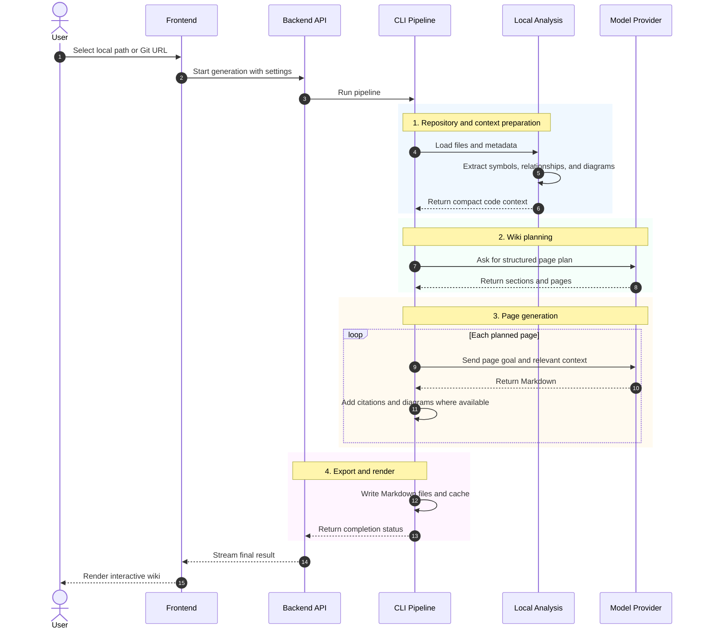

# Generation Workflow

This page describes the end-to-end RepoLume generation flow.

## Sequence

## Steps

1. Repository resolution

   RepoLume accepts a local path or Git URL. Git URLs are cloned to a temporary or configured directory. Local paths are read directly.

2. Local analysis

   RepoLume Sonar scans supported source files to extract symbols, relationships, and diagram context. The graph indexer can add compact call/import context when available.

3. Optional MCP enrichment

   If configured, MCP clients can add context from databases, GitHub issues/PRs, Jira, and Confluence. This helps generated docs connect code to operational and product context.

4. Structure planning

   The structure planner asks the model to create a page plan before any full page is generated. This keeps output organized around architecture, workflows, APIs, components, and deployment.

5. Page generation

   Each page is generated with the relevant source context. The model router can choose a lightweight or stronger model based on page importance and context richness.

6. Export

   The file exporter writes a Markdown wiki tree. The UI can render that tree, and the CLI can publish it to Confluence.
