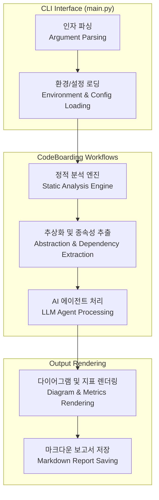

# 시작하기 (Getting Started)

본 문서는 CodeBoarding 프로젝트의 초기 설정, 설치 및 기본 실행 방법을 안내하는 기술 위키 가이드입니다. 이 가이드는 `README.md`, `install.py`, `main.py`, `PYPI.md` 소스 파일을 기반으로 작성되었습니다.

## 1. 프로젝트 소개 (Introduction)
*Source: `README.md`, `PYPI.md`*

CodeBoarding은 대규모 코드베이스의 정적 분석(Static Analysis)과 AI 기반 에이전트(AI Agents)를 결합하여 코드 아키텍처를 시각화하고 헬스 체크(Health Check)를 수행하는 지능형 자동화 도구입니다. 개발자는 이 도구를 통해 코드의 종속성(Dependencies), 복잡도(Complexity), 시스템 구조 및 리팩토링 필요 영역을 명확하게 파악할 수 있습니다.

## 2. 설치 방법 (Installation)
*Source: `install.py`, `PYPI.md`*

프로젝트 환경을 구성하기 위해 시스템 및 선호도에 따라 다음의 설치 방법들을 제공합니다.

### 2.1 스크립트를 통한 설치 (Standalone Script Installation)
`install.py` 스크립트는 프로젝트 실행에 필요한 종속성 패키지(Dependencies), 로컬 도구 모음(Tool Registry), 필수 디렉토리 구조 초기화를 자동으로 수행합니다. 처음 저장소(Repository)를 클론(Clone)한 후 권장되는 방식입니다.

```bash
# install.py 스크립트를 실행하여 초기 환경을 구성합니다.
python install.py
```

### 2.2 패키지 매니저를 통한 설치 (Package Manager Installation)
표준 프로젝트 배포판을 시스템 환경에 전역/가상 환경(Virtual Environment)으로 설치할 때는 `pip` 패키지 관리자를 활용합니다 (`PYPI.md` 참조). `uv` 패키지 매니저 환경 또한 공식 지원(`uv.lock` 포함)합니다.

```bash
# 표준 pip를 이용한 설치
pip install codeboarding

# uv 패키지 매니저를 이용한 빠른 설치
uv pip install codeboarding
```

## 3. 핵심 실행 아키텍처 (Core Execution Architecture)
*Source: `main.py`*

프로젝트의 애플리케이션 진입점(Entry Point)은 `main.py`입니다. 사용자가 CLI(Command Line Interface)를 통해 명령을 전달하면, 애플리케이션은 설정 데이터 로드(Configuration Loading), 소스 코드 스캐닝(Source Scanning), 워크플로우 오케스트레이션(Workflow Orchestration)을 거쳐 최종 결과물을 렌더링(Rendering)합니다.

아래는 `main.py`를 중심으로 한 전체 파이프라인의 실행 흐름도(Execution Flowchart)입니다.



## 4. 기본 사용법 (Basic Usage)
*Source: `main.py`, `README.md`*

환경 설정이 완료되면 `main.py`를 호출하여 분석 워크플로우를 시작할 수 있습니다. 가장 기본적인 명령어는 대상 프로젝트의 루트 디렉토리(Root Directory)를 지정하여 전체 스캔을 수행하는 것입니다.

### 핵심 명령어 (Core Commands)

```bash
# 현재 디렉토리(. 디렉토리) 전체 코드 분석 실행
python main.py

# 특정 설정 파일(user_config.py)을 주입하여 타겟 디렉토리 분석
python main.py --config user_config.py --target ./src
```

### 주요 프로세스 설명 (Process Details)
1. **초기화 (Initialization):** `logging_config.py` 및 `user_config.py`의 기본값을 가져와 런타임 환경을 구성합니다.
2. **분석 수행 (Analysis Execution):** `main.py`는 `codeboarding_workflows` 내부의 모듈을 호출하여 `.codeboarding/` 디렉토리에 분석 상태(`.codeboardingignore` 규칙 적용 등) 및 `.json` 캐시를 구성합니다.
3. **결과 확인 (Result Verification):** 실행이 완료되면 프로젝트 루트의 `.codeboarding/` 폴더 내에 마크다운 리뷰 파일들(`overview.md`, `Incremental_Analysis_Controller.md` 등)과 `analysis.json` 메타데이터가 생성됩니다.
