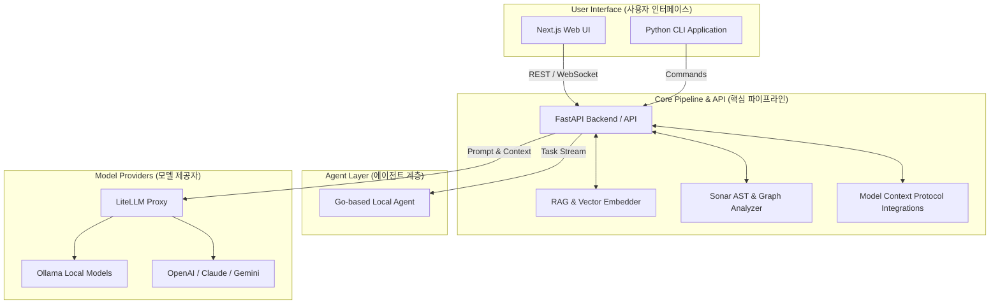

# Introduction (프로젝트 소개)

**Sources cited:** `README.md`, `README.kr.md`

**local-deepwiki**는 복잡한 소프트웨어 프로젝트와 코드베이스를 분석하여, 개발자가 쉽게 이해할 수 있는 기술 위키(Technical Wiki) 문서로 자동 변환하는 로컬 기반의 AI 어시스턴트 및 파이프라인입니다. 이 도구는 대규모 언어 모델(LLM)과 RAG(Retrieval-Augmented Generation) 기술을 결합하여 소스 코드의 맥락(Context)을 파악하고, Markdown 및 Mermaid 다이어그램을 포함한 고품질의 문서를 생성합니다.

(local-deepwiki is a local-first AI assistant and pipeline that analyzes complex software projects and codebases, automatically transforming them into developer-friendly technical wiki documentation. It combines Large Language Models (LLMs) with Retrieval-Augmented Generation (RAG) to understand code context and generate high-quality documentation, including Markdown and Mermaid diagrams.)

---

## Core Objectives (핵심 목표)

1. **Local-First Privacy (로컬 중심의 프라이버시):** 코드베이스가 외부 클라우드로 유출되는 것을 방지하기 위해, **Ollama** 및 로컬 컨테이너 기반 환경을 통해 안전하게 코드를 분석합니다. (Analyzes code securely via Ollama and local containers to prevent codebase leaks to external clouds.)
2. **Automated Documentation (자동화된 문서 생성):** 파이썬(Python) 기반의 Sonar 분석기(AST Analyzer)를 사용하여 코드의 구조를 파악하고, 자동으로 호출 그래프(Call Graph)와 모듈 의존성을 시각화합니다. (Uses a Python-based Sonar AST analyzer to understand code structure and automatically visualize call graphs and module dependencies.)
3. **Seamless Integration (원활한 통합):** Next.js 기반의 직관적인 프론트엔드와 Model Context Protocol (MCP)를 통해 GitHub, Atlassian 등 외부 서비스의 컨텍스트를 쉽게 통합합니다. (Easily integrates external contexts from GitHub and Atlassian via MCP and an intuitive Next.js frontend.)

---

## System Architecture (시스템 아키텍처)

시스템은 크게 사용자 인터페이스(UI/CLI), 핵심 분석 파이프라인(Core Pipeline), 그리고 AI 모델 계층(Model Layer)으로 구성됩니다.

### Components Description (주요 구성요소)

* **Next.js Web UI (`src/app/`)**: 사용자가 생성된 위키를 열람하고, 시스템 설정을 관리하며, 실시간으로 분석 로그를 확인할 수 있는 프론트엔드 환경을 제공합니다. (Provides a frontend environment for users to browse generated wikis, manage settings, and view analysis logs in real-time.)
* **FastAPI Backend (`api/`)**: RAG 파이프라인, 데이터베이스 처리, 그리고 웹소켓을 통한 실시간 스트리밍(`websocket_wiki.py`)을 담당하는 중앙 오케스트레이터입니다. (The central orchestrator handling the RAG pipeline, database operations, and real-time streaming via websockets.)
* **Sonar Analyzer (`cli/sonar/`)**: 소스 코드의 추상 구문 트리(AST, Abstract Syntax Tree)를 파싱하여 클래스, 함수, 모듈 간의 관계를 그래프 형태로 추출합니다. (Parses the AST of the source code to extract relationships between classes, functions, and modules in a graph format.)
* **MCP Integrations (`cli/mcp/`)**: 외부 도구와 모델 간의 안전한 컨텍스트 공유를 위한 프로토콜(Model Context Protocol)을 구현하여 코드베이스 외의 추가 데이터를 주입합니다. (Implements the Model Context Protocol to share secure context between external tools and models, injecting additional data beyond the codebase.)

---

## Key Technologies (주요 기술 스택)

* **Backend & Pipeline:** Python (FastAPI, Pytest), Poetry/UV (Dependency management)
* **Frontend:** TypeScript, Next.js, Tailwind CSS
* **AI & LLM Routing:** LiteLLM (LLM Proxy), Ollama (Local LLM Execution)
* **Code Parsing:** AST (Abstract Syntax Tree) Analysis, Tree-sitter (implicit via Graphify/Sonar)
* **Diagramming:** Mermaid.js (자동화된 구조도 및 흐름도 렌더링 / Automated structure and flow rendering)

이 소개 문서는 `README.md` 및 `README.kr.md` 파일에 정의된 프로젝트의 핵심 철학과 아키텍처 설계를 바탕으로 작성되었습니다. 이어지는 위키 페이지들을 통해 각 컴포넌트의 세부적인 작동 방식과 설정 방법을 확인할 수 있습니다.
