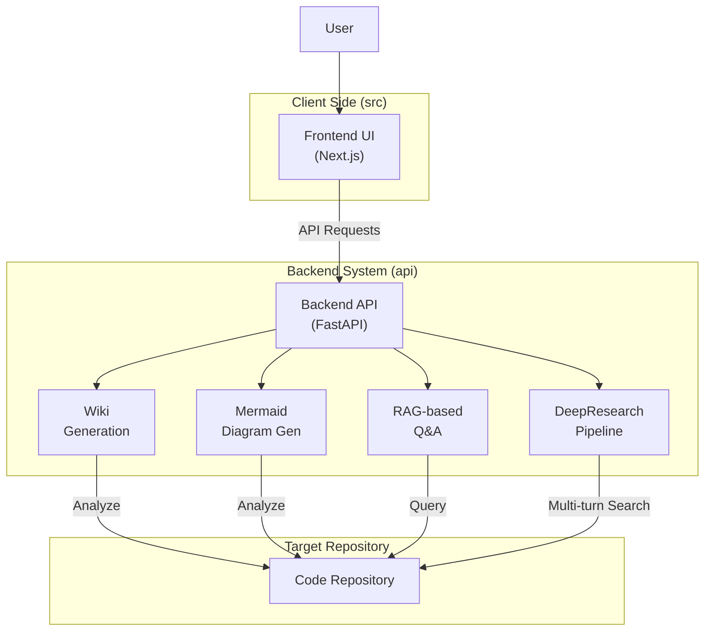

# Overview

**LocalWiki**는 다양한 Code Repository를 분석하여 포괄적이고 대화형 위키(Wiki) 문서와 아키텍처 다이어그램을 자동으로 생성해주는 강력한 범용 도구입니다. 복잡한 Codebase의 구조를 쉽게 파악하고 탐색할 수 있도록 돕습니다.

---

## Architecture Diagram

LocalWiki의 전반적인 시스템 구조와 주요 구성 요소는 다음과 같습니다.



---

## ✨ Features

- **Instant Documentation**: Code Structure 및 객체 간의 관계를 자동으로 분석하여 상세한 Wiki 페이지를 생성합니다.
- **Visual Diagrams**: 시스템 Architecture 및 Data Flow를 시각화하는 Mermaid Diagram을 자동으로 생성하여 제공합니다.
- **RAG-based Q&A**: 검색 증강 생성(RAG) 파이프라인을 구축하여, Code Repository와 관련된 사용자의 질문에 답변하는 대화형 기능을 제공합니다.
- **DeepResearch**: Multi-turn 대화를 통해 Codebase를 심층적으로 연구하고 추적하는 기능을 지원합니다.

---

## 🚀 Quick Start

LocalWiki를 실행하기 위한 기본 단계는 다음과 같습니다.

### Step 1: Environment Variables 설정
프로젝트 루트 디렉토리에 `.env` 파일을 생성하고 필요한 API Key를 설정합니다.

```env
GOOGLE_API_KEY=your_google_api_key
OPENAI_API_KEY=your_openai_api_key
```

### Step 2: Start Backend
Python 환경에서 `poetry`를 사용하여 의존성을 설치하고 FastAPI Backend 서버를 실행합니다.

```bash
python -m pip install poetry==2.0.1 && poetry install -C api
python -m api.main
```

### Step 3: Start Frontend
Node.js 환경에서 패키지를 설치하고 Next.js Frontend 앱을 실행합니다.

```bash
npm install
npm run dev
```

모든 실행이 완료되면 브라우저에서 `http://localhost:3000`에 접속하여 LocalWiki를 사용할 수 있습니다.

---

## 🛠️ Project Structure

LocalWiki의 디렉토리 구조는 Frontend와 Backend로 명확하게 분리되어 있습니다.

- `api/`: FastAPI를 기반으로 하는 Backend API 서버 코드가 위치합니다. RAG 파이프라인, Data Processing, DeepResearch 로직 등을 처리합니다.
- `src/`: Next.js 기반의 Frontend 애플리케이션 코드가 위치합니다. UI 컴포넌트와 생성된 Wiki의 렌더링을 담당합니다.
- `public/`: Frontend에서 사용하는 Static Assets(이미지, 아이콘 등)이 저장됩니다.

---

**References:**
- `README.kr.md`
- `README.md`
