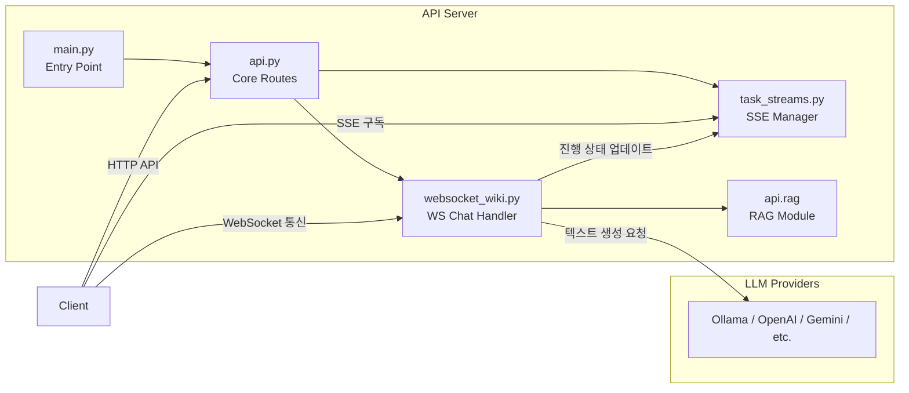
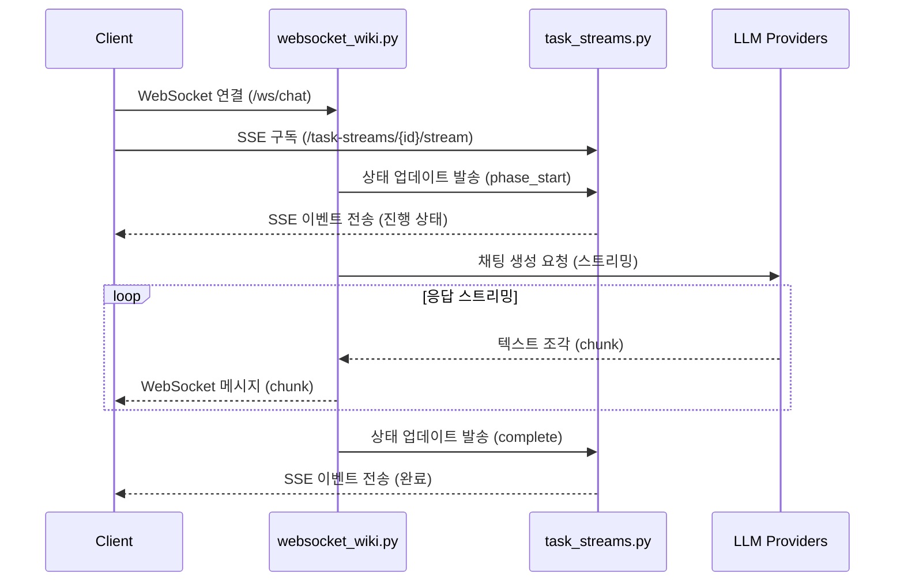

# API 서버

## 개요 (Overview)
FastAPI를 기반으로 구축된 메인 API 서버의 구조와 핵심 기능입니다. 웹소켓(WebSocket)을 통한 실시간 채팅 스트리밍, SSE(Server-Sent Events)를 활용한 백그라운드 작업 상태 브로드캐스팅, 그리고 로컬 파일 시스템 및 위키 문서 캐시 관리를 담당합니다.

## 아키텍처 (Architecture)

## 핵심 컴포넌트 (Core Components)

### 1. 진입점 (Entry Point) - `api/main.py`
- 환경 변수(`.env`)를 불러오고 시스템 로깅을 설정합니다.
- 개발 환경(`NODE_ENV != "production"`)에서는 `watchfiles` 라이브러리를 활용하여, `logs` 폴더를 제외한 파이썬(`.py`) 파일이 변경될 때 서버를 자동으로 재시작(Hot Reload)합니다.
- 필수 환경 변수(`GOOGLE_API_KEY`, `OPENAI_API_KEY` 등)의 존재 여부를 검증하고 `uvicorn`을 통해 FastAPI 애플리케이션을 구동합니다.

### 2. 핵심 API 라우트 (Core Routes) - `api/api.py`
- **FastAPI** 인스턴스를 초기화하고 CORS 미들웨어를 설정합니다.
- 위키 페이지, 캐시 데이터, 모델 설정 등을 처리하기 위한 Pydantic 데이터 모델을 정의합니다.
- **주요 기능:**
  - **위키 캐시 관리 (Wiki Cache Management)**: `.adalflow/wikicache` 및 로컬 `wiki-out` 디렉토리를 통해 위키 데이터를 저장 및 조회합니다. 삭제(`DELETE`) 요청이 들어오면 데이터를 완전히 지우지 않고 3일간 유지되는 `.trash` 폴더로 이동시킵니다 (Soft Delete).
  - **로컬 저장소 지원 (Local Repository)**: OS의 기본 폴더 선택 창을 띄우거나, 지정된 로컬 디렉토리 내부의 파일 트리 및 README 구조를 분석하여 반환합니다.
  - **모델 설정 (Model Config)**: 클라이언트가 사용할 수 있는 LLM Provider 및 모델 목록을 제공합니다.
  - **내보내기 (Export)**: 생성된 위키 페이지를 Markdown 또는 JSON 파일 형태로 추출합니다.

### 3. 웹소켓 채팅 핸들러 (WebSocket Chat) - `api/websocket_wiki.py`
- `WebSocket` 연결을 통해 클라이언트와 양방향 통신을 유지하며 LLM의 텍스트 응답을 실시간으로 스트리밍합니다.
- **RAG (Retrieval-Augmented Generation)** 모듈과 연동하여 사용자의 질문에 관련된 코드베이스 문맥을 검색하고 프롬프트에 주입합니다.
- **심층 조사 (Deep Research)**: 특정 태그를 감지하여 작업 반복 횟수(Iteration)에 따라 시스템 프롬프트를 동적으로 변경하며 깊이 있는 분석을 수행합니다.
- **오류 복구 (Fallback Mechanism)**: 입력 토큰 크기가 한도를 초과하거나 RAG 처리 중 오류가 발생할 경우, 검색된 문맥(RAG)을 제외한 기본 프롬프트로 텍스트 재생성을 시도합니다.

### 4. 작업 스트림 (Task Streams) - `api/task_streams.py`
- **SSE (Server-Sent Events)** 프로토콜을 사용하여 백그라운드 작업의 진행 상태를 클라이언트에게 실시간 비동기 스트리밍으로 전달합니다.
- `TaskStreamManager` 클래스는 여러 클라이언트의 구독(Subscribe)을 관리하며, 오래된 연결(Stale Stream)을 정리하는 기능을 포함합니다.
- API 서버 내부의 여러 모듈에서 `emit_task_event` 함수를 호출하여 작업의 시작(`phase_start`), 완료(`complete`), 오류(`error`) 상태를 중앙에서 관리하고 브로드캐스팅합니다.

## 통신 흐름 (Communication Flow)

## 주요 엔드포인트 (Key Endpoints)

| HTTP 메서드 | 경로 (Path) | 설명 (Description) | 담당 파일 |
|---|---|---|---|
| `GET` | `/health` | 서버의 정상 작동 여부를 확인하는 상태 체크 | `api.py` |
| `GET` | `/models/config` | 사용 가능한 LLM 모델 및 Provider 설정 목록 반환 | `api.py` |
| `GET` / `POST` | `/api/wiki_cache` | 위키 캐시 데이터를 조회하거나 새롭게 저장 | `api.py` |
| `GET` | `/api/processed_projects` | 처리가 완료되어 캐시된 프로젝트 목록 반환 | `api.py` |
| `GET` | `/task-streams/{stream_id}/stream` | 특정 ID를 가진 작업의 진행 상태를 SSE로 실시간 구독 | `task_streams.py` |
| `WebSocket` | `/ws/chat` | RAG 문맥을 포함한 실시간 LLM 채팅 처리 및 스트리밍 | `websocket_wiki.py` |
