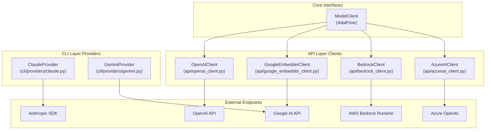

# LLM 프로바이더 연동

## Overview
LocalWiki 시스템은 다양한 외부 LLM 및 Embedder API를 일관된 방식으로 처리하기 위해 모듈화된 클라이언트 아키텍처를 제공합니다. 시스템은 크게 API 서버 환경(`api/`)을 위한 `AdalFlow`의 `ModelClient` 기반 통합 클라이언트와 CLI 독립 실행 환경(`cli/providers/`)을 위한 경량 SDK Provider 래퍼로 나뉘어 동작합니다.

## Architecture

## API Server Clients

### OpenAIClient
**Source:** `api/openai_client.py`

*   **Capabilities:** LLM (Chat Completion), Embedder, Image Generation (DALL-E) 기능을 모두 지원하는 범용 ModelClient입니다.
*   **Key Features:**
    *   `sync_client`와 `async_client`를 모두 초기화하여 동기식 및 비동기식 API 호출에 대응합니다.
    *   `images` 파라미터를 통해 전달된 이미지 경로 및 URL을 Base64 포맷이나 Image URL 객체로 변환하여 Multimodal(Vision) 입력을 자체 처리합니다 (`_prepare_image_content`).
    *   `stream=True` 요청 시 청크(Chunk) 응답 데이터를 `handle_streaming_response`를 통해 Generator 객체로 연속 반환합니다.
*   **Configuration:** `OPENAI_API_KEY`, `OPENAI_BASE_URL` 환경 변수를 사용하며, Self-hosted 모델 연동을 위해 Base URL 덮어쓰기를 지원합니다.

### GoogleEmbedderClient
**Source:** `api/google_embedder_client.py`

*   **Capabilities:** Google AI의 Embedding 전용 모델(예: `gemini-embedding-001`)을 처리하기 위한 클라이언트입니다.
*   **Key Features:**
    *   `ModelType.EMBEDDER` 타입만 허용하며, LLM 생성 기능은 제외되어 있습니다.
    *   단일 텍스트(`content`) 및 다중 텍스트 배칭(`contents`)을 파악하여 Google AI의 네이티브 Batch Embedding API로 자동 매핑합니다.
    *   응답 결과를 `EmbedderOutput` 포맷으로 파싱하고 텐서 차원(Dimension) 검증 로직을 포함합니다.
*   **Configuration:** `GOOGLE_API_KEY` 환경 변수를 사용합니다.

### BedrockClient
**Source:** `api/bedrock_client.py`

*   **Capabilities:** AWS Bedrock Runtime을 활용해 다수의 파운데이션 모델(Anthropic, Amazon Titan, Cohere, AI21 등)을 단일 인터페이스로 묶어 처리합니다.
*   **Key Features:**
    *   Model ID를 기반으로 `_get_model_provider()`를 호출하여 대상 프로바이더를 식별합니다.
    *   식별된 프로바이더별로 상이한 Prompt 규격 (예: Claude용 `messages` 배열, Amazon용 `inputText`, Cohere용 `prompt`)을 `_format_prompt_for_provider()` 내부 함수를 통해 동적으로 변환합니다.
    *   AWS STS를 활용한 Role-based Authentication(Assume Role)을 지원하여 보안 인프라 통합(`AWS_ROLE_ARN` 사용)이 가능합니다.
*   **Configuration:** `AWS_ACCESS_KEY_ID`, `AWS_SECRET_ACCESS_KEY`, `AWS_REGION` 및 선택적 `AWS_ROLE_ARN` 환경 변수를 사용합니다.

### AzureAIClient
**Source:** `api/azureai_client.py`

*   **Capabilities:** Azure 클라우드 인프라 내에 배포된 OpenAI 엔드포인트 전용 클라이언트입니다.
*   **Key Features:**
    *   표준 API Key 인증 외에 `DefaultAzureCredential` 및 `get_bearer_token_provider`를 이용한 Azure Active Directory (AAD) 기반 인증 워크플로우를 완벽히 지원합니다.
    *   `api_type="azure"`로 설정되어 동작하며, 내부적으로 Chat Completion 및 Streaming 파싱 구조는 `OpenAIClient`의 로직과 유사하게 설계되어 있습니다.
*   **Configuration:** `AZURE_OPENAI_API_KEY` (또는 Azure AD 토큰), `AZURE_OPENAI_ENDPOINT`, `AZURE_OPENAI_VERSION`을 사용합니다.

## CLI Providers

CLI 환경에서는 무거운 `ModelClient` 구조나 로컬 API 서버에 의존하지 않고, 외부 SDK를 직접 호출하는 경량화된 Provider 어댑터를 사용합니다.

### ClaudeProvider
**Source:** `cli/providers/claude.py`

*   **Implementation:** `anthropic` 공식 Python SDK 인스턴스를 직접 래핑합니다.
*   **Key Features:**
    *   Default Model: `claude-sonnet-4-5`
    *   `max_tokens` 제약을 `65536`으로 넓게 잡아 코드 베이스 및 위키 문서와 같은 대용량 컨텍스트 생성에 최적화되어 있습니다.
    *   응답 전체를 한 번에 반환하는 `generate()`와 Iterator 패턴으로 텍스트를 스트리밍하는 `stream()` 메서드를 분리하여 제공합니다.
*   **Configuration:** `ANTHROPIC_API_KEY` 및 `CLAUDE_MODEL` 환경 변수를 사용합니다.

### GeminiProvider
**Source:** `cli/providers/gemini.py`

*   **Implementation:** `google.generativeai.GenerativeModel` 클래스를 통해 API 서버 없이 Google Gemini API와 직접 통신합니다.
*   **Key Features:**
    *   Default Model: `gemini-2.0-flash`
    *   객체 초기화 시 `generation_config`(`temperature=0.7`, `top_p=0.95`, `top_k=40`, `max_output_tokens=65536`)를 사전 정의하여 안정적인 생성 품질을 일관성 있게 유지합니다.
    *   응답 청크가 누락되지 않도록 `stream=True` 호출 시 `chunk.text` 속성 유무를 내부적으로 안전하게 검증합니다.
*   **Configuration:** `GOOGLE_API_KEY` (또는 `GEMINI_API_KEY`) 및 `GEMINI_MODEL` 환경 변수를 사용합니다.
