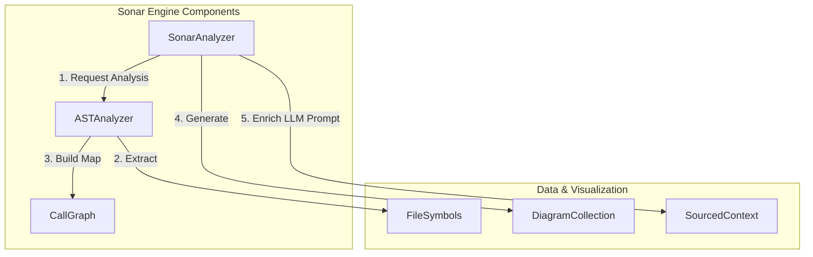
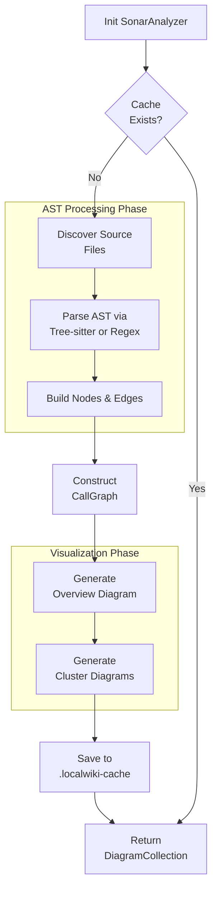

# Overview

심층 분석(DeepResearch) 시스템은 LocalWiki 내부에 탑재된 경량 정적 코드 분석(Static Code Analysis) 엔진입니다. 외부의 무거운 LSP(Language Server Protocol)에 의존하지 않고, `tree-sitter`를 활용하여 소스 코드의 `AST(Abstract Syntax Tree)`를 파싱합니다. 이를 통해 코드베이스의 클래스, 함수, 모듈 임포트 구조를 추출하여 방향성 있는 의존성 그래프(`CallGraph`)를 구성하고, 아키텍처 다이어그램을 자동 생성합니다. 

해당 분석 엔진은 코드 컨텍스트를 LLM(대형 언어 모델)에게 제공하기 위한 `SourcedContext`를 구축하는 핵심 파이프라인 역할을 수행합니다.

# System Architecture

심층 분석 엔진은 크게 파싱을 담당하는 `ASTAnalyzer`, 데이터를 표현하는 `CallGraph`, 전체 흐름을 제어하는 `SonarAnalyzer`로 구성됩니다.

# Core Components

### 1. ASTAnalyzer
**Source File:** `cli/sonar/ast_analyzer.py`

`ASTAnalyzer`는 단일 소스 파일이나 전체 리포지토리에 대한 구조적 파싱을 수행합니다.
- **Language Detection:** 확장자를 통해 Python, TypeScript, Go, Java 등 다양한 언어를 식별합니다.
- **Tree-sitter Parsing:** `tree-sitter`를 우선적으로 사용하여 클래스 정의, 함수 정의, 임포트(Import) 문을 정확하게 추출합니다. 만약 `tree-sitter` 패키지가 없거나 파싱 오류가 발생하면, 정규식(Regex) 기반의 `_analyze_regex` 폴백(Fallback) 메커니즘을 작동시켜 분석을 보장합니다.
- **Symbol Extraction:** 분석된 파일의 식별자들은 `FileSymbols` 데이터 클래스 형태로 저장됩니다.
- **Edge Resolution:** `_resolve_import`를 통해 코드 내의 임포트 문자열을 실제 로컬 파일 경로와 매핑하여 파일 간 의존성을 도출합니다.

### 2. CallGraph
**Source File:** `cli/sonar/call_graph.py`

`CallGraph` 모듈은 코드베이스의 의존성을 표현하는 방향 그래프(Directed Graph) 데이터 모델을 제공합니다.
- **Node & Edge:** 각 모듈, 클래스, 함수는 `Node` 객체로 표현되며, 임포트나 호출 관계는 `Edge` 객체로 연결됩니다.
- **Clustering & Subgraphs:** 파일 단위로 노드를 그룹화하는 `cluster_by_file`, 특정 파일들에 해당하는 부분 집합 그래포만 반환하는 `subgraph_for_files` 기능이 포함되어 있습니다.
- **Graph Queries:** `neighbors`(의존 대상) 및 `callers`(의존하는 대상) 메서드를 통해 코드 간의 영향도를 양방향으로 추적할 수 있습니다.

### 3. SonarAnalyzer
**Source File:** `cli/sonar/sonar_analyzer.py`

`SonarAnalyzer`는 심층 분석의 메인 진입점이자(Orchestrator) 다이어그램 렌더링을 담당하는 컴포넌트입니다.
- **Caching Mechanism:** `.localwiki-cache/` 디렉토리에 이전 분석 결과(`DiagramCollection`)를 해시(Hash) 기반으로 캐싱(`pickle` 사용)하여 불필요한 재분석을 방지하고 성능을 최적화합니다.
- **Diagram Generation:** 생성된 `CallGraph`를 기반으로 전체 시스템 아키텍처 다이어그램(Overview) 및 디렉토리/패키지 단위의 하위 클러스터 다이어그램을 자동으로 생성합니다.
- **Context Injection:** `get_context_for_page` 메서드를 통해, 생성된 AST 요약 정보와 연관된 Mermaid 다이어그램을 엮어 LLM 프롬프트에 제공할 `SourcedContext` 객체를 조립합니다.

# Execution Flow

리포지토리 분석 요청이 들어왔을 때 내부에서 실행되는 파이프라인의 구체적 흐름은 다음과 같습니다.

# Deployment & Integration

DeepResearch 모듈은 외부 의존성을 최소화한 `LocalWiki 내제화 버전`으로 구현되어 환경에 구애받지 않고 쉽게 배포될 수 있도록 설계되었습니다. 분석이 완료된 후 도출된 `DiagramCollection`의 데이터는 위키 페이지 생성기(WikiPageGenerator)로 전달되어 개발자가 코드를 깊게 이해하지 않아도 자연어로 시스템 구조를 파악할 수 있게 하는 핵심 지식 기반(Knowledge Base)으로 활용됩니다.
