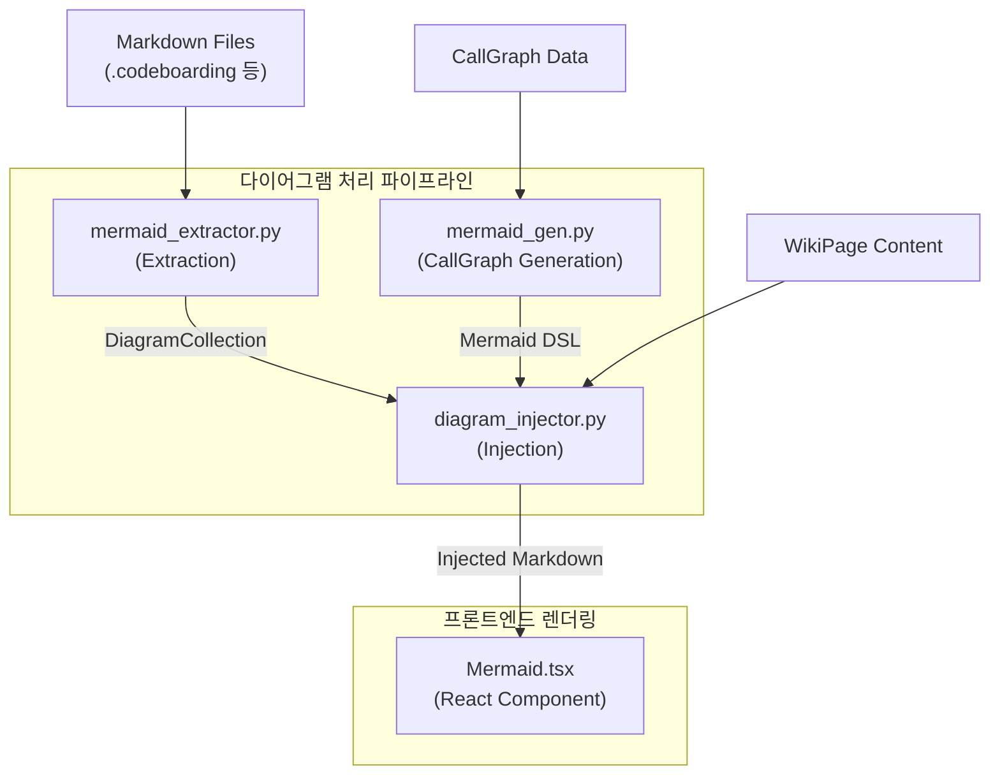
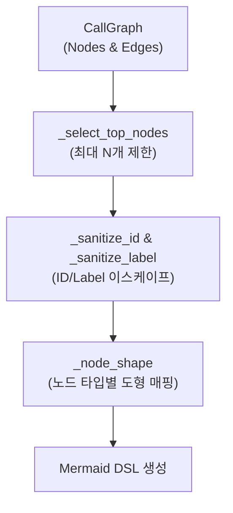

# 다이어그램 생성 (Diagram Generation)

다이어그램 생성 파이프라인은 마크다운 소스에서 기존 다이어그램을 추출하고, 코드 분석을 통해 새로운 구조도를 생성한 뒤, 위키 페이지의 적절한 위치에 주입하여 프론트엔드에서 렌더링하는 전체 과정을 다룹니다.

## Overview

시스템은 다음 4가지 핵심 컴포넌트로 구성됩니다:
1. **Extraction (`mermaid_extractor.py`)**: 원본 `.md` 파일들로부터 Mermaid 코드 블록과 메타데이터를 추출합니다.
2. **Generation (`mermaid_gen.py`)**: `CallGraph` 데이터를 분석하여 시스템 아키텍처 및 의존성 그래프를 Mermaid 형식으로 변환합니다.
3. **Injection (`diagram_injector.py`)**: 생성된 위키 페이지의 내용과 문맥을 분석하여 최적의 위치에 다이어그램을 삽입합니다.
4. **Rendering (`Mermaid.tsx`)**: React 프론트엔드에서 `mermaid.js`를 사용하여 다이어그램을 시각화하고, 확대/축소 및 테마 변경 기능을 제공합니다.

## Architecture

## Component Details

### 1. Mermaid Extractor (`cli/diagrams/mermaid_extractor.py`)

지정된 디렉토리(예: `.codeboarding`)의 마크다운 파일을 재귀적으로 탐색하여 Mermaid 다이어그램을 추출합니다.

- **`MermaidDiagram` Data Class**: 추출된 각 다이어그램의 소스 파일, 유형(예: `flowchart`, `sequenceDiagram`), 내용, 인접한 헤딩 컨텍스트(`heading_context`) 등의 메타데이터를 저장합니다.
- **`DiagramCollection`**: 추출된 모든 다이어그램을 관리하며, 다음과 같은 유틸리티 메서드를 제공합니다:
  - `best_architecture_diagram()`: 내용이 가장 긴 `graph` 유형의 다이어그램을 찾아 아키텍처 개요도로 반환합니다.
  - `for_topic(topic)`: 주어진 토픽과 다이어그램의 소스 파일, 헤딩, 내용을 비교하여 연관성 점수(Score)를 계산하고 가장 적합한 다이어그램을 찾습니다.

### 2. Diagram Generator (`cli/sonar/mermaid_gen.py`)

AST 분석 결과인 `CallGraph` 객체를 시각적인 Mermaid 다이어그램(주로 `graph LR` 또는 `graph TD`)으로 변환합니다.

- **`generate_mermaid`**: 노드(Node)와 엣지(Edge)를 순회하며 Mermaid 구문을 생성합니다. 노드의 종류(`class`, `module`, `function` 등)에 따라 다이어그램의 도형 모양(`_node_shape`)을 다르게 렌더링합니다.
- **`generate_overview_diagram`**: 연결성이 가장 높은(degree가 큰) 상위 15개의 노드를 추출하여 전체 시스템 아키텍처 개요도를 생성합니다.
- **`generate_cluster_diagram`**: 특정 패키지나 디렉토리에 속한 노드들만 그룹화(`subgraph`)하여 보여줍니다.

### 3. Diagram Injector (`cli/diagrams/diagram_injector.py`)

LLM을 통해 생성된 위키 페이지 텍스트 내에 다이어그램을 최적의 위치에 삽입합니다.

- **중복 방지**: `_has_mermaid` 함수를 통해 페이지 내에 이미 다이어그램이 존재하는지 확인하고, 존재하면 주입을 건너뜁니다.
- **위치 탐색 전략 (`_find_best_injection_point`)**:
  1. H2 헤딩(`##`) 중 `architecture`, `design`, `overview`, `구조`, `설계` 등의 키워드가 포함된 섹션을 찾습니다.
  2. 위키 페이지의 토픽(Topic) 키워드와 일치하는 헤딩을 찾아 가중치를 부여합니다.
  3. 가장 점수가 높은 H2 섹션 바로 아래에 다이어그램을 주입합니다.
  4. 적절한 H2를 찾지 못하면 첫 번째 H1 바로 아래(Fallback) 또는 문서 맨 앞(Last resort)에 삽입합니다.

### 4. Frontend Renderer (`src/components/Mermaid.tsx`)

React 프론트엔드 환경에서 주입된 Mermaid 문자열을 파싱하고 브라우저 화면에 렌더링합니다.

- **렌더링 엔진**: `mermaid.js` API를 호출(`mermaid.render`)하여 SVG 문자열을 생성합니다.
- **테마 지원**: CSS와 `data-theme="dark"` 속성을 결합하여 다크 모드와 라이트 모드(Japanese aesthetic 스타일 기본 적용)를 매끄럽게 지원합니다.
- **인터랙션 기능**:
  - `zoomingEnabled` 속성에 따라 `svg-pan-zoom` 라이브러리를 동적으로 로드(Dynamic Import)하여 다이어그램 확대/축소/이동(Pan & Zoom) 기능을 제공합니다.
  - 클릭 시 `FullScreenModal`을 띄워 전체 화면에서 다이어그램을 분석할 수 있도록 돕습니다.
  - SVG 다운로드 기능을 제공하여 외부 도구에서 다이어그램을 재활용할 수 있게 합니다.
