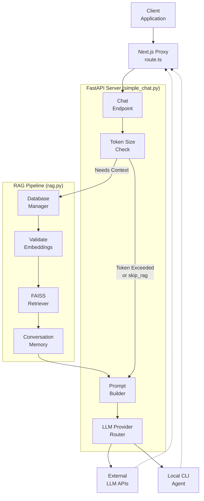

# RAG 기반 질의응답 (RAG-based Question Answering)

## Overview
본 문서는 로컬 코드베이스 및 원격 Repository에 대한 RAG 기반 질의응답 시스템의 아키텍처와 핵심 구현을 설명합니다. 이 시스템은 Next.js 기반의 Frontend Proxy를 거쳐 FastAPI 기반의 Backend 서버에서 다중 LLM Provider와 통신하며, AdalFlow 프레임워크를 확장한 RAG 파이프라인을 통해 문맥(Context) 기반의 응답을 스트리밍(Streaming) 방식으로 반환합니다.

**Source Files:**
- `src/app/api/chat/stream/route.ts`
- `api/simple_chat.py`
- `api/rag.py`

## Architecture Diagram

## System Components

### 1. Client Proxy & Streaming (`src/app/api/chat/stream/route.ts`)
Next.js 환경에서 WebSocket 연결이 불가능할 경우를 대비한 HTTP Fallback Proxy입니다. Frontend의 질의 요청을 Backend로 전달하고, 반환되는 Server-Sent Events(SSE)를 클라이언트 측으로 중계합니다.
- **Route Handler**: `POST` 요청을 수신하여 `TARGET_SERVER_BASE_URL`의 `/chat/completions/stream` Endpoint로 Body를 전달합니다.
- **Stream Processing**: Backend의 응답을 `ReadableStream` 객체로 읽어 들여 `text/event-stream` 형태로 클라이언트에게 실시간으로 청크(Chunk)를 스트리밍합니다.
- **Cache-Control**: `no-cache, no-transform` 헤더를 설정하여 스트리밍 데이터가 네트워크 계층이나 프록시 단계에서 버퍼링되지 않도록 보장합니다.

### 2. Chat API Endpoint (`api/simple_chat.py`)
FastAPI 프레임워크를 기반으로 구성된 메인 채팅 라우터입니다. 클라이언트로부터 `ChatCompletionRequest` 데이터 모델을 수신하여 RAG 문서 검색, Prompt 생성, LLM 라우팅 및 스트리밍을 오케스트레이션합니다.
- **Token Limits Management**: 입력 메시지의 Token 크기를 `count_tokens` 함수로 계산하여, 8000 토큰을 초과할 경우 RAG 검색에 따른 토큰 초과를 막기 위해 경고를 발생시키거나 `skip_rag` 속성을 판단합니다.
- **Context Retrieval**: 지정된 `filePath` 및 사용자 Query를 기반으로 `RAG` 객체를 호출하여 문서를 검색하고, File Path 단위로 묶어 포맷팅된 Context 문서를 생성합니다.
- **Deep Research Integration**: 대화 목록 내 `[DEEP RESEARCH]` 태그를 감지하면, 연구 Iteration 단계에 따라 동적인 시스템 프롬프트(`DEEP_RESEARCH_FIRST_ITERATION_PROMPT`, `DEEP_RESEARCH_FINAL_ITERATION_PROMPT` 등)를 주입합니다.
- **Multi-Provider Routing**: Google, OpenAI, Ollama, OpenRouter, Bedrock, Azure, Dashscope 등 다양한 Provider의 API 규격으로 입력을 변환(`convert_inputs_to_api_kwargs`)하여 전송합니다. `use_cli`가 활성화된 경우 `localwiki-agent` 바이너리를 Subprocess로 실행해 스트리밍 결과를 파싱합니다.
- **Fallback Strategy**: 모델 API 호출 중 Token Limit 관련 에러가 감지되면, 주입된 문맥(Context)을 제거한 Simplified Prompt 구조로 자동 재시도하는 복구 로직이 적용되어 있습니다.

### 3. RAG Pipeline (`api/rag.py`)
AdalFlow 프레임워크를 상속받아 구현된 문서 검색 및 대화 메모리 관리 모듈입니다. Repository에서 추출된 코드 및 문서들의 Vector 임베딩 값을 기반으로 유사도를 계산합니다.
- **Memory Management (`Memory`)**: `CustomConversation` 객체와 `DialogTurn` 클래스를 활용하여 대화 내역(History)을 관리합니다. 내부 리스트 할당 참조 범위 초과(Index Out of Range) 오류를 방지하기 위해 `append_dialog_turn` 및 Exception 기반의 복구 매커니즘을 지원합니다.
- **Embedding Validation (`_validate_and_filter_embeddings`)**: 추출된 문서(`transformed_docs`)들 사이의 임베딩 Vector Size(Dimension) 빈도를 조사하고, 가장 많이 존재하는 Target Size와 불일치하는 이상 Vector를 사전 필터링합니다. 이는 FAISS 인덱스 생성 시 발생할 수 있는 충돌을 예방합니다.
- **Retriever Initialization (`prepare_retriever`)**: 사용자가 지정한 포함/제외 필터(`excluded_dirs`, `included_files` 등)를 반영하여 Database를 메모리에 적재하고, 필터링이 완료된 정상 문서를 기반으로 `FAISSRetriever`를 초기화합니다.
- **Embedder Compatibility Patch**: Ollama Embedder의 단일 문자열 제약 조건을 해결하기 위해, `single_string_embedder` Wrapper를 생성하여 List 형태의 입력을 강제로 1개의 텍스트 형태로 주입하도록 설계되었습니다.
