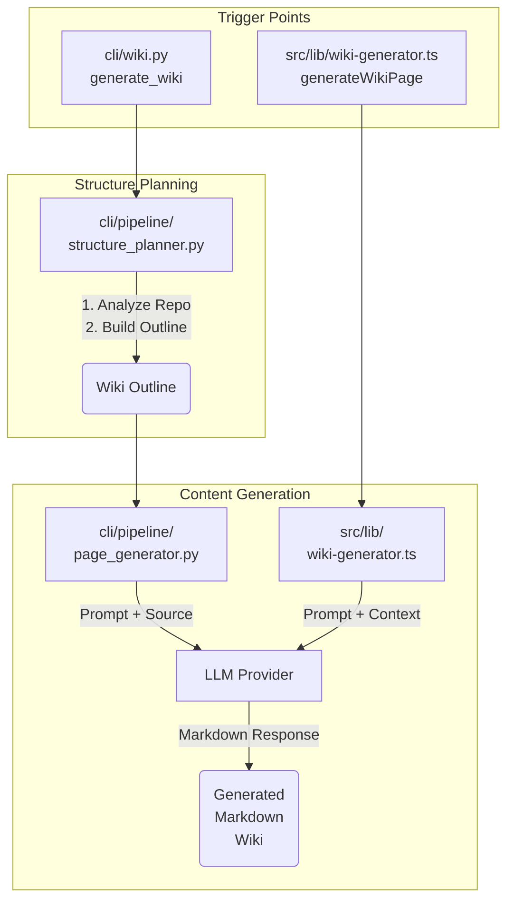

이 문서는 `cli/wiki.py`, `cli/pipeline/page_generator.py`, `cli/pipeline/structure_planner.py`, 그리고 `src/lib/wiki-generator.ts` 파일들을 바탕으로 **위키 자동 생성 (Wiki Auto-generation)** 프로세스와 아키텍처에 대해 상세히 설명합니다.

---

## Overview

위키 자동 생성 프로세스는 소스 코드를 분석하고 모델을 호출하여 구조화된 Markdown 문서를 자동으로 생성하는 워크플로우를 의미합니다. Python 기반의 CLI 툴체인과 TypeScript 기반의 백엔드 서비스(Next.js)가 협력하여 작동합니다.

전체적인 파이프라인은 크게 두 가지 관점에서 접근할 수 있습니다.
1. **CLI 기반 파이프라인:** `cli/wiki.py`를 진입점으로 하여 소스 코드의 전반적인 구조를 계획(`structure_planner.py`)하고 각 페이지를 생성(`page_generator.py`)합니다.
2. **Web API 기반 파이프라인:** Next.js API 라우트를 통해 호출되는 `src/lib/wiki-generator.ts`가 개별 파일이나 디렉토리에 대한 문서를 생성합니다.

---

## Architecture & Flow

다음은 위키 생성 파이프라인의 핵심 컴포넌트 간의 상호작용을 나타내는 Mermaid 다이어그램입니다.

---

## Component Analysis

### 1. 진입점: `cli/wiki.py`
CLI 환경에서 위키 생성을 트리거하는 메인 모듈입니다. 디렉토리 경로, 모델 설정, 출력 경로 등을 인자로 받아 파이프라인을 초기화하고 실행합니다.
- `StructurePlanner`를 호출하여 전체 위키의 목차(Outline)를 구성합니다.
- 구성된 목차를 바탕으로 `PageGenerator`를 인스턴스화하여 개별 페이지 생성을 오케스트레이션합니다.

### 2. 구조 설계: `cli/pipeline/structure_planner.py`
저장소(Repository)의 구조를 분석하여 위키의 뼈대를 생성하는 역할을 담당합니다.
- 소스 코드 디렉토리 트리를 순회하며 주요 컴포넌트, 모듈, 그리고 아키텍처 패턴을 파악합니다.
- 파악된 정보를 바탕으로 어떤 문서들(예: Overview, Architecture, Component Breakdown)이 필요한지 논리적인 계층 구조(Outline)를 설계합니다.
- 이 단계의 출력물은 이후 페이지 생성기가 각 문서를 작성하기 위한 로드맵 역할을 합니다.

### 3. 페이지 생성: `cli/pipeline/page_generator.py`
`structure_planner.py`에서 생성된 Outline을 바탕으로 실제 Markdown 콘텐츠를 생성하는 핵심 모듈입니다.
- **Context Gathering:** 대상 파일들의 소스 코드를 읽고, 의존성 정보를 추출하여 LLM에 제공할 컨텍스트를 구성합니다.
- **Prompt Engineering:** 추출된 컨텍스트와 Outline 정보를 조합하여 LLM에게 전달할 프롬프트를 생성합니다.
- **LLM Interaction:** 설정된 Provider(예: OpenAI, Anthropic)의 API를 호출하여 콘텐츠 생성을 요청합니다.
- **Post-processing:** LLM이 반환한 응답(주로 Markdown 포맷)을 파싱하고 검증하여 최종 파일로 저장합니다.

### 4. 웹 API 통합: `src/lib/wiki-generator.ts`
Next.js 백엔드 환경에서 위키 페이지 생성을 처리하는 TypeScript 모듈입니다. 주로 프론트엔드에서의 실시간 요청이나 단일 파일 대상의 문서 생성에 사용됩니다.
- `generateWikiPage` 등의 함수를 통해 특정 파일 경로에 대한 문서 생성을 요청받습니다.
- 내부적으로 파일 시스템(또는 GitHub API 등 설정된 Source Tracker)에 접근하여 파일 내용을 가져옵니다.
- 프롬프트를 구성하고 LLM API를 호출하는 로직이 포함되어 있으며, Python 파이프라인(`page_generator.py`)과 유사한 역할을 웹 환경에 맞게 수행합니다.

---

## Conclusion

Local Deepwiki의 위키 자동 생성 시스템은 대규모 코드베이스에 대해 `structure_planner.py`를 활용한 체계적인 문서 구조화(Top-down)와, `page_generator.py` 및 `wiki-generator.ts`를 활용한 디테일한 콘텐츠 생성(Bottom-up)을 결합하여 고품질의 Markdown 문서를 자동으로 생산해냅니다.
