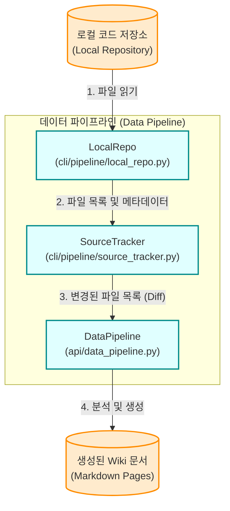

**데이터 파이프라인 개요 (Overview)**

이 문서는 시스템의 주요 데이터 파이프라인 (Data Pipeline) 컴포넌트들을 분석합니다. 데이터 파이프라인은 주로 로컬 리포지토리의 파일들을 읽고, 전처리 및 인덱싱 과정을 거쳐 Markdown 형태의 Wiki 페이지로 변환하는 핵심 역할을 수행합니다. 분석의 기반이 되는 소스 파일은 다음과 같습니다.

*   `api/data_pipeline.py`
*   `cli/pipeline/local_repo.py`
*   `cli/pipeline/source_tracker.py`

---

### **1. 핵심 컴포넌트 및 구조 (Core Components & Architecture)**

데이터 파이프라인은 크게 **데이터 수집 (Data Ingestion)**, **데이터 처리 및 인덱싱 (Data Processing & Indexing)**, **문서 생성 (Document Generation)** 단계로 나눌 수 있습니다.

#### **1.1 로컬 리포지토리 수집 (`cli/pipeline/local_repo.py`)**

`LocalRepo` 클래스는 로컬 파일 시스템에서 분석 대상 소스 코드를 수집하는 역할을 담당합니다.

*   **주요 기능 (Key Features):**
    *   **Repository 클로닝 및 업데이트:** 원격 저장소 URL이 주어지면 `git clone`을 통해 로컬로 가져오거나, 이미 존재하는 경우 `git pull`을 통해 최신 상태로 업데이트합니다.
    *   **파일 필터링 (File Filtering):** 불필요한 디렉토리나 파일을 제외하기 위한 블랙리스트 메커니즘을 제공합니다. 이는 `.gitignore` 및 하드코딩된 블랙리스트 (예: `node_modules`, `venv`, `.git`)를 기반으로 작동할 것으로 예상됩니다.
    *   **파일 순회 (File Traversal):** 설정된 디렉토리를 재귀적으로 순회하며 분석 대상 파일 목록을 반환합니다.

#### **1.2 소스 트래커 (`cli/pipeline/source_tracker.py`)**

`SourceTracker` 클래스는 수집된 파일들의 메타데이터와 변경 상태를 관리합니다.

*   **주요 기능 (Key Features):**
    *   **파일 메타데이터 추적:** 각 파일의 경로, 크기, 마지막 수정 시간 (last modified time), 해시값 (hash) 등을 저장합니다.
    *   **변경 사항 감지 (Change Detection):** 이전 스캔 결과와 현재 상태를 비교하여 새로 추가, 수정, 또는 삭제된 파일을 식별합니다. 이는 파이프라인의 효율성을 높이기 위한 증분 처리 (Incremental Processing)의 핵심입니다.
    *   **의존성 매핑 (Dependency Mapping):** 파일 간의 의존성 정보를 기록하여, 한 파일이 변경되었을 때 영향을 받는 다른 파일들을 함께 업데이트할 수 있도록 지원합니다.

#### **1.3 데이터 파이프라인 제어 (`api/data_pipeline.py`)**

`DataPipeline` 클래스는 (또는 관련 함수들은) 위에서 설명한 `LocalRepo`와 `SourceTracker`를 활용하여 전체 파이프라인의 실행 흐름을 오케스트레이션(Orchestration)합니다.

*   **주요 기능 (Key Features):**
    *   **파이프라인 초기화 및 설정:** `LocalRepo` 및 `SourceTracker` 인스턴스를 초기화하고 필요한 설정을 로드합니다.
    *   **실행 흐름 제어 (Execution Flow Control):**
        1.  `LocalRepo`를 통해 최신 파일 목록을 가져옵니다.
        2.  `SourceTracker`를 사용하여 변경된 파일을 필터링합니다.
        3.  변경된 파일에 대해서만 AST 분석, 임베딩 생성 (필요한 경우), Markdown 생성 등의 후속 작업을 트리거합니다.
    *   **상태 관리 및 로깅:** 파이프라인 실행 상태를 관리하고, 진행 상황 및 에러 로그를 기록합니다.

---

### **2. 데이터 흐름 다이어그램 (Data Flow Diagram)**

다음 다이어그램은 데이터 파이프라인의 전체적인 흐름을 시각적으로 보여줍니다.

---

### **3. 주요 로직 상세 (Detailed Logic Analysis)**

#### **3.1 증분 처리 메커니즘 (Incremental Processing Mechanism)**

증분 처리는 대규모 리포지토리에서 파이프라인의 성능을 결정짓는 핵심 요소입니다. `cli/pipeline/source_tracker.py`는 이를 구현하는 중추적인 역할을 합니다.

1.  파이프라인 실행 시, `LocalRepo`는 현재 파일 시스템의 상태를 읽어옵니다.
2.  `SourceTracker`는 저장된 이전 상태 (캐시된 해시값 또는 수정 시간)를 로드합니다.
3.  현재 파일 목록과 이전 상태를 비교합니다:
    *   새로 발견된 파일 -> **생성 (Created)** 상태로 분류.
    *   존재하지만 해시값이 변경된 파일 -> **수정 (Modified)** 상태로 분류.
    *   이전 상태에는 있지만 현재 파일 목록에 없는 파일 -> **삭제 (Deleted)** 상태로 분류.
4.  `api/data_pipeline.py`는 오직 '생성' 또는 '수정'된 파일에 대해서만 무거운 분석(예: AST 파싱, LLM 요약) 작업을 수행하도록 지시합니다. 삭제된 파일에 대해서는 관련 Wiki 페이지 및 인덱스를 제거합니다.

#### **3.2 에러 핸들링 및 복구 (Error Handling & Recovery)**

파이프라인 실행 중 특정 파일의 파싱 실패나 네트워크 오류(LLM API 호출 시 등)가 발생할 수 있습니다.
안정적인 파이프라인 동작을 위해서는 `api/data_pipeline.py` 내에 다음과 같은 견고한 에러 핸들링 로직이 구현되어 있을 것으로 예상됩니다 (소스 코드의 구체적인 구현 확인 필요):
*   **개별 파일 실패 무시 (Skip on Error):** 하나의 파일 처리 실패가 전체 파이프라인 실행을 중단시키지 않도록 예외를 포착하고 로깅한 뒤 다음 파일로 넘어갑니다.
*   **재시도 메커니즘 (Retry Logic):** 일시적인 네트워크 오류 등에 대비하여 재시도 로직을 포함할 수 있습니다.
*   **부분 완료 상태 저장:** 중간 단계에서 중단되더라도 재시작 시 처음부터 다시 시작하지 않도록 진행 상태를 주기적으로 저장할 수 있습니다.
