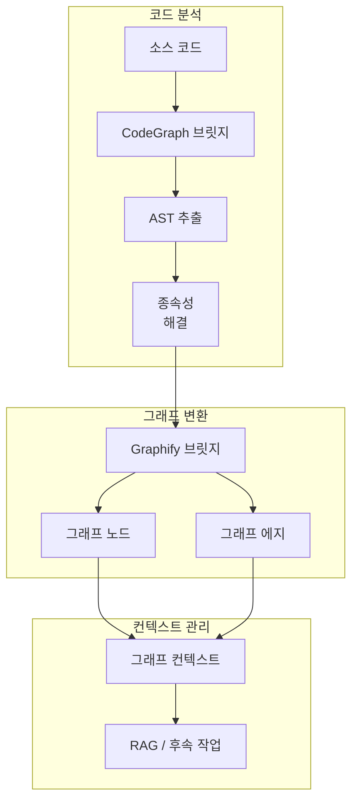
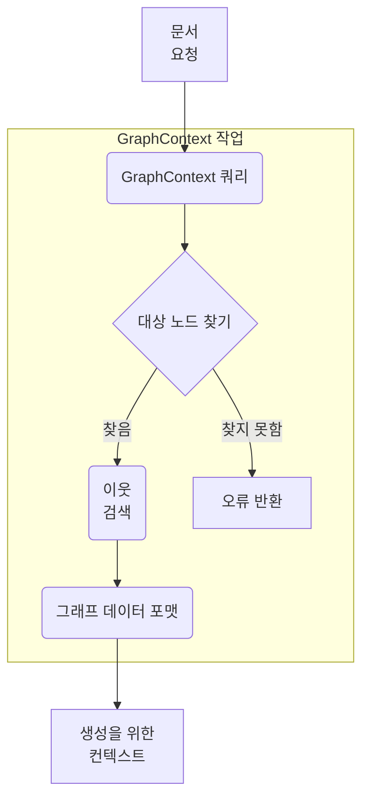

**인덱싱 엔진 (Indexing Engine)**은 `local-deepwiki` 아키텍처 내의 핵심 구성 요소로, 코드베이스를 분석하고 구조적 관계를 추출하며 원시 코드와 지식 그래프 표현 사이의 격차를 해소하는 역할을 합니다. 이 엔진을 통해 시스템은 리포지토리 내의 복잡한 종속성과 컨텍스트를 이해할 수 있습니다.

인덱싱 기능은 주로 다음 세 가지 핵심 모듈에 걸쳐 구현됩니다:

1.  **`cli/indexer/codegraph_bridge.py`**: 외부 코드 그래프 생성 도구와의 통합을 관리합니다.
2.  **`cli/indexer/graphify_bridge.py`**: 원시 코드 구조를 그래프 형식으로 변환하는 작업을 처리합니다.
3.  **`cli/indexer/graph_context.py`**: 생성된 그래프 데이터의 런타임 컨텍스트 및 상태를 관리합니다.

---

### 아키텍처 개요

인덱싱 엔진은 원시 소스 코드 분석에서 구조화된 그래프 표현으로 전환되는 파이프라인으로 작동합니다. 이 프로세스에는 추상 구문 트리(AST) 추출, 엔터티(클래스, 함수, 변수) 식별, 이들의 관계(호출, 상속) 결정, 그리고 이 데이터를 RAG(검색 증강 생성) 또는 문서 생성과 같은 후속 작업을 위한 사용 가능한 그래프 컨텍스트로 포맷팅하는 작업이 포함됩니다.

---

### 구성 요소 세부 정보

#### 1. CodeGraph Bridge (`cli/indexer/codegraph_bridge.py`)

이 모듈은 초기 분석기 역할을 합니다. 소스 코드를 구문 분석하고 의미 있는 구조적 정보를 추출하는 역할을 담당합니다. 이 모듈은 시스템을 초기 코드 표현을 생성하는 하위 수준의 구문 분석 도구 또는 라이브러리에 연결합니다.

**주요 책임:**
*   **소스 구문 분석**: 프로그래밍 언어에 따라 원시 파일을 가져와 구문을 해석합니다.
*   **엔터티 추출**: 모듈, 클래스 및 함수와 같은 주요 구성 요소를 식별합니다.
*   **관계 매핑**: 함수 호출, 임포트, 상속 체인 등 엔터티가 상호 작용하는 방식을 결정합니다.

*(참고: 특정 구현 세부 정보는 `tree-sitter` 또는 네이티브 Python `ast`와 같이 이 브릿지에서 사용하는 기본 라이브러리에 따라 다릅니다.)*

#### 2. Graphify Bridge (`cli/indexer/graphify_bridge.py`)

`codegraph_bridge.py`가 원시 구조적 데이터를 추출하면 `graphify_bridge.py`가 이를 인계받습니다. 이 구성 요소는 코드 구조의 내부 표현을 공식화된 그래프 모델로 변환합니다.

**주요 책임:**
*   **노드 생성**: 추출된 엔터티(예: 특정 Python 클래스)를 별개의 그래프 노드로 변환합니다.
*   **에지 생성**: 관계(예: 클래스 A가 클래스 B에서 상속됨)를 노드를 연결하는 방향성 에지로 변환합니다.
*   **속성 할당**: 메타데이터(파일 경로, 줄 번호 또는 독스트링 등)를 노드 및 에지에 속성으로 연결합니다.

이러한 변환은 코드베이스를 네트워크로 표현하는 데 필수적이며, "이 특정 데이터베이스 메서드를 호출하는 모든 함수 찾기"와 같은 복잡한 쿼리를 가능하게 합니다.

#### 3. Graph Context (`cli/indexer/graph_context.py`)

`graph_context.py` 모듈은 상태를 관리하고 생성된 그래프를 쿼리할 수 있는 인터페이스를 제공합니다. 런타임 동안 인덱싱된 데이터를 위한 인메모리 또는 영구 저장소 역할을 합니다.

**주요 책임:**
*   **상태 관리**: `Graphify Bridge`에서 생성된 노드와 에지를 보관합니다.
*   **쿼리 인터페이스**: 그래프를 탐색하고, ID 또는 속성별로 특정 노드를 검색하며, 엔터티 간의 경로를 찾기 위한 메서드를 제공합니다.
*   **컨텍스트 프로비저닝**: 생성 파이프라인에 필요한 컨텍스트 정보를 제공합니다(예: 특정 모듈에 대한 위키 페이지를 생성할 때 해당 모듈의 모든 종속성 및 종속된 항목 제공).

### 워크플로우 예시

사용자가 특정 모듈에 대한 문서를 요청하면 인덱싱 엔진은 다음 흐름을 수행합니다:

