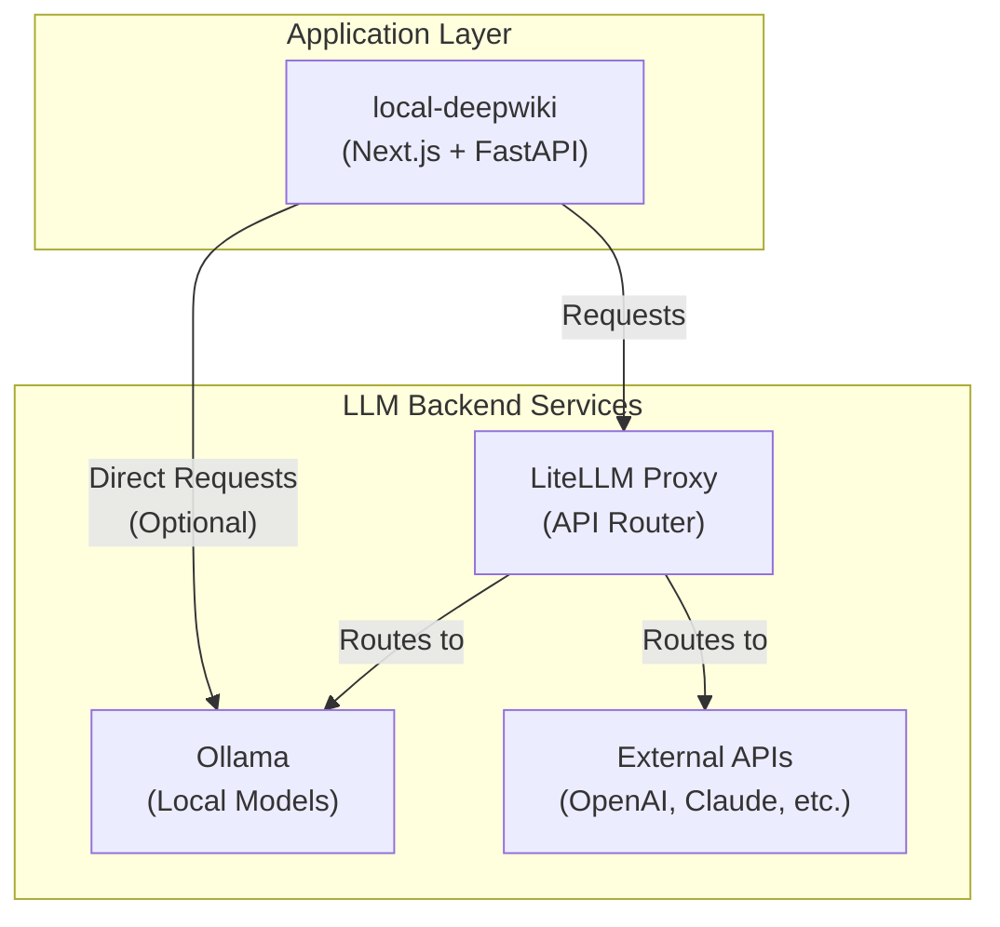

이 프로젝트의 Docker 기반 배포 환경은 컨테이너화를 통해 다양한 백엔드 서비스와 애플리케이션 프론트엔드/API를 유연하게 구성할 수 있도록 지원합니다.

### Overview

배포는 크게 애플리케이션 코어와 LLM 프록시/엔진 서비스로 나뉘며, 제공된 Dockerfile과 docker-compose 파일을 조합하여 다양한 배포 시나리오를 구성할 수 있습니다.

-   **`Dockerfile`**: Node.js 기반 애플리케이션 프론트엔드와 Python API(Uvicorn)를 함께 실행하는 복합 컨테이너 빌드 파일입니다. (참조: `Dockerfile`)
-   **`docker-compose.yml`**: 애플리케이션 코어(Next.js/Python API)를 단일 서비스로 배포하는 기본 구성 파일입니다. (참조: `docker-compose.yml`)
-   **`Dockerfile-litellm` & `docker-compose-litellm.env` / `docker-compose-litellm.yml`**: LiteLLM 프록시 서비스를 배포하기 위한 환경 및 구성 파일입니다. (참조: `Dockerfile-litellm`, `docker-compose-litellm.yml`)
-   **`Dockerfile-ollama-local`**: Ollama 기반의 로컬 LLM을 실행하는 컨테이너 환경을 구성합니다. (참조: `Dockerfile-ollama-local`)

### Deployment Architecture

이 프로젝트의 Docker 아키텍처는 유연성을 강조합니다. 사용자는 기본 앱만 실행하거나, LiteLLM 프록시를 통해 다양한 모델 API를 통합하거나, 완전 로컬 환경을 위해 Ollama를 추가할 수 있습니다.



### Components Details

#### 1. Application Container (`Dockerfile`, `docker-compose.yml`)

`Dockerfile`은 다단계 빌드(multi-stage build) 패턴을 사용하여 Next.js 정적 파일과 Python 기반 API 서버(FastAPI/Uvicorn)를 단일 이미지로 통합합니다.

-   **Base Image**: `node:18-alpine`과 `python:3.11-slim` (혹은 빌더 이미지)의 조합을 통해 프론트엔드 빌드 아티팩트를 파이썬 환경으로 복사하여 호스팅합니다. (구체적인 베이스 이미지는 프로젝트 버전에 따라 달라질 수 있으나, 전형적인 Next.js + Python API 구조를 따릅니다.)
-   **Execution**: `run.sh` 스크립트를 통해 백엔드 Uvicorn 서버와 프론트엔드 서버를 동시에 시작합니다.
-   **Compose Configuration (`docker-compose.yml`)**:
    -   `local-deepwiki` 서비스 하나로 구성되며, 포트 매핑(예: 3000:3000)을 통해 호스트에서 접근 가능하도록 설정합니다.
    -   환경 변수 파일(`.env`)과 호스트의 위키 출력 디렉토리(`./wiki-out`)를 볼륨 마운트하여 영속성을 보장합니다.

#### 2. LiteLLM Proxy (`Dockerfile-litellm`, `docker-compose-litellm.yml`)

다양한 LLM API(OpenAI, Anthropic, Azure 등)를 단일 인터페이스로 라우팅하는 LiteLLM 서비스를 제공합니다.

-   **`Dockerfile-litellm`**: LiteLLM 실행을 위한 환경을 설정하며, 커스텀 설정 파일(`litellm-config.yml`)을 포함할 수 있도록 구성됩니다.
-   **`docker-compose-litellm.yml`**:
    -   기본 애플리케이션(`local-deepwiki`) 서비스와 함께 LiteLLM 프록시 서비스를 정의합니다.
    -   애플리케이션 컨테이너는 LiteLLM 프록시를 통해 모델에 접근하도록 환경 변수(예: `OPENAI_API_BASE=http://litellm:4000`)가 구성됩니다.
    -   `docker-compose-litellm.env` 파일을 통해 API 키 및 기타 시크릿을 관리합니다.

#### 3. Local LLM Service (`Dockerfile-ollama-local`)

완전한 오프라인 환경이나 로컬 모델 실행이 필요한 경우 `Dockerfile-ollama-local`을 사용하여 환경을 구성할 수 있습니다.

-   **Ollama Image**: 주로 공식 `ollama/ollama` 이미지를 기반으로 하며, 필요에 따라 초기 모델 다운로드 스크립트를 포함할 수 있습니다.
-   **Integration**: 애플리케이션은 LiteLLM을 거치거나 직접 로컬 Ollama 엔드포인트(예: `http://ollama:11434`)로 요청을 보낼 수 있습니다.

### Running Deployment Options

배포 시나리오에 따라 적절한 docker-compose 파일을 선택하여 실행합니다.

**1. Basic Application (No internal proxy)**
외부 API 키(예: OpenAI)를 직접 애플리케이션(`.env`)에 설정하여 사용하는 경우:
```bash
docker-compose up -d --build
```

**2. Application with LiteLLM Proxy**
여러 모델 API를 라우팅하거나 로드 밸런싱이 필요한 경우:
```bash
docker-compose -f docker-compose-litellm.yml up -d --build
