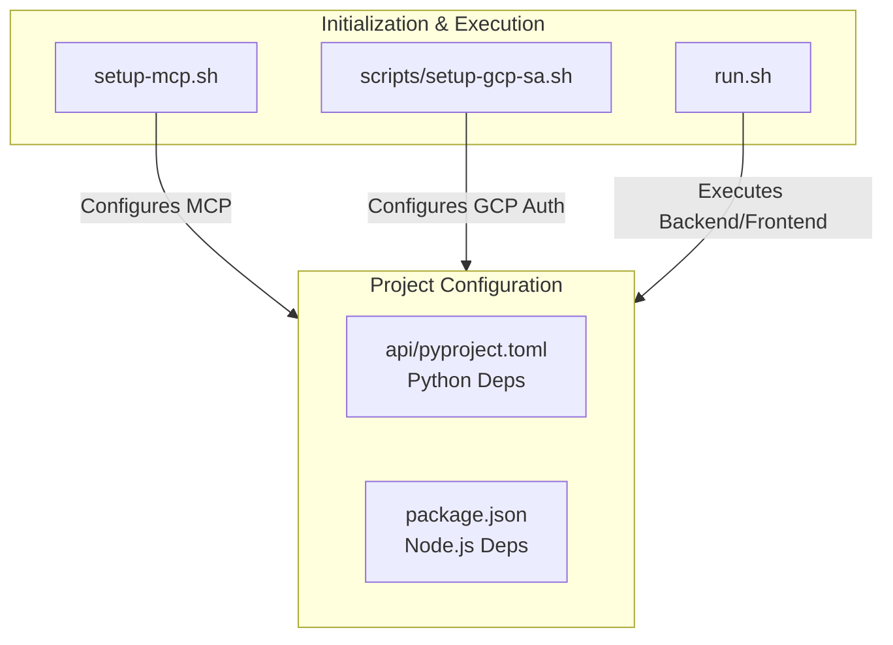

# 스크립트 및 설정 (Scripts and Configuration)

본 위키 페이지는 `local-deepwiki` 프로젝트의 주요 실행 스크립트(`run.sh`, `setup-mcp.sh`, `scripts/setup-gcp-sa.sh`)와 의존성 및 프로젝트 설정 파일(`api/pyproject.toml`, `package.json`)에 대해 설명합니다.

---

## 1. 개요 (Overview)

이 프로젝트는 Python 기반의 백엔드(API)와 Node.js 기반의 프론트엔드/에이전트 환경으로 구성됩니다. 환경 설정 및 실행을 자동화하기 위해 여러 쉘 스크립트가 제공되며, 패키지 매니저로 `poetry` (Python) 및 `npm`/`pnpm` (Node.js)을 사용합니다.

---

## 2. 실행 스크립트 (Execution Scripts)

### 2.1. `run.sh`
- **역할**: 프로젝트의 핵심 컴포넌트들을 구동하는 통합 실행 스크립트일 가능성이 높습니다. (백엔드 서버, 프론트엔드 개발 서버 등 동시 실행)
- **Source**: `run.sh`

### 2.2. `setup-mcp.sh`
- **역할**: MCP (Model Context Protocol) 환경 설정을 자동화하는 스크립트입니다. 필요한 환경 변수 설정이나 설정 파일(`config/mcp-config.yaml.example` 기반) 생성을 수행할 수 있습니다.
- **Source**: `setup-mcp.sh`

### 2.3. `scripts/setup-gcp-sa.sh`
- **역할**: Google Cloud Platform (GCP) Service Account (SA) 인증을 위한 스크립트입니다. Google Embedder (`google_embedder_client.py`) 등 GCP 서비스 연동을 위한 인증 키 파일(`secrets/gcp-sa-key.json`) 설정을 돕는 역할을 할 것으로 예상됩니다.
- **Source**: `scripts/setup-gcp-sa.sh`

---

## 3. 프로젝트 설정 파일 (Project Configuration Files)

### 3.1. `api/pyproject.toml`
- **역할**: 백엔드 API (FastAPI 또는 기타 Python 프레임워크 기반 추정)의 의존성 관리 및 프로젝트 메타데이터 정의 파일입니다.
- **사용 도구**: `poetry`
- **주요 구성 요소**:
  - `[tool.poetry.dependencies]`: LiteLLM, FastAPI, Pydantic 등 AI 모델 연동 및 API 서버 구동에 필요한 핵심 라이브러리 목록이 포함되어 있을 것입니다.
  - 빌드 시스템 요구사항.
- **Source**: `api/pyproject.toml`

### 3.2. `package.json`
- **역할**: 프론트엔드 애플리케이션(`src/app` 구조로 보아 Next.js 프로젝트) 및 기타 Node.js 기반 도구의 의존성, 스크립트 정의 파일입니다.
- **주요 구성 요소**:
  - `scripts`: `dev`, `build`, `start`, `lint` 등의 실행 명령어.
  - `dependencies`: React, Next.js, Tailwind CSS 등 UI 렌더링을 위한 라이브러리.
  - `devDependencies`: ESLint, TypeScript 등 개발 환경 도구.
- **Source**: `package.json`
