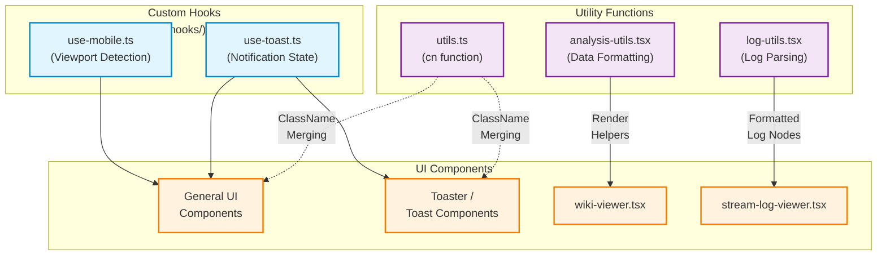

이 위키 페이지는 `local-deepwiki` 프로젝트에서 사용되는 커스텀 훅(Custom Hooks)과 유틸리티(Utilities) 함수의 구조, 목적, 그리고 상호 작용을 설명합니다.

### Overview

`src/hooks`와 `src/lib` 디렉토리에는 UI 컴포넌트 전반에서 재사용되는 핵심 로직들이 포함되어 있습니다. 이 파일들은 상태 관리, 사이드 이펙트 처리, 데이터 변환, 그리고 공통적인 UI 동작을 추상화하여 코드의 가독성과 유지보수성을 높입니다.

주요 구성 요소는 다음과 같습니다:
- **UI Hooks**: 모바일 환경 감지 및 알림(Toast) 관리.
- **Utilities**: 클래스 이름 병합, 데이터 분석 시각화, 로그 포맷팅.

---

### Custom Hooks

#### 1. `use-mobile.ts` (`src/hooks/use-mobile.ts`)
React 컴포넌트가 현재 모바일 뷰포트 크기인지 감지하는 커스텀 훅입니다. 반응형 디자인(Responsive Design)을 구현할 때 JavaScript 레벨에서 조건부 렌더링이 필요한 경우 사용됩니다.

- **기능**: 창 크기(Window Size) 변화를 리스닝(Listen)하여 설정된 Breakpoint(일반적으로 768px 이하)를 기준으로 `boolean` 값을 반환합니다.
- **주요 활용**: 사이드바 숨김/표시, 모바일 전용 UI 렌더링.

#### 2. `use-toast.ts` (`src/hooks/use-toast.ts`)
Shadcn UI 라이브러리 패턴을 따르는 Toast 알림 관리 훅입니다. 전역 상태를 관리하여 애플리케이션 어디서든 알림을 띄울 수 있도록 지원합니다.

- **기능**: 알림 생성(Push), 삭제(Dismiss), 만료(Timeout) 로직을 관리합니다.
- **상태 구조**: 현재 활성화된 Toast 목록을 상태(State)로 보유합니다.

---

### Utility Functions

#### 1. `utils.ts` (`src/lib/utils.ts`)
Tailwind CSS를 사용하는 React 프로젝트의 필수적인 클래스 이름 병합 유틸리티입니다.

- **기능 (`cn` function)**: `clsx`와 `tailwind-merge`를 결합하여 동적으로 생성된 클래스 이름 간의 충돌을 방지하고 깔끔하게 병합합니다.
- **주요 활용**: 컴포넌트의 Props로 전달된 `className`과 기본 스타일을 결합할 때 광범위하게 사용됩니다.

#### 2. `analysis-utils.tsx` (`src/lib/analysis-utils.tsx`)
분석 결과를 UI로 렌더링하기 위한 헬퍼(Helper) 함수들입니다. `tsx` 확장자를 사용하는 것으로 보아 React 엘리먼트(Element)를 반환하거나 JSX 구문을 활용하는 유틸리티로 추정됩니다.

- **기능**: 백엔드 또는 로컬 분석 엔진에서 반환된 복잡한 데이터 구조(예: AST 분석 결과, Call Graph 데이터)를 프론트엔드 컴포넌트가 렌더링하기 쉬운 형태로 변환하거나 시각화 컴포넌트 조각을 생성합니다.

#### 3. `log-utils.tsx` (`src/lib/log-utils.tsx`)
시스템 로그나 에이전트 스트림 로그를 화면에 표시하기 위한 포맷팅 및 파싱 유틸리티입니다.

- **기능**: 로그 데이터(타임스탬프, 레벨, 메시지 본문)를 파싱하고, 로그 레벨에 따른 색상이나 아이콘이 적용된 React 노드(Node)를 반환합니다. 로그 뷰어(`stream-log-viewer.tsx`) 컴포넌트에서 주로 활용될 것으로 예상됩니다.

---

### Architecture & Dependencies

다음 다이어그램은 커스텀 훅 및 유틸리티 파일들이 프로젝트 내 주요 컴포넌트와 어떻게 상호 작용하는지 보여줍니다.

### File References
*   `src/hooks/use-mobile.ts`
*   `src/hooks/use-toast.ts`
*   `src/lib/utils.ts`
*   `src/lib/analysis-utils.tsx`
*   `src/lib/log-utils.tsx`
