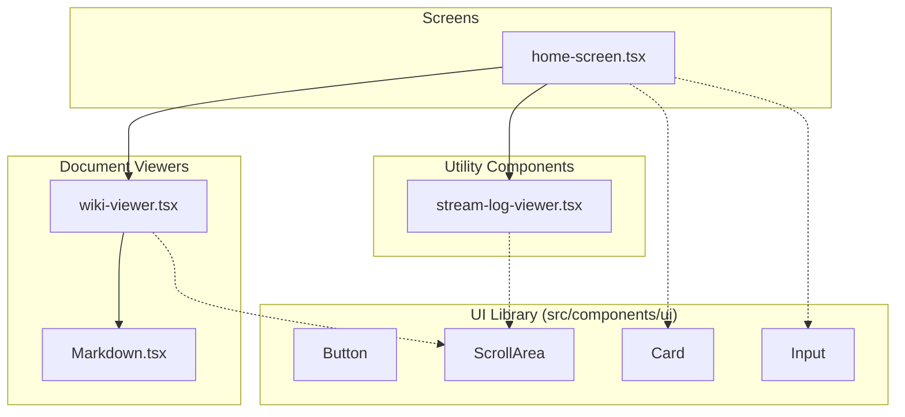

### Overview

이 위키 페이지는 `local-deepwiki` 프로젝트의 핵심 UI 컴포넌트들에 대한 분석을 제공합니다. 이 컴포넌트들은 위키 문서 렌더링, 홈 스크린 대시보드 표시, 실시간 로그 스트리밍, 그리고 공통 UI 요소 제공 등 사용자 인터페이스의 주요 기능을 담당합니다.

### Architecture / Diagram

### Components Details

#### 1. 홈 스크린 대시보드 (`src/components/home-screen.tsx`)
*   **역할**: 애플리케이션의 메인 진입점. 위키 생성 요청 폼, 최근 생성된 위키 목록, 그리고 백그라운드 작업 상태 등을 표시하는 대시보드 역할을 수행할 것으로 예상됩니다.
*   **주요 기능**: 사용자 입력을 받아 위키 생성 파이프라인을 트리거하고, `wiki-viewer.tsx` 및 `stream-log-viewer.tsx`와 상호작용하여 결과를 표시합니다.

#### 2. 위키 문서 뷰어 (`src/components/wiki-viewer.tsx`)
*   **역할**: 생성된 위키 문서(마크다운 형식)를 사용자에게 표시하는 메인 뷰어 컴포넌트입니다.
*   **주요 기능**: 문서 목차(TOC) 표시, 섹션 네비게이션, 마크다운 콘텐츠 렌더링 기능을 조율합니다. 실제 마크다운 렌더링은 `Markdown.tsx`에 위임합니다.

#### 3. 마크다운 렌더러 (`src/components/Markdown.tsx`)
*   **역할**: 마크다운 텍스트를 파싱하여 React 요소로 변환합니다.
*   **특징**: 표준 마크다운 문법뿐만 아니라, `Mermaid.tsx`와 연동하여 코드 블록 내의 Mermaid 다이어그램을 동적으로 렌더링하는 커스텀 기능을 포함할 가능성이 높습니다. 코드 하이라이팅 기능도 이곳에서 처리됩니다.

#### 4. 실시간 로그 뷰어 (`src/components/stream-log-viewer.tsx`)
*   **역할**: 위키 생성 프로세스 중 발생하는 에이전트 로그, 모델 응답, 상태 변화 등을 실시간으로 보여주는 컴포넌트입니다.
*   **주요 기능**: WebSocket이나 Server-Sent Events(SSE)를 통해 스트리밍되는 데이터를 받아 터미널 형태로 표시하며, 자동 스크롤 기능을 제공하여 최신 로그를 쉽게 확인할 수 있도록 합니다.

#### 5. 공통 UI 라이브러리 (`src/components/ui/`)
*   **역할**: 애플리케이션 전반에 걸쳐 재사용되는 기본 UI 구성 요소들의 집합입니다. shadcn/ui와 같은 컴포넌트 라이브러리를 기반으로 구축되었을 가능성이 큽니다.
*   **포함 요소**: Button, Input, Card, ScrollArea, Dialog 등 일관된 디자인 시스템을 유지하기 위한 기반 컴포넌트들이 포함되어 있습니다.
