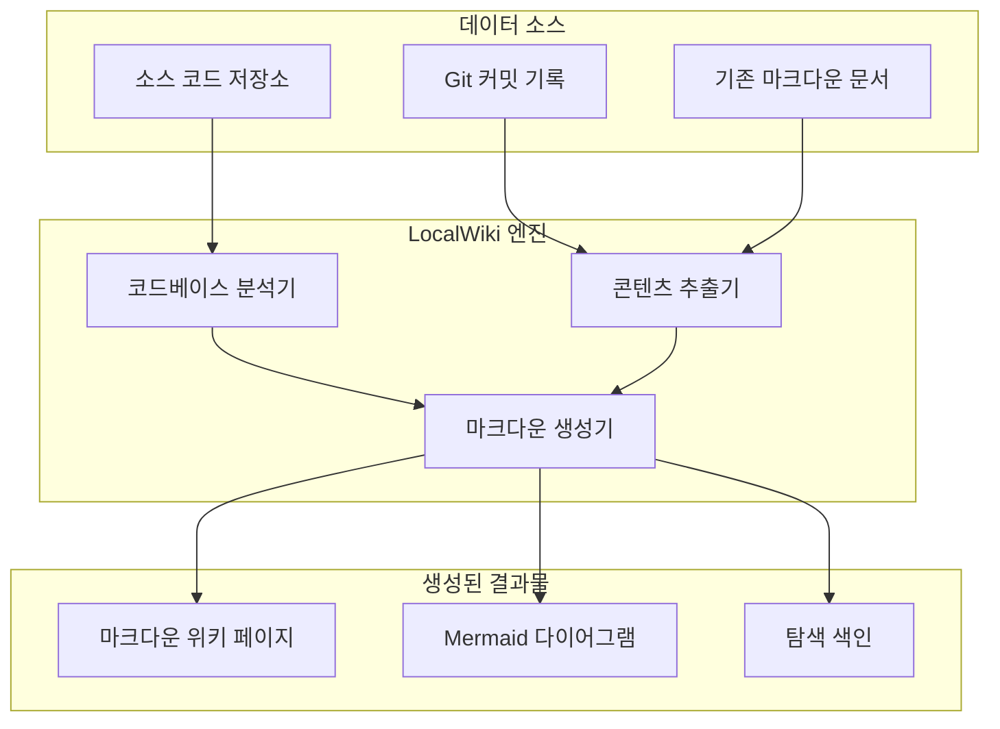

# LocalWiki 소개

## 1. 개요
LocalWiki는 로컬 프로젝트 저장소에서 포괄적인 기술 위키를 자동으로 생성하고 관리하도록 설계된 강력한 도구입니다. 소스 코드, 커밋 기록, 기존 문서를 분석하고 이를 구조화되고 탐색하기 쉬운 마크다운(Markdown) 위키로 변환하여 문서화 프로세스를 간소화합니다.

LocalWiki는 프로젝트 문서를 최신 상태로 유지하고 쉽게 접근할 수 있도록 하는 일반적인 과제를 해결합니다. 추출 및 생성 프로세스를 자동화함으로써 개발자가 항상 코드베이스의 현재 상태를 반영하는 정확한 기술 문서를 확보할 수 있도록 보장합니다.

> **출처:**
> - `README.md`
> - `README.kr.md`

---

## 2. 핵심 기능

LocalWiki는 자동화된 문서화를 위해 맞춤화된 다양한 기능을 제공합니다:

*   **자동화된 위키 생성:** 소스 파일, 커밋 로그, 기존 마크다운 파일에서 직접 정보를 추출하여 응집력 있는 위키 구조를 구축합니다.
*   **마크다운 지원:** 출력물을 표준 마크다운 형식으로만 생성하여 GitHub, GitLab 및 다양한 정적 사이트 생성기(예: Docusaurus, MkDocs)와 같은 플랫폼과의 호환성을 보장합니다.
*   **코드베이스 분석:** 프로젝트 아키텍처, 종속성 및 코드 구조를 분석하여 해당하는 다이어그램 및 아키텍처 문서를 자동으로 생성합니다.
*   **다국어 지원:** 기본 인터페이스와 출력 초점을 구성할 수 있지만, 기본적으로 다양한 프로그래밍 언어로 작성된 코드베이스를 처리합니다.

---

## 3. 시스템 아키텍처

다음 다이어그램은 LocalWiki 생성 프로세스의 고수준 아키텍처를 보여줍니다.

### 3.1 구성 요소 분석

1.  **데이터 소스 (Data Sources):** LocalWiki는 소스 코드 파일, Git 커밋 기록, 사전 존재 문서(예: `README.md` 또는 아키텍처 문서)를 포함하여 대상 저장소에서 데이터를 수집합니다.
2.  **LocalWiki 엔진 (LocalWiki Engine):** 핵심 처리 장치입니다.
    *   **분석기 (Analyzer):** 코드베이스를 스캔하여 아키텍처, 모듈 종속성 및 핵심 함수를 파악합니다.
    *   **추출기 (Extractor):** 커밋 로그와 기존 텍스트에서 관련 정보를 가져옵니다.
    *   **생성기 (Generator):** 분석 및 추출된 데이터를 종합하여 구조화된 마크다운 파일로 포맷팅합니다.
3.  **생성된 결과물 (Generated Assets):** 최종 결과물은 상호 연결된 마크다운 페이지, 자동으로 생성된 Mermaid 다이어그램(아키텍처 시각화용), 쉬운 탐색을 위한 색인으로 구성됩니다.

---

## 4. 주요 워크플로우

LocalWiki는 주로 자동화된 파이프라인을 통해 작동합니다. 일반적인 워크플로우는 다음과 같습니다:

1.  **구성 (Configuration):** 사용자가 대상 저장소 및 구성 옵션(예: 출력 디렉토리, 무시할 특정 모듈)을 지정합니다.
2.  **분석 단계 (Analysis Phase):** 도구가 저장소를 스캔하여 디렉토리 구조를 매핑하고 주요 파일을 식별합니다.
3.  **생성 단계 (Generation Phase):** 식별된 각 구성 요소에 대해 콘텐츠가 생성됩니다. 여기에는 개요 작성, API 상세화, 구조 다이어그램 생성이 포함됩니다.
4.  **게시 (Publishing):** 생성된 마크다운 파일이 지정된 출력 디렉토리에 저장되어 위키 플랫폼에서 제공하거나 로컬에서 볼 수 있도록 준비됩니다.

---

## 5. 기술 스택 고려 사항

프로젝트 구조(예: `package.json`, `tsconfig.json`, `api/`의 Python 파일)를 기반으로, LocalWiki는 백엔드 처리와 프론트엔드 인터페이스를 모두 포괄하는 최신 기술 스택을 활용합니다:

*   **백엔드 (API/처리):** Python (`requirements.txt`/`pyproject.toml` 동급 파일 및 `api.py`, `rag.py`와 같은 `api/` 내부 파일로 표시됨).
*   **프론트엔드 (인터페이스):** Node.js/React/Next.js (`package.json`, `next.config.ts`, `tailwind.config.js` 및 `src/app/` 디렉토리로 표시됨).
*   **컨테이너화:** `Dockerfile` 및 `docker-compose.yml`을 통해 Docker 지원이 제공되어 쉬운 배포 및 격리가 가능합니다.

---

## 6. 결론
LocalWiki는 자체 문서화되는 코드베이스를 향한 중요한 발걸음입니다. 아키텍처 지식과 기술적 세부 사항을 쉽게 접근할 수 있는 마크다운 위키로 추출하는 과정을 자동화함으로써 개발자의 유지 보수 부담을 줄이고 엔지니어링 팀 내의 지식 공유를 향상시킵니다.
