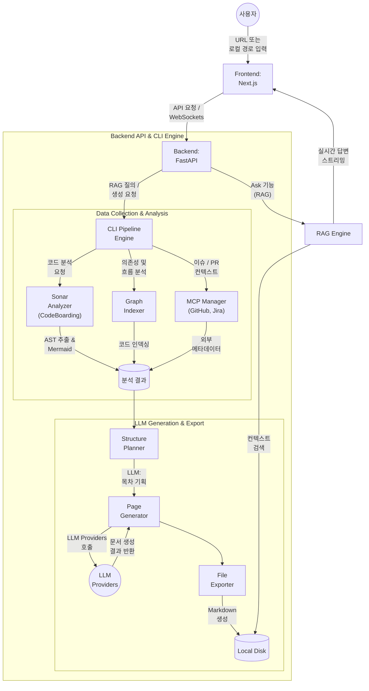

LocalWiki는 코드 분석 및 다이어그램 생성(Backend/CLI)과 대화형 UI(Frontend)를 결합한 강력한 범용 시스템입니다. 이 문서는 `docs/architecture.md` 파일에 정의된 시스템 구조를 기반으로 작성되었습니다.

### Overview

시스템 아키텍처는 사용자 입력을 처리하고 화면을 렌더링하는 Frontend, 요청을 중계하고 RAG 파이프라인을 운영하는 Backend API, 그리고 실제 코드를 정적 분석하여 문서를 생성하는 CLI Pipeline Engine으로 나누어집니다. 

### Architecture Diagram

### Components

#### Frontend
- **Path:** `src/`
- **Role:** 사용자에게 시각적 UI를 제공합니다. 저장소 URL이나 로컬 경로를 입력받아 생성된 위키 페이지를 렌더링하며, 문서 내 Mermaid 다이어그램을 표시하고 RAG 기반의 Ask 채팅 결과를 실시간 스트리밍합니다. 시스템은 Next.js 기반으로 구축되어 있습니다.

#### Backend API
- **Path:** `api/`
- **Role:** Frontend와 내부 CLI Pipeline Engine을 연결하는 브릿지 역할을 수행하는 FastAPI 기반 서버입니다.
  - **`api.py`:** 시스템의 기본 RESTful 엔드포인트를 제공합니다.
  - **`websocket_wiki.py` & `simple_chat.py`:** 위키 생성 과정의 로그와 Ask 질의응답을 실시간 WebSockets로 중계합니다.
  - **`rag.py`:** 사용자의 질문에 답변하기 위한 RAG 파이프라인을 운영합니다.

#### CLI Pipeline Engine
- **Path:** `cli/`
- **Role:** 저장소 복제, 소스 코드 분석, 컨텍스트 수집 및 최종 Markdown 파일 생성을 총괄하는 핵심 Core 엔진입니다. Frontend 종속성 없이 터미널에서 단독으로 실행할 수 있습니다.
  - **`cli/sonar/`:** 내부화된 CodeBoarding 분석 엔진을 통해 정적 분석을 수행합니다. 코드의 추상구문트리(AST)를 분석하여 클래스와 함수 간의 관계를 파악하고 시각적인 Mermaid 다이어그램 코드를 생성합니다.
  - **`cli/indexer/`:** 파일 및 모듈 간의 참조와 호출 흐름(Call Graph)을 매핑하여, LLM이 프로젝트의 전체 구조를 쉽게 파악할 수 있는 Graph Index를 생성합니다.
  - **`cli/mcp/`:** 소스 코드 분석에 더해 Jira 티켓, GitHub 이슈 및 PR 등의 외부 정보를 MCP(Multi-Context Protocol)를 통해 수집하여 생성될 문서의 품질과 컨텍스트를 보완합니다.
  - **`cli/providers/`:** Gemini, OpenAI, Claude, Ollama 등 다양한 LLM API 시스템과 통신하기 위한 일관된 어댑터 인터페이스를 제공합니다.
