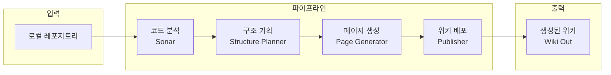

# 작업 흐름도

이 문서는 Local-Deepwiki의 핵심 작업 흐름을 설명합니다. 제공된 소스 파일(`docs/workflow.md`)을 바탕으로 작성되었으며, 전체 파이프라인의 구조와 각 단계의 역할을 명확히 보여줍니다.

## 전체 시스템 파이프라인

Local-Deepwiki는 코드베이스를 입력받아 최종적으로 브라우저에서 볼 수 있는 위키 페이지로 변환하는 일련의 과정을 거칩니다. 이 과정은 크게 코드 분석, 구조 기획, 페이지 생성, 그리고 배포의 4단계로 나눌 수 있습니다.

### 1. 코드 분석 (Sonar)

이 단계에서는 대상 저장소의 구조를 파악하고, 주요 컴포넌트 간의 의존성을 추출합니다. `cli/sonar/` 디렉토리에 위치한 도구들이 이 역할을 수행합니다.

*   **주요 모듈:** `sonar_analyzer.py`, `ast_analyzer.py`, `call_graph.py`
*   **역할:**
    *   디렉토리 트리 및 파일 목록 추출
    *   소스 코드 파싱을 통한 AST (Abstract Syntax Tree) 분석
    *   클래스, 함수, 모듈 간의 호출 관계(Call Graph) 및 상속 관계 파악
    *   의존성 추출
*   **출력:** 구조화된 코드 분석 데이터

### 2. 구조 기획 (Structure Planner)

분석된 코드 데이터를 바탕으로 위키의 목차와 페이지 구조를 기획합니다. LLM (Large Language Model)을 활용하여 논리적이고 이해하기 쉬운 위키 구조를 설계합니다.

*   **주요 모듈:** `cli/pipeline/structure_planner.py`
*   **역할:**
    *   Sonar에서 생성된 데이터를 분석
    *   전체 위키의 계층 구조 (Index, 목차) 설계
    *   각 페이지에 포함될 핵심 내용(개요, 아키텍처, 컴포넌트 설명 등) 기획
    *   페이지 간의 링크 구조 설계
*   **출력:** 위키 구조 계획서 (페이지 목록 및 각 페이지의 초안 구조)

### 3. 페이지 생성 (Page Generator)

기획된 구조를 바탕으로 실제 마크다운(Markdown) 페이지를 생성합니다. 이 단계에서도 LLM을 활용하여 각 파일의 코드, 주석, 그리고 분석된 데이터를 종합하여 사람이 읽기 쉬운 형태의 문서를 작성합니다.

*   **주요 모듈:** `cli/pipeline/page_generator.py`
*   **역할:**
    *   구조 기획에 따라 각 페이지별 상세 내용 작성
    *   소스 코드를 바탕으로 기술적 세부 사항, 사용법, API 문서 등 생성
    *   (선택적) Mermaid 다이어그램 등 시각적 요소 추가
*   **출력:** 개별 마크다운 파일들

### 4. 배포 (Publisher)

생성된 마크다운 파일들을 최종 출력 디렉토리(`wiki-out/`)에 저장하고 위키 시스템에서 접근할 수 있도록 준비합니다.

*   **주요 모듈:** `cli/pipeline/publisher.py`
*   **역할:**
    *   생성된 마크다운 문서들을 지정된 경로에 저장
    *   (필요시) 정적 사이트 생성기 등과 연동하기 위한 설정 적용
*   **출력:** 사용자에게 제공되는 최종 위키 형태

---
*소스 파일: `docs/workflow.md`*
