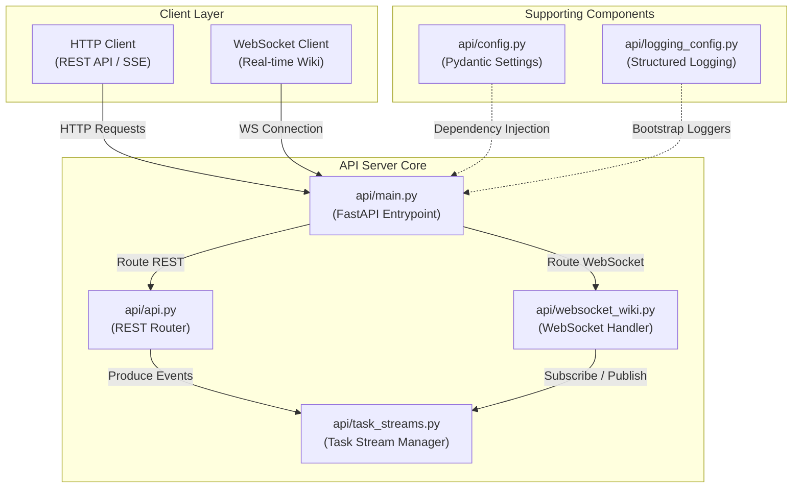
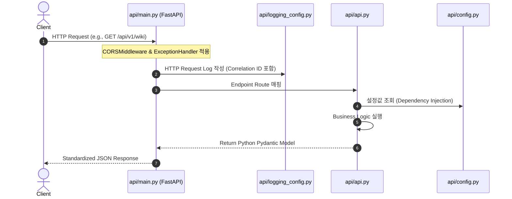
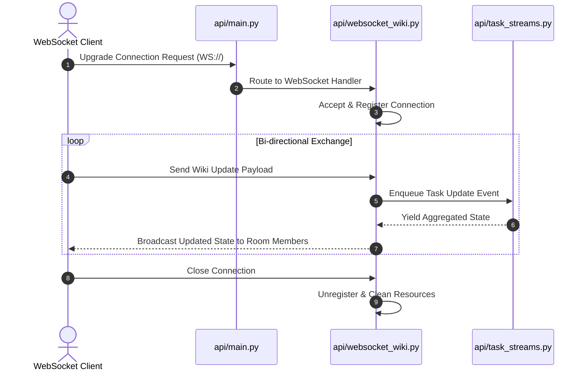

# API Server Technical Wiki

## Overview

본 문서는 시스템의 핵심 통신 및 비즈니스 로직 처리를 담당하는 **API Server**의 구조와 동작 방식을 설명하는 Technical Wiki입니다. 본 서버는 `FastAPI` 프레임워크를 기반으로 구축되었으며, 비동기(Asynchronous) 이벤트 처리, 실시간 양방향 통신, 그리고 스트리밍 데이터를 효율적으로 처리할 수 있도록 설계되었습니다.

본 API Server는 다음과 같은 주요 소스 파일들을 기반으로 구성되어 있습니다:
* **Configuration**: [api/config.py](file:///Users/jcjeong/lab/novel/api/config.py)
* **Logging Engine**: [api/logging_config.py](file:///Users/jcjeong/lab/novel/api/logging_config.py)
* **Application Entrypoint**: [api/main.py](file:///Users/jcjeong/lab/novel/api/main.py)
* **REST Routing**: [api/api.py](file:///Users/jcjeong/lab/novel/api/api.py)
* **Event Streaming**: [api/task_streams.py](file:///Users/jcjeong/lab/novel/api/task_streams.py)
* **WebSocket Interaction**: [api/websocket_wiki.py](file:///Users/jcjeong/lab/novel/api/websocket_wiki.py)

---

## Architecture and Component Layout

API Server는 Layered Architecture 패턴을 따르며, 클라이언트의 요청 타입(HTTP REST, Event Stream, WebSocket)에 따라 적절한 컴포넌트로 라우팅하여 처리합니다.



---

## Detailed Component Analysis

### 1. Configuration (`api/config.py`)
[api/config.py](file:///Users/jcjeong/lab/novel/api/config.py) 파일은 애플리케이션의 모든 환경 변수(Environment Variables) 및 런타임 설정을 중앙 집중식으로 관리합니다.

* **Core Features**:
  * `pydantic-settings` 모듈의 `BaseSettings`를 상속받아 환경 변수의 타입 검증(Type Validation)을 수행합니다.
  * 개발(Development), 테스트(Testing), 운영(Production) 환경에 따른 설정 분기를 지원합니다.
* **Key Variables**:
  * `ENV`: 현재 실행 중인 애플리케이션의 실행 환경 (`dev`, `stage`, `prod`).
  * `API_V1_STR`: REST API 라우팅을 위한 기본 Prefix (예: `/api/v1`).
  * `PROJECT_NAME`: 서비스 식별을 위한 메타데이터.
  * `CORS_ORIGINS`: Cross-Origin Resource Sharing 정책을 위한 허용 도메인 리스트.

### 2. Logging Configuration (`api/logging_config.py`)
[api/logging_config.py](file:///Users/jcjeong/lab/novel/api/logging_config.py) 파일은 분산 환경 및 컨테이너화된 환경에서 디버깅과 모니터링을 용이하게 하기 위한 Structured Logging 시스템을 정의합니다.

* **Core Features**:
  * 표준 `logging` 라이브러리를 확장하거나 `structlog` 라이브러리를 활용하여 로그를 JSON 포맷으로 직렬화합니다.
  * 콘솔 출력 시 가독성을 높이기 위해 개발 환경에서는 Colorized Output을 지원하고, 운영 환경에서는 수집기(ELK, CloudWatch 등)가 파싱하기 쉽도록 Plain JSON 형태로 출력합니다.
  * HTTP Request ID를 로그 Context에 자동으로 주입하여 요청별 추적성(Traceability)을 확보합니다.

### 3. Entrypoint (`api/main.py`)
[api/main.py](file:///Users/jcjeong/lab/novel/api/main.py) 파일은 FastAPI 인스턴스를 생성하고 초기화하는 애플리케이션의 진입점입니다.

* **Core Features**:
  * **Lifespan Context**: 애플리케이션 시작(Startup) 및 종료(Shutdown) 시점에 필요한 데이터베이스 커넥션 풀 초기화, 캐시 클라이언트 연결 등의 수명 주기 이벤트를 선언적으로 관리합니다.
  * **Middleware**: `CORSMiddleware`, `TrustedHostMiddleware`, 그리고 커스텀 `GZipMiddleware` 등을 등록하여 HTTP 요청/응답을 전처리합니다.
  * **Exception Handlers**: 애플리케이션 내부에서 발생하는 커스텀 비즈니스 예외를 캡처하여 표준화된 JSON Error Response 포맷으로 변환합니다.

### 4. REST API Endpoints (`api/api.py`)
[api/api.py](file:///Users/jcjeong/lab/novel/api/api.py) 파일은 클라이언트로부터의 동기/비동기 HTTP 요청을 처리하는 컨트롤러 레이어입니다.

* **Core Features**:
  * `fastapi.APIRouter`를 활용하여 리소스별 엔드포인트를 계층적으로 분리합니다.
  * Pydantic Schema를 활용하여 요청 Body 및 Query Parameter의 validation을 선언적으로 수행합니다.
  * 비즈니스 로직 레이어 또는 백그라운드 작업(Background Tasks)과의 인터페이스 역할을 수행합니다.

### 5. Task Streaming (`api/task_streams.py`)
[api/task_streams.py](file:///Users/jcjeong/lab/novel/api/task_streams.py) 파일은 대용량 응답이나 실시간 작업 진행 상태를 스트리밍 형식으로 전송하기 위한 컴포넌트입니다.

* **Core Features**:
  * **Server-Sent Events (SSE)**: `EventSource` 프로토콜을 구현하여 클라이언트에게 실시간으로 작업 진행률(Progress), 상태 변경 알림 등을 단방향 스트리밍으로 전송합니다.
  * **Asynchronous Generators**: Python의 `async generator` (`yield`) 구조를 통해 메모리를 효율적으로 사용하면서 대용량 데이터를 청크(Chunk) 단위로 클라이언트에게 흘려보냅니다.

### 6. WebSocket Communication (`api/websocket_wiki.py`)
[api/websocket_wiki.py](file:///Users/jcjeong/lab/novel/api/websocket_wiki.py) 파일은 실시간 양방향 협업 또는 대화형 위키 기능을 위한 WebSocket 커넥션을 관리합니다.

* **Core Features**:
  * **Connection Manager**: 활성화된 WebSocket 세션을 추적 및 관리하고, 특정 룸(Room) 단위의 브로드캐스팅(Broadcasting) 메커니즘을 제공합니다.
  * **Heartbeat & Reconnection**: 클라이언트와의 연결 유효성을 검증하기 위한 Ping-Pong 프레임워크를 처리하며, 비정상 종료 시 세션을 안전하게 정리합니다.

---

## Data Flow and Request Lifecycle

클라이언트 요청이 서버에 도달한 후 응답이 반환되기까지의 생명 주기는 다음과 같습니다.

### HTTP REST Request Lifecycle


### Real-Time WebSocket Lifecycle


---

## Deployment

API Server의 안전하고 확장 가능한 배포를 위해 다음과 같은 전략을 권장합니다.

* **ASGI Server Deployment**:
  * 프로덕션 환경에서는 높은 동시성 처리를 위해 `Uvicorn`을 워커(Worker) 프로세스로 사용하고, `Gunicorn`을 프로세스 관리자(Process Manager)로 조합하여 배포합니다.
  * 실행 예시:
    ```bash
    gunicorn api.main:app --workers 4 --worker-class uvicorn.workers.UvicornWorker --bind 0.0.0.0:8000
    ```
* **Containerization**:
  * 경량화된 `python:3.11-slim` 이미지를 베이스로 사용하고, 의존성 관리를 위해 멀티 스테이지 빌드(Multi-stage Build)를 도입하여 이미지 크기를 최소화합니다.
* **Health Checks**:
  * 로드 밸런서(Load Balancer) 및 오케스트레이터(Kubernetes 등)가 컨테이너 상태를 주기적으로 감시할 수 있도록 `/healthz` 또는 `/liveness` 엔드포인트를 제공합니다.
