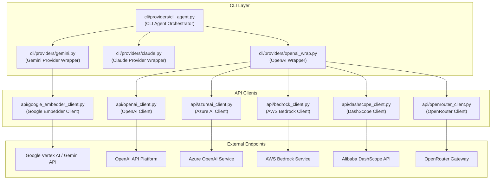
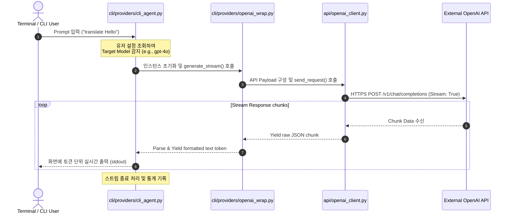

# Model Provider Clients Wiki

## Overview

본 문서는 시스템의 핵심 모듈 중 하나인 **Model Provider Clients**의 구조와 설계 사상을 설명하는 Technical Wiki입니다. 본 컴포넌트는 다양한 인공지능 모델 제공자(Model Provider)들의 API를 추상화하고, CLI 레이어와 비즈니스 로직 레이어에서 이들을 일관된 인터페이스로 사용할 수 있도록 지원하는 역할을 합니다. 

시스템은 크게 사용자 명령을 처리하고 에이전트의 흐름을 제어하는 **CLI Layer**와 실제 외부 LLM 및 임베딩 API와 통신을 담당하는 **API Client Layer**로 분리되어 설계되었습니다. 이를 통해 신규 AI 모델 프로바이더가 추가되더라도 기존 비즈니스 로직의 수정을 최소화할 수 있는 느슨한 결합(Loose Coupling) 구조를 유지합니다.

---

## Architecture Design

전체적인 시스템의 계층 구조와 데이터 흐름은 다음과 같습니다. 각 컴포넌트는 단방향 의존성을 가지며, 외부 Endpoints와의 직접적인 통신은 API Client Layer에서만 발생합니다.

---

## Core Component Specifications

### CLI Layer Components

CLI Layer의 파일들은 최종 사용자의 명령행 인터페이스 인터랙션을 처리하고, 에이전트의 내부 의사결정 상태에 따라 적절한 모델 프로바이더를 로드 및 조율합니다.

*   **[cli/providers/cli_agent.py](file:///Users/jcjeong/cli/providers/cli_agent.py)**
    *   **역할:** CLI 환경에서 유저의 요청을 받아 에이전트 루프(Agent Loop)를 실행하는 오케스트레이터입니다.
    *   **상세:** 유저 설정 및 모델 파라미터에 기초하여 `gemini.py`, `claude.py`, `openai_wrap.py` 중 적합한 프로바이더 인스턴스를 동적으로 생성하고 호출합니다.
*   **[cli/providers/gemini.py](file:///Users/jcjeong/cli/providers/gemini.py)**
    *   **역할:** Google Gemini 모델군(Gemini Pro, Ultra 등)을 CLI 에이전트에 통합하기 위한 래퍼(Wrapper)입니다.
    *   **상세:** 입력 프롬프트를 Gemini가 요구하는 스키마 구조로 직렬화(Serialization)하고, 스트리밍 응답 처리를 지원합니다.
*   **[cli/providers/claude.py](file:///Users/jcjeong/cli/providers/claude.py)**
    *   **역할:** Anthropic Claude 모델군(Claude 3 Opus/Sonnet/Haiku 등)을 연동하기 위한 CLI 어댑터입니다.
    *   **상세:** Anthropic 시스템 프롬프트 포맷 규격을 준수하며, 대화 히스토리 및 에이전트의 Tool Calling 명세를 Claude 형식으로 변환합니다.
*   **[cli/providers/openai_wrap.py](file:///Users/jcjeong/cli/providers/openai_wrap.py)**
    *   **역할:** OpenAI 사양의 엔드포인트를 사용하는 다양한 백엔드 클라이언트들을 하나로 묶어주는 통합 래퍼입니다.
    *   **상세:** `openai_client.py`뿐만 아니라 동일한 API Spec을 따르는 `azureai_client.py`, `dashscope_client.py` 등을 다형성(Polymorphism)을 활용해 제어합니다.

---

### API Client Components

API Client Layer의 파일들은 네트워크 통신, 인증(Authentication), 오류 재시도(Retry logic), 그리고 로깅(Logging) 등 외부 인프라스트럭처와의 세부 통신 프로토콜을 전담 처리합니다.

*   **[api/google_embedder_client.py](file:///Users/jcjeong/api/google_embedder_client.py)**
    *   **역할:** Google GenAI SDK를 활용하여 텍스트 임베딩(Text Embedding) 벡터를 생성하는 전용 클라이언트입니다.
    *   **상세:** RAG(Retrieval-Augmented Generation) 시스템 등에서 활용할 문서 분석용 임베딩 데이터 획득을 담당합니다.
*   **[api/openai_client.py](file:///Users/jcjeong/api/openai_client.py)**
    *   **역할:** OpenAI의 Chat Completion, Image Generation, Text-to-Speech 등의 기본 API 호출을 관리합니다.
    *   **상세:** API Key 주입, 조직 ID 설정, Rate Limit 대응을 위한 Exponential Backoff 로직을 내부적으로 포함합니다.
*   **[api/azureai_client.py](file:///Users/jcjeong/api/azureai_client.py)**
    *   **역할:** Microsoft Azure 클라우드 환경에서 호스팅되는 Azure OpenAI 인스턴스와의 연동을 지원합니다.
    *   **상세:** 엔터프라이즈 환경에서 필수적인 Active Directory 토큰 갱신 및 커스텀 API Version 관리를 제공합니다.
*   **[api/bedrock_client.py](file:///Users/jcjeong/api/bedrock_client.py)**
    *   **역할:** AWS Bedrock 인프라를 통해 호스팅되는 Claude, Llama 3, Titan 등의 파운데이션 모델(Foundation Model)을 호출합니다.
    *   **상세:** AWS IAM Credentials(Access Key / Secret Key)와 `boto3` 라이브러리를 이용하여 서명된 요청을 전송합니다.
*   **[api/dashscope_client.py](file:///Users/jcjeong/api/dashscope_client.py)**
    *   **역할:** 알리바바 클라우드의 DashScope(Tongyi Qianwen) AI 플랫폼 API 통신 클라이언트입니다.
    *   **상세:** 중화권 로컬라이제이션이 필요하거나 알리바바의 LLM 인프라를 타겟으로 할 때 활성화됩니다.
*   **[api/openrouter_client.py](file:///Users/jcjeong/api/openrouter_client.py)**
    *   **역할:** 단일 엔드포인트로 수십 가지 LLM 모델을 우회 라우팅해주는 OpenRouter 게이트웨이용 클라이언트입니다.
    *   **상세:** 동적 모델 ID 전송 및 OpenRouter 고유의 헤더 규격(HTTP-Referer 등)을 맞추어 요청을 전달합니다.

---

## Sequence Flow

아래의 시퀀스 다이어그램은 CLI 환경에서 사용자의 질문이 입력되었을 때, `cli/providers/cli_agent.py`가 어떻게 알맞은 Provider를 선정하고, `api` 클라이언트를 거쳐 응답을 반환하는지 보여줍니다. (여기서는 `OpenAI Wrap`을 경유하는 대표 흐름을 기준으로 설명합니다.)

---

## Key Technical Terms

*   **Provider Wrapper:** 외부 모델 벤더사 고유의 파라미터 구조와 API 규격을 프레임워크 내부 공통 프로토콜에 맞게 어댑팅(Adapting)해주는 어댑터 유형의 컴포넌트입니다.
*   **CLI Agent Orchestrator (`cli_agent.py`):** 사용자와 직접 인터랙션하며 추론 루프를 실행하고, 도구 실행(Tool Calling) 여부 판단 및 히스토리를 메모리에 유지·보수하는 상태 기계(State Machine) 역할을 수행합니다.
*   **OpenAI Compatibility Wrapper (`openai_wrap.py`):** 업계 표준으로 정착한 OpenAI Chat Completion API 스키마를 준수하는 서드파티 제공자들(Azure, DashScope, OpenRouter 등)을 일관적으로 다루기 위한 다형성 레이어입니다.
*   **Exponential Backoff:** 외부 API 호출 실패(e.g. 429 Too Many Requests) 시, 재시도 대기 시간을 기하급수적으로 늘려가며 요청을 재시도하여 시스템의 안정성을 확보하는 알고리즘입니다.

---

## Conclusion

**Model Provider Clients** 설계는 전형적인 **Adapter Pattern**과 **Facade Pattern**을 차용하여 구축되었습니다. `cli/` 영역의 에이전트들은 모델들이 실제로 로컬 온프레미스에 존재하거나, AWS Bedrock을 통해 제공되거나, Google Cloud 상에 호스팅되는지 여부를 알 필요가 없습니다. 

개발자는 오직 상위 인터페이스인 `cli/providers/`에 구현된 규격에 맞추어 상호작용하기만 하면 되며, 새로운 LLM의 등장이나 API 명세의 점진적 변경 사항은 `api/` 내부 클라이언트 클래스에 격리되어 처리되므로 높은 유지보수성과 확장성을 보장합니다.
