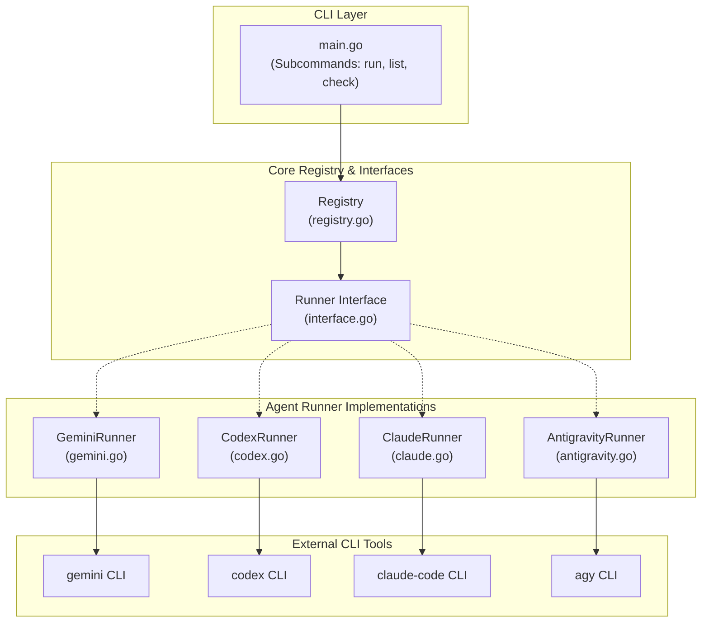
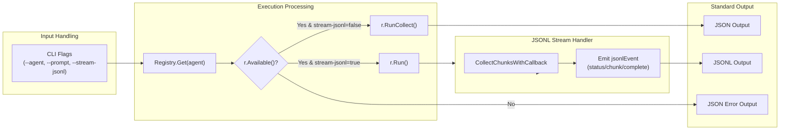

# 로컬위키 에이전트 (LocalWiki Agent) Technical Wiki

## Overview
`localwiki-agent`는 Gemini, Codex, Claude Code, 그리고 Antigravity 등 다양한 LLM Command Line Interface (CLI) Agent들을 통합하여 단일 인터페이스로 제어할 수 있도록 설계된 Go 언어 기반의 통합 에이전트 실행 도구입니다. 

본 프로젝트는 Go 1.24.4 버전을 타겟으로 개발되었으며, 프로젝트의 패키지 선언 및 의존성 환경 정보는 [agent/go.mod](file:///Users/jcjeong/lab/code-sonar/local-deepwiki/agent/go.mod) 파일에 정의되어 있습니다. 외부 Python API나 웹 인터페이스 서비스가 로컬 시스템에 설치된 터미널 에이전트 도구들을 간편하고 정형화된 방식으로 실행하고 결과를 수집할 수 있도록 돕는 미들웨어 성격의 역할을 수행합니다.

---

## Architecture & Components

`localwiki-agent` 시스템은 입력 파싱, 라우팅 및 레지스트리 관리, 개별 에이전트 실행기 레이어로 계층화되어 있습니다.



### 1. CLI Layer
- **Source file**: [agent/cmd/localwiki-agent/main.go](file:///Users/jcjeong/lab/code-sonar/local-deepwiki/agent/cmd/localwiki-agent/main.go)
- 시스템의 진입점(Entrypoint)이며 CLI 인자 처리 및 표준 입출력을 관장합니다.
- `main()` 함수에서 `run`, `list`, `check` 서브커맨드 분기를 담당하고, 실행 결과를 정규 JSON 객체 또는 줄바꿈 단위 JSON 객체인 JSON Lines (JSONL) 스트림으로 변환하여 `os.Stdout`으로 송출합니다.

### 2. Core Registry & Interfaces
- **Source files**: [agent/internal/runner/interface.go](file:///Users/jcjeong/lab/code-sonar/local-deepwiki/agent/internal/runner/interface.go), [agent/internal/runner/registry.go](file:///Users/jcjeong/lab/code-sonar/local-deepwiki/agent/internal/runner/registry.go)
- `Runner` 인터페이스는 모든 CLI 에이전트 실행기가 공통으로 구현해야 하는 규격을 정의합니다.
  - `Name() string`: 에이전트 고유 식별자 반환
  - `DefaultModel() / FlashModel() / ProModel() string`: 에이전트 기본 및 최적화 모델 명칭 반환
  - `Available() bool`: 로컬 시스템 환경의 `PATH` 내에 해당 CLI 바이너리가 설치되어 실행 가능한 상태인지 체크
  - `Run(context.Context, RunRequest) (<-chan Chunk, error)`: 비동기 스트리밍 실행 기능 제공
  - `RunCollect(context.Context, RunRequest) (RunResult, error)`: 동기식 결과 일괄 수집 기능 제공
- `Registry` 구조체는 사용 가능한 `Runner`들을 보관하며, `openai`, `gpt`, `anthropic`, `google` 등의 에이전트 별칭(Aliases)을 식별하여 올바른 실행 인스턴스로 매핑해 줍니다.

### 3. Agent Runner Implementations (Focus on Antigravity)
- **Source file**: [agent/internal/runner/antigravity.go](file:///Users/jcjeong/lab/code-sonar/local-deepwiki/agent/internal/runner/antigravity.go)
- `AntigravityRunner` 구조체는 Google DeepMind 팀이 개발한 에이전트 도구인 `agy` CLI와의 통신 및 제어를 담당하는 전용 실행기(Runner)입니다.

---

## Data Flow & Execution Model

CLI Layer에서 요청을 전달받아 외부 CLI 도구를 동기 또는 비동기 스트리밍 방식으로 처리하는 데이터 흐름은 다음과 같습니다.



### Subcommands
- **`run`**: 특정 에이전트를 가동하고 프롬프트를 처리하는 메인 커맨드입니다.
  - `--agent`: 실행하려는 대상 에이전트 지정 (`gemini`, `codex`, `claude`, `antigravity`).
  - `--prompt` 또는 `--prompt-file`: 에이전트에 공급할 질문 텍스트 혹은 파일 경로 지정.
  - `--stream-jsonl`: 실시간 스트리밍 출력을 제어하는 옵션입니다. 활성화 시 출력이 JSONL 포맷으로 실시간 파이프라인 처리가 되며, 비활성화 시 연산 종료 시점에 최종 결과 구조체를 일괄 JSON으로 인코딩하여 반환합니다.
- **`list`**: 에이전트 등록 상태 및 시스템 환경 가용한 에이전트 설치 상태 정보를 화면에 덤프합니다.
- **`check`**: CLI 바이너리 존재 여부를 검사하여 쉘 환경에서의 연동 적합성을 신속히 판별합니다.

### Streaming JSONL Events
비동기 호출 시 출력되는 `jsonlEvent`는 다음과 같은 `Type` 필드 기반 상태 구분을 가집니다.
1. `status`: 에이전트 초기 가동을 알리는 최초 상태 신호
2. `chunk`: 스트리밍 도중 도출된 결과 텍스트 일부분 (실시간 콘솔 뷰어 등에 공급됨)
3. `error`: 에이전트 실행 도중 발생한 예외 상황 및 오류 메세지
4. `complete`: 실시간 청크 전송 완료 후 산출된 전체 텍스트 내용 및 경과 시간 (`elapsed_ms`) 통계

---

## Antigravity CLI Integration

[agent/internal/runner/antigravity.go](file:///Users/jcjeong/lab/code-sonar/local-deepwiki/agent/internal/runner/antigravity.go) 파일에 구성된 `AntigravityRunner`는 로컬 쉘의 `agy` 프로그램을 안전하게 wrapping하는 컴포넌트입니다.

### 1. Model Resolution
Antigravity 에이전트는 내부적으로 Google Gemini API를 토대로 연산을 수행합니다.
- 기본/Flash 모델: `gemini-3.1-flash`
- Pro 모델: `gemini-3.1-pro`

### 2. Dependency Check (`Available`)
`exec.LookPath("agy")` 함수를 실행하여 시스템 환경 변수 `PATH` 상에서 `agy` 실행 바이너리가 조회되는지 유효성을 검증합니다.

### 3. Prompt Execution & Guardrails
`agy` CLI 실행 시 터미널 입출력의 인터랙티브 반응(Interactive prompts/menus)을 우회하고 헤드리스(Headless) 환경에서 결과 데이터를 정확히 수집하기 위해 다음과 같이 특수 설정 및 강제 명령 조항(`CRITICAL INSTRUCTION`)을 삽입하여 통신합니다.

```go
// agy supports stdin if prompt is empty string
args := []string{"--prompt", ""}

// 에이전트가 동작 과정에서 임의 파일 쓰기 등의 부작용을 일으키지 못하도록 제한하는 프롬프트 보호막 가드레일 정의
strictPrompt := req.Prompt + "\n\nCRITICAL INSTRUCTION: DO NOT use any tools to create files or save documents to the workspace or artifact directory. You MUST output the final requested content (e.g. markdown) directly as plain text to standard output so the caller can read it. Do not include any conversational filler, output ONLY the raw markdown content."
```

생성된 `exec.CommandContext`에 `Cwd`(작업 디렉토리) 정보를 인계하고, 가공된 `strictPrompt` 문자열 스트림을 `Stdin`으로 연결하여 명령어를 원격 기동시킵니다.
- **스트리밍 (`Run`)**: 실행 시 `stream.PipeCmd(cmd)`를 이용하여 프로세스의 파이프라인 출력을 지속 관측하고 이를 `Chunk` 채널로 리디렉션합니다.
- **동기 수집 (`RunCollect`)**: 실행 시 `stream.CollectOutput(cmd)`를 이용해 프로세스의 완료 출력을 즉시 수집하고 결과를 `RunResult` 구조체에 적재합니다.

---

## Deployment & Configuration

### Prerequisites
- Go Runtime (버전 1.24.4 이상 권장, [agent/go.mod](file:///Users/jcjeong/lab/code-sonar/local-deepwiki/agent/go.mod) 참고)
- 각 에이전트 실행에 필요한 쉘 도구 (`agy`, `gemini`, `codex`, `claude`)

### Build Command
```bash
cd agent
go build -o localwiki-agent cmd/localwiki-agent/main.go
```

### Execution Example
- **Antigravity 에이전트를 이용한 프롬프트 동기 실행**:
  ```bash
  ./localwiki-agent run --agent antigravity --prompt "Markdown으로 문서 작성법을 알려주세요."
  ```
- **Gemini 에이전트를 이용한 JSONL 스트리밍 실행**:
  ```bash
  ./localwiki-agent run --agent gemini --prompt "Hello World" --stream-jsonl
  ```
- **활성화된 에이전트 및 바이너리 상태 확인**:
  ```bash
  ./localwiki-agent list
  