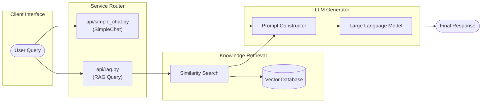
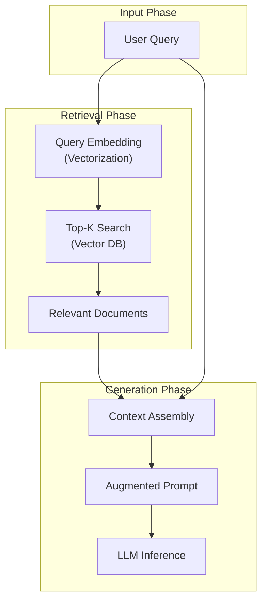

# Retrieval-Augmented Generation (RAG) QA System

## Overview
이 문서는 검색 증강 생성(Retrieval-Augmented Generation, RAG) 기반의 질의응답 시스템 아키텍처와 구현 상세를 다룹니다. 본 시스템은 단순 대화형 인터페이스를 제공하는 [api/simple_chat.py](file:///Users/jcjeong/.gemini/antigravity-cli/scratch/api/simple_chat.py)와 지식 베이스 검색을 통해 증강된 답변을 생성하는 [api/rag.py](file:///Users/jcjeong/.gemini/antigravity-cli/scratch/api/rag.py)를 기반으로 작성되었습니다.

## Introduction
대형 언어 모델(LLM)은 학습 데이터에 포함되지 않은 최신 정보나 외부 비공개 도메인 데이터에 대해 답변할 때 환각(Hallucination) 현상이 발생할 수 있습니다. 이를 극복하기 위해 RAG 시스템은 사용자의 Query에 대해 관련성 높은 문서를 검색(Retrieve)하고, 이를 Prompt의 Context로 포함하여 LLM에 전달함으로써 보다 정확하고 신뢰할 수 있는 답변을 생성(Generate)합니다.

## System Architecture

### Process Flow Diagram
다음은 [api/simple_chat.py](file:///Users/jcjeong/.gemini/antigravity-cli/scratch/api/simple_chat.py)와 [api/rag.py](file:///Users/jcjeong/.gemini/antigravity-cli/scratch/api/rag.py)의 요청 처리 흐름을 시각화한 아키텍처 다이어그램입니다.

## Component Details

### 1. Simple Chat Component (`api/simple_chat.py`)
[api/simple_chat.py](file:///Users/jcjeong/.gemini/antigravity-cli/scratch/api/simple_chat.py)는 외부 지식을 참조하지 않고 사용자의 입력에 직접 응답하는 대화 컴포넌트입니다.
- **Core Logic**: 사용자 입력 메시지를 그대로 LLM의 input 파라미터로 주입하여 처리합니다.
- **Characteristics**: 대화 기록(Conversation History)을 기반으로 한 컨텍스트 유지는 가능하지만, 모델 내부 가중치(Parametric Memory)에만 의존하므로 오답 가능성이 존재합니다.

### 2. RAG QA Component (`api/rag.py`)
[api/rag.py](file:///Users/jcjeong/.gemini/antigravity-cli/scratch/api/rag.py)는 외부 지식 베이스 검색 단계를 추가하여 생성 품질을 향상시킨 컴포넌트입니다.
- **Query Embedding**: 사용자의 입력 질문을 임베딩 모델을 통해 벡터로 표현합니다.
- **Vector Search**: 질문 벡터와 데이터베이스 내부의 문서 청크(Document Chunk) 벡터 간의 유사도를 측정하여 최상위 Top-K 문서를 검색합니다.
- **Prompt Augmentation**: 검색된 문서를 컨텍스트 형식으로 템플릿에 주입하여 프롬프트를 재구성합니다.
- **Constraint Execution**: 프롬프트 내부에서 제공된 정보(Context) 외의 사실을 가공하여 답변하지 못하도록 제한 조건을 부여해 신뢰성을 유지합니다.

## Technical Workflows

### Data Processing Pipeline
RAG 파이프라인의 핵심 데이터 흐름은 다음과 같은 순서로 진행됩니다.

## Deployment
RAG 시스템을 실제 서비스 환경에 배포할 때는 다음과 같은 아키텍처 레이어를 고려해야 합니다.
1. **API Gateway Layer**: 클라이언트 요청을 수신하고 `api/simple_chat.py`와 `api/rag.py` 서비스로 라우팅을 조율합니다.
2. **Vector DB Layer**: 문서 임베딩 및 밀집 검색(Dense Retrieval) 서비스를 제공하기 위한 벡터 DB 인프라를 구축합니다.
3. **Model Serving Layer**: LLM 추론 속도 제고를 위해 OpenAI API 연동 혹은 오픈소스 LLM(vLLM 등) 인프라를 배치합니다.
