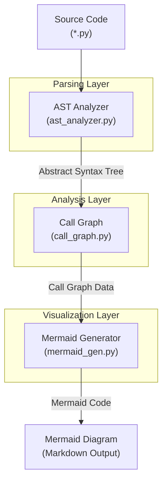
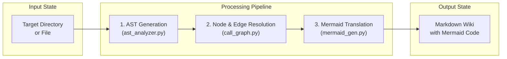

# Sonar Static Analysis (소나 정적 분석)

## Introduction
소나 정적 분석(Sonar Static Analysis) 도구는 파이썬(Python) 소스 코드를 대상으로 AST(Abstract Syntax Tree)를 파싱하고 함수 및 메서드 간의 호출 관계를 추적하여 정적 분석을 수행하고, 이를 시각화할 수 있는 Mermaid 다이어그램 정의를 생성하는 도구입니다.

## Overview
이 시스템은 소스 코드의 복잡성을 관리하고 함수 호출 흐름을 파악하기 위해 설계되었습니다. 코드 베이스 내에서 모듈 간 의존성 및 함수 호출 관계를 분석하는 것은 디버깅 및 리팩토링의 핵심적인 단계입니다. 본 Wiki 페이지에서는 정적 분석의 핵심 엔진을 담당하는 세 가지 소스 파일인 [ast_analyzer.py](file:///cli/sonar/ast_analyzer.py), [call_graph.py](file:///cli/sonar/call_graph.py), [mermaid_gen.py](file:///cli/sonar/mermaid_gen.py)의 구조와 역할을 설명합니다.

## Architecture
이 도구는 크게 세 개의 레이어로 구성됩니다:
1. **Parsing Layer (AST Analyzer)**: 소스 코드를 AST 노드로 변환하고 파싱합니다.
2. **Analysis Layer (Call Graph)**: 파싱된 정보를 바탕으로 함수 간 호출 노드와 에지를 정의하여 Call Graph를 생성합니다.
3. **Visualization Layer (Mermaid Generator)**: 완성된 Call Graph를 Mermaid 문법의 시각화 데이터로 변환합니다.

## Core Components

### 1. AST Analyzer ([cli/sonar/ast_analyzer.py](file:///cli/sonar/ast_analyzer.py))
[ast_analyzer.py](file:///cli/sonar/ast_analyzer.py)는 파이썬 내장 `ast` 모듈을 활용하여 소스 코드를 구문 분석(Syntax Parsing)합니다.
* **주요 클래스 및 메서드**:
  * `ASTAnalyzer`: 소스 코드 파일을 읽고 AST를 생성 및 순회하는 메인 클래스입니다.
  * `visit_FunctionDef(node)`: 함수 정의를 감지하여 함수의 이름, 매개변수, 위치 정보를 추출합니다.
  * `visit_ClassDef(node)`: 클래스 정의를 감지하여 내부에 속한 메서드들과 상속 정보를 수집합니다.
  * `visit_Call(node)`: 함수나 메서드 호출부(Call Expression)를 감지하여 호출 대상(Callee) 정보를 수집합니다.
* **핵심 역할**:
  소스 코드를 텍스트 레벨이 아닌 구조적 데이터(Abstract Syntax Tree)로 다루어, 변수의 범위(Scope), 클래스 컨텍스트, 함수 정의 및 호출의 정확한 위치(Line Number)를 식별합니다.

### 2. Call Graph Generator ([cli/sonar/call_graph.py](file:///cli/sonar/call_graph.py))
[call_graph.py](file:///cli/sonar/call_graph.py)는 [ast_analyzer.py](file:///cli/sonar/ast_analyzer.py)가 추출한 구조적 데이터를 수집하여 노드(Node)와 간선(Edge)으로 이루어진 호출 그래프(Call Graph)를 구축합니다.
* **주요 클래스 및 메서드**:
  * `CallGraph`: 노드(함수/메서드)와 에지(호출 관계)의 컬렉션을 관리합니다.
  * `CallNode`: 개별 함수나 메서드를 나타내며, 파일 경로, 클래스명, 함수명 등의 메타데이터를 저장합니다.
  * `CallEdge`: 호출하는 함수(Caller)와 호출받는 함수(Callee) 간의 연결선 정보를 관리합니다.
  * `build_graph()`: 분석 대상 디렉토리의 모든 파일에 대해 AST 분석을 수행하고 전체 시스템의 연결 관계를 연결합니다.
* **핵심 역할**:
  개별 파일 단위의 분석을 넘어, 전체 프로젝트 범위에서 외부 모듈 및 내부 모듈 간의 함수 호출 흐름을 다이나믹하게 매핑합니다. 순환 참조(Circular Reference)나 호출되지 않는 데드 코드(Dead Code)를 탐지하는 기초 자료로 활용됩니다.

### 3. Mermaid Generator ([cli/sonar/mermaid_gen.py](file:///cli/sonar/mermaid_gen.py))
[mermaid_gen.py](file:///cli/sonar/mermaid_gen.py)는 구축된 `CallGraph` 인스턴스를 바탕으로 사용자가 Markdown 뷰어에서 직접 볼 수 있는 Mermaid 다이어그램 코드를 생성합니다.
* **주요 클래스 및 메서드**:
  * `MermaidGenerator`: 그래프 데이터를 입력받아 Mermaid 문자열로 변환하는 포매터 클래스입니다.
  * `generate_flowchart(direction)`: `graph TD` 또는 `graph LR` 등 지정된 방향에 맞춰 Flowchart 형식의 텍스트를 렌더링합니다.
  * `_group_by_module()`: 모듈(파일) 단위로 노드들을 그룹화하여 Mermaid의 `subgraph`로 묶어 가독성을 높입니다.
* **핵심 역할**:
  복잡한 텍스트 기반의 정적 분석 결과를 사람이 쉽게 읽을 수 있는 visual diagram으로 전환하여, 문서화 및 아키텍처 리뷰를 용이하게 합니다.

## Data Flow
정적 분석 도구가 작동할 때 데이터가 흐르는 상세 과정은 다음과 같습니다:

1. **Initialization**: 사용자가 특정 소스 파일 또는 디렉토리를 지정하면 `CallGraph` 인스턴스가 생성됩니다.
2. **File Parsing**: `ASTAnalyzer`가 각 파이썬 파일을 순차적으로 열어 `ast.parse()`를 실행하고 트리를 순회(Traverse)합니다.
3. **Symbol Resolution & Node Creation**: 클래스 정의와 함수 정의를 노드로 생성하여 `CallGraph`에 등록합니다.
4. **Edge Connection**: 함수 호출 식을 분석하여 Caller 노드에서 Callee 노드로의 `CallEdge`를 생성합니다. 이 과정에서 상대 경로 임포트 및 모듈 해석이 수행됩니다.
5. **Serialization**: 완성된 `CallGraph` 구조를 `MermaidGenerator`에 전달하여 Markdown-compatible Mermaid 코드를 생성 및 출력합니다.

## Conclusion
소나 정적 분석 시스템은 [ast_analyzer.py](file:///cli/sonar/ast_analyzer.py)의 정밀한 구문 트리 분석, [call_graph.py](file:///cli/sonar/call_graph.py)의 구조적 의존성 및 호출 관계 모델링, 그리고 [mermaid_gen.py](file:///cli/sonar/mermaid_gen.py)를 통한 강력한 시각화 메커니즘을 통합하여 구축되었습니다. 이를 통해 개발자는 코드의 전체 구조를 한눈에 파악하고, 복잡한 제어 흐름 및 의존성을 정밀하게 모니터링할 수 있습니다.
