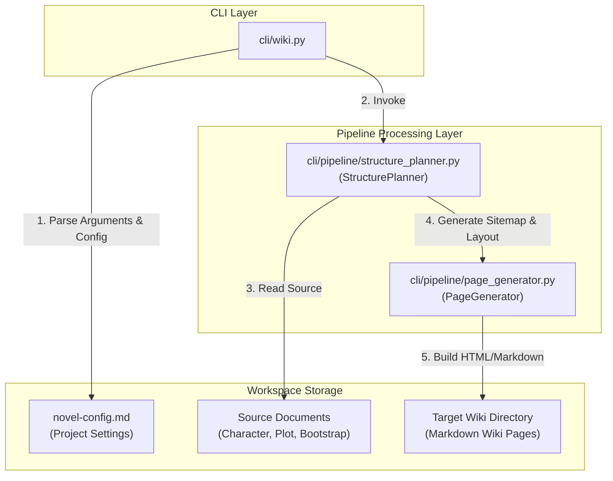
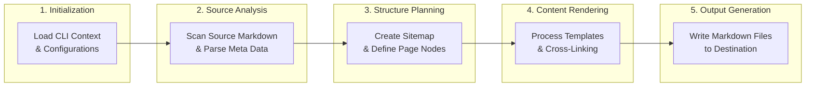

# Wiki Generation System

## Overview
Wiki Generation System은 Awesome Novel Studio에서 웹소설 프로젝트의 캐릭터 설정, 세계관 설정, 플롯 훅 가이드 등 흩어져 있는 기획 문서들을 유기적으로 연결된 **Markdown 기반의 위키(Wiki)** 형태로 자동 생성 및 빌드하는 도구입니다. 작가가 집필 중 참조하기 편리하도록 문서 간 상호 참조(Cross-Linking)를 지원하며, 프로젝트의 전체적인 맥락을 한눈에 파악할 수 있는 인덱스 구조를 제공합니다.

---

## System Architecture

위키 생성 시스템은 CLI 진입점, 구조 기획 엔진, 그리고 최종 페이지 생성 엔진의 3개 레이어로 구분됩니다.



---

## Component Details

### 1. CLI Entry Point (`cli/wiki.py`)
`cli/wiki.py`는 사용자가 터미널에서 위키 생성 명령을 실행할 때 호출되는 진입점입니다.
- **주요 역할**:
  - CLI 인자 파싱 (`project_name`, `--output-dir`, `--clean`, `--force` 등)
  - `novel-config.md` 파일에서 소설 설정 및 문서 경로 매핑 정보 로드
  - `StructurePlanner`와 `PageGenerator` 파이프라인의 수명 주기 및 실행 흐름 제어
- **주요 CLI Command**:
  ```bash
  awesome-novel-studio wiki generate [PROJECT_NAME] --output-dir ./wiki
  ```

### 2. Structure Planner (`cli/pipeline/structure_planner.py`)
`cli/pipeline/structure_planner.py`는 기획 문서의 메타데이터와 콘텐츠 분석을 기반으로 위키의 전체적인 사이트맵 및 탐색 계층 구조(Navigation Hierarchy)를 설계합니다.
- **주요 역할**:
  - `bootstrap.md`, `character_sheet.md`, `plot_hook_guide.md` 등 프로젝트 소스 문서 파싱
  - 문서 간 연관 관계(예: 인물 관계도, 세계관 내 특정 단체와 소속 캐릭터 관계 등) 분석
  - 사이트맵(`WikiStructure`) 및 페이지별 템플릿 레이아웃 결정
- **주요 Class & Method**:
  - `StructurePlanner`: 구조 기획 메인 클래스
  - `StructurePlanner.plan_hierarchy(source_dir)`: 기획 문서들을 스캔하여 위키 계층 구조 목록 반환
  - `StructurePlanner.build_sitemap()`: 메인 인덱스 및 메뉴 맵 구성

### 3. Page Generator (`cli/pipeline/page_generator.py`)
`cli/pipeline/page_generator.py`는 플래너가 정의한 구조에 따라 실제 콘텐츠를 렌더링하고 Markdown 문서 파일로 디스크에 쓰는 실행 모듈입니다.
- **주요 역할**:
  - 개별 위키 페이지의 Markdown 헤더 및 템플릿 주입
  - 텍스트 내 특정 키워드(예: 캐릭터 이름, 지명, 용어)를 자동으로 감지하여 내부 Markdown 링크(`[Character](file:///path/to/wiki/character/...)`)로 치환하는 Cross-Linking 처리
  - Mermaid 다이어그램(예: 인물 관계도) 렌더링 지원 및 정적 리소스 복사
- **주요 Class & Method**:
  - `PageGenerator`: 위키 문서 파일 작성 클래스
  - `PageGenerator.generate_page(node: WikiPageNode)`: 특정 노드의 데이터를 기반으로 단일 페이지 작성
  - `PageGenerator.inject_cross_links(content)`: 콘텐츠 내부의 핵심 어휘에 위키 링크 태깅
  - `PageGenerator.build_index()`: 메인 `index.md` 페이지 생성

---

## Detailed Pipeline Flow

위키 생성은 다음 5단계의 파이프라인 흐름을 거쳐 수행됩니다.



1. **Initialization**: `cli/wiki.py`가 타겟 프로젝트 디렉토리를 식별하고 환경 설정을 읽어들입니다.
2. **Source Analysis**: `structure_planner.py`가 소스 폴더 내의 기획 데이터를 분석하여 파일 간의 참조 관계를 추출합니다.
3. **Structure Planning**: 분석된 메타데이터를 바탕으로 사이트맵 구조를 설계하고 `WikiPageNode` 트리 구조를 빌드합니다.
4. **Content Rendering**: `page_generator.py`가 각 노드의 템플릿을 채우고 본문 텍스트 내 키워드에 대해 상대 경로 링크를 연결합니다.
5. **Output Generation**: 최종적으로 구성된 Markdown 문서들을 지정된 `--output-dir` 내에 트리 구조로 파일 저장합니다.

---

## Dependencies & Core Configurations

위키 생성기는 다음 설정 값(`novel-config.md`)을 읽어 동작합니다.

```yaml
# Example settings in novel-config.md
wiki:
  output_dir: "./wiki"
  theme: "dark"
  auto_link_characters: true
  auto_link_settings: true
  exclude_patterns:
    - "**/drafts/**"
```

- **auto_link_characters**: 본문에 등장하는 캐릭터 이름을 캐릭터 위키 시트로 자동 링크 연결할지 여부 (`cli/pipeline/page_generator.py`에서 파싱 시 활용)
- **exclude_patterns**: 위키 빌드 시 원천 데이터에서 제외할 파일 경로 목록
