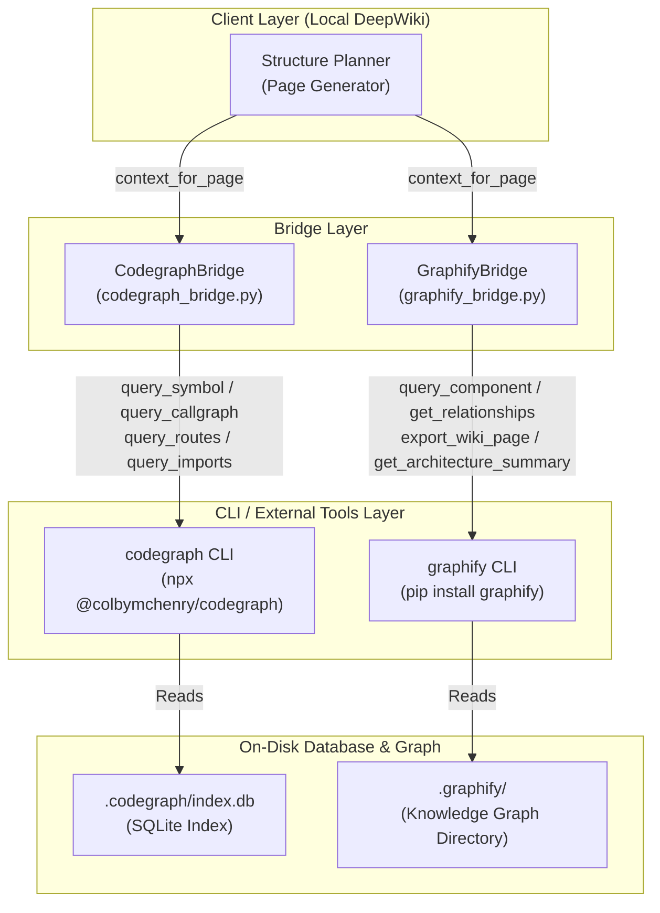
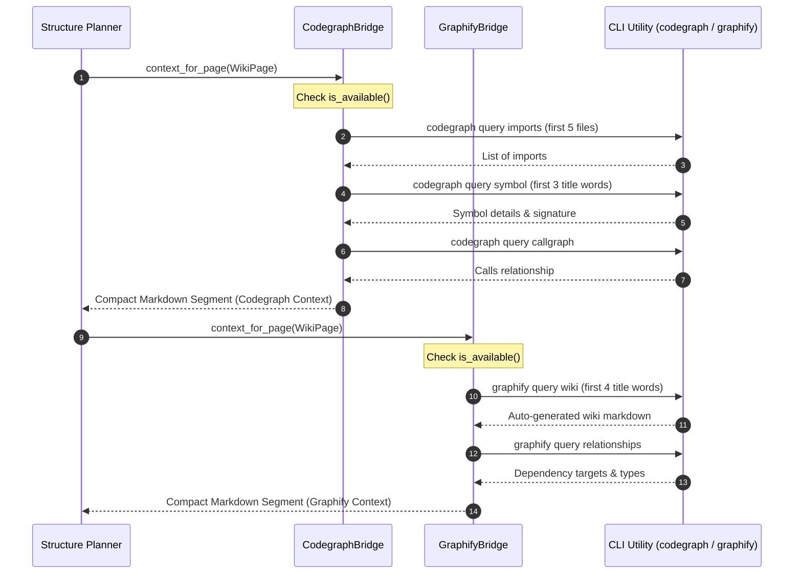

An find command is running in the background to locate `codegraph_bridge.py` on your system. I will proceed as soon as the results are available.
# Code Graph Bridge (코드 그래프 브릿지)

## Introduction

코드베이스의 크기가 커짐에 따라 LLM(Large Language Model)이 전체 소스 코드를 직접 읽는 것은 토큰 제한(token limits)과 비용 면에서 매우 비효율적입니다. 이 문제를 해결하기 위해 Local DeepWiki 시스템은 코드 전체를 단순 텍스트로 읽는 대신, 코드 구조를 그래프 데이터베이스 또는 SQLite 인덱스로 모델링하여 쿼리하는 방식을 사용합니다. 

`Code Graph Bridge`는 코드 구조 및 의미론적 정보를 쿼리하여 최적화된 Context를 LLM에 전달하는 중간 인터페이스 역할을 합니다. 본 위키 문서에서는 이를 구현하는 두 가지 핵심 브릿지 컴포넌트인 `CodegraphBridge`([cli/indexer/codegraph_bridge.py](file:///Users/jcjeong/lab/code-sonar/local-deepwiki/cli/indexer/codegraph_bridge.py))와 `GraphifyBridge`([cli/indexer/graphify_bridge.py](file:///Users/jcjeong/lab/code-sonar/local-deepwiki/cli/indexer/graphify_bridge.py))에 대해 다룹니다.

## Overview

두 브릿지는 각각 서로 다른 외부 정적 분석 도구와 지식 그래프(knowledge graph) 도구를 활용하여 필요한 정보만 표적화(targeted query)하여 추출합니다.
1. **CodegraphBridge**: `tree-sitter` 기반으로 소스 코드를 파싱하여 로컬 SQLite 데이터베이스에 인덱싱한 뒤, CLI를 통해 심볼 정의(symbol definitions), 콜 그래프(call graphs), 경로(web routes), 임포트 체인(imports)을 빠르게 조회합니다.
2. **GraphifyBridge**: `tree-sitter`를 이용한 정적 AST 추출과 LLM의 시맨틱 분석을 결합하여, 온디스크(on-disk) 형태의 지식 그래프를 구성하고 이를 쿼리합니다.

이를 통해 컨텍스트 생성 시 원본 코드를 그대로 읽을 때와 비교하여 **약 70%에서 최대 71.5배의 토큰 절감 효과(token reduction)**를 달성합니다.

## Architecture & Components

시스템 아키텍처는 아래와 같이 다층 레이어 구조로 시각화할 수 있습니다.



### Core Components
1. **Structure Planner**: `WikiPage` 단위를 정의하고, 각 페이지를 작성하기 위한 적절한 컨텍스트 소스를 식별합니다.
2. **CodegraphBridge**: SQLite 형식의 정적 분석 인덱스에 접근하여 파일 간 임포트 관계 및 심볼 위치를 확보합니다.
3. **GraphifyBridge**: 단순 정적 정보를 넘어 LLM으로 요약된 고수준 컴포넌트 간 의존성 및 자연어 요약 정보를 획득합니다.
4. **On-Disk Database & Graph**: 리포지토리 루트 하위의 숨김 폴더(`.codegraph/`, `.graphify/`)에 파일 형태로 영구 저장되는 로컬 데이터 스토어입니다.

---

## Core Features & Implementation

### 1. CodegraphBridge
[CodegraphBridge](file:///Users/jcjeong/lab/code-sonar/local-deepwiki/cli/indexer/codegraph_bridge.py#L28-L176)는 `npx @colbymchenry/codegraph` CLI 명령을 서브프로세스(`subprocess.run`)로 호출하여 `.codegraph/index.db` SQLite 파일에 저장된 심볼 관계를 조회합니다.

#### Key Functions
- **[is_available](file:///Users/jcjeong/lab/code-sonar/local-deepwiki/cli/indexer/codegraph_bridge.py#L45-L63)**: 로컬 디렉토리에 `.codegraph/index.db`가 존재하고 `codegraph` 또는 `npx` 명령어가 PATH 상에 존재하는지 확인합니다.
- **[initialize](file:///Users/jcjeong/lab/code-sonar/local-deepwiki/cli/indexer/codegraph_bridge.py#L64-L84)**: `npx @colbymchenry/codegraph init -i` 명령어를 실행하여 코드베이스를 최초로 파싱 및 인덱싱합니다.
- **[query_symbol](file:///Users/jcjeong/lab/code-sonar/local-deepwiki/cli/indexer/codegraph_bridge.py#L89-L91)**: 주어진 심볼(클래스, 함수 등)의 정의 위치와 시그니처(signature)를 리턴합니다.
- **[query_callgraph](file:///Users/jcjeong/lab/code-sonar/local-deepwiki/cli/indexer/codegraph_bridge.py#L93-L96)**: 특정 함수의 호출자(callers)와 피호출자(callees) 목록을 조회합니다.
- **[query_routes](file:///Users/jcjeong/lab/code-sonar/local-deepwiki/cli/indexer/codegraph_bridge.py#L98-L101)**: 프로젝트 내에 구현된 웹 API 라우트(URL Method + Path와 이에 대응하는 Handler 함수) 목록을 탐색합니다.
- **[query_imports](file:///Users/jcjeong/lab/code-sonar/local-deepwiki/cli/indexer/codegraph_bridge.py#L103-L106)**: 특정 소스 파일이 임포트하고 있는 타겟 모듈 체인을 배열로 리턴합니다.

### 2. GraphifyBridge
[GraphifyBridge](file:///Users/jcjeong/lab/code-sonar/local-deepwiki/cli/indexer/graphify_bridge.py#L27-L187)는 `graphify` 지식 그래프 도구와 연동하여 AST와 LLM이 결합된 고차원 시맨틱 인덱스에 접근합니다.

#### Key Functions
- **[is_available](file:///Users/jcjeong/lab/code-sonar/local-deepwiki/cli/indexer/graphify_bridge.py#L44-L57)**: `.graphify` 디렉토리가 저장소 루트에 존재하고 `graphify` CLI가 설치되었는지 검증합니다.
- **[build](file:///Users/jcjeong/lab/code-sonar/local-deepwiki/cli/indexer/graphify_bridge.py#L59-L79)**: `graphify build <repo_path>` 명령어를 실행해 코드베이스 전체를 지식 그래프화하여 `.graphify`에 빌드합니다.
- **[query_component](file:///Users/jcjeong/lab/code-sonar/local-deepwiki/cli/indexer/graphify_bridge.py#L84-L92)**: 특정 컴포넌트의 클래스 설명 및 아키텍처 역할에 대한 정제된 요약 텍스트를 조회합니다.
- **[get_relationships](file:///Users/jcjeong/lab/code-sonar/local-deepwiki/cli/indexer/graphify_bridge.py#L94-L97)**: 타겟 컴포넌트가 참조하거나 의존하고 있는 타 컴포넌트 관계 리스트를 리턴합니다.
- **[export_wiki_page](file:///Users/jcjeong/lab/code-sonar/local-deepwiki/cli/indexer/graphify_bridge.py#L99-L109)**: `graphify`가 내부 지식 그래프와 LLM을 토대로 특정 컴포넌트에 대해 직접 자동 생성한 위키 형식의 Markdown 텍스트를 반환합니다.
- **[get_architecture_summary](file:///Users/jcjeong/lab/code-sonar/local-deepwiki/cli/indexer/graphify_bridge.py#L111-L116)**: 시스템 전체의 고수준 아키텍처 요약(high-level architecture summary) 텍스트를 쿼리합니다.

---

## Data Flow & Context Generation

`Structure Planner`가 위키 페이지를 작성하기 위한 컨텍스트를 요청할 때, 각 브릿지는 아래와 같이 고도로 표적화된 방식으로 필요한 최소한의 텍스트를 추출하여 LLM 컨텍스트 윈도우(Context Window)를 절약합니다.

### Context Retrieval Data Flow



### Context Formatting Strategy
- **[CodegraphBridge.context_for_page](file:///Users/jcjeong/lab/code-sonar/local-deepwiki/cli/indexer/codegraph_bridge.py#L112-L149)**:
  - `page.file_paths` 중 상위 5개 파일에 대해 [query_imports](file:///Users/jcjeong/lab/code-sonar/local-deepwiki/cli/indexer/codegraph_bridge.py#L103)를 수행하여 파일 의존성 수집 (최대 20개 임포트).
  - 페이지 제목(`page.title`)을 공백 기준으로 쪼개어 첫 3개 단어에 대해 [query_symbol](file:///Users/jcjeong/lab/code-sonar/local-deepwiki/cli/indexer/codegraph_bridge.py#L89) 및 [query_callgraph](file:///Users/jcjeong/lab/code-sonar/local-deepwiki/cli/indexer/codegraph_bridge.py#L93) 호출.
  - 제목에 API/Route 관련 키워드(`route`, `api`, `endpoint`, `router`, `url`, `path`)가 포함되어 있으면 [query_routes](file:///Users/jcjeong/lab/code-sonar/local-deepwiki/cli/indexer/codegraph_bridge.py#L98)로 API 스펙 자동 로드.
- **[GraphifyBridge.context_for_page](file:///Users/jcjeong/lab/code-sonar/local-deepwiki/cli/indexer/graphify_bridge.py#L127-L157)**:
  - 페이지 제목의 상위 4개 단어를 기반으로 [export_wiki_page](file:///Users/jcjeong/lab/code-sonar/local-deepwiki/cli/indexer/graphify_bridge.py#L99)를 조회하여 사전 정의된 컴포넌트 정보 확보 (최대 2000자 슬라이싱).
  - 컴포넌트 간 [get_relationships](file:///Users/jcjeong/lab/code-sonar/local-deepwiki/cli/indexer/graphify_bridge.py#L94) 정보를 포맷팅하여 추가.
  - 제목에 시스템/구조 관련 키워드(`overview`, `architecture`, `system`, `design`, `아키텍처`, `개요`)가 포함된 경우 [get_architecture_summary](file:///Users/jcjeong/lab/code-sonar/local-deepwiki/cli/indexer/graphify_bridge.py#L111)를 통해 아키텍처 개요 데이터(최대 3000자) 주입.

---

## API Reference & CLI Integration

### Class Definition: CodegraphBridge
```python
class CodegraphBridge:
    def __init__(self, repo_path: str | Path):
        """
        Args:
            repo_path (str | Path): 대상 저장소의 절대 경로.
        """
        ...

    def is_available(self) -> bool:
        """.codegraph/index.db와 CLI 명령어의 존재 여부를 체크합니다."""
        ...

    def initialize(self) -> bool:
        """npx @colbymchenry/codegraph init -i 명령어를 로컬에서 실행합니다."""
        ...

    def context_for_page(self, page: WikiPage) -> str:
        """
        정적 분석 쿼리를 종합하여 컴팩트한 LLM 프롬프트용 컨텍스트 문자열을 리턴합니다.
        """
        ...
```

### Class Definition: GraphifyBridge
```python
class GraphifyBridge:
    def __init__(self, repo_path: str | Path):
        """
        Args:
            repo_path (str | Path): 대상 저장소의 절대 경로.
        """
        ...

    def is_available(self) -> bool:
        """.graphify 디렉토리와 graphify CLI 명령어의 존재 여부를 체크합니다."""
        ...

    def build(self, provider_args: Optional[Dict] = None) -> bool:
        """graphify build <repo_path> 명령어를 통해 지식 그래프를 구성합니다."""
        ...

    def context_for_page(self, page: WikiPage) -> str:
        """
        지식 그래프 내용 및 의존성을 정제하여 71.5배 압축된 컨텍스트 문자열을 리턴합니다.
        """
        ...
```

### Raw CLI Command Mapping

각 브릿지는 내부 헬퍼 메서드([_query](file:///Users/jcjeong/lab/code-sonar/local-deepwiki/cli/indexer/codegraph_bridge.py#L155) 및 [_cli_query](file:///Users/jcjeong/lab/code-sonar/local-deepwiki/cli/indexer/graphify_bridge.py#L163))를 통해 다음과 같이 CLI 명령을 생성하고 JSON을 처리합니다.

| Bridge Method | Internal Command Call | JSON Input/Output |
| :--- | :--- | :--- |
| `CodegraphBridge.query_symbol("name")` | `codegraph query symbol name` | `{ "file": "...", "line": 10, "signature": "..." }` |
| `CodegraphBridge.query_callgraph("fn")` | `codegraph query callgraph fn` | `[ { "name": "caller_fn", "direction": "in" }, ... ]` |
| `CodegraphBridge.query_routes()` | `codegraph query routes` | `[ { "method": "GET", "path": "/api", "handler": "..." } ]` |
| `GraphifyBridge.query_component("comp")` | `graphify query component comp --repo <path> --json` | `{ "name": "comp", "description": "..." }` |
| `GraphifyBridge.get_relationships("comp")` | `graphify query relationships comp --repo <path> --json` | `[ { "target": "other_comp", "type": "depends" } ]` |

---

## Deployment & Setup

두 브릿지가 원활하게 동작하고 Local DeepWiki 시스템에 고품질 컨텍스트를 공급하기 위해서는 환경 구성이 필수적입니다.

### 1. Codegraph CLI Setup
`Codegraph`가 소스 코드에서 AST(Abstract Syntax Tree)를 파싱하고 SQLite 데이터베이스에 그래프 관계를 빌드하려면 리포지토리 루트에서 다음을 실행합니다.

```bash
# Node.js 및 npm이 필요합니다.
# 리포지토리 내부에서 인덱싱 초기화 진행
npx @colbymchenry/codegraph init -i
```
이 명령어는 `.codegraph/index.db` 파일을 생성합니다.

### 2. Graphify CLI Setup
`Graphify` 지식 그래프와 컴포넌트 정보, 의존 관계를 생성하기 위해 파이썬 패키지를 설치하고 그래프를 빌드해야 합니다.

```bash
# graphify 패키지 설치
pip install graphify

# 현재 리포지토리에 대한 지식 그래프 빌드 (tree-sitter + LLM)
graphify build /path/to/repo
```
이 명령어는 리포지토리 하위에 `.graphify/` 디렉토리를 생성하여 빌드된 데이터를 저장합니다.

### 3. Fail-Safe Operations (예외 처리 구조)
- `CodegraphBridge`와 `GraphifyBridge`는 모두 `is_available()` 검사를 수행합니다.
- 데이터베이스나 외부 도구가 준비되지 않은 경우, 프로세스는 Crash(오류 종료)를 유발하지 않고 Graceful Fallback 처리를 진행하여 빈 문자열 `""`을 반환합니다.
- 이에 따라 로컬 시스템은 코드 그래프 쿼리 대신 기본 텍스트 파일 읽기 등으로 유연하게 대체(fallback)할 수 있습니다.

---

## References
- **`CodegraphBridge` Source File**: [cli/indexer/codegraph_bridge.py](file:///Users/jcjeong/lab/code-sonar/local-deepwiki/cli/indexer/codegraph_bridge.py)
- **`GraphifyBridge` Source File**: [cli/indexer/graphify_bridge.py](file:///Users/jcjeong/lab/code-sonar/local-deepwiki/cli/indexer/graphify_bridge.py)
- **External Reference**: [codegraph (colbymchenry/codegraph)](https://github.com/colbymchenry/codegraph)
- **External Reference**: [graphify (safishamsi/graphify)](https://github.com/safishamsi/graphify)
