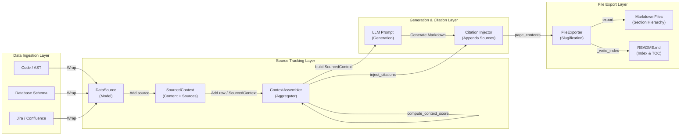

An notification will be generated when the timer or the search task completes. I will proceed once notified.
An notification will be generated when the timer or the search task completes. I will proceed once notified.
# File Export and Source Tracking in DeepWiki

## Overview
DeepWiki 파이프라인에서 생성된 위키 페이지를 디스크에 정해진 계층 구조대로 저장하고, 해당 문서를 생성하는 데 사용된 다양한 데이터의 출처(Provenance)를 추적하여 문서 하단에 자동으로 인용구(Citation)를 주입하는 메커니즘을 설명합니다. 

이 문서에서는 위키 구조를 분석하여 파일 시스템에 쓰는 파일 내보내기 모듈인 [cli/pipeline/file_exporter.py](file:///Users/jcjeong/lab/code-sonar/local-deepwiki/cli/pipeline/file_exporter.py)와 컨텍스트 수집 및 출처 메타데이터를 관리하는 소스 추적 모듈인 [cli/pipeline/source_tracker.py](file:///Users/jcjeong/lab/code-sonar/local-deepwiki/cli/pipeline/source_tracker.py)의 아키텍처와 상세 구현에 대해 다룹니다.

---

## Introduction
DeepWiki는 소스 코드 분석 결과, 데이터베이스 스키마, Jira 티켓, Confluence 문서 등 다양한 외부 소스(External Data Sources)로부터 지식을 취합하여 구조화된 위키 문서를 생성합니다. 이 과정에서 두 가지 기술적 당면 과제가 발생합니다.
1. **Source Provenance (출처 추적):** 생성형 모델(LLM)이 참조한 원본 데이터와 엑셉트(Excerpt), 그리고 수집된 시점의 타임스탬프를 보존하여 생성된 위키 문서 하단에 정확한 출처 정보를 마크다운 형식으로 남겨야 합니다.
2. **Structural Exporting (구조적 내보내기):** 생성된 각 페이지를 카테고리(Section)별 슬러그(Slug)화된 디렉터리 내에 안전한 파일명으로 파일 시스템에 쓰고, 전체 문서를 아우르는 목차(Table of Contents)와 중요도(Importance) 배지가 포함된 `README.md` 인덱스 파일을 생성해야 합니다.

이를 해결하기 위해 `Source Tracker`와 `File Exporter` 컴포넌트가 협력하여 작동합니다.

---

## Core Architecture
DeepWiki 데이터 처리 및 파일 생성 파이프라인의 핵심 흐름을 도식화한 아키텍처 다이어그램입니다.



---

## Source Tracking Component
[cli/pipeline/source_tracker.py](file:///Users/jcjeong/lab/code-sonar/local-deepwiki/cli/pipeline/source_tracker.py)는 지식의 수집처와 원본 경로, 원본 내용의 일부를 기록하는 메타데이터 관리 핵심 파일입니다.

### 1. DataSource Dataclass
[DataSource](file:///Users/jcjeong/lab/code-sonar/local-deepwiki/cli/pipeline/source_tracker.py#L17) 클래스는 단일 지식 소스에 대한 출처 메타데이터를 저장하는 구조체입니다.
* **Fields:**
  * `type` (`str`): 데이터 소스의 타입으로 `"code"`, `"database"`, `"jira"`, `"confluence"`, `"github"`, `"graph_index"` 중 하나를 가집니다.
  * `name` (`str`): 사람이 읽기 편한 고유 명칭 (예: `"PostgreSQL"`, `"JIRA-123"` 등).
  * `url` (`str`): 원본 소스로 이동할 수 있는 canonical URL 혹은 내부 로컬 파일 시스템 경로.
  * `fetched_at` (`str`): ISO-8601 표준 규격 타임스탬프 (기본값은 UTC 기준의 `_now()` 함수에 의해 생성됨).
  * `excerpt` (`str`): 지식 요약 생성 등에 실제 참고된 원본 데이터의 300자 이하의 짧은 텍스트 요약.
  * `metadata` (`dict[str, Any]`): 그 외 추가 정보(데이터베이스 타입, 브랜치명 등)를 담는 확장 데이터 영역.
* **Methods:**
  * [to_citation_line(index: int) -> str](file:///Users/jcjeong/lab/code-sonar/local-deepwiki/cli/pipeline/source_tracker.py#L37): 해당 데이터 소스를 마크다운 형식의 한 라인 형태 출처 리스트 아이템으로 서식화하여 반환합니다. 200글자 초과 시 생략 부호(`…`)를 덧붙입니다.

### 2. SourcedContext Dataclass
[SourcedContext](file:///Users/jcjeong/lab/code-sonar/local-deepwiki/cli/pipeline/source_tracker.py#L49) 클래스는 생성기에 투입할 특정 텍스트 컨텍스트 블록 정보와, 이를 도출하기 위해 쓰인 [DataSource](file:///Users/jcjeong/lab/code-sonar/local-deepwiki/cli/pipeline/source_tracker.py#L17) 리스트를 묶어 관리합니다.
* **Fields:**
  * `content` (`str`): 지식 컨텍스트 본문 텍스트.
  * `sources` (`list[DataSource]`): 지식 소스 목록.
  * `context_score` (`int`): ModelRouter에서 적합한 모델을 판단하기 위한 가중치 점수 (0-100).
* **Methods:**
  * [add_source(source: DataSource) -> None](file:///Users/jcjeong/lab/code-sonar/local-deepwiki/cli/pipeline/source_tracker.py#L60): 컨텍스트에 지식 소스를 추가합니다.
  * [merge(other: "SourcedContext") -> "SourcedContext"](file:///Users/jcjeong/lab/code-sonar/local-deepwiki/cli/pipeline/source_tracker.py#L63): 두 개의 서로 다른 컨텍스트를 병합하여 새로운 [SourcedContext](file:///Users/jcjeong/lab/code-sonar/local-deepwiki/cli/pipeline/source_tracker.py#L49) 인스턴스를 반환합니다. 본문은 공백 라인 두 개로 잇고 소스는 합치며, `context_score`는 최댓값으로 계승합니다.
  * [citation_block() -> str](file:///Users/jcjeong/lab/code-sonar/local-deepwiki/cli/pipeline/source_tracker.py#L71): 위키 페이지 맨 하단에 덧붙일 공식적인 `📚 출처 (Sources)` 영역 블록을 마크다운 포맷으로 빌드합니다.
  * `source_summary` (`@property`): 본문 상단 헤더 표기를 위해 중복을 제거한 소스 타입 목록 문자열을 반환합니다. (예: `소스: code, database`).

### 3. ContextAssembler Class
[ContextAssembler](file:///Users/jcjeong/lab/code-sonar/local-deepwiki/cli/pipeline/source_tracker.py#L102) 클래스는 다수의 MCP 클라이언트나 코드 분석 도구로부터 반환된 파편화된 컨텍스트 조각들을 수합하여, 가중치 점수를 집계하고, 최종적으로 단일화된 마크다운 컨텍스트 덩어리를 구성합니다.
* **Core Logic:**
  * `compute_context_score()`:
    수집된 지식 소스들의 종류에 따라 LLM 라우팅 시 필요한 가중치 신호 점수를 합산(최대 100점 제한)합니다.
    * `code` 포함 시: +25점
    * `graph_index` 포함 시: +20점
    * `database` 포함 시: +20점
    * `jira` 또는 `confluence` 포함 시: +15점
    * `github` 포함 시: +10점
    * 본문 중 ````mermaid```` 다이어그램 정의가 식별될 시: +10점
  * [build() -> SourcedContext](file:///Users/jcjeong/lab/code-sonar/local-deepwiki/cli/pipeline/source_tracker.py#L139):
    적재된 모든 컨텍스트 블록들의 텍스트 본문과 수집된 소스 객체들을 단일 [SourcedContext](file:///Users/jcjeong/lab/code-sonar/local-deepwiki/cli/pipeline/source_tracker.py#L49)로 통합시킵니다.
  * [inject_citations(page_content: str, ctx: SourcedContext) -> str](file:///Users/jcjeong/lab/code-sonar/local-deepwiki/cli/pipeline/source_tracker.py#L156):
    LLM에 의해 생성 완료된 최종 위키 본문 하단에 [SourcedContext.citation_block()](file:///Users/jcjeong/lab/code-sonar/local-deepwiki/cli/pipeline/source_tracker.py#L71) 결과물을 깔끔하게 결합합니다.

---

## File Exporting Component
[cli/pipeline/file_exporter.py](file:///Users/jcjeong/lab/code-sonar/local-deepwiki/cli/pipeline/file_exporter.py)는 생성 완료된 지식 페이지와 인덱스 구조를 디스크에 실질적으로 기록하고 목차를 마크다운화하는 모듈입니다.

### 1. Utility Function
* [_slugify(text: str) -> str](file:///Users/jcjeong/lab/code-sonar/local-deepwiki/cli/pipeline/file_exporter.py#L17):
  전달받은 페이지 타이틀을 안전한 디렉터리 경로 및 파일명으로 교체하기 위해 정규 표현식을 수행합니다. 소문자화, 비알파벳 특수문자 제거, 공백 및 언더바 기호를 하이픈(`-`)으로 단일화하여 정제된 슬러그(Slug) 스트링을 반환합니다.

### 2. FileExporter Class
[FileExporter](file:///Users/jcjeong/lab/code-sonar/local-deepwiki/cli/pipeline/file_exporter.py#L26) 클래스는 기정의된 Wiki 구조 명세(`WikiStructure`)와 각 페이지별 본문 마크다운 매핑 딕셔너리를 활용하여 디스크 쓰기 작업을 총괄합니다.

* **Output Layout:**
  생성될 최종 폴더 및 파일 배치 형태는 다음과 같이 디렉터리 트리 형태로 저장됩니다.
  ```text
  <output_dir>/
  ├── README.md              ← 위키의 최상위 메인 인덱스 및 목차
  ├── <section-slug>/        ← 섹션 타이틀 슬러그 폴더
  │   ├── <page-slug>.md     ← 정제된 문서 마크다운
  │   └── ...
  └── ...
  ```

* **Methods:**
  * [export(structure: WikiStructure, page_contents: Dict[str, str]) -> Path](file:///Users/jcjeong/lab/code-sonar/local-deepwiki/cli/pipeline/file_exporter.py#L43):
    1. 인수로 들어온 `output_dir` 경로의 폴더를 생성하고, 하위 디렉터리를 포함하여 누락된 경로가 있다면 자동으로 재귀 생성(`mkdir(parents=True)`)합니다.
    2. 모든 위키 섹션에 대응하는 `section_id`와 슬러그 매핑 딕셔너리(`section_slug`)를 구성합니다.
    3. 각 문서(`page`)를 검회하여 본문 텍스트가 있을 경우에만 지정된 섹션 디렉터리 내부 혹은 루트 디렉터리에 `<page-slug>.md` 파일을 UTF-8 포맷으로 안전하게 저장합니다.
    4. 디스크 쓰기가 완료되면 최하단에서 [_write_index](file:///Users/jcjeong/lab/code-sonar/local-deepwiki/cli/pipeline/file_exporter.py#L85) 함수를 트리거해 인덱스 문서를 출력합니다.
  * [_write_index(structure: WikiStructure, section_slug: Dict[str, str], page_contents: Dict[str, str]) -> None](file:///Users/jcjeong/lab/code-sonar/local-deepwiki/cli/pipeline/file_exporter.py#L85):
    * 메인 랜딩 파일인 `README.md`를 빌드합니다.
    * 위키의 루트 섹션들을 순회하여 `### [Section Title]` 형식으로 영역을 나누고, 소속된 페이지들을 리스트 형태로 구조화하여 기재합니다.
    * 이때 각 문서의 중요도(`page.importance`)에 부합하는 비주얼 배지를 링크명 왼쪽에 부착하여 시각적 인지성을 높입니다.
      * `"high"` 👉 ⭐
      * `"medium"` 👉 📄
      * `"low"` 👉 📎
    * 페이지에 별도의 간략 요약(`page.description`) 메타데이터가 명시되어 있다면 블록 인용 부호(`  > description`) 형태로 본문 경로 바로 아래 한 라인을 추가 삽입해 가독성 높은 통합 대시보드를 제공합니다.

---

## Deployment and Integration
실제 작동 파이프라인에서 두 구성요소는 다음과 같이 상호 연동되어 작동합니다.

1. **Context Collection:** CLI 구동 시 코드 베이스와 외부 MCP 데이터를 탐색하여 각각 [DataSource](file:///Users/jcjeong/lab/code-sonar/local-deepwiki/cli/pipeline/source_tracker.py#L17) 정보로 포장합니다.
2. **Context Packaging:** 취합된 컨텍스트 조각과 지식 정보들은 [ContextAssembler](file:///Users/jcjeong/lab/code-sonar/local-deepwiki/cli/pipeline/source_tracker.py#L102)를 통해 통일된 형태의 데이터로 어셈블리됩니다.
3. **LLM Generation:** 결합된 컨텍스트 데이터를 참조하여 AI 모델이 마크다운 문서를 작성합니다.
4. **Citation Stitching:** 작성이 완료되면 [inject_citations](file:///Users/jcjeong/lab/code-sonar/local-deepwiki/cli/pipeline/source_tracker.py#L156) 메서드를 통해 최종 본문 하단에 정제된 데이터 출처 블록이 결합됩니다.
5. **Physical Disk Export:** 결합된 최종 본문들을 `page_contents` 맵으로 래핑하여 [FileExporter.export](file:///Users/jcjeong/lab/code-sonar/local-deepwiki/cli/pipeline/file_exporter.py#L43)의 인수로 넘겨줌으로써 파일 기록과 인덱스 빌드 프로세스를 완료합니다.
