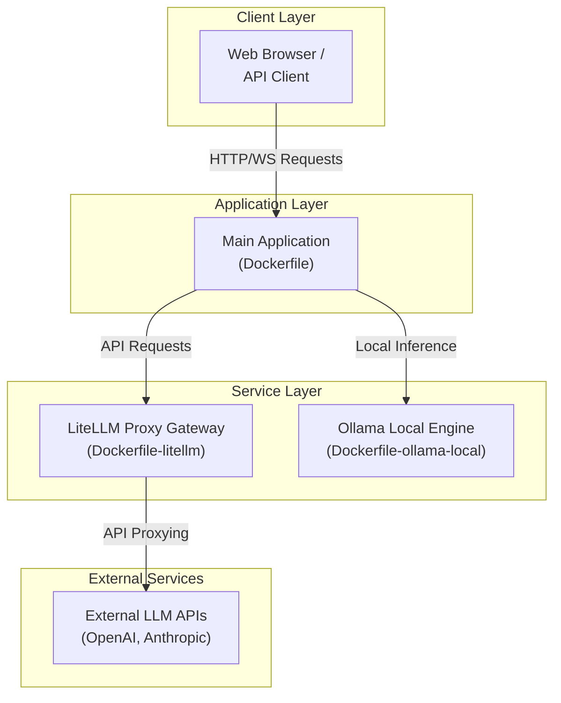

# Docker Deployment Wiki

## Overview
이 문서는 시스템의 Docker 기반 배포 환경 및 멀티 컨테이너 오케스트레이션 구성을 설명하는 기술 위키 페이지입니다. 애플리케이션 프레임워크와 외부 LLM Gateway인 LiteLLM, 그리고 로컬 LLM 엔진인 Ollama의 컨테이너화 및 유기적인 통합 배포 아키텍처를 다룹니다.

## Architecture
전체 시스템의 Docker 컨테이너 배치 및 데이터 흐름은 다음과 같은 레이어로 구성됩니다.



---

## Dockerfile Configurations

시스템을 구성하는 각 서비스는 독립적인 `Dockerfile` 설정을 통해 컨테이너 이미지로 빌드됩니다.

### 1. Main Application Dockerfile
* **Source File:** [Dockerfile](file:///Dockerfile)
* **Description:** 메인 애플리케이션의 런타임 환경을 정의합니다. 경량화된 베이스 이미지를 기반으로 멀티스테이지 빌드(Multi-stage Build) 아키텍처를 도입하여 최종 이미지 용량을 최소화하고 보안을 강화합니다.
* **Key Steps:**
  - **Builder Stage:** 의존성 패키지(Dependencies) 설치 및 정적 자산(Static Assets) 빌드.
  - **Runner Stage:** 프로덕션 실행에 필요한 최소한의 아티팩트와 런타임 환경 패키지만 포함. Non-root user를 생성하여 컨테이너 실행 권한 제한.

### 2. LiteLLM Proxy Dockerfile
* **Source File:** [Dockerfile-litellm](file:///Dockerfile-litellm)
* **Description:** 다양한 LLM 공급자(OpenAI, Anthropic, Cohere 등)의 API 키와 요청 포맷을 통합 관리하는 LiteLLM Proxy Gateway 서버의 컨테이너 이미지 설정을 담당합니다.
* **Key Features:**
  - `litellm` 공식 런타임 환경 구성.
  - 라우팅 규칙 및 모델 매핑을 위한 `config.yaml` 설정을 내부적으로 참조 및 로드.

### 3. Ollama Local LLM Dockerfile
* **Source File:** [Dockerfile-ollama-local](file:///Dockerfile-ollama-local)
* **Description:** 오프라인 및 로컬 인프라 환경에서 오픈소스 거대 언어 모델(Llama, Mistral 등)을 서빙하기 위한 Ollama 엔진 이미지 빌드 명세서입니다.
* **Key Features:**
  - GPU 가속(NVIDIA CUDA 등) 드라이버 지원 환경 설정 구성.
  - 컨테이너 시작 시 사전에 정의된 모델을 로컬로 자동 풀링(Pull)하는 부트스트랩 스크립트 레이어 포함.

---

## Docker Compose Configurations

여러 컨테이너 서비스들을 단일 네트워크 내에서 조율하고 구동하기 위한 YAML 정의 파일들입니다.

### 1. Multi-Container Orchestration
* **Source File:** [docker-compose.yml](file:///docker-compose.yml)
* **Description:** 메인 애플리케이션 컨테이너와 로컬 Ollama 서비스를 묶어 오케스트레이션하는 주 설정 파일입니다.
* **Core Services:**
  - `web-app`: 메인 웹 애플리케이션 서비스.
  - `ollama`: GPU 가속 지원 하에 내부 API를 통해 `web-app`에 추론 기능을 제공하는 백엔드 서비스.
  - **Networking:** 브리지 네트워크(Bridge Network) 구성을 통해 컨테이너 간 안전한 내부 통신을 보장합니다.

### 2. LiteLLM Integration Compose
* **Source File:** [docker-compose-litellm.yml](file:///docker-compose-litellm.yml)
* **Description:** LiteLLM 프록시 서비스를 별도로 분리하거나, 기존 스택에 플러그인 형태로 병합하여 구동하기 위한 Compose 확장 설정 파일입니다.
* **Core Services:**
  - `litellm`: 외부 상용 LLM 서비스에 대한 인증 및 라우팅 허브 역할을 수행합니다.
  - **Environment Variables:** 다수의 외부 API Key 관리 및 마운트 볼륨을 통한 `config.yaml` 맵핑 지원.

---

## Deployment Guides

Docker 및 Docker Compose를 사용한 구체적인 배포 운영 절차입니다. 상세 설명은 [docs/docker.md](file:///docs/docker.md)를 참고하십시오.

### Prerequisites
배포를 시작하기 전에 호스트 머신에 다음 소프트웨어가 설치되어 있어야 합니다.
- Docker Engine v24.0.0 이상
- Docker Compose v2.20.0 이상
- (선택 사항) 로컬 GPU 가속 이용 시: NVIDIA Container Toolkit

### Deployment Steps

1. **Environment Variables Configuration**
   배포에 필요한 환경 변수(`.env` 파일)를 작성합니다.
   ```bash
   # Port Settings
   APP_PORT=3000
   OLLAMA_PORT=11434
   LITELLM_PORT=4000
   
   # API Keys
   OPENAI_API_KEY=your-openai-key
   ```

2. **Build and Run (Standard Mode)**
   메인 애플리케이션과 로컬 LLM 구성을 실행합니다.
   ```bash
   docker compose up -d --build
   ```

3. **Build and Run with LiteLLM Gateway**
   LiteLLM 프록시 서버를 포함하여 함께 배포하려면 다음 명령어를 사용합니다.
   ```bash
   docker compose -f docker-compose.yml -f docker-compose-litellm.yml up -d --build
   ```

4. **Service Verification**
   컨테이너의 작동 유무 및 헬스 체크를 수행합니다.
   ```bash
   docker compose ps
   docker compose logs -f
   ```

---

## Best Practices

성공적인 Docker 배포 및 프로덕션 환경 운영을 위해 아래의 권장 조치 사항을 준수할 것을 권장합니다.

1. **Volume Mount Management**
   - Ollama의 가중치 파일(Weight Files)이나 데이터베이스 컨텐츠 등 영속성이 요구되는 데이터는 호스트 볼륨(`volumes`)을 정의하여 컨테이너 재생성 시 데이터가 소실되지 않도록 관리합니다.

2. **Security & Non-root Users**
   - 프로덕션 컨테이너는 루트 권한으로 실행되지 않아야 합니다. 각 `Dockerfile` 내에 전용 유저를 정의하고 권한을 조정하십시오.

3. **Resource Constraints**
   - 특히 Ollama와 같은 로컬 모델 인프라는 CPU/Memory 사용량이 극도로 높아질 수 있으므로, `docker-compose.yml` 내에 `deploy.resources.limits` 옵션을 명시하여 컨테이너가 호스트 전체 리소스를 독점하지 않도록 제어해야 합니다.

---
*참조 및 상세 정보는 [docs/docker.md](file:///docs/docker.md) 문서를 참고하십시오.*
