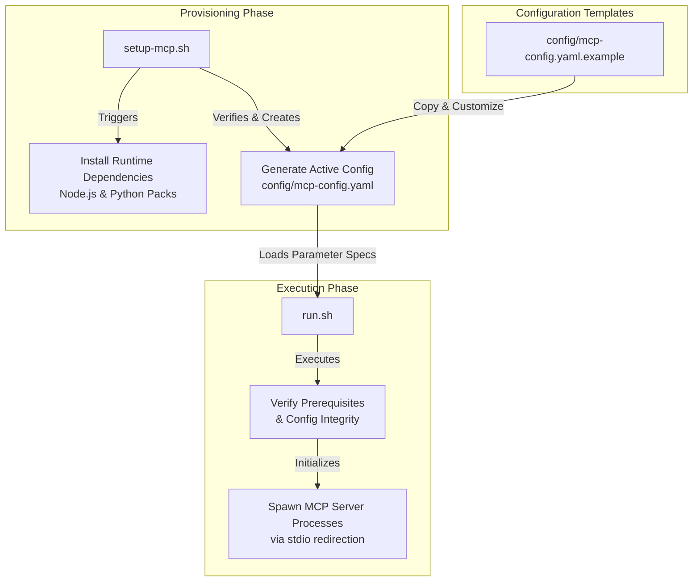

# Scripts and Configurations

## Introduction
이 문서는 시스템의 초기 환경 설정 및 런타임 실행을 관리하는 스크립트와 설정 구조를 정의하는 technical wiki page입니다. 본 프로젝트는 Model Context Protocol (MCP) 호환 서버를 관리하고 통합 구동하기 위해 자동화된 쉘 스크립트와 선언적 YAML 설정 파일을 사용합니다.

## Overview
본 가이드의 내용은 다음 소스 파일들을 기반으로 작성되었습니다.
* **[setup-mcp.sh](file:///Users/jcjeong/.gemini/antigravity-cli/scratch/setup-mcp.sh)**: MCP 환경 및 필요한 런타임 의존성을 Provisioning하고 초기화하는 셋업 스크립트입니다.
* **[run.sh](file:///Users/jcjeong/.gemini/antigravity-cli/scratch/run.sh)**: 어플리케이션을 기동하고 구성된 MCP 서버 인스턴스들을 부트스트랩하는 런타임 엔트리포인트 스크립트입니다.
* **[config/mcp-config.yaml.example](file:///Users/jcjeong/.gemini/antigravity-cli/scratch/config/mcp-config.yaml.example)**: 시스템에 마운트할 MCP 서버 목록, 구동 인자 및 환경 변수를 정의한 템플릿 설정 파일입니다.

---

## System Architecture and Data Flow

시스템 초기화 단계부터 런타임 실행 단계까지의 구성 요소 간 상호작용 및 데이터 흐름은 다음과 같습니다.



---

## Detailed Specifications of Components

### 1. setup-mcp.sh
`[setup-mcp.sh](file:///Users/jcjeong/.gemini/antigravity-cli/scratch/setup-mcp.sh)`는 인프라스트럭처의 최초 빌드 및 환경 프로비저닝을 전담합니다.

* **Key Responsibilities**:
  * **Runtime Engine Validation**: 시스템의 기본 요구사항인 Node.js, Python, npm, pip 런타임 엔진이 사용 가능한 상태인지 식별합니다.
  * **Automated Dependency Resolution**: MCP 도구 동작에 요구되는 외부 Node 패키지 및 Python 라이브러리를 일괄적으로 설치합니다.
  * **Configuration Bootstrapping**: `config/mcp-config.yaml` 파일이 감지되지 않는 경우, `config/mcp-config.yaml.example` 템플릿을 자동으로 복제하여 기본 프로필을 설정합니다.
  * **File Permissions adjustment**: 실행 프로세스 체인 내에 필요한 모든 쉘 파일에 실행 권한(`chmod +x`)을 보장합니다.

### 2. run.sh
`[run.sh](file:///Users/jcjeong/.gemini/antigravity-cli/scratch/run.sh)`는 어플리케이션의 라이프사이클을 조정하고 주 프로세스를 구동하는 마스터 오케스트레이션 쉘 스크립트입니다.

* **Runtime Sequence**:
  * **Prerequisite Validation**: 실행 전 `config/mcp-config.yaml` 활성 설정 파일의 가용성을 최종 확인하고 빌드 결과물(artifacts)을 점검합니다.
  * **Environment Setup**: 서브프로세스 기동을 위해 필수 시스템 환경 변수(Environment Variables)를 메모리에 바인딩하고 내보내기(`export`)를 처리합니다.
  * **Process Spawning & Binding**: 설정에 등록된 개별 MCP 서버 목록을 순회하여 Node/Python 자식 프로세스를 기동하고, Stdio 파이프라인을 메인 어플리케이션 컨텍스트에 연결합니다.

### 3. config/mcp-config.yaml.example
`[config/mcp-config.yaml.example](file:///Users/jcjeong/.gemini/antigravity-cli/scratch/config/mcp-config.yaml.example)` 파일은 다중 MCP 서버 클라이언트를 선언식으로 정의할 수 있는 구성 청사진을 제공합니다.

* **Key Schema Elements**:
  * `mcpServers`: 연동할 모든 MCP 서버 정의 블록들의 상위 그룹 노드입니다.
  * `command`: 서버 기동을 담당하는 최상위 실행 명령어(예: `npx`, `node`, `python3`)를 구성합니다.
  * `args`: 실행 시점에 명령어에 넘겨줄 커맨드라인 파라미터 배열(arguments array)입니다.
  * `env`: 각 MCP 서버 커넥션 범위 내에서 격리되어 격리 주입되는 환경 변수 맵(environment variables key-value block)입니다. API Key, 인증 엔드포인트(Authentication Endpoints), 로깅 레벨(Logging Level) 설정을 다룹니다.

---

## Deployment and Setup Guide

### Prerequisites
* macOS 호환 시스템 환경 (bash / zsh)
* Node.js v18 이상 및 npm
* Python v3.9 이상 및 pip

### Setup Instructions

1. **Clone the Repository and Navigate to Workspace**:
   레포지토리를 클론한 후 작업 디렉토리의 루트로 이동합니다.

2. **Initialize Configuration**:
   기본 템플릿인 `[config/mcp-config.yaml.example](file:///Users/jcjeong/.gemini/antigravity-cli/scratch/config/mcp-config.yaml.example)`을 기반으로 활성 설정 파일을 생성합니다.
   ```bash
   bash -c "cp config/mcp-config.yaml.example config/mcp-config.yaml"
   ```
   생성된 `config/mcp-config.yaml` 파일을 편집하여 로컬 환경에 맞는 실행 경로와 필요한 API Key들을 입력합니다.

3. **Run Initialization Script**:
   런타임 구동에 필요한 기본 빌드 및 의존성 주입을 시작합니다.
   ```bash
   bash -c "./setup-mcp.sh"
   ```

4. **Start Application**:
   설정된 MCP 서버 프로세스들을 실행하고 어플리케이션 서비스를 바인딩합니다.
   ```bash
   bash -c "./run.sh"
   ```

---

> [!WARNING]
> `config/mcp-config.yaml` 내부에는 외부 인증용 API Key나 개인 토큰 등 중요 Credentials 데이터가 포함되므로, 이를 원격 소스코드 저장소에 업로드하지 않도록 반드시 `.gitignore` 파일에 대상 파일명을 누락 없이 포함시켜야 합니다.

> [!NOTE]
> 만약 특정 MCP 서버가 실행 도중 예외 에러나 커넥션 실패를 발생시키는 경우, `mcp-config.yaml` 내 해당 서버 블록의 `env` 속성에서 `DEBUG` 또는 `LOG_LEVEL` 환경 변수를 `debug`로 상향 조정한 후 다시 시도해 주십시오.
