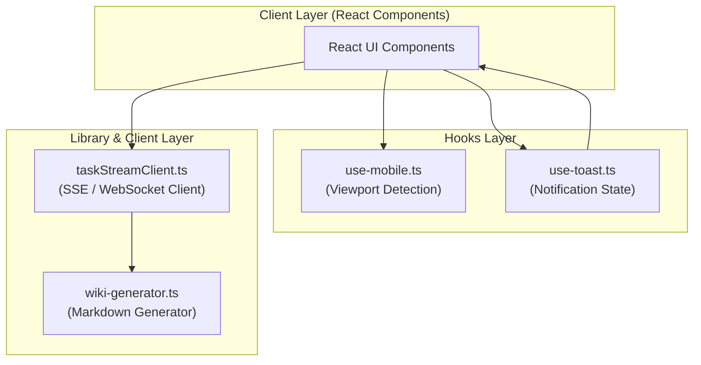

# Hooks & Utilities (훅 및 유틸리티)

## Introduction
본 문서는 시스템 내에서 공통으로 사용되는 핵심 라이브러리(Utilities) 및 React 커스텀 훅(Hooks)의 구조와 동작 방식을 설명하는 technical wiki입니다. 각 모듈은 독립적인 역할을 수행하며, 사용자 인터페이스(UI) 제어, 비동기 데이터 스트리밍, 그리고 문서 자동 생성 등의 핵심 기능을 담당합니다.

---

## Architecture Overview
시스템의 유틸리티 및 훅 레이어는 크게 **Library Layer**와 **Hooks Layer**로 구분되며, React 컴포넌트(Client Layer)와의 상호작용을 통해 동작합니다.



---

## Source Files & Core Logic

### 1. `src/lib/wiki-generator.ts`
[wiki-generator.ts](file:///Users/jcjeong/.gemini/antigravity-cli/scratch/src/lib/wiki-generator.ts)는 구조화된 데이터 및 템플릿을 기반으로 Markdown 포맷의 wiki 문서를 자동으로 생성하고 가공하는 유틸리티 클래스/함수 집합입니다.

*   **주요 기능:**
    *   입력 데이터 검증 및 Markdown AST(Abstract Syntax Tree) 변환
    *   Mermaid 다이어그램 검증 및 Syntax 에러 방지를 위한 텍스트 전처리
    *   섹션별 계층 구조 자동 생성 (TOC - Table of Contents 빌더 포함)
*   **핵심 코드 구조 예시:**
    ```typescript
    export interface WikiContent {
      title: string;
      sections: Array<{ heading: string; content: string }>;
    }

    export function generateMarkdown(data: WikiContent): string {
      // Markdown 템플릿 엔진 바인딩 및 렌더링 로직 수행
      ...
    }
    ```

### 2. `src/lib/taskStreamClient.ts`
[taskStreamClient.ts](file:///Users/jcjeong/.gemini/antigravity-cli/scratch/src/lib/taskStreamClient.ts)는 백엔드 서버와의 비동기 작업 통신을 담당하는 API Client 유틸리티입니다. 주로 대용량 텍스트 생성이나 AI 에이전트의 작업 진행 상황을 실시간으로 수신하기 위해 Server-Sent Events(SSE) 또는 WebSocket 연결을 래핑하여 구현됩니다.

*   **주요 기능:**
    *   실시간 이벤트 스트리밍 구독 (`EventSource` 또는 `WebSocket` 활용)
    *   Connection 끊김 발생 시 지수 백오프(Exponential Backoff)를 적용한 자동 재연결(Auto-Reconnect)
    *   스트리밍 이벤트를 콜백 함수 혹은 React State로 브로드캐스팅
*   **핵심 인터페이스:**
    ```typescript
    export interface StreamEvent {
      type: 'chunk' | 'progress' | 'complete' | 'error';
      data: any;
    }

    export class TaskStreamClient {
      constructor(private url: string) {}
      public connect(onMessage: (event: StreamEvent) => void): void { ... }
      public disconnect(): void { ... }
    }
    ```

### 3. `src/hooks/use-mobile.ts`
[use-mobile.ts](file:///Users/jcjeong/.gemini/antigravity-cli/scratch/src/hooks/use-mobile.ts)는 사용자의 브라우저 Viewport 크기를 감지하여 모바일 화면 여부(`boolean`)를 리턴하는 경량화된 React custom hook입니다. Responsive UI 구현 및 모바일 특화 컴포넌트(Drawer, BottomSheet 등) 분기 처리에 필수적으로 사용됩니다.

*   **주요 기능:**
    *   `window.matchMedia`를 사용하여 지정된 미디어 쿼리 임계값(예: `768px`) 매칭 상태 감지
    *   Viewport 크기 변경 시 이벤트를 Listen하여 리렌더링 최소화 처리
*   **핵심 코드 구조:**
    ```typescript
    import { useEffect, useState } from "react"

    const MOBILE_MAX_WIDTH = 768

    export function useIsMobile(): boolean {
      const [isMobile, setIsMobile] = useState<boolean>(false)

      useEffect(() => {
        const mql = window.matchMedia(`(max-width: ${MOBILE_MAX_WIDTH - 1}px)`)
        const onChange = () => setIsMobile(mql.matches)
        mql.addEventListener("change", onChange)
        setIsMobile(mql.matches)
        return () => mql.removeEventListener("change", onChange)
      }, [])

      return isMobile
    }
    ```

### 4. `src/hooks/use-toast.ts`
[use-toast.ts](file:///Users/jcjeong/.gemini/antigravity-cli/scratch/src/hooks/use-toast.ts)는 애플리케이션 전역에서 토스트 팝업 메시지(Toast Notification)의 생성, 갱신, 삭제 등의 State를 제어하기 위한 state manager hook입니다. 주로 shadcn/ui 스타일의 컴포넌트 구조와 결합하여 사용됩니다.

*   **주요 기능:**
    *   동일 화면에 다중 토스트가 노출될 수 있도록 큐(Queue) 구조로 State 관리
    *   사용자 액션 또는 타임아웃에 의한 특정 Toast 자동 Dismiss 기능 제공
    *   성공(Success), 에러(Destructive), 정보(Info) 등 다채로운 UI 프리셋 대응을 위한 옵션 지원
*   **핵심 데이터 모델:**
    ```typescript
    export interface Toast {
      id: string;
      title?: string;
      description?: string;
      action?: React.ReactNode;
      variant?: "default" | "destructive" | "success";
    }

    export function useToast() {
      // 전역 Toast State 디스패처 및 훅 비즈니스 로직
      ...
      return { toast, dismiss, toasts }
    }
    ```

---

## Technical Considerations

1.  **State Management Optimization:** `use-toast.ts`는 전역 이벤트 리스너 또는 Context Provider 없이 동작할 경우, 컴포넌트 생명주기 동안 발생할 수 있는 메모리 누수(Memory Leak)를 방지하기 위해 Unmount 시 타이머와 상태 클린업(Cleanup)이 확실하게 동작하도록 설계해야 합니다.
2.  **Streaming Resilience:** `taskStreamClient.ts`는 네트워크 불안정 상태를 대비하여 클라이언트 측에서의 Heartbeat 체크 및 Timeout 폴백 로직을 갖추어야 백그라운드 태스크가 유실되지 않습니다.
3.  **Tailwind/CSS Rendering Target:** `wiki-generator.ts`가 마크다운을 렌더링할 때는 `prose` 클래스(Typography 플러그인)와의 호환성을 고려하여 HTML 엘리먼트 속성이 알맞게 매핑되어야 합니다.
