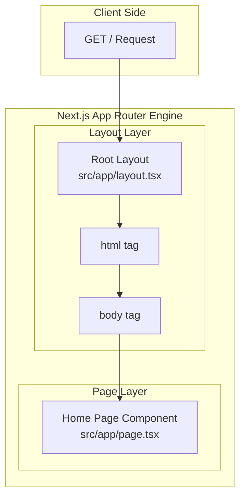

# Pages and Layouts (페이지 및 레이아웃)

## Overview
Next.js App Router는 파일 시스템 기반 라우팅을 사용하며, UI를 구성하는 핵심 단위로 Pages와 Layouts를 제공합니다. 본 문서는 [src/app/layout.tsx](file:///Users/jcjeong/.gemini/antigravity-cli/scratch/src/app/layout.tsx)와 [src/app/page.tsx](file:///Users/jcjeong/.gemini/antigravity-cli/scratch/src/app/page.tsx) 소스 파일을 기준으로 Next.js의 레이아웃 및 페이지 렌더링 구조와 상호 관계를 설명합니다.

## Introduction
Next.js App Router에서 모든 경로는 폴더 구조로 정의되며, 해당 폴더 내의 특정 파일명이 특별한 역할을 수행합니다.
- **layout.tsx**: 복수의 페이지 간에 공유되는 UI를 정의합니다. 상태(State)를 유지하고, 불필요한 리렌더링을 방지하며, 중첩(Nesting)이 가능합니다.
- **page.tsx**: 특정 경로(Route)의 고유한 UI를 나타내며, 사용자가 직접 브라우저를 통해 접근할 수 있는 화면을 렌더링합니다.

## Architecture & Directory Structure
애플리케이션의 기본 진입점(Entrypoint) 폴더 및 파일 구조는 다음과 같습니다.

```
src/
└── app/
    ├── layout.tsx  # Root Layout
    └── page.tsx    # Home Page
```

### File Citations
- **Root Layout File**: [src/app/layout.tsx](file:///Users/jcjeong/.gemini/antigravity-cli/scratch/src/app/layout.tsx)
- **Home Page File**: [src/app/page.tsx](file:///Users/jcjeong/.gemini/antigravity-cli/scratch/src/app/page.tsx)

## Core Components

### Root Layout (`src/app/layout.tsx`)
[src/app/layout.tsx](file:///Users/jcjeong/.gemini/antigravity-cli/scratch/src/app/layout.tsx)는 애플리케이션의 최상위 레이아웃(Root Layout)으로, 애플리케이션 전체에 공통으로 적용되는 설정을 담당합니다.
- **Role**: 최상위 `<html>` 및 `<body>` 태그를 반드시 포함해야 하며, 전역 폰트 설정, 메타데이터(Metadata), 글로벌 CSS 스타일, 그리고 전역 상태 공급자(Global Providers)를 선언합니다.
- **Props**: `children` 프로프(React.ReactNode)를 필수적으로 전달받아 하위 컴포넌트(페이지 또는 중첩 레이아웃)를 렌더링합니다.

### Home Page (`src/app/page.tsx`)
[src/app/page.tsx](file:///Users/jcjeong/.gemini/antigravity-cli/scratch/src/app/page.tsx)는 애플리케이션의 루트 경로(`/`)에 매핑되는 엔트리 페이지 컴포넌트입니다.
- **Role**: 사용자가 웹 서비스에 최초 진입했을 때 보게 되는 메인 UI 화면을 담당하며, 독자적인 컴포넌트 구조와 데이터 바인딩을 가집니다.
- **Server Components by Default**: Next.js App Router의 컴포넌트들은 기본적으로 React Server Components(RSC)로 설정되므로, 서버 사이드에서 데이터를 사전에 패칭(Data Fetching)하고 클라이언트로 빌드된 HTML을 전달하여 렌더링 성능을 최적화합니다.

## Rendering Flow & Hierarchy
클라이언트의 요청이 Next.js App Router 내에서 어떻게 레이아웃과 페이지 컴포넌트로 전달되고 조립되는지 보여주는 구조도입니다.



이 계층 구조에서 [page.tsx](file:///Users/jcjeong/.gemini/antigravity-cli/scratch/src/app/page.tsx) 컴포넌트는 [layout.tsx](file:///Users/jcjeong/.gemini/antigravity-cli/scratch/src/app/layout.tsx)가 제공하는 `<body>` 내의 `children` 영역으로 자동 삽입(Dependency Injection)되어 하나의 완전한 HTML 문서로 병합된 후 브라우저에 최종 렌더링됩니다.

## Conclusion
Next.js App Router의 페이지 및 레이아웃 시스템은 파일 구조 기반의 엄격한 규칙을 준수합니다. [layout.tsx](file:///Users/jcjeong/.gemini/antigravity-cli/scratch/src/app/layout.tsx)를 활용하여 공통 UI 구조를 격리하고 불필요한 네트워크 트래픽을 감축하며, [page.tsx](file:///Users/jcjeong/.gemini/antigravity-cli/scratch/src/app/page.tsx)를 사용해 각 라우트별 독립적인 도메인 콘텐츠와 비즈니스 로직을 효율적으로 분리할 수 있습니다.
