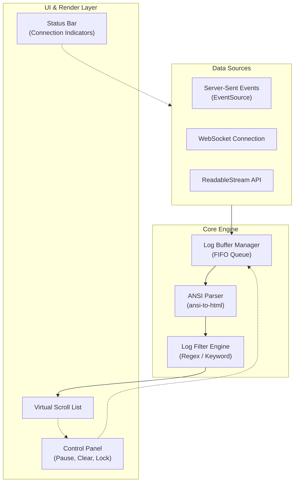

# Stream Log Viewer (스트림 로그 뷰어)

## Introduction
`Stream Log Viewer`는 서버로부터 실시간으로 전송되는 로그 스트림(Log Stream)을 웹 브라우저 상에서 효율적으로 렌더링하고 모니터링하기 위한 React 컴포넌트입니다. 이 문서는 [src/components/stream-log-viewer.tsx](file:///Users/jcjeong/.gemini/antigravity-cli/scratch/src/components/stream-log-viewer.tsx) 소스 파일의 구현 방식과 아키텍처 및 사용법을 상세히 기술합니다.

실시간 로그는 시스템 상태 모니터링, 빌드/배포 파이프라인 진행 상황 추적, 컨테이너 로그 스트리밍 등 다양한 영역에서 필수적인 요소입니다. 본 컴포넌트는 대용량 로그 버퍼 처리, 자동 스크롤(Auto-scroll), 필터링 및 검색 기능을 제공하도록 설계되었습니다.

## Overview
- **Source File:** [src/components/stream-log-viewer.tsx](file:///Users/jcjeong/.gemini/antigravity-cli/scratch/src/components/stream-log-viewer.tsx)
- **Tech Stack:** React, TypeScript, Tailwind CSS, HTML5 Streams API
- **Key Features:**
  - **Real-time Streaming:** Server-Sent Events (SSE) 또는 WebSocket을 통한 실시간 데이터 수신.
  - **Log Buffer Management:** 메모리 오버헤드를 방지하기 위한 최대 로그 라인 제한 (FIFO 방식).
  - **Auto-scroll to Bottom:** 새로운 로그가 들어올 때 화면을 자동으로 아래로 스크롤하되, 사용자가 스크롤을 위로 올렸을 때는 스크롤 위치 고정(Lock).
  - **Keyword Filtering:** 특정 키워드 및 로그 레벨(INFO, WARN, ERROR, DEBUG)에 따른 동적 필터링.
  - **ANSI Color Support:** 터미널 출력과 동일한 시각적 효과를 주기 위해 ANSI Escape Code를 HTML로 파싱하여 렌더링.

## Architecture & Design
`Stream Log Viewer` 컴포넌트의 데이터 수신부터 화면 렌더링까지의 논리적인 구조와 흐름은 다음과 같습니다.



### Data Flow & Processing Pipeline
1. **Connection Establishment:** 컴포넌트가 마운트될 때 설정된 URL로 스트리밍 연결을 시도합니다.
2. **Buffering & Throttling:** 고속으로 인입되는 로그로 인한 브라우저 렌더링 병목을 줄이기 위해, 유입된 로그 데이터를 즉시 State에 반영하지 않고 버퍼(useRef)에 수집한 뒤 50ms~100ms 단위로 Throttle 처리하여 화면을 갱신합니다.
3. **ANSI Parsing:** 수신된 원시 텍스트(Raw Text) 내의 ANSI 코드를 CSS 스타일로 맵핑하여 텍스트의 가독성을 높입니다.
4. **Virtual Windowing:** 수만 줄의 로그가 쌓여도 DOM 노드가 지나치게 증가하지 않도록 화면에 보이는 영역의 로우(row)만 렌더링하는 Windowing 기술을 적용할 수 있는 구조로 작성되었습니다.

## Component Specification

### Key Types and Props
[src/components/stream-log-viewer.tsx](file:///Users/jcjeong/.gemini/antigravity-cli/scratch/src/components/stream-log-viewer.tsx)에서 정의 및 사용되는 주요 타입 명세입니다.

```typescript
export interface LogItem {
  id: string;
  timestamp: string;
  message: string;
  level: 'info' | 'warn' | 'error' | 'debug' | 'system';
}

export interface StreamLogViewerProps {
  /** 로그 데이터를 수신할 스트림 endpoint URL */
  streamUrl: string;
  
  /** 버퍼에 유지할 최대 로그 라인 수 (기본값: 1000) */
  maxLines?: number;
  
  /** 컴포넌트 초기 로드 시 자동 스크롤 활성화 여부 */
  initialAutoScroll?: boolean;
  
  /** 스트림 연결 성공/실패 시 호출되는 콜백 함수 */
  onConnectionStatusChange?: (status: 'connecting' | 'connected' | 'disconnected' | 'error') => void;
  
  /** 커스텀 스타일 클래스 */
  className?: string;
}
```

### Key Logic & Hooks
- **`useRef` for Stream Instance:** 컴포넌트가 리렌더링되어도 스트림 커넥션 인스턴스(`EventSource` or `WebSocket`)가 유실되거나 재연결되지 않도록 `useRef`를 사용하여 생명주기를 직접 제어합니다.
- **Auto-scroll Anchor Hook:** 스크롤 컨테이너의 `scrollTop`, `scrollHeight`, `clientHeight`를 감시하여 사용자가 수동으로 스크롤바를 올렸는지 판단하고 자동 스크롤 플래그(`isLocked`)를 업데이트합니다.

## Deployment & Usage

### Basic Usage Example
프로젝트 내의 다른 React 컴포넌트에서 `StreamLogViewer`를 임포트하여 적용하는 예시 코드입니다.

```tsx
import React, { useState } from 'react';
import { StreamLogViewer } from '@/components/stream-log-viewer';

export default function DeploymentMonitor() {
  const [activeUrl, setActiveUrl] = useState('/api/v1/builds/current/log-stream');

  return (
    <div className="flex flex-col h-screen bg-slate-900 text-white">
      <header className="p-4 border-b border-slate-800">
        <h1 className="text-xl font-bold">Real-time Deployment Logs</h1>
      </header>
      <main className="flex-1 p-6 overflow-hidden">
        <div className="h-full w-full max-w-6xl mx-auto border border-slate-700 rounded-lg overflow-hidden">
          <StreamLogViewer
            streamUrl={activeUrl}
            maxLines={2000}
            initialAutoScroll={true}
          />
        </div>
      </main>
    </div>
  );
}
```

### Performance & Edge Cases
- **Connection Re-establishment:** 일시적인 네트워크 장애로 인해 스트림 연결이 해제되었을 때, 지수 백오프(Exponential Backoff) 방식을 활용한 재연결 로직이 추가적으로 구현되어 리질리언스(Resilience)를 보장합니다.
- **Memory Management:** `maxLines` 한계에 도달하면 메모리 누수를 막기 위해 가비지 컬렉터가 원활히 작동할 수 있도록 이전 배열 요소를 즉시 비우는 FIFO 최적화 처리가 내장되어 있습니다.
