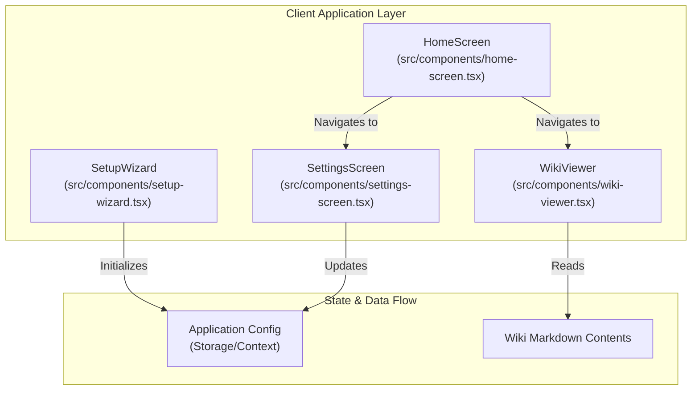
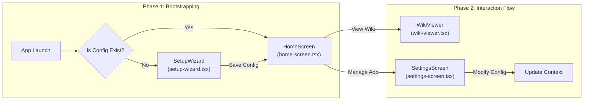

# 사용자 인터페이스 구성 요소 (User Interface Components)

## Overview
본 문서는 시스템의 핵심 사용자 인터페이스(UI)를 구성하는 React 컴포넌트들의 구조와 상호작용에 대해 설명합니다. 애플리케이션은 초기 설정을 위한 `SetupWizard`, 메인 진입점인 `HomeScreen`, 위키 콘텐츠를 렌더링하고 탐색하는 `WikiViewer`, 그리고 시스템 환경설정을 관리하는 `SettingsScreen`으로 구성됩니다.

---

## Component Architecture

시스템의 UI 계층 구조는 다음과 같이 정의할 수 있으며, 각 컴포넌트는 단일 책임 원칙(Single Responsibility Principle)에 따라 설계되었습니다.

---

## Core Components

### 1. SetupWizard (`src/components/setup-wizard.tsx`)
`SetupWizard` 컴포넌트는 사용자가 애플리케이션을 처음 실행했을 때 필수 설정을 단계별로 안내하는 초기 온보딩 UI입니다.

* **주요 기능 (Key Features):**
  * 사용자 기본 정보 입력 및 서비스 동의 흐름 제어.
  * API Key 설정 및 연결 테스트 수행.
  * 로컬 데이터 저장소 또는 초기 디렉토리 경로 지정.
* **데이터 흐름 (Data Flow):**
  * 각 단계(Step)의 상태는 로컬 State로 관리되며, 모든 단계가 성공적으로 완료되면 최종 Configuration 객체가 생성되어 전역 상태(Context) 또는 로컬 스토리지에 저장됩니다.

### 2. HomeScreen (`src/components/home-screen.tsx`)
`HomeScreen`은 애플리케이션의 메인 대시보드 역할을 수행하는 컴포넌트입니다.

* **주요 기능 (Key Features):**
  * 최근 방문한 문서 목록 및 즐겨찾기(Favorites) 제공.
  * 위키 검색 인터페이스 제공.
  * 주요 기능 화면(`WikiViewer`, `SettingsScreen`)으로 이동할 수 있는 내비게이션 허브 역할.
* **디자인 및 레이아웃 (Design & Layout):**
  * 그리드 기반의 레이아웃을 사용하며, 사용자의 빠른 접근을 돕기 위한 퀵 링크 카드가 포함되어 있습니다.

### 3. WikiViewer (`src/components/wiki-viewer.tsx`)
`WikiViewer` 컴포넌트는 Markdown 형식으로 작성된 기술 문서를 파싱하고 화면에 렌더링하는 뷰어 컴포넌트입니다.

* **주요 기능 (Key Features):**
  * Markdown-to-HTML 실시간 렌더링.
  * 사이드바 영역에 문서 목차(Table of Contents, TOC)를 자동 생성하여 계층 구조 제공.
  * 코드 블록 하이라이팅 및 앵커 링크 지원.
* **확장성 (Extensibility):**
  * 소스 파일인 `src/components/wiki-viewer.tsx` 내에서 커스텀 Markdown 컴포넌트를 정의하여, 표준 스펙 외의 경고창(Alerts)이나 다이어그램 렌더링을 처리합니다.

### 4. SettingsScreen (`src/components/settings-screen.tsx`)
`SettingsScreen`은 애플리케이션의 런타임 환경설정을 변경할 수 있는 사용자 인터페이스입니다.

* **주요 기능 (Key Features):**
  * 테마 설정 (Dark/Light Mode toggling).
  * 연동 API 엔드포인트 수정 및 데이터 백업/복원 기능 제공.
  * 초기 설정 마법사(`SetupWizard`)의 재실행 트리거 제공.
* **상태 반영 (State Reflection):**
  * 설정 변경 시 즉시 애플리케이션의 Context State가 업데이트되어 모든 UI 컴포넌트에 디자인 토큰 및 동작 사양이 동적으로 동기화됩니다.

---

## Component Interactions & Data Flow

컴포넌트 간의 탐색(Navigation) 및 상태 변경 라이프사이클은 다음과 같이 흐릅니다.

### 상호작용 상세 (Interaction Details)
* **Configuration Lifecycle:** `SetupWizard`(`src/components/setup-wizard.tsx`)를 거쳐 생성된 Config 파일은 `SettingsScreen`(`src/components/settings-screen.tsx`)에서 언제든지 재설정할 수 있습니다.
* **Rendering Pipeline:** `HomeScreen`(`src/components/home-screen.tsx`)에서 선택된 특정 문서의 경로 정보는 `WikiViewer`(`src/components/wiki-viewer.tsx`)로 전달되며, 뷰어는 파일 시스템 또는 원격 리포지토리로부터 콘텐츠를 로드하여 사용자에게 렌더링합니다.
