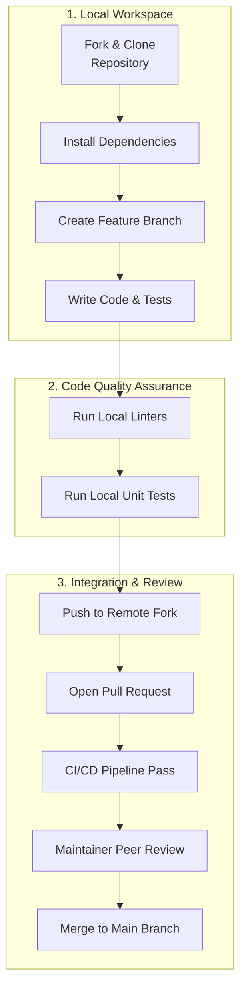

# 기여 가이드 (Contributing Guide)

이 문서는 프로젝트에 기여하는 개발자들을 위한 가이드라인입니다. 소스 코드 수정, 문서 개선, 버그 제보 등 모든 형태의 기여를 환영합니다. 이 가이드는 [CONTRIBUTING.md](file:///CONTRIBUTING.md) 파일을 기반으로 작성되었습니다.

---

## Overview

프로젝트의 지속 가능한 개발과 코드 퀄리티 유지를 위해 모든 기여자는 일관된 프로세스를 따라야 합니다. 아래 다이어그램은 로컬 개발 환경 설정부터 최종 코드 반영(Merge)까지의 전체 Contribution Workflow를 보여줍니다.



---

## Getting Started

### Prerequisites
기여를 시작하기 전에 로컬 환경에 다음 구성 요소가 설치되어 있어야 합니다.
- **Git** (Version 2.25.0 이상)
- **Node.js** (Active LTS Version, e.g., v18 or v20)
- **Package Manager**: `npm` 또는 `yarn`

### Local Development Setup
1. 원본 저장소를 개인 계정으로 **Fork**합니다.
2. Fork한 저장소를 로컬 머신에 **Clone**합니다.
   ```bash
   git clone https://github.com/<your-username>/project-name.git
   cd project-name
   ```
3. 원본 저장소를 `upstream` 원격 저장소로 등록합니다.
   ```bash
   git remote add upstream https://github.com/original-owner/project-name.git
   ```
4. 의존성 패키지를 설치합니다.
   ```bash
   npm install
   ```

---

## Branching Strategy

프로젝트는 Git Flow 모델을 단순화한 브랜치 전략을 사용합니다. 모든 신규 개발 및 버그 수정은 적절한 접두사를 가진 브랜치에서 진행되어야 합니다.

- **Main Branch (`main`)**: 상시 배포 가능한 상태를 유지하는 최상위 브랜치입니다.
- **Feature Branch**: 새로운 기능 개발이나 버그 수정을 위한 작업 공간입니다.
  - 기능 개발: `feature/issue-<number>` 또는 `feat/<feature-name>`
  - 버그 수정: `bugfix/issue-<number>` 또는 `fix/<bug-name>`
  - 문서 수정: `docs/<document-name>`

---

## Code Standards & Linting

일관된 코드 스타일을 유지하고 런타임 오류를 최소화하기 위해 Static Analysis 툴을 활성화해 두었습니다.

- **Formatter**: `prettier`를 사용하여 코드 레이아웃을 자동 정리합니다.
- **Linter**: `eslint`를 사용하여 코드 내 위험 요소를 실시간 감지합니다.
- 코드 작성 후 커밋을 생성하기 전에 반드시 아래 스크립트를 수행하여 Linting 에러가 없는지 확인하십시오.
  ```bash
  npm run lint
  npm run format:check
  ```

---

## Commit Message Guidelines

커밋 메시지는 Git 히스토리를 명확하게 유지하기 위해 **Conventional Commits** 사양을 따릅니다.

### Commit Format
```text
<type>(<scope>): <subject>

<body>

<footer>
```

- **Type 목록**:
  - `feat`: 새로운 기능 추가
  - `fix`: 버그 수정
  - `docs`: 문서 변경 (README, CONTRIBUTING 등)
  - `style`: 코드 스타일 수정 (포맷팅, 세미콜론 누락 등, 로직 변경 없음)
  - `refactor`: 리팩토링 (코드 가독성 개선, 성능 최적화 등)
  - `test`: 테스트 코드 추가 및 수정
  - `chore`: 빌드 업무, 패키지 매니저 설정, 의존성 라이브러리 추가 등

- **Example**:
  ```text
  feat(auth): add JWT expiration validation

  - implement token validation inside middleware
  - return 401 Unauthorized when token expires

  Closes #142
  ```

---

## Pull Request (PR) Submission

작업이 완료되면 `main` 브랜치를 대상으로 Pull Request를 오픈할 수 있습니다.

1. 로컬의 최신 변경 사항을 본인의 원격 저장소(Fork)로 `push`합니다.
   ```bash
   git push origin feature/my-new-feature
   ```
2. GitHub Repository 페이지에서 **Compare & pull request** 버튼을 클릭합니다.
   ```text
   Base repository: original-owner/project-name (branch: main)
   Head repository: your-username/project-name (branch: feature/my-new-feature)
   ```
3. PR Template의 항목을 충실히 기입합니다.
   - 작업 내용 요약 (Summary of changes)
   - 관련 Issue 번호 연동 (e.g., Resolves #142)
   - 테스트 수행 여부 체크
4. 생성된 PR에 대해 최소 1명 이상의 Core Maintainer의 승인(Approve)을 획득해야 하며, CI/CD Pipeline 검사가 통과되어야 최종적으로 Merge될 수 있습니다.

---

## Testing & CI/CD

코드 변경이 기존 기능에 영향을 주지 않도록 테스트 코드를 반드시 작성해야 합니다.

- **Unit Testing**: 개별 함수 및 모듈 단위 테스트는 `jest` 또는 `vitest`를 사용하여 실행됩니다.
- **Integration Testing**: API 엔드포인트 및 모듈 간의 협력 상태를 검증합니다.
- **Run Tests Locally**:
  ```bash
  npm run test
  ```
- **CI/CD Pipeline**: GitHub Actions를 통해 PR이 열릴 때마다 Linting, Formatting, Unit Test가 자동으로 검증됩니다. 파이프라인이 실패한 PR은 승인되지 않습니다.

---

## Code of Conduct

우리는 상호 존중과 배려를 기반으로 하는 오픈소스 커뮤니티 지향점을 공유합니다. 성별, 인종, 종교, 기술적 배경 등에 상관없이 누구나 환영받을 수 있는 환경을 구축하기 위해 노력합니다. 괴롭힘, 모욕적인 언행, 차별적 행위는 용납되지 않으며, 문제 발생 시 메인테이너 그룹에게 제보해 주시기 바랍니다.
