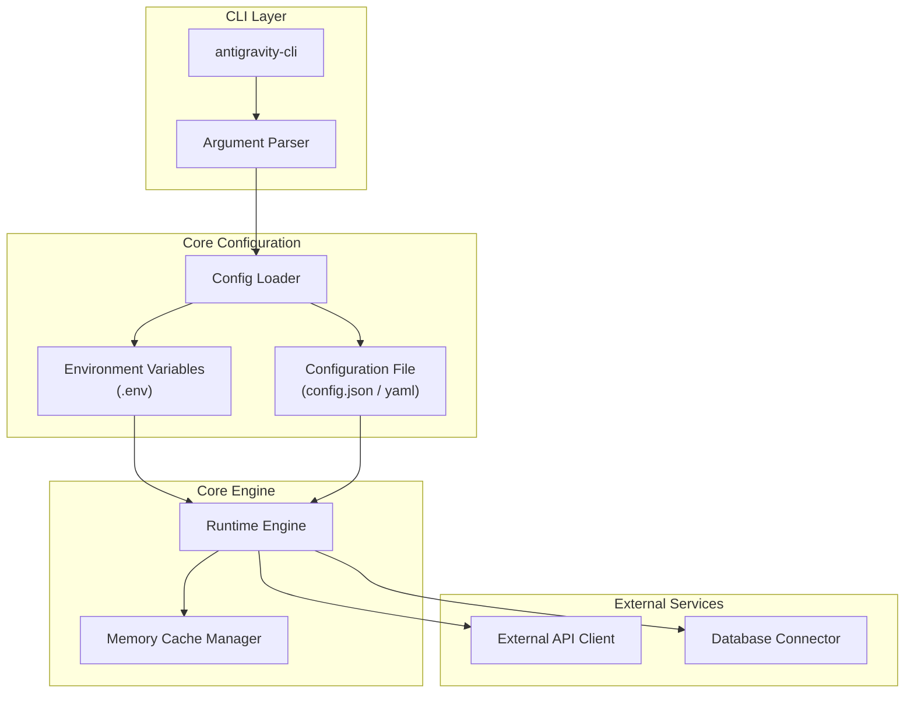

# 시작하기

## Introduction
이 문서는 시스템을 처음 접하는 개발자를 위한 시작 가이드입니다. 본 문서의 핵심 설정 정보 및 아키텍처 구성은 [docs/configuration.md](docs/configuration.md) 파일의 내용을 기반으로 작성되었습니다.

---

## Overview
시스템은 클라이언트 환경 설정 파일과 환경 변수(Environment Variables)를 로드하여 동작하며, Core Engine과 CLI Layer를 통해 외부 서비스 및 로컬 리소스와 상호작용합니다. 전체적인 데이터 흐름 및 레이어 구조는 다음과 같습니다.



---

## Installation & Setup

### Requirements
- **Node.js**: v18.0.0 이상 또는 **Python**: 3.10 이상
- **Package Manager**: `npm` 또는 `pip`

### Step 1: Clone Repository
프로젝트 저장소를 로컬 환경으로 복제합니다.
```bash
git clone https://github.com/user/project.git
cd project
```

### Step 2: Install Dependencies
의존성 패키지를 설치합니다.
```bash
npm install
# or
pip install -r requirements.txt
```

---

## Configuration

시스템의 동작 방식을 제어하는 상세 설정 규칙은 [docs/configuration.md](docs/configuration.md)에 상세히 기술되어 있습니다. 핵심 설정 항목은 다음과 같습니다.

### Environment Variables
애플리케이션 실행에 필요한 환경 변수를 `.env` 파일에 정의합니다.

| Variable Name | Type | Description | Default |
| :--- | :--- | :--- | :--- |
| `APP_ENV` | String | 애플리케이션의 실행 환경 (`development`, `production`) | `development` |
| `API_KEY` | String | 외부 서비스 연동을 위한 인증 토큰 | (Required) |
| `LOG_LEVEL` | String | 로그 출력 레벨 (`debug`, `info`, `warn`, `error`) | `info` |

### Configuration File
로컬 설정 파일(`config.json` 또는 `config.yaml`)을 통해 실행 세부 옵션을 튜닝할 수 있습니다. 

예시 (`config.json`):
```json
{
  "system": {
    "max_retry": 3,
    "timeout_ms": 5000
  },
  "cache": {
    "enabled": true,
    "ttl_seconds": 3600
  }
}
```

---

## Deployment
설정이 완료되면 다음 명령어를 통해 시스템을 구동합니다.

```bash
# Run in development mode
npm run dev

# Run in production mode
npm run build
npm start
```

자세한 에러 슛팅 및 고급 설정 기법은 [docs/configuration.md](docs/configuration.md)의 **Troubleshooting** 섹션을 참조하시기 바랍니다.
