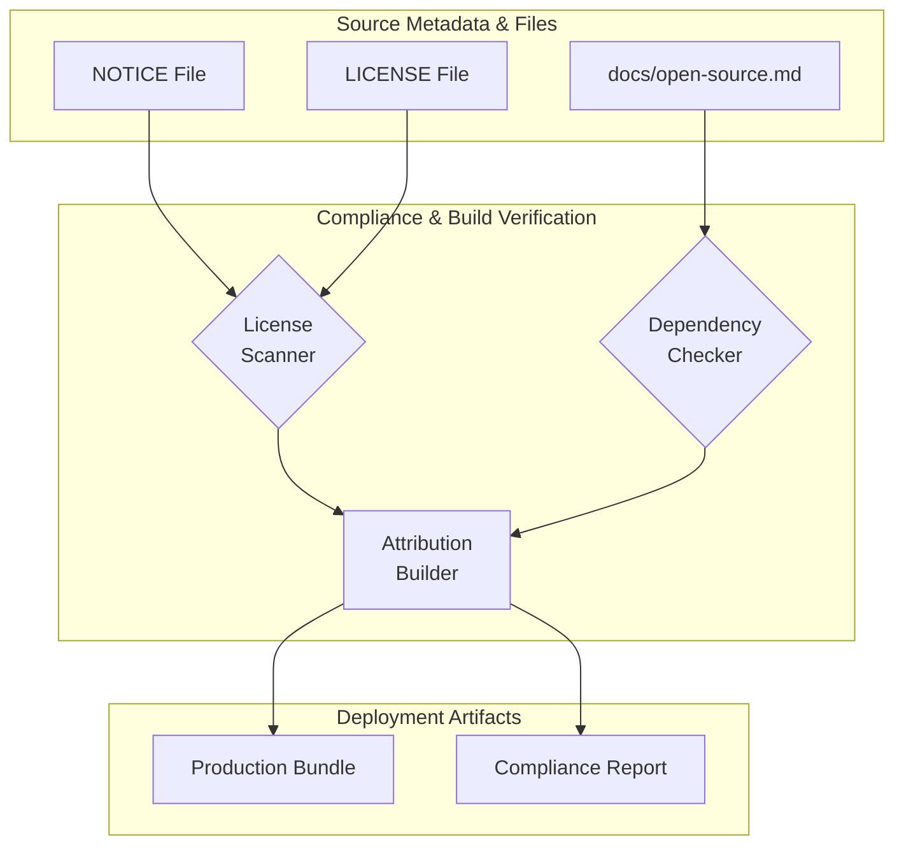

# Open Source Attribution

## Introduction
본 문서는 프로젝트 내에서 사용되는 오픈소스 소프트웨어(OSS)의 라이선스 준수(License Compliance) 및 고지(Attribution) 의무를 관리하는 아키텍처와 프로세스를 기술합니다. 오픈소스 라이선스에 따른 의무 사항을 명확히 정의하고, [NOTICE](file:///NOTICE), [LICENSE](file:///LICENSE), 및 [docs/open-source.md](file:///docs/open-source.md) 파일의 역할과 이들이 빌드 및 배포 파이프라인에서 어떻게 상호작용하는지 설명합니다.

---

## Source Files & Citations
오픈소스 속성 및 고지 정보는 다음 세 가지 핵심 파일을 기준으로 관리됩니다:

1. **[LICENSE](file:///LICENSE)**: 
   - 프로젝트 자체의 배포 라이선스 및 핵심 종속성 라이선스 선언을 포함합니다.
   - 프로젝트 배포 시 법적 고지의 기준이 되는 주 파일입니다.
2. **[NOTICE](file:///NOTICE)**: 
   - 프로젝트에 사용된 서드파티(Third-party) 라이선스의 저작권 고지(Copyright Notice) 및 속성(Attribution) 정보를 포함합니다.
   - Apache License 2.0 등 특정 라이선스에서 요구하는 의무 고지 사항을 준수하기 위해 유지됩니다.
3. **[docs/open-source.md](file:///docs/open-source.md)**: 
   - 개발자 및 감사자(Auditor)를 위해 프로젝트 내 오픈소스 종속성 목록과 라이선스 상태를 시각적이고 상세하게 정리한 문서입니다.

---

## Attribution Workflow Architecture

오픈소스 라이선스 고지 생성 및 검증에 대한 전체 파이프라인 구조는 다음과 같습니다:

---

## Compliance Requirements & Roles

### 1. LICENSE Requirements
프로젝트 배포 시 라이선스 원본 파일([LICENSE](file:///LICENSE))이 배포 패키지 루트에 반드시 포함되어야 합니다. 각 서드파티 모듈이 자체 라이선스를 가지고 있는 경우, 바이너리 배포본 내의 별도 디렉터리(예: `licensing/`)에 보관되거나 통합 고지 파일에 기재되어야 합니다.

### 2. NOTICE Attribution
[NOTICE](file:///NOTICE) 파일은 수정되거나 추가된 서드파티 라이선스의 고지 사항을 실시간으로 반영해야 합니다.
- **Modifications**: 종속성이 추가되거나 업데이트될 때, 해당 라이선스의 저작권자 표기를 [NOTICE](file:///NOTICE)에 추가합니다.
- **Redistribution**: 재배포 시 최종 사용자에게 NOTICE 파일이 그대로 전달되도록 빌드 프로세스를 설계해야 합니다.

### 3. Open Source Documentation
[docs/open-source.md](file:///docs/open-source.md) 파일은 개발 단계에서의 투명성을 확보하기 위해 매 릴리스마다 업데이트됩니다.
- 포함되어야 하는 속성: Component Name, Version, License Type, Source Link, Copyright.

---

## Build and Deployment Integration
CI/CD 파이프라인에서 오픈소스 속성이 누락되지 않도록 검증 절차를 자동화합니다.

1. **Static Analysis**: `License Scanner` 단계를 통해 소스코드 내의 헤더 선언과 [LICENSE](file:///LICENSE) 및 [NOTICE](file:///NOTICE)의 정합성을 비교합니다.
2. **Dependency Validation**: package manifest와 [docs/open-source.md](file:///docs/open-source.md)에 등록된 종속성 목록이 일치하는지 `Dependency Checker`로 확인합니다.
3. **Packaging**: 최종 배포 아티팩트(`Production Bundle`) 생성 시, 빌드 스크립트가 자동으로 [LICENSE](file:///LICENSE)와 [NOTICE](file:///NOTICE) 파일을 포함하도록 강제합니다.
