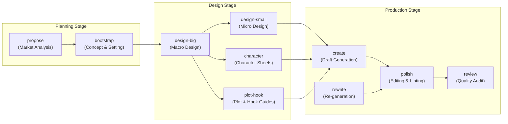

# 프로젝트 소개 (Project Introduction)

본 문서는 **Awesome Novel Studio** 프로젝트의 핵심 컨셉, 아키텍처, 그리고 작업 워크플로우를 소개하는 기술 위키 페이지입니다. 본 문서의 내용은 프로젝트의 기본 설명서인 [README.md](file:///README.md) 및 국문 설명서인 [README.kr.md](file:///README.kr.md)를 바탕으로 작성되었습니다.

---

## Overview
**Awesome Novel Studio**는 웹소설 창작 과정을 체계적으로 자동화하고 보조하기 위한 에이전트 기반 스튜디오 솔루션입니다. 기획 구상 단계부터 캐릭터 설정, 플롯 설계, 본문 집필, 윤문, 그리고 품질 검증에 이르기까지 소설 창작의 전 과정을 파이프라인으로 연결하여 관리합니다. 

이 프로젝트는 거대 언어 모델(LLM)과 사전 정의된 전문 스킬(Skills) 세트를 결합하여 일관성 있고 매력적인 웹소설 콘텐츠를 생성하는 것을 목표로 합니다.

---

## System Architecture

Awesome Novel Studio는 모듈화된 스킬 구조를 채택하고 있으며, 각 단계는 이전 단계의 결과물(아티팩트)을 참조하여 작동합니다. 전체 시스템은 크게 **Planning Stage**, **Design Stage**, **Production Stage**의 세 가지 레이어로 구분됩니다.

---

## Workflow Pipeline & Core Components

프로젝트를 구성하는 주요 컴포넌트와 작동 프로세스는 다음과 같습니다.

### 1. Planning Stage
* **propose**: 타겟 장르와 플랫폼 시장의 트렌드를 분석하여 경쟁력 있는 3가지 방향의 소설 시놉시스 및 기획안을 제안합니다.
* **bootstrap**: 제안된 기획안 중 선택된 안을 바탕으로 세계관 설정, 플랫폼 전략, 핵심 셀링 포인트(USP)를 수립하는 기초 설계를 수행합니다.

### 2. Design Stage
* **design-big (Macro Design)**: 작품 전체를 관통하는 거시적 설계를 수행합니다. 부트스트랩, 캐릭터 시트, 플롯 훅 가이드를 종합적으로 생성하며, 전문 분야 리서치 서브에이전트(`domain-researcher`)를 통해 필요한 배경 자료를 자동으로 수집합니다.
* **design-small (Micro Design)**: 25화 단위의 세부 설계를 담당합니다. 거시 설계 문서를 참조하여 회차별 플롯과 훅(Hook)의 강도, 캐릭터 변화 양상을 정의합니다.
* **character & plot-hook**: 각각 캐릭터 성장 곡선/관계도 설계 및 유료 전환 전략/서사 아크 설계를 단독으로 처리할 수 있는 독립형 스킬입니다.

### 3. Production Stage
* **create**: `novel-config.md`에 설정된 규칙과 기획 문서를 준수하여 실제 소설의 에피소드 본문을 작성합니다. 캐릭터의 입체성 유지와 수치적 일관성 확보를 최우선으로 합니다.
* **polish**: 다단계 에이전트 파이프라인을 구동하여 본문의 문체, 어조, 오탈자, 서사 템포 등을 윤문하고 개선합니다.
* **rewrite**: 설정 변경이나 스토리 전개 수정이 필요할 때, 기존 에피소드를 분석하여 개연성에 맞게 본문을 재작성합니다.
* **review**: 작성된 에피소드들의 품질을 주기적으로 감사하여 전체 워크플로우의 정합성이 무너지지 않았는지(Consistency Gap)를 진단합니다.

---

## Key Technical Features

1. **State Preservation via Metadata**: 모든 프로젝트는 `novel-config.md`를 통해 설정 파일 및 아티팩트의 경로를 매핑하고 에이전트 가드레일을 관리합니다.
2. **Context-Aware Generation**: 본문 생성 시 상위 기획 문서(캐릭터 시트, 플롯 가이드 등)를 지속적으로 프롬프트 컨텍스트에 주입하여 설정 붕괴를 방지합니다.
3. **Multi-Agent Collaboration**: 윤문(`polish`) 및 분석 단계에서 성격이 다른 여러 에이전트들이 협력 혹은 상호 검증하는 구조를 갖추고 있습니다.

---

## References
* **Source Specification**: 본 wiki에 수록된 구조와 명세의 상세 정보는 프로젝트 루트 폴더 내 [README.md](file:///README.md) 및 [README.kr.md](file:///README.kr.md) 문서에서 직접 확인할 수 있습니다.
