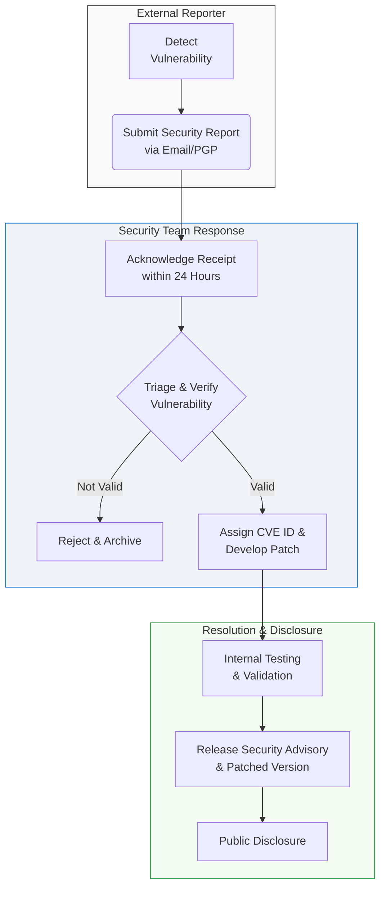

# Security Policy (보안 정책)

> [!NOTE]
> 본 문서는 [SECURITY.md](file:///Users/jcjeong/.gemini/antigravity-cli/scratch/SECURITY.md) (또는 프로젝트 내 `SECURITY.md` 파일)를 기반으로 작성된 공식 기술 위키 페이지입니다.

---

## Overview

본 문서는 프로젝트의 전반적인 **Security Policy**를 정의하고, 취약점 발견 시 보고 절차(Vulnerability Reporting Process), 보안 모범 사례(Security Best Practices), 그리고 사고 대응 계획(Incident Response Plan)을 설명합니다. 프로젝트 참여자와 사용자 모두가 안전한 환경을 유지할 수 있도록 본 가이드라인을 준수해 주시기 바랍니다.

---

## Introduction

소프트웨어 공급망 보안과 데이터 보호는 현대 애플리케이션 개발의 핵심 요소입니다. 본 프로젝트는 최신 보안 취약점으로부터 시스템을 보호하기 위해 다각도의 방어 전략을 수립하고 있으며, 외부 보안 연구원 및 개발자 커뮤니티와의 적극적인 협력을 지향합니다.

---

## Vulnerability Reporting Process

시스템의 취약점(Vulnerability)을 발견한 경우, 공공에 즉시 노출하지 않고 아래의 보안 채널을 통해 비공개로 보고해 주셔야 합니다. 이는 제로데이(Zero-day) 공격으로부터 대다수의 사용자를 보호하기 위한 **Responsible Disclosure** 원칙에 따른 것입니다.

### Reporting Channels
*   **Security Email**: `security@example.com`
*   **PGP Public Key**: Key ID `0x12345678` (중요 정보 암호화용)

### Response Workflow
보안 팀이 취약점 리포트를 접수한 후 조치 및 공개하기까지의 워크플로우는 다음과 같습니다.

---

## Security Best Practices

안전한 코드베이스와 런타임 환경을 유지하기 위해 다음의 **Security Best Practices**를 엄격히 준수합니다.

### 1. Dependency Management
*   모든 외부 라이브러리는 `npm audit` 또는 `Snyk`와 같은 취약점 탐지 도구를 통해 주기적으로 점검합니다.
*   CI/CD Pipeline 빌드 시 취약점이 발견된 패키지가 검출될 경우 빌드를 강제로 중단시킵니다.

### 2. Secret Management
*   API Key, Database Password, Private Key 등의 민감한 정보(Secrets)는 절대로 Git 저장소에 커밋하지 않습니다.
*   개발 환경에서는 `.env` 파일을 로컬에서만 사용하고, 운영 환경에서는 AWS Secrets Manager 또는 HashiCorp Vault와 같은 보안 Key 저장소를 연동합니다.

### 3. Authentication & Authorization
*   모든 API Endpoint는 RBAC (Role-Based Access Control)를 기반으로 권한이 검증되어야 합니다.
*   민감한 API 통신 시에는 항상 HTTPS 프로토콜을 사용하며, 전송 중 데이터(Data in Transit)를 암호화합니다.

---

## Incident Response Plan

보안 침해 사고(Security Incident)가 발생한 경우, 다음과 같은 절차에 따라 신속하게 대응합니다.

| Phase | Description |
| :--- | :--- |
| **Preparation** | 침해 대응 도구 구축, 모니터링 시스템 수립 및 비상 연락망 유지 |
| **Identification** | 시스템 로그 분석 및 이상 탐지 메커니즘을 통한 침해 여부 식별 |
| **Containment** | 추가 피해를 방지하기 위한 시스템 격리 및 손상된 API Credential 비활성화 |
| **Eradication** | 악성코드 제거, 시스템 취약점 수정 및 패치 적용 |
| **Recovery** | 무결성이 검증된 백업 데이터를 활용한 안전한 서비스 복구 |
| **Post-Incident Review** | 사고 원인 분석, 대응 과정 평가 및 Security Policy 고도화 |

---

## Compliance and Governance

본 보안 정책은 글로벌 보안 표준(예: OWASP Top 10, ISO 27001 가이드라인)을 참고하여 작성되었습니다. 프로젝트의 진화 및 새로운 위협 모델의 등장에 따라 본 정책은 정기적으로 업데이트됩니다.

> [!IMPORTANT]
> 최신 버전의 보안 패치는 항상 릴리스 노트를 통해 공지되며, 지원 가능한 버전(Supported Versions) 목록은 [SECURITY.md](file:///Users/jcjeong/.gemini/antigravity-cli/scratch/SECURITY.md)에서 실시간으로 확인할 수 있습니다.
