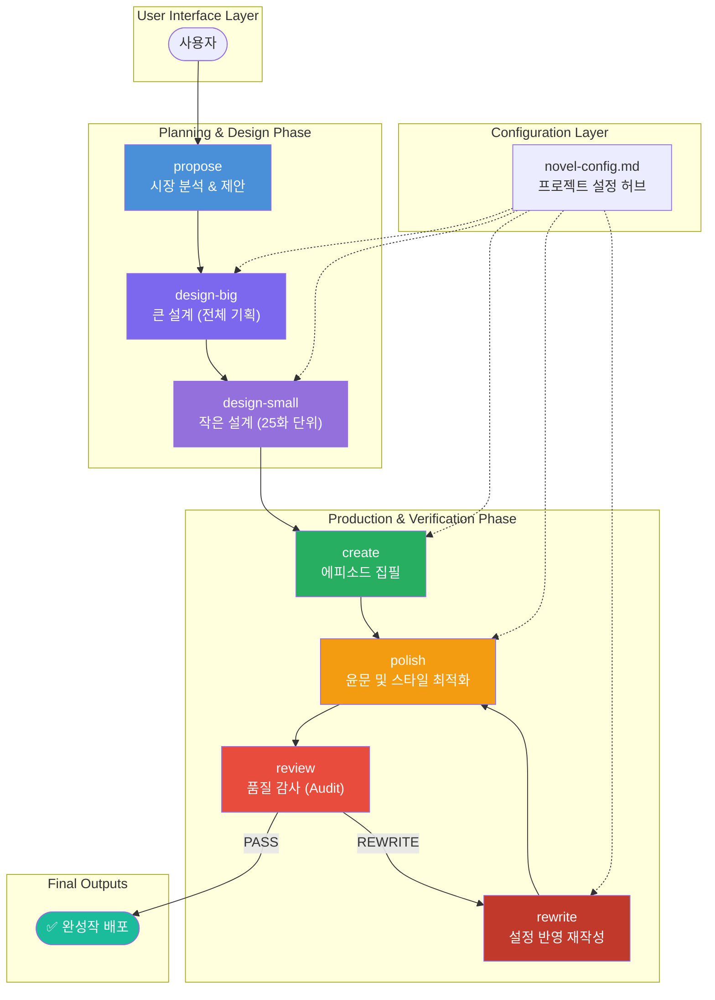
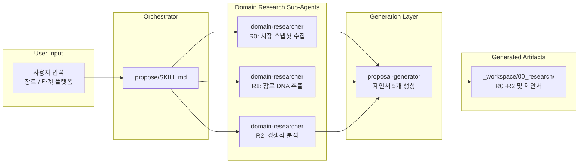
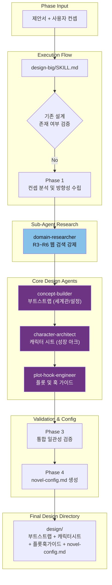
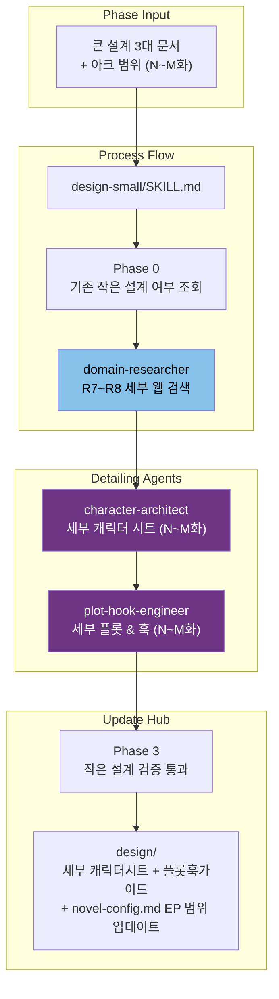
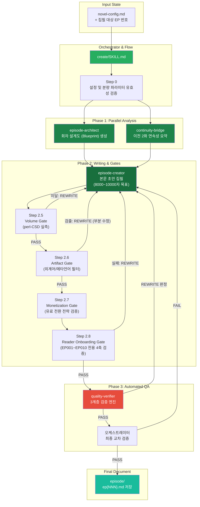
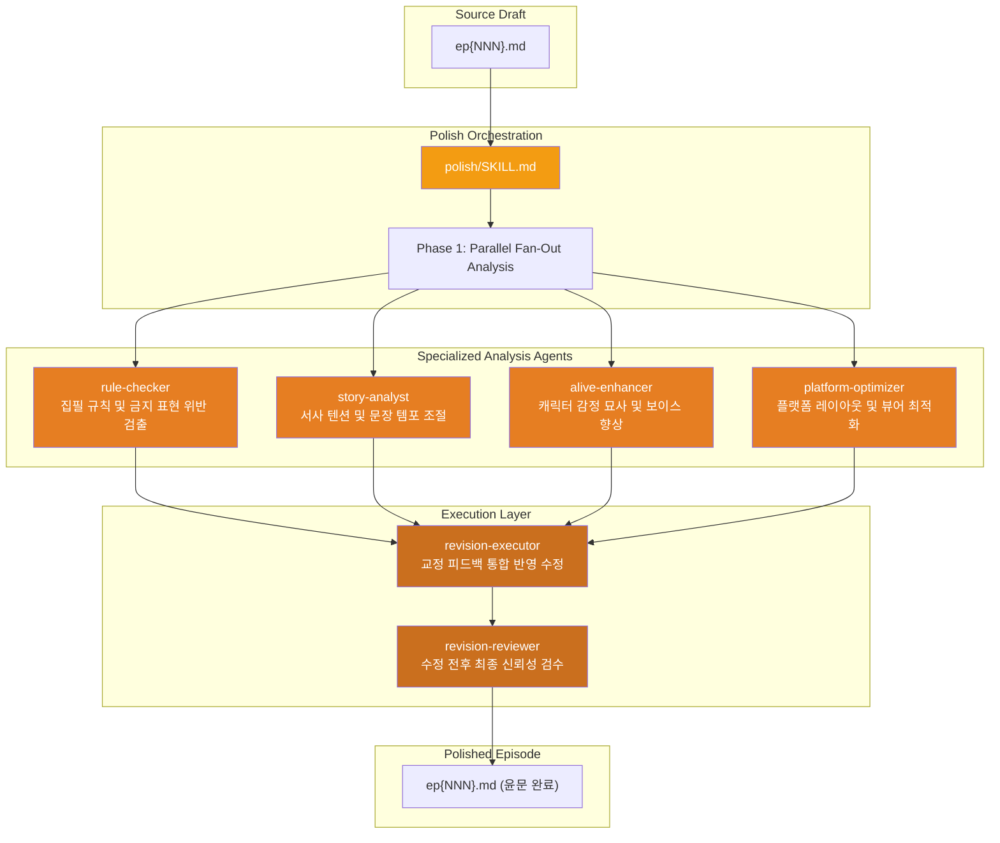
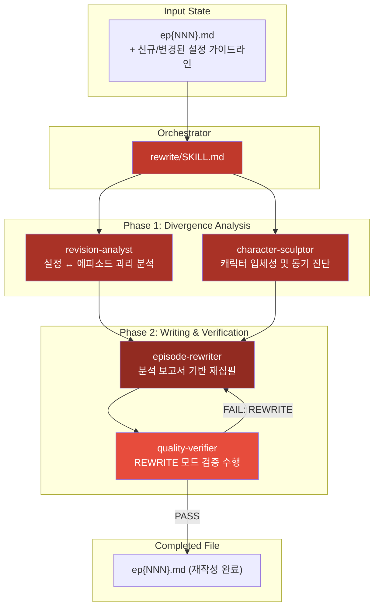
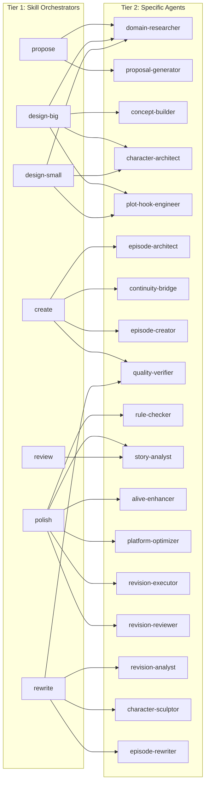

# Architecture Overview

> **Source File:** `docs/architecture.md` (Awesome Novel Studio v2 Architecture Reference)
> 본 문서는 웹소설 창작 자동화 파이프라인의 설계 철학, 구조, 구성 요소 간의 관계를 정의한 아키텍처 개요 위키 페이지입니다.

## Introduction
Awesome Novel Studio v2는 웹소설 창작의 전 과정을 자동화하고 고품질의 에피소드를 일관되게 생성할 수 있도록 지원하는 지능형 멀티 에이전트 시스템(Multi-Agent System)입니다. 본 시스템은 시장 분석, 소설 기획(큰 설계 및 작은 설계), 본문 집필, 윤문 및 재작성, 최종 품질 감사를 통합적인 파이프라인으로 연결하여 고밀도 서사를 효율적으로 창작하는 것을 목표로 합니다.

## Design Philosophy
시스템 설계의 핵심 원칙과 목표는 다음과 같습니다.

1. **High-Density Narrative (고밀도 서사)**: 독자가 1화를 읽었을 때 다른 소설의 2화 분량을 읽은 것 같은 서사적 포만감을 느끼도록 설계합니다. 전체 화수를 늘리지 않으면서 편당 사건의 밀도를 극대화합니다.
2. **Volume Guarantee (분량 보장)**: 공백 제외 7,500자 ~ 10,000자의 안정적인 분량 출력을 보장합니다. 분량이 부족한 경우, 단순한 묘사나 설명의 서술을 늘리는 대신 **새로운 충돌 단계(Conflict Stage)**를 추가하여 서사의 깊이를 더합니다.
3. **Consistency (일관성)**: 설정 모순, 수치 불일치, 캐릭터 보이스 교차 오염을 방지하기 위해 파이프라인의 각 단계에서 엄격한 검증 게이트를 적용합니다.
4. **Real-time Market Reflect (실시간 시장 반영)**: 모든 리서치 작업은 과거 학습 데이터에만 의존하지 않고 실시간 웹 검색(Web Search)을 강제하여 트렌디한 시장 환경을 즉각적으로 반영합니다.

### 3-Tier Architecture
시스템은 다음과 같이 명확히 구분된 3개 계층으로 구조화되어 작동합니다.

- **Tier 1: Skill Orchestrator Layer**: 사용자가 직접 호출하는 최상위 인터페이스 및 오케스트레이터입니다. 전체 파이프라인 흐름을 제어합니다.
- **Tier 2: Agent Layer**: 오케스트레이터가 특정 서브태스크를 처리하기 위해 호출하는 개별 에이전트 군입니다.
- **Tier 3: Reference Document Layer**: 에이전트와 오케스트레이터가 행동 및 품질 검증의 기준으로 삼는 공유 가이드라인 및 규칙 정본입니다.

### Volume Design Rules
| Parameter Name | Target Value | Action / Rule |
| :--- | :--- | :--- |
| `draft_chars_no_space` | 공백 제외 6,500 ~ 9,000자 | 초안 작성 단계의 목표치 (`novel-config.md` 설정) |
| `target_chars_no_space` | 공백 제외 6,000 ~ 8,500자 | 최종 결과물에 대한 소프트 가이드 상한 |
| `min_chars_no_space` | **공백 제외 6,000자** | **하드 하한(Hard Minimum)**. 미달 시 즉시 `REWRITE` 수행 |
| Measurement Standard | `perl -CSD` (공백 제외 문자 수) | `wc -m`(공백 포함)은 참고용으로만 사용 |

### Reader Onboarding Policy (EP001 ~ EP010)
초반 에피소드(1화 ~ 10화)에서 독자가 세계관의 고유 설정과 용어를 쉽게 수용할 수 있도록 4대 검증 축을 통과해야 합니다. (정본: `skills/references/reader-onboarding-gate.md`)

- **TERM_ORDER (용어 도입 순서)**: 새로운 용어나 초식 도입 시, "물리적 현상/상황 설명 $\rightarrow$ 용어 명명"의 순서를 따릅니다. 위반 시 `REWRITE`.
- **COMEDY_PLACEMENT (개그 배치)**: 독자가 현재 위기 상황을 명확하게 파악한 이후에만 농담이나 가벼운 분위기 전환을 허용합니다. 위반 시 `REWRITE`.
- **ABSORPTION_CAUSALITY (기연/인과성)**: 기연 획득 및 힘의 흡수 과정은 "트리거(Trigger) $\rightarrow$ 차이 인지(Difference) $\rightarrow$ 신체 변화(Somatic Change) $\rightarrow$ 결과(Result)"의 4단계를 명확히 묘사해야 합니다. 위반 시 `REWRITE`.
- **ACTION_CLARITY (액션 명확성)**: 해당 회차에서 발생한 핵심 액션을 단 한 문장으로 명료하게 요약할 수 있어야 합니다. 위반 시 `REWRITE`.

---

## Pipeline Workflow
전체 창작 파이프라인의 작업 흐름은 제안 단계부터 기획, 집필, 윤문, 품질 감사 및 재작성까지 유기적으로 이어지는 구조를 띱니다.



---

## Pipeline Detail Phase

### 3-1. PROPOSE Phase
사용자가 희망하는 장르와 플랫폼 입력을 기반으로, 실시간 트렌드를 분석하여 5개의 맞춤형 소설 기획안을 제안합니다.



- **Research Artifacts (리서치 산출물)**:
  - `R0_시장스냅샷.md`: 투데이 베스트, 신규/신인 베스트 순위 및 지표 스냅샷
  - `R1_장르DNA.md`: 선택 장르의 메이저 공식, 필수 아키타입, 회피해야 할 클리셰 및 금기 사항
  - `R2_경쟁작분석.md`: 유사 인기작 분석 및 차별화 지점 탐색

### 3-2. DESIGN-BIG Phase
채택된 제안서와 사용자 컨셉을 기초로 전체 소설의 뼈대가 되는 부트스트랩, 캐릭터 시트, 플롯 훅 가이드를 설계하고 검증합니다.



- **Domain Research Output (R3 ~ R6)**:
  - `R3_업계구조.md`: 세부 직업 프로필, 빌런 세력 계급, 전문 커리어 패스
  - `R4_사건연표.md`: 주인공 성장 및 핵심 역량 모듈 활성화 타임라인
  - `R5_기존작분석.md`: 기획의 유니크한 셀링 포인트 및 시장 포지셔닝 차별화
  - `R6_갈등사례.md`: 대립 세력의 동기 분석 및 갈등 관계의 역사적/사회적 맥락

- **Inter-Agent Communication Protocol (에이전트 통신 프로토콜)**:
  ```mermaid
sequenceDiagram
    participant CB as "concept-builder"
    participant CA as "character-architect"
    participant PHE as "plot-hook-engineer"

    CB->>CA: 주인공 핵심 설정, 전문 지식 분야, 서사적 터닝 포인트 전달
    CB->>PHE: 역량 획득 모듈(화수 구간 및 소진 조건), 유료 전환 시점 전략 전달
    CA->>PHE: 주인공 내부 동기, 적대 세력 구조, 주요 조력자 명단 전달
    PHE->>CA: 아크별 갈등을 극대화하기 위해 필요한 캐릭터 신규 추가 및 속성 수정 요청


- **Detail Research Output (R7 ~ R8)**:
  - `R7_전문지식_{N}~{M}화.md`: 해당 에피소드 구간 내 주인공이 사용할 기술, 장비, 전문 기법의 디테일
  - `R8_사건상세_{N}~{M}화.md`: 배경이 되는 사건의 구체적 타임라인 및 조력자/빌런의 시간대별 움직임

### 3-4. CREATE Phase
`novel-config.md` 설정과 설계도를 바탕으로 한 화의 에피소드를 본격적으로 집필하고, 다계층 게이트 검증을 거쳐 최종 초안을 완성합니다.



#### Quality-Verifier CREATE Mode Verification (3계층 검증)
`quality-verifier`는 아래 표와 같이 세 가지 레이어에서 세분화된 축으로 품질을 검증합니다.

| Verification Level | Metric Key | Verification Details | Failure Action |
| :--- | :--- | :--- | :--- |
| **Tier 1 HARD GATE** | `VOLUME` | `perl -CSD` 기준 `min_chars_no_space` 이상 여부 확인 | 즉시 `REWRITE` |
| **Tier 1 HARD GATE** | `ARTIFACT` | 마크다운 표식 잔해, 메타 언어, 외계어(생성형 AI 흔적) 무단 포함 여부 | 즉시 `REWRITE` |
| **Tier 1 HARD GATE** | `READER_ONBOARDING` | EP001~EP010 한정 온보딩 4축(TERM_ORDER 등) 중 최소 2개 이상 만족 | 즉시 `REWRITE` |
| **Tier 2 QUALITY GATE** | `DESIGN` | 에피소드 설계도(Blueprint) 상의 플롯 비트가 누락 없이 묘사되었는지 여부 | 2개 이상 실패 시 `REWRITE` |
| **Tier 2 QUALITY GATE** | `POWER_OUTCOME` | 주인공의 주도성 및 능력 발휘를 통한 압도적 결과(`Outcome Delta`)의 도출 | 동일 |
| **Tier 2 QUALITY GATE** | `TIMELINE_NUMBERS` | 기존 설정 문서들과의 시간대 및 수치적 일관성 교차검증 | 동일 |
| **Tier 2 QUALITY GATE** | `HOOK_VALLEY` | 오프닝/엔딩의 훅 강도 및 감정선이 급락하는 구간(`Dead Zone`)의 존재 여부 | 동일 |
| **Tier 2 QUALITY GATE** | `GUARDRAIL` | `novel-config.md`에 명시된 개별 프로젝트용 보존 가드레일 준수 여부 | 동일 |
| **Tier 3 POLISH GATE** | `VOICE_DNA` | 등장인물 고유의 어조(Dialogue DNA)가 붕괴되거나 오염되었는지 여부 | 실패 시 `POLISH` 단계로 이관 |
| **Tier 3 POLISH GATE** | `STYLE_SIGNATURE` | 한국어 문장의 가독성 및 프로젝트 고유 문체 스타일 구현 상태 | 동일 |
| **Tier 3 POLISH GATE** | `TONE_DNA` | 소설 전체의 지향점 및 장르적 분위기 유지 상태 | 동일 |

### 3-5. POLISH Phase
이미 완성된 초안의 스타일, 문장 구조, 가독성을 극대화하기 위해 4명의 전문 분석 에이전트를 병렬적으로 호출한 뒤 교정본을 작성 및 검수합니다.



### 3-6. REWRITE Phase
품질 검증 게이트를 통과하지 못했거나, 상위 기획/설정 문서가 전면 개정되었을 때 기존 에피소드 본문을 분석하여 설정에 맞게 전면 재작성합니다.



---

## Orchestrator and Agent Matrix
각 오케스트레이터(스킬)가 하위 작업을 처리하기 위해 협업하는 에이전트들의 매핑 구조는 다음과 같습니다.



---

## Reference Documents Relationship
에이전트들이 공통 규칙과 기준을 파악하기 위해 참조하는 내부 가이드라인 정본들의 의존성 네트워크입니다.

```mermaid
graph TD
    subgraph SHARED ["skills/references/ (공유 검증 게이트)"]
        R1["genre-dna-framework.md"]
        R2["early-monetization-gate.md"]
        R3["config-validation-gate.md"]
        R4["platform-validation.md"]
        R5["platform-novelpia-retention.md"]
        R6["length-gate.md<br>(perl-CSD 실측 기준)"]
        R7["artifact-gate.md<br>(AI 오염 검사 단일 정본)"]
        R8["reader-onboarding-gate.md<br>(4축 온보딩 검증)"]
        R9["commercial-core-contract.md"]
    end

    subgraph CREATE_REF ["skills/create/references/ (create 전용 참조)"]
        CR1["creation-principles.md"]
        CR2["paid-length-planning.md"]
        CR3["default-config.md"]
        CR4["verdict-format.md"]
        CR5["pipeline-auto.md"]
        CR6["trace-template.md"]
        CR7["customize-guide.md"]
    end

    subgraph RefConsumers ["Consumers"]
        CB["concept-builder"]
        CA["character-architect"]
        PHE["plot-hook-engineer"]
        DR["domain-researcher"]
        EA["episode-architect"]
        EC["episode-creator"]
        QV["quality-verifier"]
        RA["revision-analyst"]
        PO["platform-optimizer"]
        S_CR["create/SKILL.md"]
        S_PL["polish/SKILL.md"]
        S_RW["rewrite/SKILL.md"]
        S_RV["review/SKILL.md"]
    end

    R1 --> CB & CA & PHE & DR
    R2 --> EA & EC & QV & RA
    R3 --> S_CR & S_PL & S_RW
    R4 --> QV & S_CR
    R5 --> PO
    R6 --> S_CR & QV
    R7 --> S_CR & QV
    R8 --> EA & EC & QV & S_RV
    R9 --> EA & EC & QV

    CR1 --> EA & EC
    CR2 --> EA & EC
    CR3 --> S_CR
    CR4 --> QV
    CR5 --> S_CR
    CR6 --> S_CR
    CR7 --> S_CR
```



---

## Output Directory Structure
프로젝트 활성화 시 생성되는 결과물 및 작업 공간의 전체 디렉토리 트리 구조입니다.

```
{프로젝트 루트}/
├── novel-config.md                   # 전체 파이프라인 통합 설정 허브
├── design/                           # 기획 및 설정 산출물 폴더
│   ├── {작품}_부트스트랩.md          # 세계관 및 플랫폼 전략
│   ├── {작품}_캐릭터시트.md          # 캐릭터 성장 아크 및 관계도
│   ├── {작품}_플롯훅가이드.md        # 전체 시놉시스 및 유료화 훅 전략
│   ├── {작품}_세부캐릭터시트_{N}~{M}화.md # 25화 단위 세부 캐릭터 설정
│   └── {작품}_세부플롯훅가이드_{N}~{M}화.md # 25화 단위 에피소드 플롯
├── episode/                          # 최종 완고 보관 폴더
│   ├── ep001.md
│   ├── ep002.md
│   └── ...
└── _workspace/                       # 에이전트 작업 영역
    ├── 00_research/                  # 리서치 가이드 및 시장 데이터
    │   ├── R0_시장스냅샷.md
    │   ├── R1_장르DNA.md
    │   ├── R2_경쟁작분석.md
    │   ├── R3_업계구조.md
    │   ├── R4_사건연표.md
    │   ├── R5_기존작분석.md
    │   ├── R6_갈등사례.md
    │   ├── R7_전문지식_{N}~{M}화.md
    │   └── R8_사건상세_{N}~{M}화.md
    ├── design-big/                   # 큰 설계 중간 산출물
    │   ├── 00_concept_analysis.md
    │   ├── 01_concept-builder_bootstrap.md
    │   ├── 02_character-architect_sheet.md
    │   └── 03_plot-hook-engineer_guide.md
    ├── design-small/                 # 작은 설계 중간 산출물
    │   └── EP{N}-EP{M}/
    │       ├── 04_character-architect_detail.md
    │       └── 05_plot-hook-engineer_detail.md
    ├── create/                       # 에피소드 집필 중간 기록
    │   └── EP{NNN}/
    │       ├── 01_episode-architect_blueprint.md
    │       ├── 02_continuity-bridge_report.md
    │       ├── 04_quality-verifier_verdict.md
    │       └── workflow.md
    └── alive-tracker.md              # 캐릭터별 동적 관계/상태 트래커
```

---

## Configuration Hub (novel-config.md)
`novel-config.md`는 파이프라인 상의 모든 스킬과 에이전트가 가장 먼저 로드하여 동작 기준을 정하는 **유일한 정본(Single Source of Truth) 설정 허브**입니다.

### Example Configuration Schema
```yaml
project:
  name: "{작품가제}"
  target_platform: "문피아"          # 허용 플랫폼: 문피아 | 네이버시리즈 | 카카오페이지 | 리디 | 조아라 | 노벨피아
  target_genre: "{장르}"
  episode_dir: "episode/"
  work_dir: "_workspace/"
  design_dir: "design/"

create:
  draft_chars_no_space: 8000-10000   # 집필 초안 목표 글자 수 (공백 제외)
  min_chars_no_space: 6000           # 품질 게이트 통과를 위한 하드 하한선
  target_chars_no_space: 7500-10000  # 최종 완고 목표 글자 수
  dialogue_ratio: 40-60%             # 대사 분량 비중
  max_scenes: 6                      # 회차당 최대 씬 개수

설정문서 매핑:
  공통 문서:
    character_core: design/{작품}_캐릭터시트.md
    bootstrap: design/{작품}_부트스트랩.md
    writing_rules: CLAUDE.md

  EP 범위별 설정문서:
  | EP 범위 | 레이블 | 플롯 가이드 경로 | 세부 플롯 가이드 | 세부 캐릭터 시트 |
  |---------|--------|----------------|----------------|----------------|
  | 1-25    | ACT1   | design/{작품}_플롯훅가이드.md | design/{작품}_세부플롯_1~25.md | design/{작품}_세부캐릭터_1~25.md |

보존 가드레일:
  - "{보존해야 할 설정 및 전개 1}"
  - "{보존해야 할 설정 및 전개 2}"
```

---

## Error Handling Principles
시스템 전체에서 예외 및 프로세스 에러 발생 시 적용되는 표준 대응 절차입니다.

- **domain-researcher Failure**: 리서치 서브 에이전트 실패 시 1회에 한해 재시도를 수행합니다. 지속적으로 실패할 경우 기본 장르 DNA 레퍼런스를 토대로 작업을 유지하며, 생성된 산출물 상단에 `[자동 리서치 미반영]` 경고 라벨을 명시합니다.
- **Agent Call Failure**: 개별 태스크 처리 에이전트 호출 실패 시 1회 재시도 후, 오케스트레이터가 직접 템플릿 혹은 규칙을 기반으로 대체 데이터를 강제 생성하고 품질 경고를 첨부합니다.
- **Divergence of Configuration**: 설정 문서 간의 충돌 및 괴리가 탐지되는 경우, 최상위 문서인 `부트스트랩(bootstrap)`을 진실의 원천(Source of Truth)으로 삼아 하위 문서(캐릭터 시트 및 플롯 가이드)를 자동 보정합니다.
- **Shortage of Text Volume**: 최종 에피소드 글자 수가 하한선(6,000자) 미만일 경우 문장을 인위적으로 길게 늘이지 않고, `episode-architect`에게 즉시 추가 충돌 전개(Conflict Phase)를 할당하도록 조치하여 서사의 밀도를 보장합니다.
- **AI Footprint Detection**: 오염 게이트에서 외계어, 마크다운 코드 잔해, 메타 언어가 발견될 시 `episode-creator`를 재호출하여 전체 재집필이 아닌 해당 섹션 영역에 대한 타겟 부분 교정 작업을 수행합니다.
- **Worktree Cache Collision**: 깃 워크트리 사용 도중 캐시 충돌 오류가 발생할 시 자동으로 `git config --unset extensions.worktreeConfig` 명령어를 수행하여 로컬 설정을 무력화 및 정상화합니다.

---

## Web Search Constraint (domain-researcher)
모든 `domain-researcher` 활동 과정에서 엄수되어야 할 절대적 제약 규칙입니다.

1. **Mandatory Real-time Search**: 어떠한 경우에도 로컬 모델의 사전 학습 지식(Internal Knowledge)에만 의존하여 기획안을 작성할 수 없으며, 실시간 웹 API 조회를 강제 적용해야 합니다.
2. **Elimination of Speculation**: 시장 정보 보고서에 "~로 보인다", "~일 것으로 생각된다" 등 추측성 문장이 포함될 경우 보고서 작성을 취소하고 리서치를 재실행합니다.
3. **Explicit Real References**: 경쟁작 및 벤치마킹 타겟 분석 시 가상의 소설 제목 생성을 전면 불허하며, 반드시 실존하는 작품 정보와 실제 연재 화수를 명시해야 합니다.
4. **Current Ranked Data**: 랭킹 수집 시 반드시 검색을 수행하는 당일 기준의 유효 플랫폼 베스트 지표 데이터를 획득하여 문서화해야 합니다.
---
*최종 수정일: 2026-06-02 | Awesome Novel Studio v2.1*
*문서 참조 원본: `docs/architecture.md`*
