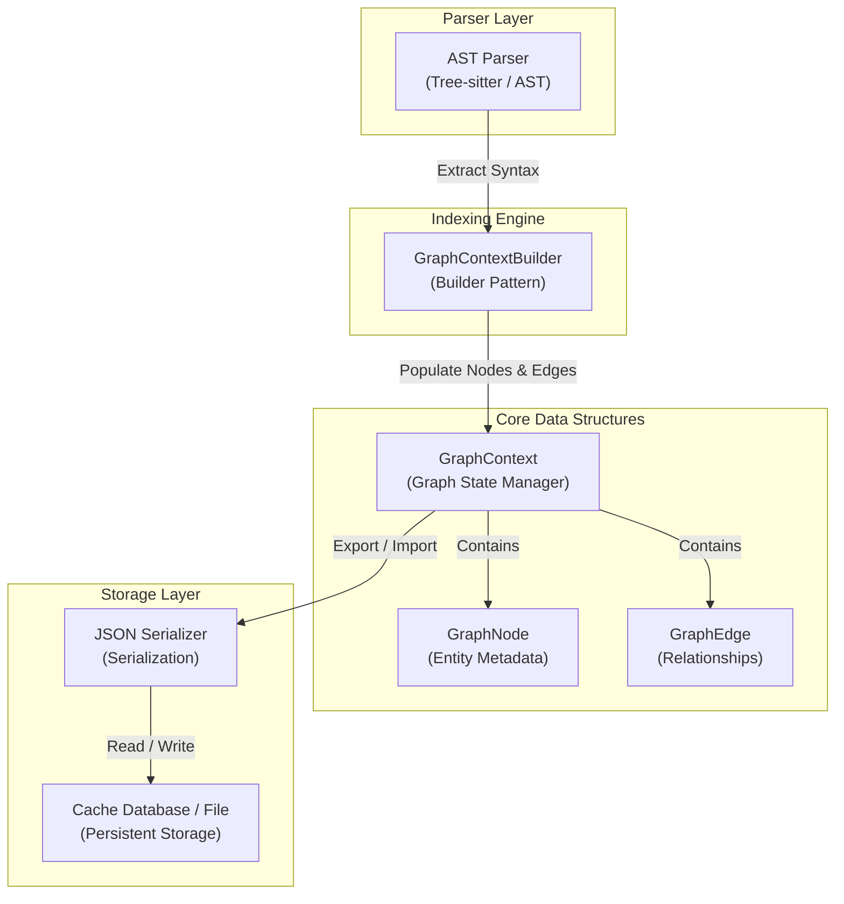
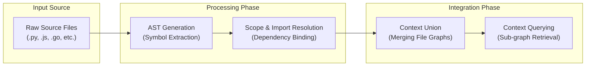

# Technical Wiki: Graph Context

## Introduction
**Graph Context**는 코드베이스의 구조적 관계(class hierarchy, function calls, imports, variable references 등)를 그래프 형태로 표현하고 관리하는 핵심 모듈입니다. 이 시스템은 소스 코드 분석을 통해 추상 구문 트리(AST) 수준의 엔티티와 그 관계를 추출하여, 개발 도구 및 LLM(Large Language Model)이 코드의 맥락(context)을 보다 정확하고 깊이 있게 이해할 수 있도록 돕습니다.

본 문서는 `cli/indexer/graph_context.py` 파일의 설계, 아키텍처 및 주요 API를 다룹니다.

---

## Overview
`cli/indexer/graph_context.py`는 코드베이스 전체의 의존성 및 관계를 표현하는 **Dependency Graph**를 생성, 조회 및 관리하는 역할을 수행합니다. 코드 내 개별 요소(클래스, 메서드, 변수 등)는 `GraphNode`로 정의되며, 이들 간의 관계(호출, 상속, 참조 등)는 `GraphEdge`로 연결됩니다. 최종적으로 `GraphContext` 클래스가 이들을 통합 관리하여 특정 노드 주변의 서브그래프(subgraph) 추출 등 고차원 쿼리 기능을 제공합니다.

---

## Architecture

`Graph Context` 시스템의 구성 요소 및 데이터 흐름은 다음과 같습니다.

---

## Key Classes and APIs

`cli/indexer/graph_context.py`에 정의된 핵심 클래스와 주요 인터페이스 정보입니다.

### 1. `GraphNode`
그래프 상의 단일 코드 엔티티(Entity)를 나타내는 데이터 클래스입니다.
* **Fields:**
  * `node_id` (`str`): 노드를 식별하기 위한 고유 키 (예: Fully Qualified Name 또는 File Path + Line Number).
  * `name` (`str`): 엔티티의 이름 (클래스명, 함수명 등).
  * `type` (`str`): 엔티티의 종류 (`file`, `class`, `function`, `variable`, `import` 등).
  * `filepath` (`str`): 해당 엔티티가 정의된 파일 경로.
  * `start_line` (`int`): 정의 시작 라인.
  * `end_line` (`int`): 정의 종료 라인.
  * `metadata` (`dict`): 시그니처, 접근 제어자 등 추가 메타데이터.

### 2. `GraphEdge`
두 노드 간의 관계(Relation)를 지향성 선(Directed Edge)으로 정의합니다.
* **Fields:**
  * `source` (`str`): 출발 노드 ID.
  * `target` (`str`): 도착 노드 ID.
  * `relation_type` (`str`): 관계 속성 (`defines`, `calls`, `references`, `inherits`, `imports` 등).
  * `weight` (`float`): 필요시 관계 강도를 정의하기 위한 가중치.

### 3. `GraphContext`
노드와 엣지의 컬렉션을 보유하고, 그래프 쿼리 기능을 구현하는 중심 클래스입니다.
* **Core Methods:**
  * `add_node(node: GraphNode) -> None`: 그래프에 노드를 추가합니다.
  * `add_edge(edge: GraphEdge) -> None`: 그래프에 엣지를 추가합니다.
  * `get_node(node_id: str) -> Optional[GraphNode]`: 특정 ID의 노드 정보를 반환합니다.
  * `get_neighbors(node_id: str, direction: str = "out") -> List[GraphNode]`: 지정 노드와 인접한 이웃 노드 목록을 가져옵니다.
  * `get_subgraph(node_id: str, depth: int = 1) -> "GraphContext"`: 지정 노드를 중심으로 `depth` 홉 이내의 모든 노드와 엣지로 이루어진 서브그래프를 반환합니다.
  * `to_dict() -> dict`: 그래프를 직렬화(Serialization) 가능한 딕셔너리 형태로 변환합니다.
  * `from_dict(data: dict) -> "GraphContext"`: 역직렬화(Deserialization)를 수행하여 인스턴스를 생성합니다.

### 4. `GraphContextBuilder`
정적 코드 분석을 바탕으로 그래프 구조를 순차적으로 빌드하는 Builder 객체입니다.
* **Core Methods:**
  * `parse_file(filepath: str) -> None`: 개별 파일을 파싱하여 로컬 노드 및 엣지를 추출합니다.
  * `resolve_references() -> None`: 파일 전반에 걸친 모호한 참조(References)와 전역 심볼(Symbols)을 비교 검증하여 글로벌 엣지로 연결합니다.
  * `build() -> GraphContext`: 최종 조립된 `GraphContext` 인스턴스를 반환합니다.

---

## Data Flow

코드베이스의 색인(Indexing) 단계부터 활용 단계까지의 데이터 처리 프레임워크입니다.

1. **AST Generation**: 소스 파일을 스캔하여 식별자, 클래스 선언, 함수 정의 및 Import 구문을 수집합니다.
2. **Scope & Import Resolution**: 타겟 심볼의 실제 선언 위치를 추적하여 참조 지점과 정의 지점 사이에 관계(`GraphEdge`)를 설정합니다.
3. **Context Union**: 파일 단위 그래프 조각을 통합하여 하나의 거대한 코드베이스 의존성 네트워크를 구축합니다.
4. **Context Querying**: 특정 소스 파일이나 기능 단위를 분석할 때, 그에 인접한 파일군 및 API 연동 정보(`Graph Context`)를 추출하여 다운스트림 모듈(예: LLM 프롬프트 빌더)에 전달합니다.

---

## Key Benefits
* **Enhanced LLM Prompts**: 코드 리팩토링이나 디버깅 시 관련 코드 조각을 탐색 경로(`Graph Context`) 기준으로 추출하여 프롬프트 토큰 효율성을 크게 높입니다.
* **Semantic Analysis**: 단순 키워드 검색을 넘어 구조적 연관성에 근거한 코드 영향도 평가(Impact Analysis)가 가능합니다.
* **Serializable Cache**: 한 번 빌드된 그래프 컨텍스트는 JSON 포맷으로 저장 및 캐싱되므로 증분 색인(Incremental Indexing)을 구현하여 재분석 속도를 비약적으로 향상시킵니다.
